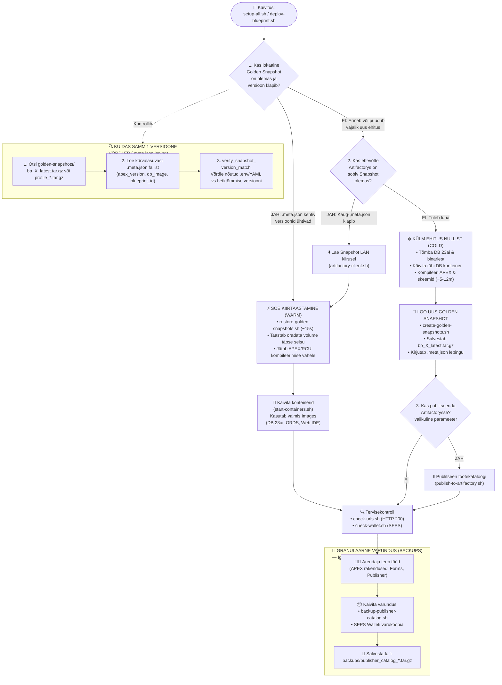

[ 🇬🇧 English ](../devops-lifecycle-guide.md) | [ 🇪🇪 Eesti ](devops-lifecycle-guide.md) | [ 🇫🇮 Suomi ](../fi/devops-lifecycle-guide.md) | [ 🇸🇪 Svenska ](../sv/devops-lifecycle-guide.md) | [ 🇱🇻 Latviešu ](../lv/devops-lifecycle-guide.md) | [ 🇱🇹 Lietuvių ](../lt/devops-lifecycle-guide.md)

# 🔄 Konteineripiltide, kuldsete hetktõmmiste ja varukoopiate elutsükli juhend

See juhend kirjeldab platvormi **3-tasemelise katastroofitaaste ja kiirpaigalduse (FastPath) mudeli** arhitektuuri, salvestusasukohti ja töövooge:
1. **Konteineripildid (Images):** Muutumatu operatsioonisüsteem, teegid ja tarkvaramootorid.
2. **Kuldne Hetktõmmis (Golden Snapshots):** Terve andmebaasi seisu tõmmis (volume dump) ~15-sekundiliseks kiirtaastamiseks.
3. **Varukoopiad (Backups):** Komponentide granulaarsed ekspordid (Publisher aruannete kataloog, SEPS Wallet, SQL failid).

---

## 🗺️ 1. Otsustus- ja kasutusvoo joonis (mermaid)



---

## 📊 2. Kolme taseme võrdlustabel: Images VS golden snapshots VS backups

| Mõiste | 📂 Asukoht | 🎯 Millal kasutatakse? | ⚙️ Kuidas kasutatakse? | ⏱️ Taastekiirus |
| :--- | :--- | :--- | :--- | :--- |
| **🖼️ Konteineripildid (Images)** | `docker/`, Podmani storage, Artifactory / OCR register | Konteineri elutsükli alguses (OS, Linuxi teegid, Java, ORDS, WebLogic binaarid). | `podman run` / `podman-compose up` loeb pildi kihte. Ei sisalda andmebaasi tabelite andmeid. | Tõmmatakse 1 korra vahemällu. |
| **📸 Kuldne Hetktõmmis (Golden Snapshot)** | [`golden-snapshots/`](../../golden-snapshots/) (`.tar.gz` + `.meta.json`) | **Testimisel, katastroofitaastes ja blueprintide vahetamisel.** | `restore-golden-snapshots.sh` pakib andmebaasi volume'i lahti otse kettale. Väldib 15m APEX-i kompileerimist. | **~15–25 sekundit** |
| **💾 Varukoopiad (Backups)** | [`backups/`](../../backups/), [`config/tns_admin/`](../../config/tns_admin/) | **Rakenduste, aruannete ja paroolivõtmete säilitamisel.** | Failipõhine eksport (Publisher kataloogi `.tar.gz`, APEX rakenduse SQL split-eksport, SEPS Wallet `cwallet.sso`). | Sekundid (väikesed arhiivid). |

---

## 🛠️ 3. Kiirkäsud

```bash
# 1. Taasta Golden Snapshot (~15s):
./scripts/snapshots/restore-golden-snapshots.sh -b 3

# 2. Loo uus Golden Snapshot:
./scripts/snapshots/create-golden-snapshots.sh -b 3

# 3. Publitseeri Artifactorysse:
./scripts/publish-to-artifactory.sh --product blueprints --blueprint 3

# 4. Varunda Publisheri kataloog:
./scripts/publisher/backup-publisher-catalog.sh
```

---

## 🚀 2. Faststart baaspilt ja hetktõmmise režiimid

### A. faststart baaspilt (`oracle-free-apex:23ai-apex26.1`)
- **Kuidas see toimib:** Pärast 1. grupi paigaldust salvestatakse APEX-iga andmebaasi pilt ja taaskasutatakse kõigis profiilides (`db-alise`, `db-forms`, `db-publisher`).
- **Mõju:** Lühendab mitme andmebaasiga paigaldust **27 minutilt ~6.5 minutile (76% kiirem)**.

### B. hetktõmmise režiimid: Base VS release
- **`SNAPSHOT_MODE=base` (`--snapshot-mode base`):** Loob puhta andmebaasi ja APEX mootori tõmmise **enne** rakenduste importi (arendaja puhas testbaas).
- **`SNAPSHOT_MODE=release` (`--snapshot-mode release`, Vaikimisi):** Loob tõmmise koos paigaldatud rakendustega toodangureliisi ja rollbäki jaoks.

### C. kiirtestimise ja CI/CD lipud
- `--fast` / `--skip-tests`: Jätab vahele paigaldusjärgsed testid (~30–45s sääst).
- `--lock-internal-apex`: Lukustab siseandmebaaside veebiligipääsud (`ACCOUNT LOCK`).
- `--single-pass`: Käivitab CI-s ainult Pass 1 testi (~1.5h sääst).
- `--unified-middleware`: Käivitab ühendatud Forms+Publisher konteineri (50% RAM-i sääst).
