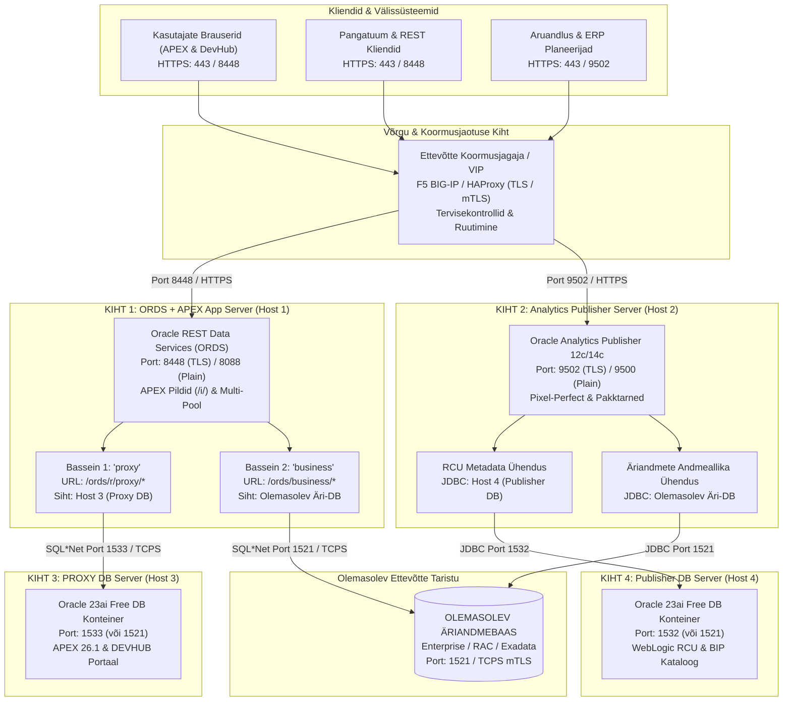
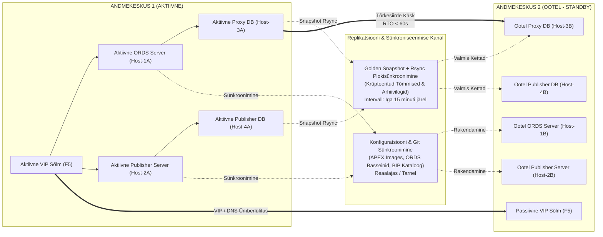

# Ettevõtteklassi hajutatud multi-host arhitektuuri spetsifikatsioon

[ 🇬🇧 English ](../enterprise-distributed-architecture.md) | [ 🇪🇪 Eesti ](enterprise-distributed-architecture.md) | [ 🇫🇮 Suomi ](../fi/enterprise-distributed-architecture.md) | [ 🇸🇪 Svenska ](../sv/enterprise-distributed-architecture.md) | [ 🇱🇻 Latviešu ](../lv/enterprise-distributed-architecture.md) | [ 🇱🇹 Lietuvių ](../lt/enterprise-distributed-architecture.md)

---

## 1. Ülevaade ja finantsregulatsioonide nõuetele vastavus

Käesolev dokument sätestab toodangukõlbliku, kõrgkäideldava ja hajutatud arhitektuurse mudeli Oracle DevOps & APEX platvormi paigaldamiseks finantsettevõtte ja reguleeritud sektori remote Linux serveritele kolmes elutsükli etapis: **DEV**, **TEST** ja **PROD**.

### Regulatiivsed ja turvalisuse invariandid
- **DORA (Digitaalse Tegevuskerksuse Määrus) & EBA Juhendid:** Garanteerib äritegevuse järjepidevuse kahe andmekeskuse **Active / Standby** mudeli kaudu, pakkudes **RTO < 60s** (taasteaja eesmärk) ja **RPO < 15m** (andmekao piirmäär).
- **PCI-DSS & ISO/IEC 27001:** Null plaintext parooli kettal, kohustuslik otspunktidevaheline TLS 1.3 / mTLS krüpteering, AES-256 Oracle Secure External Password Store (SEPS) Auto-Login Walleti kasutamine, rootless Podman konteinerite isolatsioon ja vähimate õiguste printsiip andmebaasikasutajatele.
- **Vastutusalade Selge Eraldamine (4 Kihti):** Likvideerib ühise tõrkepunkti ja mälukonkurentsi, hajutades töökoormuse 4 eraldiseisva serverisõlme vahel igas keskkonnas.

---

## 2. Hajutatud 4-kihiline arhitektuuritopoloogia

Iga keskkond (DEV, TEST, PROD) koosneb 4 eraldiseisvast füüsilisest või virtuaalsest Linux hostist (RHEL 9 / Oracle Linux 9):

---

## 3. Toodangu (PROD) active / standby avariitaaste

Toodangukeskkonnas (PROD) peegeldatakse kõik 4 kihti kahe andmekeskuse vahel (DC-1 Aktiivne vs DC-2 Ootel/Standby):

---

## 4. Võrgupordi ja tulemüüri maatriks

| Lähteallikas | Sihtkoht | Port / Protokoll | Teenus | Kirjeldus |
|:---|:---|:---|:---|:---|
| Sisevõrk / Kasutajad | F5 Koormusjagaja (VIP) | `443/TCP`, `8448/TCP` | HTTPS | APEX rakendused, DevHub & Core REST API-d |
| Sisevõrk / ERP | F5 Koormusjagaja (VIP) | `9502/TCP` | HTTPS | Analytics Publisher veebiliides & REST API |
| F5 Koormusjagaja | Server 1 (ORDS) | `8448/TCP` | HTTPS | Pöördproksi liiklus ORDS konteinerisse |
| F5 Koormusjagaja | Server 2 (Publisher) | `9502/TCP` | HTTPS | Pöördproksi liiklus Publisher konteinerisse |
| Server 1 (ORDS) | Server 3 (Proxy DB) | `1533/TCP` | Oracle SQL*Net | APEX tuuma & DevHub päringud (`proxy` bassein) |
| Server 1 (ORDS) | Olemasolev Äri-DB | `1521/TCP` (või `2484`) | SQL*Net / TCPS | Äriandmebaasi REST teenused (`business` bassein) |
| Server 2 (Publisher) | Server 4 (Publisher DB) | `1532/TCP` | Oracle SQL*Net | WebLogic RCU konfiguratsioon & kataloogi talletus |
| Server 2 (Publisher) | Olemasolev Äri-DB | `1521/TCP` (või `2484`) | SQL*Net / TCPS | Äriandmete lugemine aruannete genereerimiseks |
| Bastion / CI Runner | Kõik Serverid (1..4) | `22/TCP` | SSH / SFTP | Automaatne paigaldus, Ansible, käsureatööriistad |
| Server 3A (Active DB) | Server 3B (Standby DB) | `22/TCP` / `873/TCP` | SSH / rsync | Proxy DB Golden Snapshot andmemahu replikatsioon |
| Server 4A (Active DB) | Server 4B (Standby DB) | `22/TCP` / `873/TCP` | SSH / rsync | Publisher DB RCU Golden Snapshot andmemahu replikatsioon |
