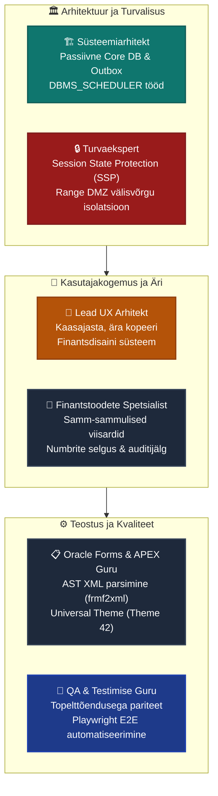
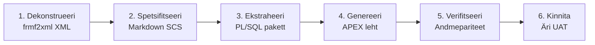

# 🏛️ Oracle Forms Moderniseerimise Strateegiline Tegevuskava (Master Plan)

> **Keelelüliti:**  
> [ 🇬🇧 English ](file:///Users/allanlahe/Oracle/oracle-free-db-in-prod/docs/forms-modernization-master-plan.md) | [ 🇪🇪 Eesti ](file:///Users/allanlahe/Oracle/oracle-free-db-in-prod/docs/et/forms-modernization-master-plan.md)

---

## 1. Eksekutiivne Kokkuvõte ja Visioon

Käesolev strateegiline tegevuskava reguleerib kriitilise tähtsusega **25-aastase finantsrakenduse (umbes 130 Oracle Forms vormi)** evolutsioonilist moderniseerimist kaasaegseks, turvaliseks ja mugavaks **Oracle APEX** veebirakenduseks.

```
┌──────────────────────────────────────────────────────────────────────────────────────────────────┐
│ PEAMINE STRATEEGILINE PÕHIMÕTE: EVOLUTSIOON, MITTE NULLIST ÜMBERKIRJUTUS                         │
├───────────────────────────────────────────────────┬──────────────────────────────────────────────┤
│ ❌ LÕKS: BIG-BANG ÜMBERKIRJUTUS (REACT/JAVA)      │ ✅ ÕNNESTUNUD TEE: APEX & OLEMASOLEV BAAS    │
├───────────────────────────────────────────────────┼──────────────────────────────────────────────┤
│ • Nullist uue virna ehitus (4+ aastat raisatud)   │ • 80–90% äriloogikast on juba andmebaasis    │
│ • Miljonid kulutatud, äriarendus külmunud         │ • Vana Forms oli vaid aken andmebaasi        │
│ • Konsultandid ei tunne andmebaasi äriloogikat    │ • APEX rakendab olemasolevaid pakette        │
│ • Kahekordne taristukulu ja DR-keerukus           │ • 0 € lisalitsentsitasu (sisaldub baasis)    │
│ • 5–10 aastane riskiprojekt                       │ • 10–15 kuud järkjärgulist valmimist         │
└───────────────────────────────────────────────────┴──────────────────────────────────────────────┘
```

### Projekti Peamised Tugevused
1. **80–90% äriloogikast elab juba andmebaasis:** Aastakümnete pikkused maksureeglid, arvutusvalemid ja finantstõed on turvaliselt kapseldatud PL/SQL pakettidesse.
2. **Oracle Analytics Publisher on juba kasutusel:** Oracle Reportsi ei kasutata; Publisher tagab pikslitäpsed väljatrükid ja integreerub natiivselt APEX-iga.
3. **Uusim APEX ja ORDS on andmebaasis valmis:** Infrastruktuuri baaskiht on tootmiskõlblik ja toetatud.
4. **Zero-Trust võrgupiirang:** Äriandmebaas (Core DB) on rangelt passiivne ega algata kunagi väljaminevaid ühendusi.

---

## 2. Seitsme Eksperdi Vaatenurga Audit



### 2.1 🎨 UX Lead: Finantsvaldkonna Ergonoomika & Disainisüsteem
- **Moderniseeri, ära kopeeri:** Asenda 25-aastased tihedad 100-väljalised ekraanid kaasaegse **Faceted Search** otsingu, **Interactive Grid** tabelite ja **samm-sammuliste viisarditega**.
- **Põhjamaine Finantskujundus:**
  - Primaarne tegevuskollane: `#FDC92A` (tõmmised `#FBDD91`, `#FFDF88`)
  - Sügav tume espresso: `#2F2424` (tüpograafia, menüüd, kõrge kontrast)
  - Pehme aprikoosi/liivakarva taustapind: `#FBF2EA` / `#F9F8F6`
  - Finantsnumbrid paremale joondatud ja fikseeritud laiusega (`font-variant-numeric: tabular-nums`).
  - WCAG 2.1 AA/AAA kontrastinõuete täitmine kõigis tehingudialoogides.
- **Klaviatuuritöö kiirus:** Säilitada kiirklahvid ja loogiline tabulatsioon kogenud finantsoperaatorite jaoks.

### 2.2 📋 Forms Guru: Dekonstruktsioon ja Tsentraliseerimine
- **130 vormi jaotus keerukuse järgi:**
  - **Laine 1 (30 vormi):** Lihtsad klassifikaatorid ja CRUD lehed.
  - **Laine 2 (60 vormi):** Standardsed Master-Detail tehinguvormid.
  - **Laine 3 (40 vormi):** Komplekssed finantsmonoliidid.
- **Trigerite viimine baasi:**
  - `POST-QUERY` loogika viiakse SQL vaadetesse.
  - `WHEN-VALIDATE-RECORD` teisendatakse andmebaasikitsendusteks ja pakettideks.
  - Vormide program units viiakse taaskasutatavatesse andmebaasipakettidesse.

### 2.3 🔒 Turvaekspert: Zero-Trust ja Passiivne Äribaas
- **Äribaas ei ole väljaminev aktor:** Tulemüürid keelavad äribaasist väljaminevad võrguühendused.
- **Session State Protection (SSP):** URL-i argumentidel on kontrollkood kohustuslik.
- **Granulaarne autoriseerimine:** Rollid on seotud andmebaasi õigustega; kliendipoolne õigustest möödahiilimine on välistatud.

### 2.4 🏗️ Süsteemiarhitekt: Passiivne Outbox ja Batch-Orkestratsioon
- **Transactional Outbox Pattern:** Äribaas kirjutab sündmused `OUTBOX_EVENTS` tabelisse samas tehingus.
- **DMZ Proxy DB (`db-proxy`):** Käivitab `DBMS_SCHEDULER` tööd, mis tõmbavad ootel sündmused ning teevad tegelikud välised REST/Kafka väljakutsed.
- **Sissetulevad API-d läbi ORDS-i:** Välised partnerid pöörduvad ORDS-i poole, mis kutsub turvaliselt passiivseid salvestatud protseduure äribaasis.

### 2.5 🧪 QA Guru: Andmepariteedi Topelttestimine
- **SQL MINUS kontroll:** Automaatne skript (`diff-forms-apex-data.sh`) võrdleb vana Formsi ja uue APEX lehe tehingute tulemeid tabelites.
- **Playwright E2E testid:** Brauseritestid valideerimisreeglite ja kasutajavoogude kontrolliks.

### 2.6 ⚡ APEX Guru: Universal Theme & Pikaajaline Hooldatavus
- **Natiivsed komponendid:** Kasutatakse APEX Universal Theme standardkomponente koos kohandatud CSS-iga; välistatakse raskesti hooldatavad välised JS raamistikud.
- **Valutud versiooniuuendused:** APEX tulevased versioonid uuenevad automaatselt ilma koodi purunemiseta.

### 2.7 💼 Finantsspetsialist: Usaldus ja Töövoogude Selgus
- **Topeltkinnitus kriitilistel tehingutel:** Selged dialoogid enne pearaamatusse kandmist või massmaksete käivitamist.
- **Kontekstitundlik abi:** Igal finantsväljal on sisseehitatud abitekst, mis töötab ka võrguühenduseta.

---

## 3. Repositooriumite Arhitektuur (Multi-Repo Jaotus)

Selge vastutusalade ja turvatsoonide eraldus:

```
┌─────────────────────────────────────────────────────────────────────────────────────────────────┐
│ REPOSITORIUMITE STRUKTUUR JA VASTUTUSALAD                                                       │
├────────────────────────────────┬───────────────────────────────┬────────────────────────────────┤
│ 1. oracle-devops-platform      │ 2. financial-core-db          │ 3. financial-apex-app          │
│ (Taristu, DevOps & AI Tööriist)│ (Andmebaasikiht & Batchid)    │ (APEX UI, Kujundus & Testid)   │
├────────────────────────────────┼───────────────────────────────┼────────────────────────────────┤
│ • Podman/Docker orkestreerimine│ • Tabelid, vaated, indeksid   │ • APEX rakenduse lähtekood     │
│ • Oracle Forms 14c ja frmf2xml │ • Liquibase changelogid       │ • Finantsteema CSS ja muutujad │
│ • Migratsiooni kiirendid       │ • Transactional Outbox DDL    │ • Playwright E2E testid        │
│ • Portfelli analüüsi skriptid  │ • utPLSQL testikomplektid     │ • Offline kasutajaabi ja dokid │
│ • Dev Hub juhtimispaneel       │ • DBMS_SCHEDULER ahelad       │ • Rakenduse lokaliseeringud    │
└────────────────────────────────┴───────────────────────────────┴────────────────────────────────┘
```

---

## 4. AI Assambleeliin: 6-Etapiline Migratsiooni Konveier

Iga vorm läbib standardse 6-etapilise konveieri:



---

## 5. Ajakava ja Ressursside Hinnang

### Stsenaarium A: 1 Juhtiv Arhitekt + AI Sünergia
- **Ettevalmistus (Faas 0):** 3–4 nädalat (Teema, Outbox, 3 pilootvormi).
- **Laine 1 (Lihtsad - 30 vormi):** 2 nädalat (~3 vormi päevas).
- **Laine 2 (Tehingud - 60 vormi):** 6–7 nädalat (~2 vormi päevas).
- **Laine 3 (Monoliidid - 40 vormi):** 8–10 nädalat (1–2 päeva vormi kohta).
- **Faas 4 (UAT ja juurutus):** 3–4 nädalat.
- **KOKKU:** **5.5 – 7 kuud**.

### Stsenaarium B: Tavapärane Inimmeeskond (ilma AI assambleeliinita)
- **Koosseis:** 1 Arhitekt, 2 APEX arendajat, 1 Forms/PLSQL spetsialist, 1 QA insener, 0.5 UX disainer, 0.5 Ärianalüütik.
- **KOKKU:** **10 – 14 kuud**.

---

## 6. Selles Repos Olemasolevad Migratsiooni Tööriistad

| Tööriist / Komponent | Asukoht | Kirjeldus |
|---|---|---|
| **Portfelli Analüsaator** | [`scripts/forms/analyze-forms-portfolio.sh`](file:///Users/allanlahe/Oracle/oracle-free-db-in-prod/scripts/forms/analyze-forms-portfolio.sh) | Analüüsib korraga kõiki vorme, arvutab skoori ja määrab migratsioonilained. |
| **Outbox Core DDL** | [`config/templates/outbox-proxy/01_core_outbox_ddl.sql`](file:///Users/allanlahe/Oracle/oracle-free-db-in-prod/config/templates/outbox-proxy/01_core_outbox_ddl.sql) | Passiivse äribaasi outbox tabel ja pakett. |
| **Proxy Dispatcher** | [`config/templates/outbox-proxy/02_proxy_poller_chain.sql`](file:///Users/allanlahe/Oracle/oracle-free-db-in-prod/config/templates/outbox-proxy/02_proxy_poller_chain.sql) | DMZ Proxy `DBMS_SCHEDULER` ahel väliskõnede tegemiseks. |
| **Finantsteema CSS** | [`assets/themes/nordic-financial/nordic-financial-theme.css`](file:///Users/allanlahe/Oracle/oracle-free-db-in-prod/assets/themes/nordic-financial/nordic-financial-theme.css) | APEX Universal Theme 42 stiil täpsete värvitokenite ja tabelireeglitega. |
| **Theme Roller JSON** | [`assets/themes/nordic-financial/theme_roller_nordic_financial.json`](file:///Users/allanlahe/Oracle/oracle-free-db-in-prod/assets/themes/nordic-financial/theme_roller_nordic_financial.json) | 1-klikiga APEX-isse imporditav värvikonfiguratsioon. |
| **Pariteedikontroll** | [`scripts/forms/diff-forms-apex-data.sh`](file:///Users/allanlahe/Oracle/oracle-free-db-in-prod/scripts/forms/diff-forms-apex-data.sh) | SQL MINUS päringutel põhinev pariteeditestimise skript. |
| **Interaktiivne Esitlus** | `Dev Hub > Forms Modernization` | 13-slaidiline interaktiivne esitlus Dev Hubi veebiliideses. |
