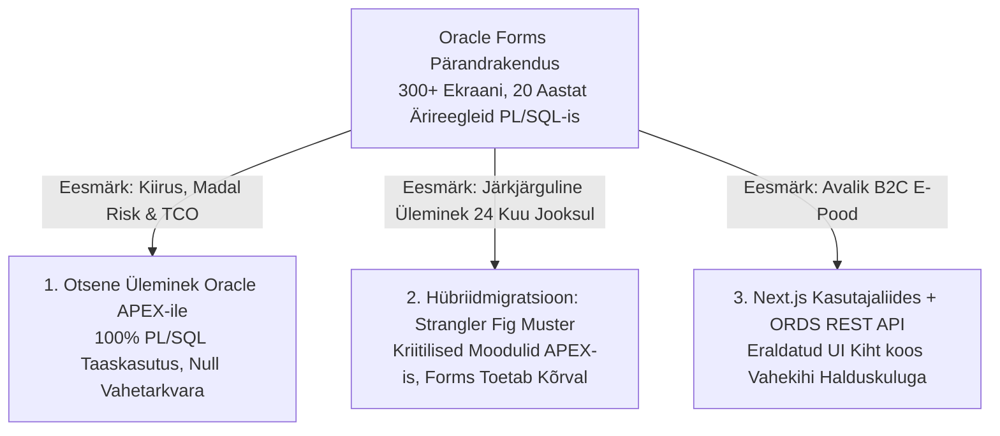
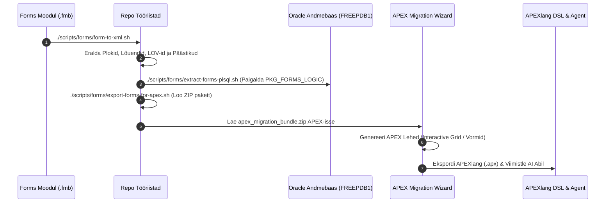

# Oracle Forms & reports moderniseerimise ja Oracle APEX-ile üleviimise juhend

[ 🇬🇧 English ](file:///Users/allanlahe/Oracle/oracle-free-db-in-prod/docs/forms-to-apex-migration-guide.md) | [ 🇪🇪 Eesti ](file:///Users/allanlahe/Oracle/oracle-free-db-in-prod/docs/et/forms-to-apex-migration-guide.md) | [ 🇫🇮 Suomi ](file:///Users/allanlahe/Oracle/oracle-free-db-in-prod/docs/fi/forms-to-apex-migration-guide.md) | [ 🇸🇪 Svenska ](file:///Users/allanlahe/Oracle/oracle-free-db-in-prod/docs/sv/forms-to-apex-migration-guide.md) | [ 🇱🇻 Latviešu ](file:///Users/allanlahe/Oracle/oracle-free-db-in-prod/docs/lv/forms-to-apex-migration-guide.md) | [ 🇱🇹 Lietuvių ](file:///Users/allanlahe/Oracle/oracle-free-db-in-prod/docs/lt/forms-to-apex-migration-guide.md)

---

## 1. Juhtkonna kokkuvõte & äriline põhjendus 2026. aastal

Kasutad 2026. aastal endiselt Oracle Forms & Reports süsteeme? Peamine põhjus, miks ettevõtted üle maailma liiguvad Oracle APEX-ile, ei ole enam pelgalt tehnoloogiline uudsus — **see on otsene KULU, tegevuskiirus ja ressursside kokkuhoid.**

```mermaid
graph TD
  subgraph Pärandvarana Oracle Forms Stack
    LF1[Oracle WebLogic Server] --- LF2[Forms Services 12c/14c]
    LF2 --- LF3[Repository Creation Utility RCU]
    LF3 --- LF4[Kulukas ja Raske Virtuaalmasinate Taristu]
    LF4 --- LF5[Java Runtime / Web Start Klienditarkvara]
  end

  subgraph Kaasaegne Oracle APEX Stack
    AP1[Oracle Database 23ai / Free DB]
    AP2[Natiivne APEX Mootor Andmebaasis]
    AP3[Oracle REST Data Services ORDS]
    AP1 --- AP2
    AP2 --- AP3
    AP3 --- AP4[Null Klienditarkvara: Puhas HTML5 / CSS3 Veeb]
  end
```



### Forms & reports pärandvara tegelik kulu
Oracle Forms keskkondade käigushoidmine nõuab märkimisväärseid ressursse:
- ❌ **Raskepärane Vahetarkvara:** Vajab eraldi WebLogic Server klastreid, Node Manageri ja RCU skeeme.
- ❌ **Kõrged Taristukulud:** Mitmed gigabaidid RAM-i hallatava serveri kohta ning aeglane käivitusaeg.
- ❌ **Keerulised Juurutused:** Tundlikud binaarsete `.fmx`/`.mmx` failide kompileerimised erinevate operatsioonisüsteemide vahel.
- ❌ **Kasutajapoolsed Tõrked:** Sõltuvus Java Web Startist, brauseri pistikprogrammidest või noVNC töölauaühendustest.
- ❌ **Kulukas Hooldus:** Kahanev spetsialistide hulk ja kõrgendatud tugilitsentside tasud.

### Oracle APEX-i eelised
Samal ajal töötab Oracle APEX **natiivselt Oracle andmebaasi tuumas**:
- ✅ **Puudub Eraldiseisev Vahetarkvara:** ORDS tegeleb kergekaalulise HTTP/REST ruutimisega; APEX käivitatakse otse SQL/PLSQL mootoris.
- ✅ **Litsentsitasuta:** Sisaldub tasuta Oracle andmebaasi litsentsis (Free DB, SE2, EE, Autonomous Database).
- ✅ **100% PL/SQL Äriloogika Taaskasutus:** Olemasolevad paketid, protseduurid ja päästikud (*triggers*) ei vaja ümberkirjutamist.
- ✅ **Kaasaegne Kohanduv UX:** Universal Theme pakub mobiilivalmidust, tumedat režiimi ja ligipääsetavust standardina.
- ✅ **Pilve- ja Konteinerivalmidus:** Hetkeline käivitus kergetes Podman konteinerites ja OCI pilves.
- ✅ **Tehisintellektiga Arendus (Vibe Coding):** APEXlang (`.apx`) DSL ja tehisintellekti agendid kiirendavad arendust mitu korda.

> [!IMPORTANT]
> **Otsustajate Peamine Järeldus:**
> Organisatsioonid saavad kogu oma ärirakenduste portfelli moderniseerida **ilma andmebaasi äriloogikat nullist ümber kirjutamata**. Küsimus ei ole enam *"Kas me peaksime moderniseerima?"*, vaid *"Kui kaua me suudame pärandvara kulusid taluda?"*

---

## 2. Miks APEX on tehisintellekti ajastul arhitektuurselt ülimalt tõhus: "Low-Code kui kood"

*(Inspireeritud Justin Milleri ja Cristina Varase tehisintellekti strateegiast)*

Low-code arendus teeb läbi revolutsioonilist hüpet: visuaalsest hiirega komponentide lohistamisest liigutakse **"Low-Code kui Kood" (Low-Code as Code)** ajastusse. Oracle APEX 26.1 ja APEXlang võimaldavad luua, valideerida ja juurutada täismahulisi ettevõtte rakendusi otse VS Code'ist ilma ainsatki komponenti visuaalselt lohistamata.

Tänases generatiivse tehisintellekti (GenAI) maailmas on LLM-ide abil rakenduste loomiseks kaks põhimõtteliselt erinevat viisi:

```mermaid
graph TD
  subgraph Valik 1: Otsene Genereerimine (Direct Generation - Habras Kood)
    D1[LLM Päring / Prompt] --> D2[LLM kirjutab 10 000 rida toorkoodi<br/>React, Next.js, Node, Käsitsi Kirjutatud Sessioonihaldus]
    D2 --> D3[Kõrge vigade ja hallutsinatsioonide oht, puuduvad CSRF/bind muutujad,<br/>N+1 päringud, loetamatu koodiülevaade]
  end

  subgraph Valik 2: Kaudne Genereerimine (Indirect Generation - Intentsioonimootor)
    I1[LLM Päring / Prompt] --> I2[LLM kirjutab 10 rida APEXlang DSL koodi<br/>Määrab kõrgetasemelise INTENTSIOONI: Grid, Vorm, Filtrid]
    I2 --> I3[Lahingutes testitud Täitmismootor (Implementation Engine)<br/>Oracle APEX + Andmebaasi Tuum]
    I3 --> I4[100x Suurem Korrektsus, 1000x Parem Loetavus,<br/>Garanteeritud Sessioonihaldus, Autentimine ja Transaktsioonid]
  end
```

### SQL analoogia: Miks me ei genereeri 100 000 rida c või java koodi?
Kõike, mida saab teha SQL-is, saaks põhimõtteliselt teha ka C või Java keeles. Me ei *vaja* tingimata andmebaasimootorit; LLM võiks genereerida oma faililukustuse ja andmehalduse süsteemi (**Valik 1: Otsene Genereerimine**).
Kuid mitte keegi ei tee seda. Selle asemel kirjutame **10 rida deklaratiivset SQL-i** ning usaldame andmebaasimootorit (RDBMS), mis tagab samaaegsuse (MVCC), ACID transaktsioonid, indekseerimise ja tabelite liitmised (**Valik 2: Kaudne Genereerimine**).

### APEXlang läbimurre (APEX 26.1+)
Andmekesksed veebirakendused koosnevad standardsetest ehitusplokkidest: raportid, graafikud, liigendotsing (*faceted search*), vormid, sessioonihaldus, autentimine ja autoriseerimine.

- **Otsene Genereerimine (Valik 1):** Paludes LLM-il genereerida tuhandeid ridu React/TypeScript/CSS liimkoodi, tekitatakse tehnilist võlga, turvaauke ja läbipaistmatuid vigu.
- **Kaudne Genereerimine (Valik 2):** Paludes LLM-il genereerida deklaratiivset **APEXlang (`.apx`)** koodi, kirjeldatakse vaid kõrgetasemelist **kavatsust** (*intent*). Natiivne **Oracle APEX Täitmismootor** teostab ja turvab komponendid automaatselt.

| Mõõde | Otsene Genereerimine (Tavaline Full-Stack AI) | Kaudne Genereerimine (APEXlang + APEX Mootor) |
| :--- | :--- | :--- |
| **Koodibaasi Maht** | 1000–10 000 rida liimkoodi ja boilerplatet | **10–50 rida deklaratiivset `.apx` DSL koodi** |
| **Arhitektuurne Korrektsus** | Keskmine (hallutsineeritud erandid, lekked) | **100x Suurem Tõenäosus** (Mootor tagab arhitektuuri) |
| **Inimloetavus ja Ülevaatus** | Äärmiselt keeruline (massiivsed diff-failid) | **1000x Parem Loetavus** (Selged intentsioonipõhised diffid) |
| **Sisseehitatud Turvalisus** | Käsitsi (tuleb promptida CSRF, bindid jne) | **Automaatne** (Sessioonikaitse, sidusmuutujad) |
| **Pikaajaline Elutsükkel (LCM)**| Sõltuvuste roiskumine (npm/raamistike vahetus)| **Null Roiskumist** (Mootori uuendused säilitavad koodi) |
| **Inimkontroll (Human-in-the-Loop)** | Habras must kast | **Auditeeritav, versioonitav ja lihtsalt hallatav** |

### Juhitud sisend VS juhitud käitusaeg: AI usaldusmudeli pööramine

*(Inspireeritud Kris Rice'i, Oracle Database tarkvaraarenduse asepresidendi analüüsist)*

Enamik AI koodikirjutamise (vibe-coding) riske lahkavaid artikleid jõuab samale diagnoosile: tehisintellekt genereerib toorkoodi, mis peidab endas SQL-süstimise auke, katkist autentimist või lekkinud paroole. Pakutav lahendus on alati tagantjärele lisatav hõõrdejõud: koodiskännerid, staatiline analüüs (SAST) ja pikk koodiülevaatus.

**Oracle APEX + APEXlang pöörab selle usaldusmudeli pea peale:**

```mermaid
graph TD
  subgraph Traditsiooniline Vibe-Coding (Juhitud Käitusaeg / Tagantjärele Kontroll)
    T1[LLM Genereerib Suvalist Toorkoodi] --> T2[Kood Sisaldab Turvaauke ja SQL-Süstimist]
    T2 --> T3[Aeglane ja Kallis Tagantjärele Koodiülevaatus & Skännerid]
    T3 --> T4[Vigade Jõudmine Toodangusse]
  end

  subgraph APEX + APEXlang (Juhitud Sisend / Kaitsepiire Enne Genereerimist)
    A1[LLM Genereerib Deklaratiivset APEXlang DSL-i] --> A2[Versioonitud EBNF Grammatika Kaitsepiire]
    A2 --> A3[Parsimise-Aegne Valideerimine: Vigased Konstruktsioonid Kukuvad Kohe Läbi]
    A3 --> A4[Andmebaasi Tuuma Turvalisus: Automaatsed Sidusmuutujad, Null Süstimist, Möödapääsmatu RLS]
  end
```

1. **Avaldatud EBNF Grammatika kui Esivärava Kaitse ([`apexlang.ebnf`](https://docs.oracle.com/en/database/oracle/apex/26.1/apxln/apexlang.ebnf)):** APEXlangi kirjutav LLM ei väljasta suvalist koodi, vaid rangelt formaliseeritud [EBNF grammatikale](https://docs.oracle.com/en/database/oracle/apex/26.1/apxln/apexlang.ebnf) alluvat struktuuri. Kohalikus või ettevõtte AI järeldusmootoris (nt `llama.cpp` GBNF piirangutega dekodeerimine) on mudelil füüsiliselt võimatu väljastada olematuid võtmeid, vigaseid väärtusi või sulgemata sulge. Vigane süntaks kukub läbi parsimise ajal SQLcl-is, mitte kunagi toodangus.
2. **Deterministlik AST Staatiline Turvaanalüüs:** Turvatööriistad ei kasuta habrast tekstilist regex-otsingut, vaid analüüsivad otse abstraktset süntaksipuud (AST) — kontrollides autoriseerimisskeeme (`@ADMIN_ROLE`), raami sissepaneku keeldu (`embedInFrames: deny`) ja laiendatud HTML-i varjestamist enne juurutamist.
3. **Platvormi Sisseehitatud Immuunsus:**
   - **SQL-süstimine:** APEX kasutab vaikimisi alati sidusmuutujaid (*bind variables*) kõigis regioonides, vormides ja protsessides.
   - **Autentimine:** Standardne deklareeritud skeem välistab käsitsi kirjutatud JWT vead.
   - **Pääsuhaldus ja Reataseme Turvalisus (RLS/VPD):** Turvapoliitikad elavad andmebaasi tuumas *allpool* rakenduse kihti. AI mudel saab neid viidata, kuid **ei saa neist mitte kunagi mööda hiilida**.

> [!TIP]
> **Juhitud Sisend vs Juhitud Käitusaeg:**
> Võid kulutada tohutult aega ja raha vigade püüdmisele pärast seda, kui AI on need tekitanud — või ehitada platvormile, kus enamik turvaauke on juba arhitektuurselt võimatud. Vaata ametlikku masinloetavat [APEXlang EBNF Grammatikat](https://docs.oracle.com/en/database/oracle/apex/26.1/apxln/apexlang.ebnf).

### Koodi omamise koormus: Genereeri seda, mida soovid omada; oma seda, mida genereerid
Kaasaegsete AI agentidega (Antigravity, Claude Code, Codex) saab genereerida mistahes rakenduse — piiriks on vaid idee kvaliteet. Kuid ettevõtte kriitiliste süsteemide puhul ei piisa sellest, et rakendus läbib 1. päeval AI automaattestid:

> [!IMPORTANT]
> **Deklaratiivne blueprint kui spetsifikatsioon vs Koodi omamise koormus:**
> Kiirem ja turvalisem tarne saavutatakse kaasaegses arhitektuuris mitte toorkoodi massilise genereerimise, vaid **lihtsama ja turvalisema arhitektuuri** abil. Kui AI genereerib 10 000+ rida Reacti, Node'i või mikroteenuste liimkoodi, langeb kogu koodi omamise ja haldamise koormus (*code ownership burden*) arendusmeeskonnale: turvaaukude paikamine, teekide aegumine ja pidev refaktoreerimine.
> Seevastu APEX blueprint ja APEXlang (`.apx`) töötavad kui **deklaratiivne spetsifikatsioonikeel**. Turvalisus (CSRF, XSS, RLS, sidusmuutujad) on mootorisse sisse ehitatud, võrgulatents on 0ms ning puudub vajadus hallata ja omada tuhandeid ridu genereeritud toorkoodi.

1. **Lühiajalise rahulolu lõks (Otsene AI genereerimine):** Kui lased AI-l genereerida 10 000 rida React/Node koodi, vastutab sinu meeskond iga üksiku rea eest. Mõne kuu pärast aeguvad teegid, tekivad turvaaugud ja brauseri API-d muutuvad, sundides arendajaid pidevale koodi ümbertegemisele.
2. **Pikaajaline ettevõtte standard (Mudelipõhine APEX mootor):** Kui genereerid deklaratiivset **APEXlang** koodi, püsib rakenduse kood puhas ja vigadeta aastaid. Kui Oracle uuendab APEX-it ja andmebaasi, saab rakendus automaatselt uued turvauuendused, ligipääsetavuse ja jõudluse ilma, et arendaja peaks muutma ainsatki koodirida.

> [!TIP]
> **Tööstusanalüütikute Hinnang (IDC, Blue Badge Insights, KuppingerCole, Constellation Research):**
> Sõltumatud tarkvara-analüütikud (Carl Olofson, Andrew J. Brust, Alexei Balaganski) toovad välja kolm Oracle generatiivse AI strateegilist läbimurret:
> 1. **Avatud AI mudelite ökosüsteem:** Oracle ei sunni kasutama suletud mudelit, vaid toetab standardse MCP protokolli kaudu kõiki juhtivaid AI agente (Antigravity AI, Claude Code, Cursor, Codex).
> 2. **Innovatsiooni eraldamine tehnilisest võlast:** Deklaratiivne APEXlang võimaldab ülikiiret prototüüpimist, samal ajal kui andmebaasimootor välistab teekide aegumise ja koodi roiskumise.
> 3. **Läbipaistev juhtimine (Musta kasti ohu vältimine):** Deklaratiivne `.apx` süntaks tagab 100% selguse ja auditeeritavuse enne koodi andmebaasis käivitamist.

---

## 3. Modulaarse monoliidi eelis: Miks vältida mikroteenuste keerukuse lõksu

*(Inspireeritud Anton Martyniuki ja Enterprise Architecture parimatest praktikatest)*

Pärandvarasüsteemide (Forms/Reports) moderniseerimisel langevad paljud organisatsioonid lõksu, kus koodibaas tükeldatakse enneaegselt 30+ hajutatud mikroteenuseks, lootes "iseseisvaid juurutusi":

```mermaid
graph TD
  subgraph Hajutatud Mikroteenuste Lõks
    M1[100+ Repot ja Killustatud CI/CD]
    M2[Võrgu Latentsus Igal Sisesel API Kutsel]
    M3[Hajutatud Transaktsioonid ja Saga Keerukus]
    M4[Andmete Sünkroonist Väljumine ja Lõplik Konsistentsus]
    M1 --- M2
    M2 --- M3
    M3 --- M4
  end

  subgraph Andmebaasisisene Modulaarne Monoliit (Oracle APEX)
    A1[Ühtne Juurutatav Tervik ja Hetkeline Setup]
    A2[Mälusisene SQL/PLSQL Käivitus: Null Võrgulatentsust]
    A3[Natiivsed ACID Transaktsioonid ja Null Andmete Triivi]
    A4[Vajadusel Hetkeline REST API läbi ORDS AutoRESTi]
    A1 --- A2
    A2 --- A3
    A3 --- A4
  end
```

### Mikroteenused ei kaota keerukust — Nad viivad selle võrku
Kui monoliitne süsteem lõhutakse mikroteenusteks, vahetatakse hallatav koodi keerukus massiivse võrgu- ja taristu ülalpidamiskulu vastu:
- ❌ Hajutatud transaktsioonid nõuavad keerulist ja habrast Saga kompensatsiooniloogikat.
- ❌ Võrgu latentsus ja andmete JSON-iks serialiseerimine aeglustab iga päringut.
- ❌ Andmed triivivad erinevate dokumentide/SQL andmebaaside vahel sünkroonist välja.
- ❌ Kohaliku arenduskeskkonna ülesseadmine võtab uuel arendajal terve nädala.

### Oracle APEX: Tipptasemel modulaarne monoliit
Oracle APEX ja Oracle 23ai pakuvad ideaalset **Modulaarse Monoliidi arhitektuuri**:
1. **Puhtad Domeenipiirid:** Loogika eraldatakse andmebaasi skeemide, PL/SQL pakettide ja APEX rakenduste abil ilma võrgumakse maksmata.
2. **Natiivne ACID & Mitmemudelisus:** Relatsioonilised tabelid, JSON Duality vaated ja AI Vector manused on pärandatavad ühesainsas transaktsioonis ilma andmete triivita.
3. **Pragmaatiline Teenuste Eraldamine:** Kui välisel süsteemil on *tõepoolest* vaja ligipääsu, saab **ORDS AutoREST (`ORDS.ENABLE_OBJECT`)** abil luua REST API üheainsa reaga ilma süsteemi ümber ehitamata.

---

## 4. Strateegiline otsustusraamistik: APEX VS. next.js VS. hübriidmigratsioon

*(Inspireeritud Marcio Ramo ja Wojciech Bielawski arhitektuuriarutelust)*

Kui ettevõttel seisab ees 300+ ekraaniga pärandsüsteemi (Forms) moderniseerimine, küsitakse sageli: **"Kas kirjutada kõik ümber Next.js/React peale või migreeruda Oracle APEX-ile?"**



### "Armu probleemi, mitte tehnoloogiasse" (domeeniteadmus on ettevõtte tõeline vara)

*(Inspireeritud Simon Martinellist, AI Unified Process loojast ja Oracle ACE Pro-st)*

Generatiivse AI ajastul on koodi genereerimine muutunud kiireks ja odavaks. Ettevõtte tõeline konkurentsieelis ja tarkvaratehniline väljakutse on **äridomeeni probleemi, ärilise kavatsuse ja süsteeminõuete sügav mõistmine**.

Oracle Formsi pärandsüsteemid kätkevad endas 15–25 aasta jooksul lihvitud ärireegleid ja erijuhtumeid. Tarkvaratehnika distsipliin ei seisne uusima veebiraamistiku tagaajamises, vaid domeeniprobleemile õige lahenduse ehitamises. Moderniseerimisel peab peamine siht olema **selle domeeniteadmuse säilitamine** võimalikult lihtsa ja vahetu arhitektuuriga.

### Juhusliku sidususe minimeerimine (accidental coupling & IVP)

*(Inspireeritud Yannick Lothist, Independent Variation Principle / IVP autorist)*

Iga arhitektuurne otsus kas minimeerib või võimendab **juhuslikku tehnilist sidusust** (*accidental coupling*):
- **Juhuslik Sidusus Vahekihiga Ümberkirjutamisel (Next.js / Node):** Andmebaasi domeeni lahutamine eraldi esiotsa raamistikuks sunnib meeskondi ehitama ja hooldama tarbetut tehnilist liimi: võrgu serialiseerimist, DTO objekte ja dubleeritud valideerimisloogikat.
- **Minimaalne Sidusus Oracle APEX-is:** Kuna APEX käivitub otse andmebaasi tuumas PL/SQL pakettide peal, on juhuslikud tehnilised sõltuvused viidud miinimumini. Domeenimudeli muudatused kanduvad rakendusse loomulikult ilma 5 võrgukihi ümberkirjutamiseta.

### Strateegiline otsustusmaatriks

| Mõõde | Oracle APEX (Andmebaasisiseselt) | Next.js / React (Vahekiht) | Hübriidmigratsioon (Strangler Fig) |
| :--- | :--- | :--- | :--- |
| **Peamine Optimeering** | **Kiirus, Madalaim Risk, PL/SQL Taaskasutus** | B2C Tarbijaliides, Multi-Cloud UI | Riskide hajutamine 100+ ekraani puhul |
| **Äriloogika Taaskasutus**| **100% Otsene PL/SQL Pakettide Tugi**| Nõuab REST API Kihti (`ORDS`) | Järkjärguline PL/SQL eraldamine |
| **Taristu Lisakulu** | **Null (Töötab natiivselt Oracle DB-s)** | Nõuab Node.js / Vercel servereid | Null täiendavat taristut |
| **Turvalisus ja Autentimine**| **Sisseehitatud Sessiooni- ja RLS Kaitse** | Käsitsi JWT, CORS ja CSRF haldus | Ühtne APEX ja DB autentimine |
| **Parim Kasutuskoht** | **ERP, CRM, Sisemised Operatsioonisüsteemid**| **Avalikud Kliendiportaalid** | **Suured Ettevõtte Portfellid (300+ Forms)**|

> [!TIP]
> **Pragmaatiline Ettevõtte Tee (Hübriidstrateegia):**
> Suurte süsteemide puhul kasuta **Kägistajaviigipuu mustrit (Strangler Fig Pattern)**: moderniseeri kõige kriitilisemad ja kasutajate poolt enim nõutud moodulid esmalt **Oracle APEX-ile**, samal ajal kui ülejäänud Forms moodulid töötavad paralleelselt sama andmebaasi skeemi peal. Ava puhtad REST API-d **ORDS AutoREST** abil vaid seal, kus välised kolmandad süsteemid seda päriselt vajavad.

---

## 5. Tehnoloogiline võrdlustabel

| Arhitektuurne Omadus | Oracle Forms 14c / 12c | Kaasaegne Oracle APEX (23ai / 26.1) |
| :--- | :--- | :--- |
| **Käituskiht** | WebLogic Server (`WLS_FORMS`) | Natiivne Andmebaasi Tuum |
| **Veebilüüs** | WebLogic HTTP Server / OHS | Oracle REST Data Services (ORDS) |
| **Kliendinõuded** | Java Runtime (JRE), Web Start või noVNC (`6082`) | Brauseri HTML5 / CSS3 / JavaScript |
| **Kasutajaliides** | Fikseeritud koordinaatidega aknad | Kohanduv Universal Theme (Mobiil & Arvuti) |
| **Litsentsid** | FMW / WebLogic Suite Litsentsid | **Sisaldub Andmebaasis (Lisatasuta)** |
| **Käivitusaeg** | 3–6 minutit domeeni buutimine | **~5–15 sekundit FastStart konteineris** |
| **Andmeühendus** | Rasked olekupõhised SQL*Net sessioonid | Kerged ühenduste kogumi (*connection pool*) päringud |
| **REST API Tugi** | Keerulised SOAP / Java vahekihid | Natiivne AutoREST (`ORDS.ENABLE_OBJECT`) ja REST töölaud |

---

## 6. Praktiline 5-etapiline migratsiooni töövoog

Meie repositoorium sisaldab valmis automatiseerimisskripte kaustas [`scripts/forms/`](file:///Users/allanlahe/Oracle/oracle-free-db-in-prod/scripts/forms).



---

### Etapp 1: Inventuur ja XML teisendus

Kuna APEX ei loe suletud binaarset `.fmb` formaati, teisendatakse moodulid struktureeritud XML-kujule:

```bash
# Ühe mooduli teisendamine:
./scripts/forms/form-to-xml.sh forms_apps/orders.fmb

# Kogu kausta teisendamine:
find forms_apps -name "*.fmb" -exec ./scripts/forms/form-to-xml.sh {} \;
```

---

### Etapp 2: PL/SQL äriloogika eraldamine pakettidesse

Formsi päästikutesse (`WHEN-BUTTON-PRESSED`, `POST-QUERY`, `KEY-NEXT-ITEM`) peidetud kood eraldatakse puhasteks andmebaasipakettideks:

```bash
./scripts/forms/extract-forms-plsql.sh forms_apps/orders.xml
```

Tulemuseks on `PKG_ORDERS_FORMS_LOGIC.sql`, mis paigaldatakse andmebaasi skeemi ja mida APEX saab koheselt välja kutsuda.

---

### Etapp 3: APEX migratsioonipaketi loomine

Kõik XML failid ja SQL sõltuvused koondatakse üheks standardseks paketiks:

```bash
./scripts/forms/export-forms-for-apex.sh
```
Väljund: `build/apex_migration_bundle.zip`.

---

### Etapp 4: Importimine APEX application migration workshopi

1. Ava **Oracle APEX App Builder** (`http://localhost:8088/ords` või `https://localhost:8448/ords`).
2. Vali menüüst **App Builder** $\rightarrow$ **Application Migration Workshop**.
3. Loo uus projekt ja lae üles `build/apex_migration_bundle.zip`.
4. Vali analüüsitud plokid ja kliki **Generate Application**.

---

### Etapp 5: Tehisintellekti ja APEXlang DSL viimistlus läbi SQLcl MCP

Ekspordi baasrakendus tekstipõhisesse `APEXlang` (`.apx`) formaati:

```bash
sql /@DB_PROXY_DEV <<EOF
apex export -applicationid 100 -exptype apexlang
EXIT;
EOF
```

> [!TIP]
> **Miks SQLcl & MCP on kohustuslik AI tööriistapaar:**
> AI agent (Antigravity AI / Claude Code) suhtleb otse **SQLcl-iga läbi Model Context Protocoli (`sql -mcp`)**:
> 1. **Null Hallutsinatsiooni:** Agent kontrollib reaalset andmesõnastikku (`USER_TAB_COLUMNS`) üle MCP enne koodi genereerimist.
> 2. **Parsimise-Aegne EBNF Valideerimine:** Agent käivitab käsu `apex validate`, tagades süntaksi korrektsuse enne importi.
> 3. **Automaatne Kiirjuurutus:** Agent käivitab käsu `apex import` sekunditega ilma veebiliideses hiirega lohistamata.

Kasuta skilli [`apexlang_app_generation`](file:///Users/allanlahe/Oracle/oracle-free-db-in-prod/.agents/skills/apexlang_app_generation/SKILL.md) ja ametlikku juhendit [Oracle APEXlang Reference Manual](https://docs.oracle.com/en/database/oracle/apex/26.1/apxln/), et asendada pärandahendused kaasaegsete sahtelvormide (*Modal Drawers*) ja mitmekeelsete `messages.apx` tekstidega.

---

## 7. Oracle reports (`.rdf`) migreerimine

| Oracle Reports Pärandkood | Kaasaegne APEX Sihtlahendus |
| :--- | :--- |
| **Arved, Saatelehed ja Prindivormid** | **Oracle Analytics Publisher** (Pixel-Perfect REST API, BP 10/41) |
| **Interaktiivsed Juhtimisaruanded** | **APEX Interactive Reports & Cards** SVG graafikutega |
| **Tavapärane PDF Väljatrükk** | **APEX Native Document Printing** (Sisseehitatud PDF/Excel eksport) |

---

## 8. Kokkuvõte ja järgmised sammud

Formsilt APEX-ile üleminek on madala riskiga ja kiire tasuvusega projekt:

1. **Käivita Blueprint 41 või Blueprint 22**, et testida Formsi ja APEX-it paralleelselt:
   ```bash
   ./scripts/setup-all.sh -b 41
   ```
2. **Käivita automatiseeritud teisendusskript:**
   ```bash
   ./scripts/forms/export-forms-for-apex.sh
   ```
