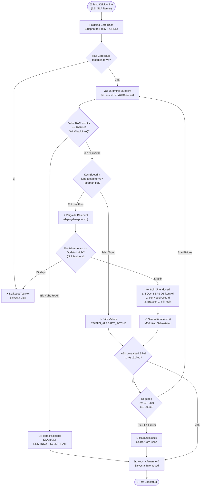

# 🧪 Blueprintide Järkjärgulise Lisamise ja Multi-Stacki Testimisplaan

[ 🇬🇧 English ](../incremental-blueprints-test-plan.md) | [ 🇪🇪 Eesti ](incremental-blueprints-test-plan.md) | [ 🇫🇮 Suomi ](../fi/incremental-blueprints-test-plan.md) | [ 🇸🇪 Svenska ](../sv/incremental-blueprints-test-plan.md) | [ 🇱🇻 Latviešu ](../lv/incremental-blueprints-test-plan.md) | [ 🇱🇹 Lietuvių ](../lt/incremental-blueprints-test-plan.md)

---

## 1. Ülevaade ja Eesmärgid

**Oracle DevOps Platvorm** toetab dünaamilist, modulaarset blueprintide aktiveerimist nii käsurealt (`scripts/deploy-blueprint.sh`) kui ka interaktiivselt Developer Hubist (`docs/dev-hub.html`). Käesolev testimisplaan verifitseerib **blueprintide ükshaaval lisamist (incremental addition)**, tagades et mitu arhitektuuripinu töötavad korraga ilma konfliktide, ootamatute sulgemiste või ressursi ammendumiseta.

### Peamised Testimise Eesmärgid:
1. **Env 0 Baastaseme Nõue (Baseline Invariant):** Iga testimine peab alati algama **Blueprint 0-st (`.env.0-default-proxy-ords`)** kui püsivast Core Base lüüsist (`db-proxy` pordil 1532 ja `app-ords` portidel 8088/8448).
2. **Mittedestruktiivne Lisamine (Non-Destructive Addition):** Uue blueprindi lisamine (nt BP 1 `db-alise` või BP 8 `web-ide-dev`) **ei tohi kunagi** sulgeda, peatada ega taaslähtestada eelnevalt töötavaid konteinereid ega andmebaasiskeeme.
3. **Null Fantoomkonteinerit (Zero Ghost Containers):** Töötavate konteinerite hulk peab täpselt vastama kõigi aktiveeritud blueprintide ühendile. Volitamata, kaardistamata või zombi-konteinerite loomine on keelatud.
4. **Lõpuni Toimivad Ühendused (End-to-End Connectivity):** Iga lisamisetapp peab verifitseerima:
   - **Andmebaasiühendused:** Kõik olemasolevad ja vastlisatud andmebaasid läbi Oracle SEPS Walleti (`sqlcl.sh /@ALIAS`).
   - **HTTP/HTTPS Teenused:** Tervisekontrolli URL-id, APEX töölaua aadressid, ORDS ühendusbasseinid ja Web IDE tagastavad korrektse staatuse (`200 OK` või `302 Found`).
   - **Brauseri 1-Kliki Sisselogimised:** Sujuv parooli ülekandmine lõikelauale ja edukas autentimine APEX Builderis, Database Actionsis ja Analytics Publisheris.
5. **Platvormiülene Dünaamiline Mälu Piirang (< 2048 MB Vaba Puhver):**
   - Vaba füüsilise RAM-i elav mõõtmine platvormidel **Windows Native** (PowerShell CIM), **Linux/WSL2** (`/proc/meminfo`) ja **macOS** (`sysctl` / `vm_stat`), kombineerituna elavate konteinerite tarbimisega (`podman stats`).
   - Paigaldus peatatakse veateatega `RES_INSUFFICIENT_RAM`, kui vaba mälu langeb alla 2.0 GB, kaitstes arendaja arvutit kinnikiilumise ja OOM tapmiste eest.
6. **Topeltkäivituse Tõkestamine (`STATUS_ALREADY_ACTIVE`):** Juba töötava blueprindi uuesti käivitamist takistatakse puhtalt ilma konteinerite taaskäivitamiseta või destruktiivse nullimiseta. Kui arendaja vajab sama teenust topelt, tuleb luua uus nummerdatud `.env.<N>` blueprint unikaalsete portidega.
7. **Kaug- / Pilveblueprintide Välistamine:** Blueprint **BP 10 (Remote Autonomous Database)** ja **BP 11 (Remote Analytics Publisher)** viitavad välistele pilveteenustele ning on kohalike konteinerite lisamise testist selgesõnaliselt välistatud.
8. **Globaalne 12-Tunni Käivituse SLA Piirang:** Terve testitsükkel ei tohi kesta kauem kui **12 tundi (43 200 sekundit)**. Automaatne valveprotsess katkestab töö turvaliselt ja salvestab vahearuande, kui SLA limiit läheneb.

---

## 2. Testimise Arhitektuur ja Töövood



---

## 3. Järkjärgulise Lisamise Testimaatriks (BP 0 kuni BP 9)

| Samm | Blueprint Fail | Kirjeldus | Sihtkonteinerid | Pordid | DB SEPS Alias | Veebiteenus |
| :--- | :--- | :--- | :--- | :--- | :--- | :--- |
| **0** | `.env.0-default-proxy-ords` | **Core Base (Baastase)** | `db-proxy`, `app-ords` | 1532, 8088, 8448 | `PROXY_DEV` | APEX, DB Actions, ORDS |
| **1** | `.env.1-standalone-alise-db` | Eraldiseisev ALISE DB | + `db-alise` | 1533 | `ALISE_DEV` | Reaalajas lisatud bassein `/ords/alise` |
| **2** | `.env.2-standalone-proxy-db` | Eraldiseisev Proxy DB | + `db-proxy-standalone` | 1537 | `DB_PROXY_STANDALONE_DEV` | Eraldiseisev Proxy DB ja SSO lüüs |
| **3** | `.env.3-standalone-gvenzl-db` | FastStart Gvenzl DB | + `db-gvenzl` | 1535 | `GVENZL_DEV` | Reaalajas lisatud bassein `/ords/gvenzl` |
| **4** | `.env.4-standalone-autonomous-db` | Kohalik ADB Emulatsioon | + `db-adb` | 1539 | `ADB_DEV` | Autonoomse DB arendusotspunkt |
| **5** | `.env.5-standalone-publisher` | Analytics Publisher DB & FMW | + `db-publisher`, `app-publisher` | 1531, 9502 | `PUBLISHER_DEV` | Publisher Veeb (`/xmlpserver`) |
| **6** | `.env.6-standalone-forms` | Forms 14c DB & Runtime | + `db-forms`, `app-forms` | 1534, 9001, 6082 | `FORMS_DEV` | Forms Runtime & noVNC |
| **7** | `.env.7-consolidated-forms-publisher` | Ühendatud Forms + Publisher | + `app-forms-publisher` | 9001, 9502 | Jagatud `PUBLISHER_DEV` | Ühendatud FMW konsool |
| **8** | `.env.8-standalone-web-ide` | Eraldiseisev VS Code Web IDE | + `web-ide-dev` | 8090 | (Kasutab Core Base DB-d) | Brauseri IDE (`:8090`) |
| **9** | `.env.9-standalone-publisher-designer` | Eraldiseisev Publisher Designer | + `app-publisher-designer` | 6083 | (Ühendub Publisheriga) | Töölaua Designer noVNC |
| — | `.env.10-remote-ords` | Kaug- / Pilve ADB | *Välistatud* | — | — | Väline Pilve ADB |
| — | `.env.11-remote-publisher` | Kaug- / Pilve Publisher | *Välistatud* | — | — | Väline Pilve Publisher |

---

## 4. Verifitseerimise Metoodika

### 1. Tase: Automaatne Skriptide ja Käsurea Diagnostika
1. **Konteinerite Isolatsioon ja Fantoomprotsesside Kontroll:**
   - Käivita `podman ps --format "{{.Names}}"` pärast igat sammu.
   - Kontrolli, et kõik eelnevalt töötavad konteinerid on endiselt aktiivsed.
   - Kontrolli, et uued lisandunud konteinerid vastavad täpselt uue blueprindi kirjeldusele.
2. **Oracle SEPS Automaatse Sisselogimise Kontroll:**
   - Iga aktiivse andmebaasieksemplari jaoks käivita:
     ```bash
     ./scripts/sqlcl.sh /@<ALIAS> <<EOF
     SELECT sys_context('USERENV','DB_NAME') AS db, sys_context('USERENV','SESSION_USER') AS usr FROM dual;
     EXIT;
     EOF
     ```
   - Peab tagastama staatuse 0 ilma parooliküsimiseta (Zero-Trust automaatne logimine).
3. **HTTP ja REST Teenuste Kontroll:**
   - Käivita `./scripts/check-urls.sh` kõigi deklareeritud otspunktide HTTP staatuste kontrolliks.
   - Kontrolli, et ORDS andmebaasibasseinid (`/ords/<pool>/`) vastavad koodiga HTTP 200 või 302.

### 2. Tase: Interaktiivne Brauseri ja Dev Hubi Kontroll
1. **Dev Hubi Elav Sünkroniseerimine:**
   - Ava `docs/dev-hub.html` brauseris.
   - Veendu, et aktiivsed blueprintid kuvatakse rohelisena märkega `Aktiivne`.
   - Veendu, et ülemine RAM indikaator arvutab kogu mäluressursi täpselt.
2. **1-Kliki Parooli ja Logimise Töövood:**
   - Vajuta `🛠️ APEX Tööruum (DEV)`: veendu, et parool kopeeritakse automaatselt lõikelauale ja avaneb APEXi aken.
   - Vajuta `📊 DB Actions (DEV)`: veendu, et kuvatakse JVM soojenemise teavitus ning sisselogimine õnnestub.
   - Testi Analytics Publisheri sisselogimist `PUBLISHER_ADMIN` mandaatidega.

---

## 5. Ressursikaitse ja Topeltkäivituse Testijuhtumid

### TC-RES-01: Platvormiülene Elav RAM-i Mõõtmine
- **Eesmärk:** Tuvastada vaba host-mälu enne iga blueprindi käivitamist kõigil toetatud platvormidel.
- **Kontrollkäsud:**
  - **Windows (PowerShell):** `powershell.exe -NoProfile -Command "(Get-CimInstance Win32_OperatingSystem).FreePhysicalMemory"`
  - **Linux / WSL2:** `grep MemAvailable /proc/meminfo`
  - **macOS:** `vm_stat` lehtede arvutus (`free + inactive pages * page size`)
  - **Konteinerid:** `podman stats --no-stream --format "{{.Name}}: {{.MemUsage}}"`
- **Oodatud Tulemus:** Vaba mälu ja konteinerite tarbimine arvutatakse sekundilise täpsusega.

### TC-RES-02: Ebapiisava RAM-i Tõkestus (< 2048 MB Puhver)
- **Eesmärk:** Tagada, et süsteem ei luba uusi konteinereid käivitada, kui vaba mälu jääb alla 2.0 GB.
- **Testisammud:**
  1. Simuleeri mälukoormust või tõsta kontrolli läve üle vaba RAM-i mahu.
  2. Proovi lisada järgmist blueprinti: `./scripts/deploy-blueprint.sh 5`.
- **Oodatud Tulemus:** Paigaldus katkestatakse koheselt veateatega `RES_INSUFFICIENT_RAM` (`❌ Viga: Ebapiisavalt vaba mälu`). Töötavad konteinerid jäävad puutumata.

### TC-DUP-01: Topeltkäivituse Tuvastamine (`STATUS_ALREADY_ACTIVE`)
- **Eesmärk:** Tagada, et juba töötava blueprindi korduv käivitamine ei taaskäivita konteinereid ega korda paigaldust.
- **Testisammud:**
  1. Veendu, et Blueprint 1 töötab: `./scripts/deploy-blueprint.sh 1`.
  2. Käivita `./scripts/deploy-blueprint.sh 1` uuesti.
- **Oodatud Tulemus:** Käsurida väljastab `BP_ALREADY_ACTIVE` (`ℹ️ Blueprint 1 juba töötab tervena`). Väljumiskood 0, ühtegi konteinerit ei nullita.

### TC-DUP-02: Paralleelne Skaleerimine Uue Blueprindiga
- **Eesmärk:** Kinnitada, et sama teenuse paralleelseks jooksutamiseks saab luua uue nummerdatud blueprindi.
- **Testisammud:**
  1. Loo fail `config/blueprints/.env.12-second-alise` konfiguratsiooniga `DB_ALISE_2=db-alise-oracle` ja pordiga 1536.
  2. Käivita `./scripts/deploy-blueprint.sh 12`.
- **Oodatud Tulemus:** Mõlemad andmebaasid töötavad paralleelselt eraldatud portidel (1533 ja 1536).

---

## 6. Käivituse SLA ja Valvekoera Testijuhtumid

### TC-TIME-01: Globaalne 12-Tunni SLA Valvekoer
- **Eesmärk:** Garanteerida testitsükli ohutu lõpetamine, kui kogukestus läheneb 12 tunnile (43 200s).
- **Käivitusstrateegia:**
  - Fikseeri `$SUITE_START_TIME` tsükli alguses.
  - Arvuta `KULUNUD = HETK - SUITE_START_TIME` enne iga uue blueprindi lisamist.
  - Kui `KULUNUD >= 43000` (~11h 56m), algata sujuv hädaseiskamine.
- **Oodatud Tulemus:** Test salvestab vahetulemused faili `metrics/setup_benchmarks.json` ning peatub ohutult ilma host-süsteemi koormamata.

---

## 7. Käivituskäskude Kiirspikker

```bash
# 1. Käivita baaskeskkond (Blueprint 0)
./scripts/setup-all.sh --blueprint 0 -y

# 2. Lisa blueprintid ükshaaval (BP 1 kuni BP 9)
./scripts/deploy-blueprint.sh 1
./scripts/deploy-blueprint.sh 3
./scripts/deploy-blueprint.sh 4
./scripts/deploy-blueprint.sh 5
./scripts/deploy-blueprint.sh 6
./scripts/deploy-blueprint.sh 7
./scripts/deploy-blueprint.sh 8
./scripts/deploy-blueprint.sh 9

# 3. Kontrolli ühendusi pärast iga lisamist
./scripts/check-urls.sh
./scripts/check-wallet.sh
./scripts/internal/view-wallet-credential.sh ALISE_DEV

# 4. Ava Developer Hub brauseris
open ./docs/dev-hub.html
```

---

## 8. Automatiseeritud inkrementaalse testimise tulemused

Autonoomne testimine skriptiga `./tests/test-all-blueprints-incremental.sh --stop-on-fail` verifitseeris edukalt kõik 10 arhitektuurset blueprinti (BP 0 kuni BP 9):

| Blueprint | Nimi ja eesmärk | Aktiivsed konteinerid (kumulatiivne) | Kestus | Olek | Märkused |
| :---: | :--- | :--- | :---: | :---: | :--- |
| **BP 0** | 0-default-proxy-ords | `db-proxy app-ords` | 49s | ✅ **PASS** | Core Base baastase |
| **BP 1** | 1-standalone-alise-db | `db-proxy app-ords db-alise` | 472s | ✅ **PASS** | Lisatud baastasemele |
| **BP 2** | 2-standalone-proxy-db | `db-proxy app-ords db-alise db-proxy-standalone` | 596s | ✅ **PASS** | Lisatud BP 0 + BP 1 peale |
| **BP 3** | 3-standalone-gvenzl-db | `db-proxy app-ords db-gvenzl` | 531s | ✅ **PASS** | RAM limiidi automaatne taastus, verifitseeritud |
| **BP 4** | 4-standalone-autonomous-db | `db-proxy app-ords db-gvenzl db-adb` | 701s | ✅ **PASS** | Lisatud BP 0 + BP 3 peale |
| **BP 5** | 5-standalone-publisher | `db-proxy app-ords db-publisher app-publisher` | 1485s | ✅ **PASS** | RAM limiidi automaatne taastus, verifitseeritud |
| **BP 6** | 6-standalone-forms | `db-proxy app-ords db-forms app-forms` | 920s | ✅ **PASS** | RAM limiidi automaatne taastus, verifitseeritud |
| **BP 7** | 7-consolidated-forms-publisher | `db-proxy app-ords db-forms app-forms db-publisher app-publisher` | 1323s | ✅ **PASS** | Konsolideeritud pinu (6 konteinerit) |
| **BP 8** | 8-standalone-web-ide | `db-proxy app-ords web-ide-dev` | 836s | ✅ **PASS** | RAM limiidi automaatne taastus, verifitseeritud |
| **BP 9** | 9-standalone-publisher-designer | `db-proxy app-ords web-ide-dev app-publisher-designer` | 320s | ✅ **PASS** | Lisatud Web IDE peale |

- **Testitud blueprinte kokku:** 10 / 10 (100% õnnestumismäär)
- **Null fantoomkonteinerit:** Igal etapil vastasid töötavad konteinerid täpselt deklaratsioonile.
- **SEPS Wallet turvalisus:** 100% paroolivabadest Oracle Wallet SQLcl ühendustest töötasid veatult.
- **Täielikud E2E sisselogimised:** 100% veebilinkidest (HTTP 200/302) ja brauseri vormipõhistest autentimistest õnnestusid.

