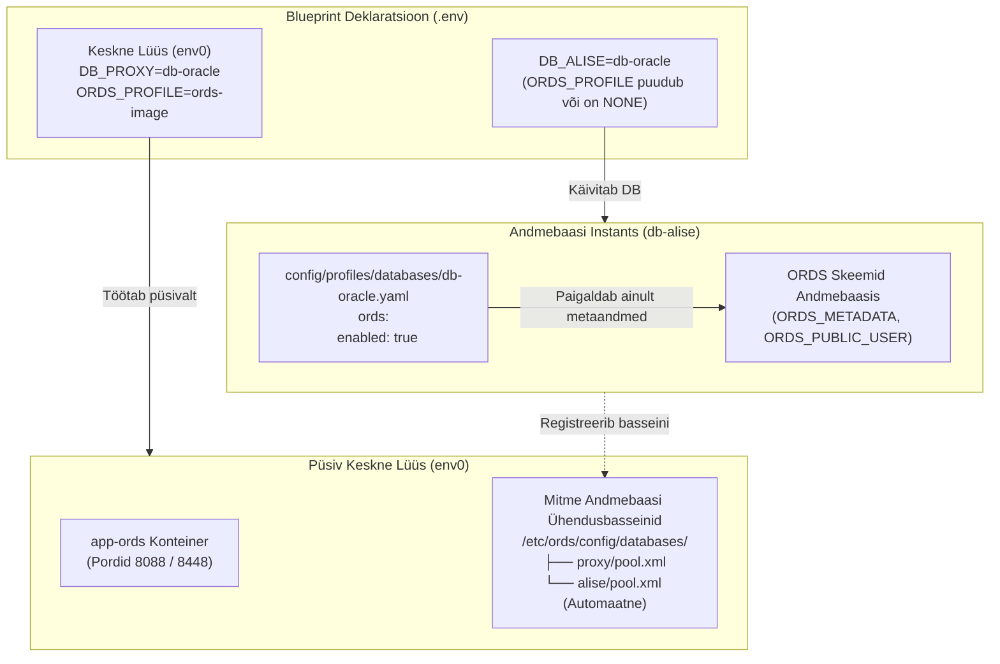

[ 🇬🇧 English ](../ords-profiles-lifecycle.md) | [ 🇪🇪 Eesti ](ords-profiles-lifecycle.md) | [ 🇫🇮 Suomi ](../fi/ords-profiles-lifecycle.md) | [ 🇸🇪 Svenska ](../sv/ords-profiles-lifecycle.md) | [ 🇱🇻 Latviešu ](../lv/ords-profiles-lifecycle.md) | [ 🇱🇹 Lietuvių ](../lt/ords-profiles-lifecycle.md)

# 🌐 Oracle REST data services (ORDS) profiilide ja sidumata elutsükli juhend

See juhend selgitab **Oracle REST Data Services (ORDS)** arhitektuuri, elutsükli haldust ning seadistamist lokaalsetes konteinerites, kaugeserverites ja Oracle Autonomous Database (ADB) pilvekeskkondades.

---

## 🏛️ 1. Sidumata arhitektuuri põhimõtted

Nüüdisaegses modulaarses arhitektuuris on veebirakenduste lüüs andmebaasimootorist lahti seotud:



### Peamised arhitektuurinõuded:
1. **`ords.enabled: true` Andmebaasi Profiilis:**
   - Valmistab ette andmebaasipoolsed ORDS-i skeemid, metaandmed (`ORDS_METADATA`) ja proxy-kasutajad.
   - **EI KÄIVITA** `app-ords` veebikonteinerit.
2. **`ORDS_PROFILE` Blueprintis:**
   - Määrab, kas `app-ords` veebikonteiner luuakse.
   - Kui parameeter puudub või on väärtusega `NONE`, töötab andmebaas puhta taustateenusena ilma jõudeoleku veebikonteineri RAM-kuluta.
3. **Automaatne Registreerimine Keskse Lüüsiga:**
   - Kui Blueprint 0 (`env0`) töötab taustal, genereerib iga uus lisatav andmebaas automaatselt ühendusbasseini `<basseini_nimi>.xml` ja teeb keskses ORDS-is reaalajas taaskäivituse (hot-reload).

---

## 📦 2. Kolm kanoonilist ORDS profiili

Kõik ORDS-i profiilid asuvad kaustas `config/profiles/ords/`:

| Profiil | Fail | Tüüp | Optimeering ja Sihtotstarve |
| :--- | :--- | :--- | :--- |
| **`ords-image`** | `config/profiles/ords/ords-image.yaml` | `image` | **Ametlik Oracle OCR Konteineripilt.** (`container-registry.oracle.com/database/ords:latest`). Viirusetõrjele optimeeritud, puudub kettale lahtipakkimine, kiire käivitus. Soovitatav kohalikuks arenduseks ja CI/CD-ks. |
| **`ords-local-custom`** | `config/profiles/ords/ords-local-custom.yaml` | `local_custom` | **Kohalik Kohandatud Skriptipaigaldus.** Kasutab ametlikke arhiive kaustast `binaries/ords/` ja paigaldusskripte, pakkides need lahti ajutises konteineris. |
| **`ords-remote-custom`** | `config/profiles/ords/ords-remote-custom.yaml` | `remote_custom` | **Kaugserveri Lüüs.** Ühendub olemasoleva eraldiseisva ORDS serveriga määratud võrguaadressil üle SSH või HTTPS. |

### Näide blueprintis:
```bash
# Kasuta ametlikku OCR konteineripilti
ORDS_PROFILE=ords-image

# Kasuta kohalikke paigaldusskripte
ORDS_PROFILE=ords-local-custom

# Kasuta kaugserveri ORDS-i
ORDS_PROFILE=ords-remote-custom
```

---

## ☁️ 3. Oracle autonomous database (ADB) integreerimine

Oracle Autonomous Database (Cloud ADB Serverless) sisaldab Oracle'i pilves juba eelinstalleeritud ja hallatud ORDS-i:

```yaml
# config/profiles/databases/db-adb.yaml
ords:
  enabled: true
  install_in_db: false       # ÄRA KUSTUTA ega kirjuta üle pilve poolt hallatud ORDS_METADATA skeemi
  verify_version_match: true # Kontrolli versioonide ühilvust keskse lüüsiga
```

### ADB elutsükli reeglid:
1. **Pilve Metaandmete Säilitamine (`install_in_db: false`):**
   - Paigaldusmootor jätab vahele `ords install` käsu andmebaasis, vältides pilveskeemide kahjustamist või õiguste vigu.
2. **Versioonide Ühilvuse Kontroll (`verify_version_match: true`):**
   - ADB registreerimisel lokaalses või keskses ORDS-is kontrollib süsteem päringuga ADB ORDS versiooni ning võrdleb seda töötava lüüsiga.
3. **mTLS Rahakoti Ühendusbassein:**
   - Loob ühendusbasseini pilve mTLS rahakoti konfiguratsiooniga ja TNS aliasega.

---

## 💡 4. Juhised kui ORDS server puudub

Kui käivitatakse andmebaasi blueprint ilma `ORDS_PROFILE` määranguta ja keskne ORDS ei tööta:

1. **Terminali Veebiteenuste Tabel:**
   ```text
   ┌─────────────────────────────────┬────────────────────────────────────────────┬─────────────────────────────┐
   │ Rakendus                        │ URL                                        │ Autentimine                 │
   ├─────────────────────────────────┼────────────────────────────────────────────┼─────────────────────────────┤
   │ ℹ️ ORDS Web Gateway              │ NOT CONFIGURED (Standalone DB)             │ Run: ./scripts/setup-all.sh --b 0
   └─────────────────────────────────┴────────────────────────────────────────────┴─────────────────────────────┘
   ```
2. **Selge Arendaja Juhis:**
   ```text
   ℹ️  ORDS Server ei ole konfigureeritud (app-ords puudub).
   💡 Juhis: Veebiliidese aktiveerimiseks käivita: ./scripts/setup-all.sh --b 0 või lisa blueprinti ORDS_PROFILE=ords-image
   ```
3. **Diagnostikatööriist (`scripts/check-urls.sh`):**
   - Tuvastab korrektselt veebiserveri puudumise ning kuvab viisaka selgituse ilma ühendusvigade ja katkestusteta.

---

## 🚀 5. Kiirkäsud

```bash
# 1. Käivita püsiv keskne ORDS lüüs:
./scripts/setup-all.sh -b 0

# 2. Käivita eraldiseisev äriandmebaas (registreeritakse automaatselt kesksesse ORDS-i):
./scripts/setup-all.sh -b 1

# 3. Kontrolli veebiaadresse ja aktiivseid basseine:
./scripts/check-urls.sh

# 4. Vaata andmebaasi basseini paroole:
./scripts/get-password.sh DB_ALISE_ORDS_PUBLIC_USER
```
