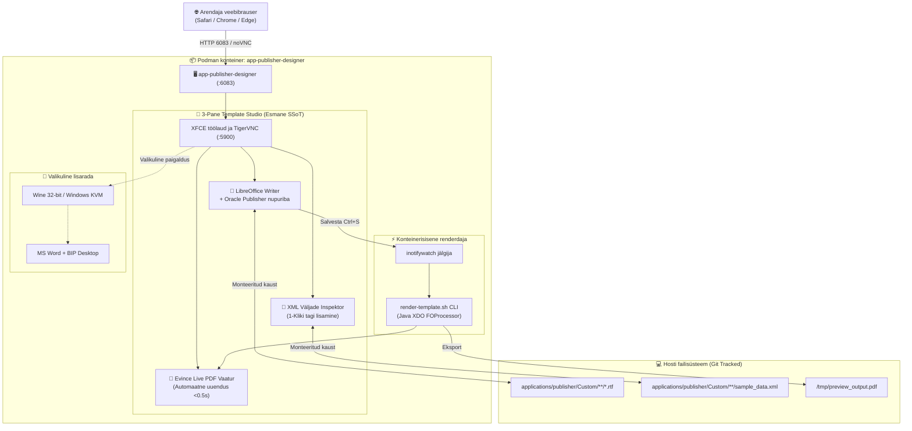
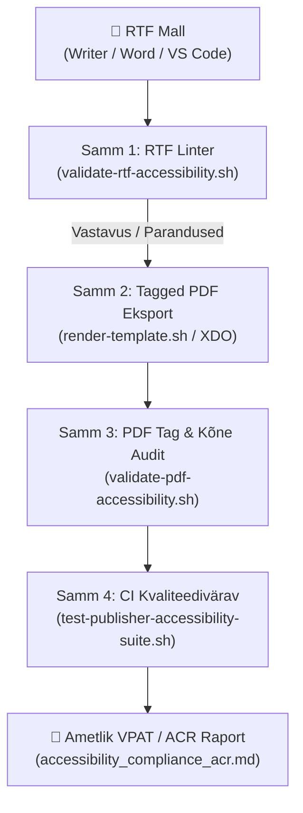

# Oracle Analytics Publisher malli kujundaja ja ligipääsetavuse juhend: LibreOffice Writer 3-Pane Studio (Esmane) ja MS Word KVM/Wine (Valikuline)

[ 🇬🇧 English ](../publisher-template-builder-guide.md) | [ 🇪🇪 Eesti ](publisher-template-builder-guide.md) | [ 🇫🇮 Suomi ](../fi/publisher-template-builder-guide.md) | [ 🇸🇪 Svenska ](../sv/publisher-template-builder-guide.md) | [ 🇱🇻 Latviešu ](../lv/publisher-template-builder-guide.md) | [ 🇱🇹 Lietuvių ](../lt/publisher-template-builder-guide.md)

---

## 1. Ülevaade ja äriline eesmärk

**Pikslitäpsete äridokumentide (arved, saatelehed, finantsaruanded)** kujundamine Oracle Analytics Publisheris tugineb **Rich Text Format (RTF) mallidele**, mis liidetakse **XML andmetega**, genereerides struktureeritud ja ligipääsetavaid PDF-faile.

### 🛑 Lahendatud ettevõtte probleemid:
Piiratud ettevõtte IT-keskkondades puutuvad mallide loojad kokku kriitiliste takistustega:
1. **Puuduvad Microsoft Office'i litsentsid arendus- ja CI-konteinerites:** Ettevõtte litsentsid on seotud töötaja individuaalse arvutiga. CI/CD automaatika ja arendajate Linuxi konteinerid ei oma MS Wordi litsentse.
2. **Lukustatud töökohad (puuduvad administraatoriõigused):** Arendajad ei saa oma arvutisse paigaldada lisatarkvara (`BIPublisherDesktop64.exe`) ega MS Wordi lisandmooduleid.
3. **Platvormide ülesus:** Arendajatel, kes töötavad **macOS** või **Linux** arvutitel, puudub Microsoft Wordi jaoks ametlik Template Builder lisandmoodul.

### 💡 Lahendus: LibreOffice 3-Pane Studio (Esmane SSoT):
**`app-publisher-designer`** konteiner (Blueprint 9) pakub null-litsentsi, null-paigaldusega koheselt töötavat töökohta otse veebibrauseris **HTML5 noVNC kaudu pordil 6083** (`http://localhost:6083/vnc.html`):
- **LibreOffice 7.x/24.x Writer (Eelkonfigureeritud SSoT):** Sisaldab eelpaigaldatud kohandatud **⚡ Oracle Publisher** menüüsid, nupuribasid, XML tagide lisamist ja kiirklahve. Kommertslitsentse pole vaja.
- **Evince Live PDF Vaatur:** Re-renderdab ja taaslaeb täidetud PDF-i vähem kui poole sekundiga iga salvestuse (`Ctrl+S`) järel.
- **Oracle XML Väljade Inspektor:** Visuaalne XML puu 1-kliki lisamisega otse Writeri aknasse X11 automatiseerimise abil.
- **Konteinerisisene kiir-renderdamise mootor:** Sisseehitatud Java Oracle XDO / `FOProcessor` ja headless PDF ekspordi käsurida.
- **Otsene Git sünkroonimine:** Stuudios salvestatud mallid asuvad otse hosti kaustas `templates/publisher/`.
- **Valikuline erirežiim:** Microsoft Word Wine'i või Windows KVM kaudu on toetatud valikulise teise rajana neile, kellel on olemas 32-bit Office paigaldusfailid.

---

## 2. Arhitektuur ja töökoha topoloogia



---

## 3. Kiirstart: LibreOffice Writer 3-Pane Studio (Esmane SSoT)

3-aknaga Template Studio on valmis koheselt pärast Blueprint 9 käivitamist ilma väliseid installereid alla laadimata.

### Samm 1: Käivita kujundaja konteiner
Blueprint 9 kaudu (Soovitatav):
```bash
./scripts/setup-all.sh -b 9
```
Või eraldiseisva skriptiga:
```bash
./scripts/publisher/start-designer.sh
```
Käivitamine kindlas keeles (nt eesti keeles):
```bash
./scripts/publisher/start-designer.sh --lang et   # Valikud: en, et, fi, sv, lv, lt
```

### Samm 2: Ava Template Studio brauseris
1. Ava veebibrauseris `http://localhost:6083/vnc.html`.
2. Tee topeltklõps töölaua ikoonil **🚀 Oracle Publisher Template Studio**.
3. Stuudio paigutab automaatselt 3 akent kõrvuti:
   - **Vasakul (65% laiusest):** **LibreOffice Writer** aktiivse RTF malliga (`arve_test_standard.rtf`).
   - **Paremal üleval (35% laiusest):** **Evince Live PDF Vaatur** kuvamas faili `valmis_arve.pdf`.
   - **Paremal all (35% laiusest):** **Oracle XML Väljade Inspektor** faili `arve_test_andmed.xml` puuvaatega.

### Samm 3: Kujundamine ja tagide lisamine
1. **Oracle Publisher menüü ja nupuriba LibreOffice'is:**
   - `🏷️ Lisa Väli (Field)`: Lisab `<?TAG_NAME?>` kursori asukohta.
   - `🔁 for-each Tsükkel`: Ümbritseb valitud tabeliread koodiga `<?for-each:LINES/LINE?> ... <?end for-each?>`.
   - `❓ Tingimus (IF)`: Lisab tingimusploki (`<?if:VAT_RATE > 0?>...<?end if?>`).
   - `⚡ Kiir-Renderda PDF`: Genereerib kohese PDF väljundi.
2. **1-Kliki lisamine XML Väljade Inspektorist:**
   - Vali XML puust soovitud element ja klõpsa **👉 Sisesta Kursorisse** — täpne süntaks sisestatakse otse Writerisse X11 automatiseerimise abil!
3. **Reaalajas live-eelvaade:**
   - Vajuta Writeris `Ctrl+S`. Taustal töötav inotify jälgija kompileerib PDF-i uuesti ja Evince uuendab vaate alla poole sekundiga.

### Samm 4: Peata kujundaja mälu vabastamiseks
```bash
./scripts/publisher/stop-designer.sh
```

---

## 4. Konteineris ja hostis testimise protsess

Malle saab testida ja kompileerida ilma graafilist töölauda avamata.

### 4.1 Hosti CLI test-renderdaja (`test-render.sh`)
Hosti käivitusskript tuvastab automaatselt, kas `app-publisher-designer` konteiner töötab:
```bash
# Tavapärane kasutus:
./scripts/publisher/test-render.sh \
  templates/publisher/samples/arve_test_standard.rtf \
  templates/publisher/samples/arve_test_andmed.xml \
  [väljund.pdf]

# Mitmekeelne renderdamine XLIFF tõlkega:
./scripts/publisher/test-render.sh --locale fi
```
- Kui konteiner töötab, suunatakse renderdamine konteinerisisesele skriptile `/u01/oracle/bin/render-template.sh`.
- Kui konteiner ei tööta, kasutatakse lokaalset headless LibreOffice + XDO eeltöötleja varuvarianti.

### 4.2 Otsene käivitamine konteineri sees
Renderdamist saab käivitada otse töötava konteineri sees:
```bash
podman exec -it app-publisher-designer /u01/oracle/bin/render-template.sh \
  /u01/templates/samples/arve_test_standard.rtf \
  /u01/templates/samples/arve_test_andmed.xml \
  /u01/templates/samples/valmis_arve_et.pdf \
  --locale et
```

### 4.3 Live Watcher & Hot-Reload (`watch-render-host.sh`)
Mallide redigeerimisel lokaalselt või Microsoft VS Code'is:
```bash
./scripts/publisher/watch-render-host.sh \
  templates/publisher/samples/arve_test_standard.rtf \
  templates/publisher/samples/arve_test_andmed.xml \
  templates/publisher/samples/valmis_test_arve.pdf
```
- Jälgib RTF faili muudatusi ajatemplite abil.
- Re-renderdab PDF-i automaatselt igal salvestusel vähem kui 0.5 sekundiga.
- Avab automaatselt operatsioonisüsteemi vaikevaaturi.

### 4.4 Mitmekeelsuse XLIFF (`.xlf`) arhitektuur
Üksainus RTF põhimall (`arve_test_standard.rtf`) teenindab kõiki 6 keelt ametlike Oracle XLIFF tõlkefailide kaudu:
- `arve_test_standard_et.xlf` (eesti keel)
- `arve_test_standard_en.xlf` (inglise keel)
- `arve_test_standard_fi.xlf` (soome keel)
- `arve_test_standard_sv.xlf` (rootsi keel)
- `arve_test_standard_lv.xlf` (läti keel)
- `arve_test_standard_lt.xlf` (leedu keel)

Renderda suvalises keeles parameetriga:
```bash
./scripts/publisher/test-render.sh --locale fi
```

---

## 5. Dokumentide ligipääsetavuse & PDF/UA-1 testimise protsess

Kõik Oracle Analytics Publisheri äridokumendid peavad vastama standarditele **PDF/UA-1 (ISO 14289-1)**, **WCAG 2.1 Level AA**, **Euroopa Ligipääsetavuse Akt (EAA / EN 301 549)** ja **Section 508**.

### Kohustuslikud disainireeglid (kokkuvõte):
1. **Pealkirjade hierarhia:** Kasuta stiile (`Heading 1` dokumendi pealkirjaks, `Heading 2` alajaotusteks). Ära kunagi simuleeri pealkirju paksu kirjaga.
2. **Tabeli päise kordus (`\trhdr`):** Mitmeleheküljelistel andmetabelitel peab päiserida korduma igal lehel (*LibreOffice: Tabeli omadused -> Tekstivoog -> Korda päist*; *MS Word: Rida -> Korda päisereana igal leheküljel*).
3. **Piltide ja logode Alt-tekst:** Igal pildil peab olema kirjeldav alternatiivtekst. Ettevõtte logod kasutavad keskset dünaamilist valemit:
   ```text
   url:{concat($IMAGE_DIR, '/company_logo.png')}
   Alt: Ettevõtte ametlik logo
   ```
4. **Värvikontrast:** Tavateksti ja tausta suhe vähemalt **4.5:1**. Helehalli teksti kasutamine valgel taustal on keelatud.
5. **Keelemärgis:** Genereeritud PDF peab deklareerima `/Lang` (`et-EE`, `en-US`, `fi-FI` jne).

### Ligipääsetavuse 4-etapiline testimisvoog:



#### Samm 1: RTF struktuurne auditeerimine
Käivita RTF linter enne kompileerimist:
```bash
./scripts/publisher/validate-rtf-accessibility.sh templates/publisher/samples/accessible_starter_template.rtf --strict
```
Kontrollib:
- Standardsete stiilide `Heading 1` ja `Heading 2` olemasolu.
- Tabeli päise korduskoodi `\trhdr` olemasolu.
- Piltide graafikaobjektide alternatiivtekste.
- Keelatud tühjade vahetulpade puudumist.

#### Samm 2: Sildistatud ligipääsetava PDF-i eksport
Renderdamisel süstib mootor PDF-i nõutavad struktuurielemendid:
- Kataloogi struktuuripuu: `/StructTreeRoot`
- Märgistatud sisu metadata: `/MarkInfo << /Marked true >>`
- Loomuliku keele märgis: `/Lang (et-EE)`

#### Samm 3: PDF tagide ja ekraanilugeja kõnesimulatsioon
Kontrolli genereeritud PDF-i silte ja simuleeri ekraanilugejate (NVDA, JAWS) kuuldavat kõnejada:
```bash
./scripts/publisher/validate-pdf-accessibility.sh templates/publisher/samples/valmis_arve_et.pdf
```
Kuvab struktuurituvastuse:
- Dokumendi pealkiri (`/H1`)
- Tabeli struktuur (`/Table`, `/TR`, `/TH`, `/TD`)
- Piltide Alt-tekstid (`/Figure /Alt (...)`)
- Vaegnägijale ette loetav kõnejada reaalajas.

#### Samm 4: Automaatne CI testikomplekt & ACR raport
Käivita täielik ligipääsetavuse automaattestide komplekt:
```bash
./tests/integration/test-publisher-accessibility-suite.sh
```
- Testib kõiki malle kaustas `templates/publisher/accessibility_suite/`.
- Salvestab võrdluskestused ja tulemused failidesse `metrics/accessibility_benchmarks.json` ja `.env`.
- Genereerib ametliku **Ligipääsetavuse vastavusraporti (VPAT / ACR)** asukohas:
  [`tests/reports/accessibility_compliance_acr.md`](../../tests/reports/accessibility_compliance_acr.md).

Täielikud nõuded ja juhised leiate spetsiaalsest juhendist:
👉 [`.agents/skills/oracle_publisher_accessibility/SKILL.md`](../../.agents/skills/oracle_publisher_accessibility/SKILL.md).

---

## 6. Arendaja töövoog: Microsoft VS Code & GitHub Copilot

RTF malle saab luua ja muuta otse **Microsoft VS Code'is** koos tehisintellekti abiga:

1. **Automaatsed Copiloti juhised:** VS Code GitHub Copilot loeb automaatselt faile [`.github/copilot-instructions.md`](../../.github/copilot-instructions.md) ja [`templates/publisher/COPILOT_INSTRUCTIONS.md`](../../templates/publisher/COPILOT_INSTRUCTIONS.md).
2. **Käivita terminalis live-jälgija:**
   ```bash
   ./scripts/publisher/watch-render-host.sh
   ```
3. **Ava mall VS Code'is:**
   Ava fail `templates/publisher/samples/arve_test_standard.rtf`.
4. **Küsitle Copilotit (`Cmd+I` / Chat):**
   Palu Copilotil lisada veerge, vormindada valuutat (`format-number`) või lisada tingimusplokke näidisfaili `templates/publisher/samples/arve_test_andmed.xml` põhjal.
5. **Reaalajas eelvaade (`Cmd+S`):**
   Faili salvestamisel toimub re-renderdamine alla 0.5 sekundiga ning PDF vaade uueneb.
6. **Automaatne kontroll:**
   Käivita `./tests/unit/test-publisher-rtf-template.sh` süntaksi ja skeemi kontrolliks.

---

## 7. Valikuline lisarada: Microsoft Word & BIP Desktop Wine'i või Windows KVM-i kaudu

Organisatsioonidele, kellel on kehtivad Microsoft Office'i litsentsid ja kes eelistavad ametlikku Oracle Wordi menüüriba:

### Samm 1: Aseta Office ja BIP paigaldusfailid kausta
Kopeeri 32-bitised paigaldusfailid kausta `binaries/publisher/`:
- `binaries/publisher/setup.exe` (Office 2010/2013/2016 32-bit standalone installer)
- `binaries/publisher/BIPublisherDesktop32.exe` (Oracle BI Publisher Desktop Template Builder)

### Samm 2: Käivita paigaldusskript
Käivita hostist seadistusskript:
```bash
./scripts/publisher/setup-word-designer.sh
```
Või ava noVNC töölaud brauseris (`http://localhost:6083/vnc.html`) ja klõpsa ikooni **"⚡ Paigalda Word & Publisher Designer"**.
Paigaldatud Word ja lisandmoodul säilivad konteineri taaskäivitamisel kettamahus `publisher_designer_wine`.

### Valitavad profiilid:
1. **Wine 32-bit režiim (Vaikimisi — `config/profiles/publisher/publisher-designer-standard.yaml`):**
   - Ubuntu 22.04 baasil Wine 32-bit prefix, `.NET 4.0` ja MSXML6.
2. **Natiivne Windows KVM režiim (`config/profiles/publisher/publisher-designer-windows.yaml`):**
   - Virtualiseeritud Windowsi töölaud (`dockur/windows`) KVM riistvarakiirendusega ja RDP toega pordil 3389.

---

## 8. Oracle Analytics Publisher malli süntaksi kiirviide

| Funktsionaalsus | Oracle BI Publisher RTF Tag | Kirjeldus |
| :--- | :--- | :--- |
| **Välja väärtus** | `<?INVOICE_NUM?>` | Väljastab XML elemendi väärtuse |
| **Korduvad read** | `<?for-each:G_LINES?>` ... `<?end for-each?>` | Itereerib üle XML reaelemendite |
| **Tingimusplokk** | `<?if:VAT_RATE > 0?>` ... `<?end if?>` | Kuvab sisu vaid tingimuse täitumisel |
| **Arvu vormindus** | `<?format-number(TOTAL, '#,##0.00')?>` | Vormindab rahasummad ja komakohad |
| **Kuupäeva vormindus**| `<?format-date(INVOICE_DATE, 'YYYY-MM-DD')?>` | Vormindab kuupäevad standardkujule |
| **Keskne logo** | `url:{concat($IMAGE_DIR, '/company_logo.png')}` | Viitab kesksele pildile ilma kohalike teedeta |
| **Päise kordus** | `\trhdr` (Tabeli rea omadused) | Kohustuslik PDF/UA-1 mitmeleheküljelise tabeli puhul |
| **Dokumendi pealkiri** | Stiil `Heading 1` Writeris/Wordis | Kohustuslik üksainus H1 märgis ekraanilugejatele |

---

## 9. Ettevõtte GitOps Standard (`applications/publisher/`), REST Paigaldus & CI/CD Töövoog

Ettevõtteklassi stabiilsuse, nulleelarve turvalisuse ja CI/CD nõuete tagamiseks hallatakse kõiki malle ja andmemudeleid kaustas `applications/publisher/`, mis peegeldab Oracle Analytics Publisheri serveri kataloogi 1:1 (`/Custom/<Valdkond>/<Raport>/`).

### 9.1 Kaustastruktuur ja GitOps Invariant

```text
applications/publisher/
├── .gitignore                         # Välistab binaarsed *.xdoz ja *.xdmz arhiivid
├── README.md                          # Dokumentatsioon (6 keelt: EN, ET, FI, SV, LV, LT)
└── Custom/
    └── Invoices/
        └── Invoice_Report/
            ├── Invoice_Report.xdo/       # Git-jälgitav raporti pakett
            │   ├── template.rtf          # Ligipääsetav PDF/UA-1 RTF mall
            │   ├── template_et.xlf       # Eesti keele XLIFF tõlked
            │   ├── template_fi.xlf       # Soome keele XLIFF tõlked
            │   └── _manifest.xml         # Publisheri raporti manifest
            └── Invoice_DataModel.xdm/    # Git-jälgitav andmemudeli pakett
                ├── datamodel.sql         # Puhas SQL andmete kogumise päring
                ├── datamodel.xml         # Andmemudeli XML (seotud ALISE_APP_DB-ga)
                └── sample_data.xml       # Näidisandmed offline ja CI testimiseks
```

### 9.2 Scaffolding & Paigalduse Käsureatööriistad

1. **Uue raporti genereerimine (Scaffolding):**
   ```bash
   ./scripts/publisher/create-report.sh Custom/Invoices/Packing_Slip "Saatelehe Raport"
   ```
2. **Serverisse saatmine (REST API / Copy):**
   ```bash
   ./scripts/publisher/deploy-template.sh Custom/Invoices/Invoice_Report --mode rest
   ```
3. **Paigaldus koos kohese serveripoolse PDF test-renderdusega:**
   ```bash
   ./scripts/publisher/deploy-template.sh Custom/Invoices/Invoice_Report --render
   ```

### 9.3 Turvarollid ja SEPS Walleti Rotatsioon

| Kasutaja | WebLogic Grupp | SEPS Walleti Alias | Skoop & Õigused |
| :--- | :--- | :--- | :--- |
| `bip_developer` | `XMLP_DEVELOPER`, `XMLP_TEMPLATE_DESIGNER` | `PUBLISHER_DEVELOPER` | Mallide ja andmemudelite loomine kaustas `/Custom/` |
| `bip_user` | `XMLP_SCHEDULER`, `XMLP_ANALYZER` | `PUBLISHER_USER` | Trükiste käivitamine, vaatamine ja ajaloo haldus |
| `bip_admin` | `XMLP_ADMIN` | `PUBLISHER_ADMIN` | BIP kataloogi haldus (puudub WebLogic konsool) |

Paroolide roteerimine läbi Oracle SEPS Walleti:
```bash
./scripts/rotate-password.sh publisher dev     # Roteerib bip_developer parooli
./scripts/rotate-password.sh publisher user    # Roteerib bip_user parooli
./scripts/rotate-password.sh publisher admin   # Roteerib bip_admin parooli
```

### 9.4 GitHub Actions CI/CD Töövoog (`.github/workflows/deploy-publisher-reports.yml`)

```mermaid
sequenceDiagram
    autonumber
    actor Dev as 👨‍💻 Release Manager<br/>(Arendaja / Haldur)
    participant GHA as ⚙️ GitHub Actions Runner<br/>(deploy-publisher-reports)
    participant QG as 🧪 CI Kvaliteedivärav<br/>(Linter & Test-Render)
    participant Art as 📦 GitHub Artifacts<br/>(Allalaaditav PDF)
    participant Sec as 🔑 Secret Store<br/>(GitHub Secrets / OIDC)
    participant Pub as 🏢 Publisher Server<br/>(:9502 REST API)

    Dev->>GHA: 1. Käivita workflow_dispatch<br/>(keskkond: dev/test/prod, raporti tee)
    activate GHA

    rect rgb(30, 41, 59)
        Note over GHA,QG: Automaatsed kvaliteediväravad enne paigaldust
        GHA->>QG: 2. XML & SQL süntaksikontroll<br/>(xmllint datamodel.xml)
        QG-->>GHA: ✅ Süntaks valideeritud
        GHA->>QG: 3. RTF ligipääsetavuse audit<br/>(PDF/UA-1, \trhdr, H1/H2, Alt-tekst)
        QG-->>GHA: ✅ Ligipääsetavuse nõuded täidetud
        GHA->>QG: 4. Headless test-renderdus<br/>(näidisandmetega sample_data.xml)
        QG-->>GHA: ✅ Näidis-PDF genereeritud
        GHA->>Art: 5. Laadi valmis test-PDF artefaktina üles<br/>(actions/upload-artifact@v4)
        Art-->>Dev: 👁️ PDF allalaaditav GitHubi UI-st
    end

    rect rgb(15, 23, 42)
        Note over GHA,Pub: Serverisse paigaldamine (REST API Deploy)
        GHA->>Sec: 6. Päri volitused (OAuth2 Bearer<br/>või bip_developer parool)
        Sec-->>GHA: 🔑 Turvaline autentimispäis
        GHA->>Pub: 7. POST /xmlpserver/services/rest/v1/reports<br/>(deploy-template.sh --mode rest)
        Pub-->>GHA: HTTP 200 / 201 Created (Idempotent)
        
        opt Kui määratud valikuline serveri test-render
            GHA->>Pub: 8. POST /reports/{path}/run (Server Render)
            Pub-->>GHA: 📑 Serveri ametlik PDF voog
        end
    end

    GHA->>Dev: 9. Kuva $GITHUB_STEP_SUMMARY<br/>(Edukas raport, lingid ja kontrolli tulemus)
    deactivate GHA
```



