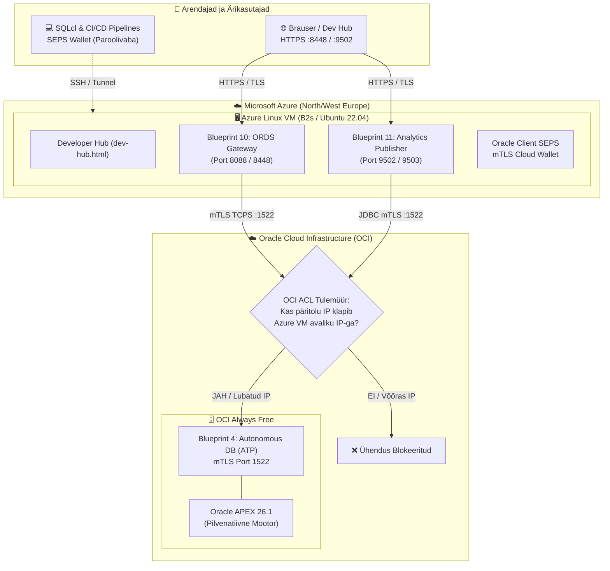

# Multi-cloud ettevõtte kaugtestimise juhend
## Oracle cloud infrastructure (OCI always Free) ja microsoft Azure (Free tier)

[ 🇬🇧 English ](../remote-multicloud-setup-guide.md) | [ 🇪🇪 Eesti ](remote-multicloud-setup-guide.md) | [ 🇫🇮 Suomi ](../fi/remote-multicloud-setup-guide.md) | [ 🇸🇪 Svenska ](../sv/remote-multicloud-setup-guide.md) | [ 🇱🇻 Latviešu ](../lv/remote-multicloud-setup-guide.md) | [ 🇱🇹 Lietuvių ](../lt/remote-multicloud-setup-guide.md)

---

## 1. Ülevaade ja arhitektuur

Käesolev juhend kirjeldab ettevõtte nõuetele vastava multi-cloud arhitektuuri seadistamist ja testimist:
- **Andmebaasikiht (OCI Always Free):** Oracle Autonomous Database Serverless (ATP/ADW, Blueprint 4). Ligipääs on rangelt piiratud tulemüüriga (ACL) ainult Azure VM avalikule IP-aadressile, suheldes üle krüpteeritud mTLS (`cwallet.sso`, AES-256) pordil `1522`.
- **Rakendus- ja Lüüsikiht (Microsoft Azure):** Linux Virtual Machine (Standard B2s / B1s), mis käitab eraldiseisvat ORDS Gateway'd (**Blueprint 10**) ja Analytics Publisherit (**Blueprint 11**) ilma kohaliku andmebaasita (0-DB arhitektuur).
- **Kliendikiht ja Turvalisus:** Arendajad ja ärikasutajad pöörduvad Azure'i veebilüüside (Dev Hub, APEX Builder, Publisher) poole üle HTTPS-i, samal ajal kui automatiseeritud tööriistad kasutavad paroolivaba Oracle SEPS Walletit.



---

## 2. Eeldused ja tasuta pilveressursside jaotus

| Pilv | Teenus | Spetsifikatsioon | Maksumus |
| :--- | :--- | :--- | :--- |
| **OCI (Oracle Cloud)** | Autonomous Transaction Processing (ATP) | 1 ECPU / OCPU, 20 GB salvestusruumi, Always Free | **0.00 € / kuu** |
| **Microsoft Azure** | Virtuaalmasin (`Standard_B2s` / `Standard_B1s`) | 2 vCPU, 4 GB RAM, Ubuntu 22.04 LTS | **0.00 €** (Tasuta konto krediit / 12 kuud) |
| **Microsoft Azure** | Network Security Group (NSG) | Sissetulevad pordid: 22, 8088, 8448, 9502, 9503 | **0.00 €** |

---

## 3. Etapp 1: OCI autonomous database seadistus (ATP)

1. Logi sisse [Oracle Cloud Infrastructure konsooli](https://cloud.oracle.com/).
2. Liigu menüüsse **Oracle Database** $\rightarrow$ **Autonomous Database**.
3. Klõpsa **Create Autonomous Database**:
   - **Display Name & Database Name:** `adbp` (või `freeadb`).
   - **Workload Type:** *Transaction Processing (ATP)*.
   - **Deployment Type:** *Serverless*.
   - **Always Free:** Lülita sisse **Always Free** lüliti.
   - **Database Version:** Vali *23ai* (või *19c*).
   - **Administrator Credentials:** Määra tugev parool kasutajale `ADMIN` (salvesta see kindlasse kohta).
   - **Network Access:**
     - Vali **Secure access from allowed IPs and VCNs only**.
     - Lisa oma arendusarvuti avalik IP.
     - *(Pärast Azure VM loomist Etapis 2 lisad siia ka Azure VM-i avaliku IP).*
4. Klõpsa **Create Autonomous Database**. Oota umbes 2–3 minutit, kuni olekuks muutub **Available** (Roheline).
5. **Laadi alla mTLS pilve-wallet:**
   - Autonomous Database lehel klõpsa nupule **Database Connection**.
   - Jaotises *Download client credentials (Wallet)* klõpsa **Download Wallet**.
   - Määra walleti parool (nt `Welcome_12345#`) ja laadi alla fail `Wallet_adbp.zip`.
   - Paiguta see fail projekti kausta: `config/tns_admin/Wallet_adbp.zip`.

---

## 4. Etapp 2: Microsoft Azure Linux VM seadistus

1. Logi sisse [Azure Portaali](https://portal.azure.com/).
2. Liigu **Virtual Machines** $\rightarrow$ **Create** $\rightarrow$ **Azure virtual machine**.
   - **Resource Group:** Loo uus (nt `rg-oracle-multicloud`).
   - **Virtual machine name:** `vm-oracle-edge-gateway`.
   - **Region:** `North Europe` või `West Europe` (vali OCI regioonile võimalikult lähedane madalaima latentsuse tagamiseks).
   - **Image:** `Ubuntu Server 22.04 LTS - x64 Gen2` (või `Oracle Linux 9`).
   - **Size:** `Standard_B2s` (2 vCPU, 4 GiB mälu) — tagab vajaliku RAM-i Publisheri ja ORDS-i sujuvaks paralleelseks tööks.
   - **Authentication type:** *SSH public key*.
   - **SSH public key source:** Kasuta olemasolevat avalikku võtit (`~/.ssh/id_ed25519.pub` või `~/.ssh/id_rsa.pub`).
3. **Seadista Network Security Group (NSG) sissetulevad reeglid (Inbound Rules):**
   - Luba port `22` (SSH) ainult Sinu IP-lt.
   - Luba port `8088` & `8448` (ORDS HTTP & HTTPS).
   - Luba port `9502` & `9503` (Analytics Publisher HTTP & HTTPS).
4. Klõpsa **Review + create**, seejärel **Create**.
5. Pärast valmimist vaata Azure VM **avalikku IP-aadressi** (nt `20.105.45.12`).
6. **Uuenda OCI tulemüüri (ACL):**
   - Mine tagasi OCI Autonomous Database lehele $\rightarrow$ **Network** $\rightarrow$ **Edit Access Control List (ACL)**.
   - Lisa `<AZURE_VM_PUBLIC_IP>/32` lubatud IP-de loetellu ja salvesta.

---

## 5. Etapp 3: Automatiseeritud paigaldus kaugserveris (`deploy-remote.sh`)

Kasuta ühtset kaugpaigalduse skripti, mis kopeerib koodi, seadistab Podmani, laeb üles OCI mTLS Walleti ja käivitab kaug-blueprintid:

```bash
# 1. Paigalda Blueprint 10 (Eraldiseisev ORDS Gateway & Dev Hub) Azure VM-i:
./scripts/deploy-remote.sh \
    --host <AZURE_VM_PUBLIC_IP> \
    --user ubuntu \
    --key ~/.ssh/id_ed25519 \
    --wallet config/tns_admin/Wallet_adbp.zip \
    --blueprint 10

# 2. Paigalda Blueprint 11 (Eraldiseisev Analytics Publisher Server) Azure VM-i:
./scripts/deploy-remote.sh \
    --host <AZURE_VM_PUBLIC_IP> \
    --user ubuntu \
    --key ~/.ssh/id_ed25519 \
    --wallet config/tns_admin/Wallet_adbp.zip \
    --blueprint 11
```

---

## 6. Etapp 4: Multi-cloud testipaketi käivitamine

Käivita automaatne testprogramm, mis kontrollib kogu ahelat otsast lõpuni:

```bash
./tests/test-remote-multicloud.sh \
    --azure-host <AZURE_VM_PUBLIC_IP> \
    --oci-db-name adbp \
    --wallet config/tns_admin/Wallet_adbp.zip
```

Testprogramm kontrollib automaatselt:
1. **Võrgu SLA ja latentsus:** Pilvedevaheline RTT Azure'i ja OCI vahel.
2. **Zero-Trust SEPS Wallet:** Verifitseerib mTLS paroolivaba ühenduse SQLcl kaudu (`/@DB_ADB_ADMIN`).
3. **ORDS veebiliidesed (BP 10):** APEX Builder, Database Actions (SQL Web) ja AutoREST liidesed.
4. **Analytics Publisher (BP 11):** Verifitseerib Publisheri andmemudelid ja PDF raportite genereerimise üle JDBC mTLS.
5. **ACL tulemüüri kontroll:** Kinnitab, et lubamata IP-delt ühendused blokeeritakse.
6. **Raport:** Koostab tulemuste raporti faili `tests/reports/remote_multicloud_test_report.md`.
