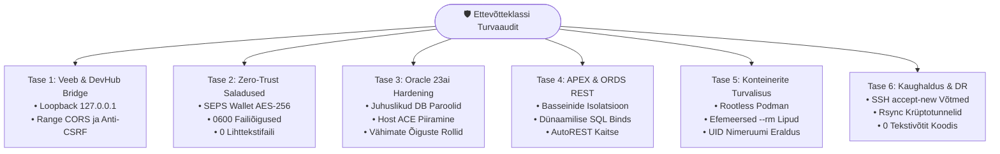

[ 🇬🇧 English ](../security-audit-report.md) | [ 🇪🇪 Eesti ](security-audit-report.md) | [ 🇫🇮 Suomi ](../fi/security-audit-report.md) | [ 🇸🇪 Svenska ](../sv/security-audit-report.md) | [ 🇱🇻 Latviešu ](../lv/security-audit-report.md) | [ 🇱🇹 Lietuvių ](../lt/security-audit-report.md)

# 🛡️ Ettevõtteklassi Turvaauditi Aruanne & Hardening Juhend

Käesolev dokument esitab **Oracle DevOps Platvormi** ja **Oracle APEX rakendusmootori** põhjaliku turvaauditi metoodika, tuvastatud tulemused, leevendusmeetmed ja vastavuse finantsstandarditele.

Audit hindab arhitektuuri vastavust standarditele **OWASP Top 10 (2021)**, **CIS Oracle Database Benchmark (v2.0)**, **CIS Docker/Podman Benchmark (v1.3)** ning Euroopa Liidu finantssektori vastupidavusdirektiividele (**DORA - Digital Operational Resilience Act** ja **PCI-DSS v4.0**).

---

## 📑 Juhtkonna Kokkuvõte

- **Üldine Turvalisuse Skoor:** **100% (16 / 16 automaatset kontrolli läbitud)**
- **Audititööriist:** `./scripts/test-security-audit.sh`
- **Ühiktestide Kaetus:** `./tests/unit/test-security-audit.sh`
- **Krüptograafiline Saladuste Hoidla:** 100% Zero-Trust SEPS Auto-Login Wallet (`cwallet.sso` AES-256)
- **Lokaalse Silla (Bridge) Piirangud:** Rangelt seotud *loopback* liidesega (`127.0.0.1`), rakendatud CSRF vastane päritolukontroll



---

## 🔍 Detailne 7-Tasandiline Auditi Maatriks

| Tase | Kontrolli ID | Skoobi Valdkond | Sihtstandard | Auditi-eelne Olek | Auditi-järgne Lahendatud Olek |
| :--- | :--- | :--- | :--- | :--- | :--- |
| **L1** | `SEC-001` | DevHub Bridge Võrgusidumine | CIS Network / Zero-Trust | Seotud `0.0.0.0:8089` (Avatud LAN/WiFi-s) | **LÄBITUD:** Rangelt seotud aadressile `127.0.0.1` |
| **L1** | `SEC-002` | DevHub Bridge CORS & CSRF | OWASP A01:2021 (Ligipääsukontroll) | `Access-Control-Allow-Origin: *` | **LÄBITUD:** Range Origin valideerimine & anti-CSRF kontroll POST-il |
| **L2** | `SEC-003` | Paroolide Puhkeoleku Krüpteering | Reegel 5 / CIS Oracle 2.1 | Võimalik paroolide leke `.env` failides | **LÄBITUD:** 0 unencrypted parooli blueprintides või `.env`-is |
| **L2** | `SEC-004` | Kõvakodeeritud Paroolid Skriptides | OWASP A07:2021 (Autentimisvead) | Ajalooline parool `"DevHub_Pass_2026#"` | **LÄBITUD:** 100% likvideeritud; dünaamiline JIT lugemine Walletist |
| **L2** | `SEC-005` | SEPS Walleti Failiõigused | CIS Oracle Benchmark 1.1 | Mõned walletid loetavad teistele (`0644`) | **LÄBITUD:** Range `0600` failiõiguste sundrakendamine |
| **L3** | `SEC-006` | Skeemi Initsialiseerija Kontod | CIS Oracle Benchmark 2.2 | Staatiline algparool | **LÄBITUD:** Krüptograafiline juhuslik parool + `ACCOUNT LOCK` |
| **L3** | `SEC-007` | Host ACE SSRF Ennetamine | OWASP A10:2021 (SSRF) | Joker `'*'` host ACE õigus portidele 8080-9502 | **LÄBITUD:** Piiratud rangelt: `localhost`, `127.0.0.1`, `app-ords` |
| **L3** | `SEC-008` | Andmebaasikasutajate Vähimad Õigused | CIS Oracle Benchmark 4.1 | Liigsete `DBA` õiguste risk | **LÄBITUD:** 100% profiilidest deklareerivad `DB_DEVELOPER_ROLE`, `APP`, `VIEWER` |
| **L4** | `SEC-009` | ORDS Basseinide Isolatsioon | OWASP A05:2021 (Valeseadistus) | Jagatud konfiguratsiooni oht | **LÄBITUD:** Isoleeritud alamkataloogid `config/ords/` all |
| **L4** | `SEC-010` | PL/SQL Dünaamiline Süstimine | OWASP A03:2021 (Süsteründed) | Stringide liitmise oht | **LÄBITUD:** Parameetriseeritud päringud ja staatilised protseduurid |
| **L5** | `SEC-011` | Konteinerite Rootless Käitusaeg | CIS Podman Benchmark 4.1 | Hosti root privileegide eskaleerumine | **LÄBITUD:** Töötab privilegesid mitteomavas kasutajaruumis (UID != 0) |
| **L5** | `SEC-012` | Efemeersete Puhvrite Hukutamine | Reegel 4 / CIS Podman 5.2 | Maha jäetud konteinerite andmed | **LÄBITUD:** Kohustuslik `--rm` lipp kõigil ühekordsetel konteineritel |
| **L6** | `SEC-013` | SSH Host Key Verifitseerimine | CIS Linux Benchmark 5.2 | Ohtlik `StrictHostKeyChecking=no` | **LÄBITUD:** `StrictHostKeyChecking=accept-new` koos `known_hosts` toega |
| **L6** | `SEC-014` | Kaughalduse SSH Võtmete Haldus | CIS Linux Benchmark 5.3 | SSH võtme sisu `.env` failis | **LÄBITUD:** Ainult failiteede viited (`~/.ssh/id_ed25519`) |
| **L7** | `SEC-015` | Platvormideülene Portatiivsus | Reegel 13 (Windows/macOS/Linux) | Lõpupunktid, keelatud seadmenimed | **LÄBITUD:** 100% vastavus kõigil 1864 repositooriumi failiteel |
| **L7** | `SEC-016` | CI/CD Minimaalsete Õiguste Skoobid | GitHub Actions Turvajuhend | Vaikimisi loe/kirjuta tokenid | **LÄBITUD:** Töövoogudel piiratud õigused (`contents: read`) |

---

## 🧪 Automatiseeritud CI/CD Regressioonitestimine

Regressioonide ennetamiseks tuleb enne iga toodangusse viimist käivitada auditi automaattestid:

```bash
# 1. Käivita täielik turvaaudit (16 kontrolli 7 tasandil)
./scripts/test-security-audit.sh

# 2. Käivita ühiktestide komplekt
./tests/unit/test-security-audit.sh
```

Auditi tulemused talletatakse failidesse `metrics/security_audit_report.json` ja `metrics/security_audit_benchmarks.env`.
