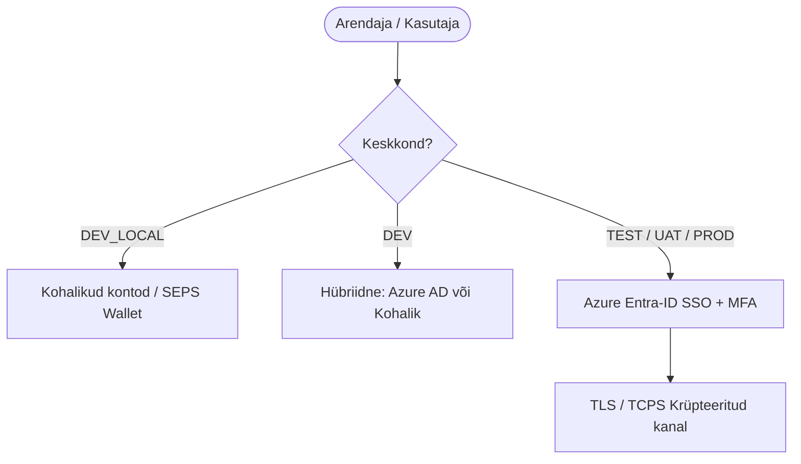

[ 🇬🇧 English ](../security.md) | [ 🇪🇪 Eesti ](security.md) | [ 🇫🇮 Suomi ](../fi/security.md) | [ 🇸🇪 Svenska ](../sv/security.md) | [ 🇱🇻 Latviešu ](../lv/security.md) | [ 🇱🇹 Lietuvių ](../lt/security.md)

# Oracle Free DB & APEX turvalisus ja SSO arhitektuur

See dokument koondab kokku projekti turvakaalutlused, paroolide halduse, kasutajarollid lokaalses arenduses ning pilvepõhise ühekordse sisselogimise (SSO / Azure Entra-ID) arhitektuuri.

---

## 1. Paroolide ja saladuste haldus lokaalselt (zero-trust)

Arenduskeskkonna saladused ja andmebaasi paroolid asuvad krüpteeritult Oracle SEPS Walletis (`cwallet.sso`) ning neid **ei lisata kunagi versioonihaldusesse ega salvestata kettale lihttekstina** (Reegel 5).

*   **Paroolide pärimine mälus:** Kõik paroolid päritakse vajaduspõhiselt otse mällu käsuga `./scripts/get-password.sh <alias>`.
*   **Vähimate õiguste rollid:** Iga andmebaasi jaoks genereeritakse standardsed kontod: `DBA_ADMIN`, `DEV` (Oracle 23ai `DB_DEVELOPER_ROLE`), `APP`, `VIEWER`.

---

## 2. Keskkondade sisselogimise ja turvalisuse maatriks

Projekti infrastruktuuris on määratletud viis keskkonnaklassi (seadistatakse muutuja `ENVIRONMENT_TYPE` kaudu failis `.env`), et tagada optimaalne arendusmugavus ja range toodanguturvalisus:

| Keskkond (`ENVIRONMENT_TYPE`) | Kus jookseb? | Autentimise tüüp (APEX & DB) | Kasutajate haldus | TLS krüpteering (TCPS) |
| :--- | :--- | :--- | :--- | :--- |
| **`DEV_LOCAL`** | Arendaja kohalik PC | Kohalikud SEPS Wallet kontod | Automaatne / `create-developer.sh` | Ei (Mugavus/Offline) |
| **`DEV`** | Jagatud arendusserver | Hübriidne (Kohalik + **Azure AD**) | Azure AD + JIT / Kohalikud kontod | Valikuline |
| **`TEST`** | Testserver (CI/CD) | **Azure Entra-ID (SSO)** | Tsentraalne (Azure AD grupid) | Jah (Port 2484) |
| **`UAT`** | Eeltoodangu server | **Azure Entra-ID (SSO)** | Tsentraalne (Azure AD grupid) | Jah (Port 2484) |
| **`PROD`** | Toodanguserver | **Azure Entra-ID (SSO)** | Tsentraalne (Azure AD grupid) | Jah (Port 2484) |



### A. lokaalne arendus (`DEV_LOCAL` arvutis)
*   **Mugavus ja offline-tugi:** Arendaja saab töötada täielikult ilma võrguühenduseta ja VPN-ita.
*   **Autonoomia ja vähimate õiguste printsiip:** Iga andmebaasi instantsi puhul luuakse automaatselt ettevalmistatud kasutajakontod koos paroolivaba Oracle Wallet (SEPS) ühendusega:
    *   **1. DBA Administraator (`DBA_ADMIN`):** Administratiivsete tegevuste ja DDL/DML halduse konto (`DBA` roll), mis ennetab `SYS` kasutaja igapäevast kasutamist ja tekitab turvalisi käitumisharjumusi. Ühendus: `sql /@DB_ALISE_DBA_ADMIN` või `sql /@DB_DB_ALISE_DBA_ADMIN`.
    *   **2. Arendaja kasutaja (`USER_DEVELOPER`):** Rakenduste ja skeemide igapäevaseks arenduseks mõeldud konto, millele on omistatud ametlik Oracle 23c/23ai **`DB_DEVELOPER_ROLE`** (lisaks `RESOURCE` ja `CREATE SESSION`). Ühendus: `sql /@DB_ALISE_DEV` või `sql /@DB_DB_ALISE_DEV`.
    *   **3. Rakenduskasutaja (`USER_APP`):** Oracle Forms ja ärirakenduste objektide ja käitusaja konto (`CREATE SESSION`, `RESOURCE`, `CREATE TABLE/VIEW/PROCEDURE`). Ühendus: `sql /@DB_FORMS_APP` või `sql /@DB_ALISE_APP`.
    *   **4. Vaataja konto (`USER_VIEWER`):** Piiratud õigustega teostus- ja testkonto, millel on rangelt ainult kõigi skeemide lugemisõigus (`SELECT ANY TABLE`, `SELECT ANY DICTIONARY`, `READ ANY TABLE`). Ühendus: `sql /@DB_ALISE_VIEWER` või `sql /@DB_DB_ALISE_VIEWER`.
    *   **5. Dual Alias Tugi:** SEPS Wallet toetab paralleelselt nii lühikesi (`DB_ALISE_*`, `DB_PROXY_*`) kui täisnimega aliaseid (`DB_DB_ALISE_*`, `DB_DB_PROXY_*`).
    *   **6. VS Code täielik sünkroonsus (`register-connections.sh`):** Kõik andmebaasi kontod (`SYS`, `DBA_ADMIN`, `SCHEMA`, `DEV`, `APP`, `VIEWER`) registreeritakse automaatselt VS Code Oracle SQL Developer laienduse kaustadesse koos salvestatud krüpteeritud paroolidega.
*   **SSO möödapääs (Bypass):** Kui arendaja soovib ajutiselt testida lokaalset SSO-d, kuid ühendust pole, saab kasutada möödapääsu parameetrit: `&fsp_sso_login_override=y`.

---

## 3. Adaptiivne 5-astmeline TLS/HTTPS arhitektuur

Veebiteenuste (ORDS, APEX, Analytics Publisher) HTTPS krüpteerimiseks ja brauseri hoiatusteta (*Not Secure*) toimimiseks ilma lokaalsete administraatori/root õigusteta on välja töötatud **5-astmeline hierarhiline sertifikaatide mootor** (`scripts/internal/resolve-tls-mode.sh`):

```text
config/certs/
├── custom/          # Samm 0: Arendaja käsitsi lisatud sertifikaadid (tls.crt, tls.key)
├── public/          # Variant 1: Avalik FQDN & Let's Encrypt / Avalik CA
├── corp/            # Variant 2: Ettevõtte Sise-PKI sertifikaadid (corp_cert.crt)
├── user_ca/         # Variant 3: Lokaalne CA (usaldatud kasutajahoidlas, 0-admin)
└── self_signed/     # Variant 4: Jooksvalt genereeritud iseallkirjastatud cert (Untrusted fallback)
```

---

## 4. Andmebaasi ja rakenduste SSO

*   **SQLcl ja JDBC:** Oracle Database toetab nativselt Azure AD OAuth2 tokeneid ja globaalseid rolle.
*   **ORDS ja API-d:** ORDS toetab Bearer JWT tokeneid ja proxy-kasutajaid.
*   **APEX Social Sign-In:** Kasutab OpenID Connect autentimist koos Just-In-Time kasutajate provisjoneerimisega.
