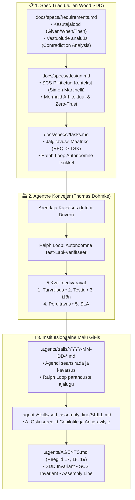

[ 🇬🇧 English ](../spec-driven-development-and-assembly-line.md) | [ 🇪🇪 Eesti ](spec-driven-development-and-assembly-line.md) | [ 🇫🇮 Suomi ](../fi/spec-driven-development-and-assembly-line.md) | [ 🇸🇪 Svenska ](../sv/spec-driven-development-and-assembly-line.md) | [ 🇱🇻 Latviešu ](../lv/spec-driven-development-and-assembly-line.md) | [ 🇱🇹 Lietuvių ](../lt/spec-driven-development-and-assembly-line.md)

# Spetsifikatsioonipõhine Arendus (SDD), Isehalduslikud Süsteemid (SCS) ja Agentne Konveier

> **Arhitektuuristandard ja tegevusjuhend üleminekuks vibe-codingult tootmiskõlblikule (viable) koodile Oracle DevOps platvormil**

---

## 🧭 Üldine Kokkuvõte

Kuna tarkvaraarendus kiireneb generatiivse AI toel, pakub intuitsioonipõhine *vibe coding* (prompti-ja-looda lähenemine) erakordset prototüüpimiskiirust. Samas vajavad ärikriitilised ettevõtteplatvormid (finantsandmed, riiklikud registrid, ERP süsteemid) **deterministlikku usaldusväärsust, institutsionaalset mälu ja arhitektuurilise triivi välistamist**.

Tootmiskõlbliku kvaliteedi tagamiseks rakendab Oracle DevOps platvorm kolme rahvusvahelise tarkvarajuhi sünteesitud standardit:

1. **Julian Wood (Principal Developer Advocate, AWS):** **Spetsifikatsioonipõhine arendus (Spec-Driven Development - SDD)** — Üleminek suvalistelt viipadelt struktureeritud spetsifikatsioonidele (`requirements.md`, `design.md`, `tasks.md`), teostuseelne vastuolude analüüs ja ranged Given/When/Then kriteeriumid.
2. **Simon Martinelli (Tarkvaraarhitekt, martinelli.ch):** **Isehalduslikud süsteemid (Self-Contained Systems - SCS) ja AI kontekstiökonoomika** — Mikroteenuste "hajutatud mudakuhja" (Distributed Big Ball of Mud) vältimine; domeenide vertikaalne eraldatus (UI + Loogika + Andmed); Oracle Pluggable Databases (PDB-d) kui ülim andmebaasi-SCS; ning kontekstiakna eelarvestamine (<300–500 rida spetsifikatsiooni kohta).
3. **Thomas Dohmke (Entire.io kaasasutaja ja tegevjuht / endine GitHubi tegevjuht):** **Agentne Konveier (The Agentic Assembly Line)** — Kavatsusepõhine arendus (Intent-Driven), autonoomsed **Ralph Loop** tsüklid (testi-lapi-verifitseeri), Giti püsivad **Seansirajad** (`.agents/trails/`) ja 5 automatiseeritud kvaliteediväravat.

---

## 🏛️ Arhitektuurne Ülevaade



---

## 📋 Sammas 1: Spetsifikatsioonipõhine Arendus (Julian Wood, AWS)

*Vibe coding* algab kohese koodikirjutamisega. SDD nõuab, et **kavatsus ja nõuded eelnevad teostusele**:

### 1. Spetsifikatsioonitriood (`docs/specs/<domain>/`)
Iga domeeni või süsteemipiiri jaoks hoitakse kolme kanoonilist dokumenti:
- **`requirements.md`:**
  - **Kontekst ja Persoonad:** Kellele funktsionaalsus on suunatud ja mis eesmärgil.
  - **Funktsionaalsed nõuded (`[REQ-XX]`):** Sõnastatud Gherkin Given/When/Then süntaksis.
  - **Teostuseelne Vastuolude Analüüs (Reegel 17):** Vastastikku välistavate lippude ja konfliktsete olekute tuvastamine enne koodi puudutamist (nt `-s` tõmmise taastamine vs `--fresh` puhas ehitus).
  - **Mittefunktsionaalsed nõuded (NFR):** Latentsus, Reegel 5 Zero-Trust turvalisus ja ligipääsetavus.
- **`design.md`:**
  - **SCS Piiritletud Kontekst:** Mis kuulub antud domeeni ja mis on välised liidesed.
  - **Mermaid Arhitektuuriskeemid:** Vastavalt Reeglile 10 kujundatud visuaalsed diagrammid.
  - **Turvamudel:** Paroolivaba SEPS Wallet autentimine.
- **`tasks.md`:**
  - **Jälgitavuse Maatriks (Traceability Matrix):** Iga aatomülesanne (`[TSK-XX]`) peab viitama nõudele (`[REQ-YY]`).
  - **Verifitseerimiskäsud:** Deterministlikud käsud tulemuse kontrollimiseks.
  - **Ralph Loop Juhised:** Autonoomse parandamise kriteeriumid.

### 2. Kanoonilised Mallid
Mallid asuvad kaustas `docs/specs/templates/`:
- `requirements.template.md`
- `design.template.md`
- `tasks.template.md`

---

## 📦 Sammas 2: Isehalduslikud Süsteemid ja Kontekstiökonoomika (Simon Martinelli)

Mikroteenuste hajutatud keerukuse ja ühise andmebaasi anti-mustrite vältimiseks toetub platvorm **Self-Contained Systems (SCS)** põhimõtetele:

### 1. Vertikaalne Domeeni Autonoomia
- Iga SCS sisaldab oma veebikasutajaliidest, äriloogikat ja andmesuveräänsust.
- **Oracle Pluggable Databases (PDB-d) kui Ülim SCS:** PDB-d (`FREEPDB1`, `ALISEPDB`, `PUBPDB`) pakuvad täielikku andmesuveräänsust, eraldi andmesõnastikku, eraldatud tabeliruume ja sõltumatuid kasutajaid ühe kerge konteineri ressursijalajäljega.
- Ristandmebaaside SQL-päringud (cross-PDB joins) üle domeenipiiride on rangelt keelatud; suhtlus toimub asünkroonsete API-de või sündmuslüüside kaudu.

### 2. AI Kontekstiakna Eelarve (<300–500 rida)
Monoliitsed 5000-realised spetsifikatsioonid kurnavad AI tähelepanuakna ja tekitavad hallutsinatsioone.
- Iga spetsifikatsioon on eraldatud oma kausta (`docs/specs/<domain>/`).
- Üksikute failide maht hoitakse **alla 300–500 rea**.
- See võimaldab AI-agendil (GitHub Copilot, Google Antigravity) laadida kogu vertikaalse viilu (`requirements.md` + `design.md` + `tasks.md` + kood) ühte puhtasse kontekstiaknasse.

---

## 🏭 Sammas 3: Agentne Konveier (Thomas Dohmke)

Thomas Dohmke näeb tänapäevast arendustööd **Agendikonveierina**, kus inimene juhib kavatsust (intent), samal ajal kui AI-agendid teostavad ülesandeid tagasisideahelas:

### 1. Autonoomsed Ralph Loop Tsüklid (Testi-Lapi-Verifitseeri)
Ülesannete lahendamisel ei peatu agent esimese vea korral:
1. **Käivita Test:** Käivita seotud test või lokaalne CI (`tests/test-local-ci.sh`).
2. **Uuri Viga:** Analüüsi logi ja tuvasta juurpõhjus kontekstis.
3. **Lapi Kood:** Vii koodis ja skriptides sisse autonoomne parandus.
4. **Taasverifitseeri:** Korda tsüklit kuni 100% testidest läbivad roheliselt (exit code 0).
5. **Kvaliteediväravad:** Kinnita tulemus enne Git-kinnitust läbi 5 kvaliteedivärava.

### 2. Institutsionaalne Mälu Git-is (`.agents/trails/`)
Brauseri vestlused kustuvad ja lähevad aja jooksul kaotsi. Püsiva mälu tagamiseks:
- Iga agendi seanss talletab oma kavatsuse, disainiotsused ja Ralph Loop parandused markdown-failina kaustas `.agents/trails/YYYY-MM-DD-<teema>.md`.
- Tulevased arendajad või AI-agendid näevad Git-ajaloost **miks** teatud otsused tehti.

### 3. Viis Kvaliteediväravat (Release Gates)
Kood loetakse toodangukõlblikuks ainult siis, kui see läbib kõik 5 väravat:
- 🛡️ **Gate 1: Turvalisus ja Zero-Trust (Reegel 5):** Paroolid dekrüpteeritakse mälus SEPS Walletist; kettal puuduvad lihttekstiparoolid; `install_logs/` on rangelt gitignored (Reegel 1.2).
- 🧪 **Gate 2: Funktsionaalsus ja Jälgitavus (Reegel 17):** 100% testidest läbivad koodiga 0 (`tests/unit/test-spec-traceability.sh`).
- 🌐 **Gate 3: Mitmekeelsus (Reegel 9):** 100% sümmeetria kõigis 6 toetatud keeles (EN, ET, FI, SV, LV, LT) — `./tests/test-multilingual-support.sh`.
- 💻 **Gate 4: Porditavus (Reegel 13 & 14):** Ranged ASCII teed ja NTFS ühilduvus (`test-filename-portability.sh`).
- ⚡ **Gate 5: Jõudlus ja SLA (Reegel 1):** FastStart taastamine $\le$ 20 sekundit.

---

## 🛠️ Automatiseeritud Kontroll Lokaalses CI-s

Metoodika ja jälgitavuse reegleid kontrollitakse igal käivitusel:

```bash
# Käivita 7-astmeline SDD ja konveieri audit:
./tests/unit/test-spec-traceability.sh

# Käivita lokaalne GitHub Actions CI simulaator dry-run režiimis:
./tests/test-local-ci.sh --dry-run
```

Test kontrollib:
1. Kanooniliste mallide olemasolu kaustas `docs/specs/templates/`.
2. Domeenispetsifikatsioonide trioodi täielikkust kaustas `docs/specs/`.
3. Nõuete ID-de unikaalsust ja vastuolude analüüsi olemasolu.
4. SCS piiride, Mermaid skeemide ja Zero-Trust mudeli olemasolu failis `design.md`.
5. Jälgitavuse maatriksi ja Ralph Loop tsükli olemasolu failis `tasks.md`.
6. Seansilogi olemasolu kaustas `.agents/trails/` koos kavatsuse ja 5 kvaliteediväravaga.
7. Juhtreeglite 17, 18, 19 ja AI oskuse kehtivust.

---

## 🔗 Seotud Ressursid

- **Juhtreeglid:** [`.agents/AGENTS.md`](../../.agents/AGENTS.md) (Reeglid 17, 18, 19)
- **AI Oskusreegel:** [`.agents/skills/sdd_assembly_line/SKILL.md`](../../.agents/skills/sdd_assembly_line/SKILL.md)
- **Seansirajad:** [`.agents/trails/`](../../.agents/trails/README.md)
- **Domeenispetsifikatsioon:** [`docs/specs/devops-portal/`](../specs/devops-portal/requirements.md)
- **Lokaalne CI Konveier:** [`tests/test-local-ci.sh`](../../tests/test-local-ci.sh)
