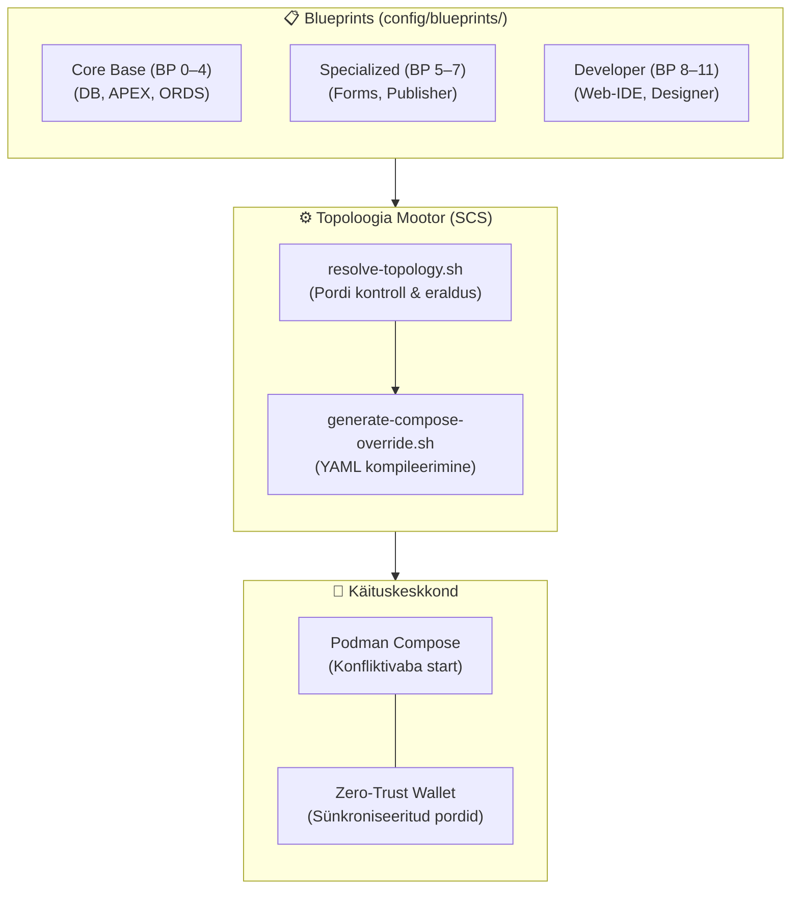

# Blueprints ja Dünaamiline Porditopoloogia — Tehniline Disain (Technical Design)

- **Domeen (SCS):** `blueprints-topology`
- **Viidatud Nõuded:** `docs/specs/blueprints-topology/requirements.md`
- **Metoodika:** Simon Martinelli (SCS Arhitektuur) & Julian Wood (SDD Disain)

---

## 1. Arhitektuuriline Ülevaade ja Piiritletud Kontekst (Bounded Context)

Blueprintide ja topoloogia süsteem on **Self-Contained System (SCS)**, mis haldab deklaratiivseid arhitektuurimudeleid ja pordieraldust, tagades Zero-Trust isolatsiooni.

---

## 2. Pordinumbrite Topoloogia Maatriks

| Teenus | Vaikimisi Host Port | Konteineri Port | Profiil |
| :--- | :--- | :--- | :--- |
| **Oracle 23ai Free DB** | `1521` | `1521` | `db-oracle-free` |
| **ORDS Smart Gateway** | `8088` (HTTP) / `8448` (HTTPS) | `8080` / `8443` | `ords-standard` |
| **Analytics Publisher** | `9704` | `9704` | `publisher-standard` |
| **Oracle Forms 14c** | `9001` (WLS) / `6080` (noVNC) | `9001` / `6080` | `forms-standard` |
| **Web-IDE (VS Code)** | `8444` | `8443` | `web-ide-standard` |

---

## 3. Zero-Trust Arhitektuur ja Tuumikbaasi Kaitse

- **Core Base Protection:** Blueprintide ümberlülitamisel säilib tuumikandmebaas ja selle SEPS Wallet puutumatuna.
- **Port Isolation:** Ükski teenus ei avalda porte väljapoole ilma krüpteeringuta (HTTPS/TLS).
