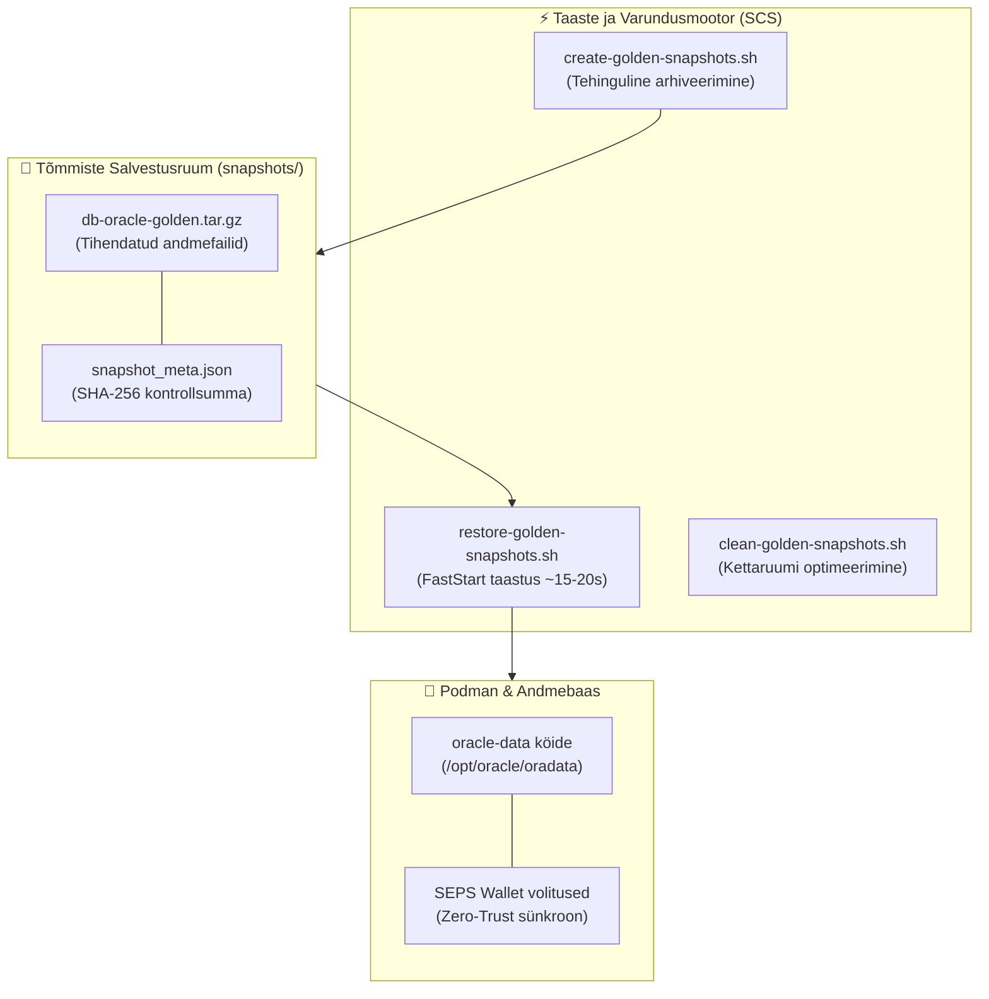
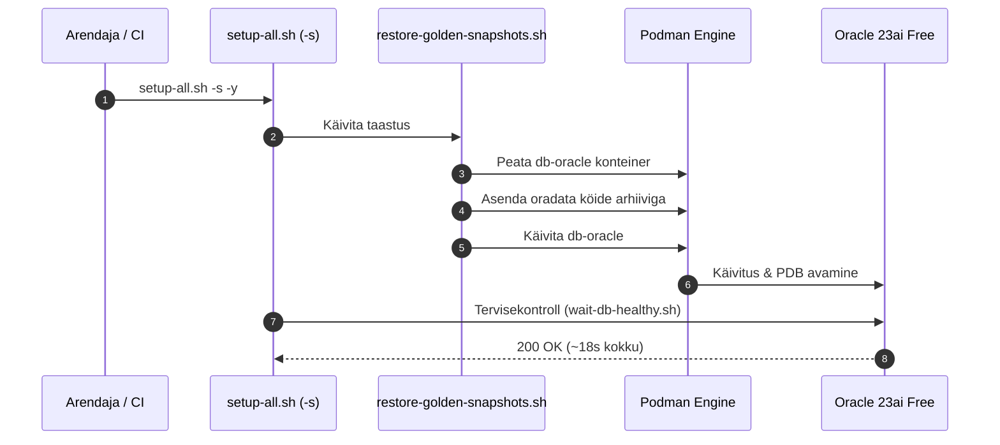

# Kuldsete Hetktõmmiste Katastroofitaastus — Tehniline Disain (Technical Design)

- **Domeen (SCS):** `golden-snapshots`
- **Viidatud Nõuded:** `docs/specs/golden-snapshots/requirements.md`
- **Metoodika:** Simon Martinelli (SCS Arhitektuur) & Julian Wood (SDD Disain)

---

## 1. Arhitektuuriline Ülevaade ja Piiritletud Kontekst (Bounded Context)

Kuldsete hetktõmmiste süsteem on **Self-Contained System (SCS)**, mis haldab andmebaasi füüsiliste andmeköidete varundust ja taastamist, tagades Zero-Trust turvalisuse ja tehingulise terviklikkuse.

---

## 2. Protsessivoog ja Tehinguline Konsistents

---

## 3. Zero-Trust Turvalisus ja Terviklikkus

- **Zero-Trust Wallet Sünkroonsus:** Tõmmis sisaldab andmebaasi seisu, mis vastab rangelt `wallet/` SEPS rahakotile.
- **Failisüsteemi Puhastamine:** Enne taastamist puhastatakse vanad ajutised failid ja lock-failid.
