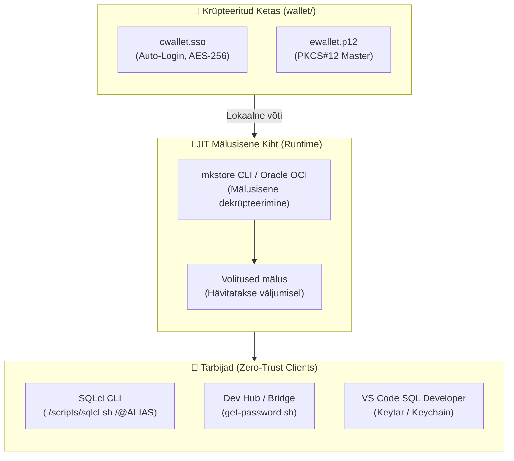
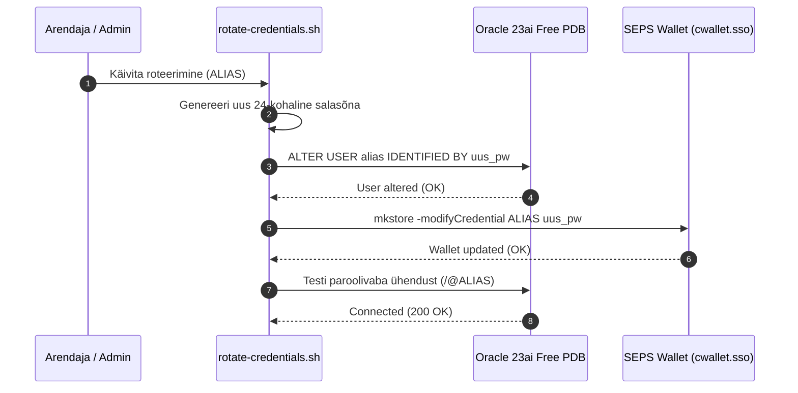

# Zero-Trust SEPS Wallet — tehniline disain ja arhitektuur (Technical Design)

- **Domeen (SCS):** `wallet-security`
- **Viidatud Nõuded:** `docs/specs/wallet-security/requirements.md`
- **Metoodika:** Simon Martinelli (SCS Arhitektuur) & Julian Wood (SDD Disain)

---

## 1. Arhitektuuriline Ülevaade ja Piiritletud Kontekst (Bounded Context)

Volituste turvalisus ja SEPS rahakott moodustavad **Self-Contained System (SCS)** piiritletud konteksti, mis vastutab andmebaasi saladuste elutsükli, salvestamise ja dekrüpteerimise eest vastavalt Zero-Trust nõuetele.

---

## 2. Komponentide Lepingud ja Liidesed

### 2.1. Wallet Credential Reader API (`get-password.sh`)
- **Käsk:** `./scripts/get-password.sh <ALIAS>`
- **Sisend:** TNS Wallet alias (nt `DB_DEV`, `DB_SYS`, `DB_APEX_ADMIN`)
- **Väljund:** Dekrüpteeritud parool standardväljundisse (või exit code 1 tõrke korral).
- **Turvaleping:** Parooli ei kirjutata kunagi kettale, vahemällu ega logifailidesse.

### 2.2. SQLcl Paroolivaba Autentimine
- **Käsk:** `./scripts/sqlcl.sh /@<ALIAS>`
- **Keskkond:**
  - `TNS_ADMIN=$WORKSPACE_DIR/wallet`
  - `JAVA_TOOL_OPTIONS=-Doracle.net.tns_admin=$TNS_ADMIN`
- **Tulemus:** Automaatne sisselogimine ilma parooliviibata.

---

## 3. Roteerimise ja Taaste Voog (Credential Lifecycle)

---

## 4. Mittefunktsionaalsed Nõuded ja Ohutus (NFRs)

- **NFR-SEC-1 (Failiõigused):** Rahakoti failidel on rangelt `chmod 0600` ja kaustal `chmod 0700`.
- **NFR-SEC-2 (Git Välistus):** Kataloog `wallet/` ja failid `*.sso`, `*.p12` on lisatud `.gitignore` faili.
- **NFR-SEC-3 (Zero-Trace):** Ephemeral konteinerid töötavad lipuga `--rm`, hävitades mäluprotsessid väljumisel.
