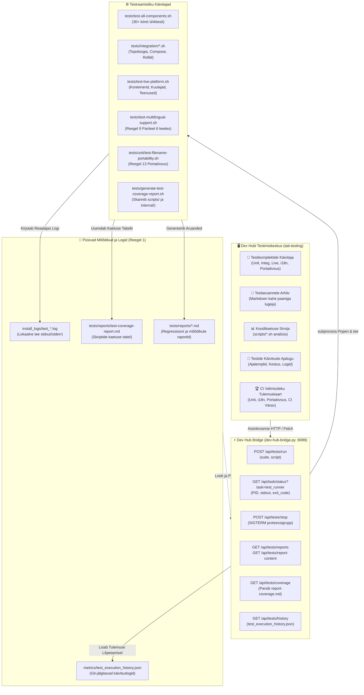

[ 🇬🇧 English ](../testing-framework-and-devhub.md) | [ 🇪🇪 Eesti ](testing-framework-and-devhub.md) | [ 🇫🇮 Suomi ](../fi/testing-framework-and-devhub.md) | [ 🇸🇪 Svenska ](../sv/testing-framework-and-devhub.md) | [ 🇱🇻 Latviešu ](../lv/testing-framework-and-devhub.md) | [ 🇱🇹 Lietuvių ](../lt/testing-framework-and-devhub.md)

# 🧪 Testraamistik ja Dev Hubi Integratsioon

Käesolev tehniline juhend kirjeldab platvormi mitmetasemelise automaattestimise arhitektuuri, Developer Hubi (`docs/dev-hub.html`) interaktiivset **Testimiskeskust** (`tab-testing`), asünkroonset testide orkestreerimist `dev-hub-bridge.py` kaudu ning testkatvuse analüüsi.

---

## 🏛️ 1. Tehniline Arhitektuur ja Komponentide Voog

Testimise ökosüsteem ühendab arendaja UI toimingud testikäivitajate, reaalajas logimise ja Git-jälgitavate mõõdikutega:

---

## 🚀 2. Testikomplektide Ülevaade

Platvorm jaotab kvaliteedi kontrolli spetsialiseeritud testikomplektideks:

| Komplekti Võti | Nimi | Kirjeldus | Käsk |
| :--- | :--- | :--- | :--- |
| `unit` | **Ühiktestide Komplekt** | 29+ kiiret isolatsioonitesti: konfigratsioonid, SEPS wallet, süntaks ja loogika ilma live-baasita. | `./tests/test-all-components.sh` |
| `integration` | **Integratsioonitestid** | Mitme andmebaasi topoloogia, compose override genereerimine, profiili rollid ja ühenduskontroll. | `tests/integration/*.sh` |
| `live` | **Live Platvormi E2E** | Täielik regressioon töötavate konteinerite, andmebaasi kuulajate ja veebiteenuste vastu. | `./tests/test-live-platform.sh` |
| `i18n` | **Mitmekeelsuse Pariteet** | Reegli 9 range audit, mis kontrollib sõnastiku sümmeetriat kõigis 6 keeles (EN, ET, FI, SV, LV, LT). | `./tests/test-multilingual-support.sh --all` |
| `portability` | **Failinimede Portatiivsus** | Reegli 13 audit: Windows NTFS/FAT keelatud märgid, seadmenimed ja ASCII teekonventsioonid. | `./tests/unit/test-filename-portability.sh` |
| `browser` | **Brauseri & SSO E2E** | Simuleerib brauseritoiminguid, APEXi sisselogimist, Dev Hubi otseteed ja SSO autentimist. | `./scripts/test-browser-login.sh` |
| `ci_sim` | **Lokaalne GitHub CI** | Käivitab või eelvaatleb GitHub Actions CI/CD töövooge võrguühenduseta konteinerites. | `./scripts/test-local-ci.sh --dry-run` |
| `coverage` | **Kaetuse Genereerija** | Analüüsib kaetust kataloogides `scripts/` ja `scripts/internal/` ning uuendab markdown raportit. | `./tests/generate-test-coverage-report.sh` |

---

## 🖥️ 3. Dev Hubi Testimiskeskus (`tab-testing`)

Developer Hubi testimise vahekaart pakub nelja alamvahekaarti:

### 3.1 🚀 Testikomplektide Käivitaja (`test-subtab-runner`)
- **Komplektikaardid**: Võimaldab ühe klõpsuga käivitada tervet komplekti või rippmenüüst valitud üksikut testi.
- **Sisseehitatud Reaalajas Terminal**: Terminaliboks (`#0b0f19`), mis kuvab stdout/stderr reaalajas voogu, pakub automaatse kerimise lülitit, stopperit, logi allalaadimist ja sundkatkestamist (`POST /api/tests/stop`).

### 3.2 📑 Testiaruannete Arhiiv (`test-subtab-reports`)
- **Kahepaaniline vaatur**: Vasakul loetletakse raportid (`tests/reports/*.md`) staatusemärkidega (`PASS`, `FAIL`, `INFO`) ja ajatemplitega.
- **Renderdatud Markdown**: Paremal kuvatakse vormindatud HTML koos aktiivsete Mermaid diagrammidega ning lülitiga toor-markdowni vaatamiseks.

### 3.3 📊 Koodikaetuse Sirvija (`test-subtab-coverage`)
- **KPI Kokkuvõte**: Visuaalne edenemisriba, mis näitab kaetud skriptide protsenti, koguarvu, kaetud ja katmata skripte.
- **Interaktiivne Tabel**: Kuvab kõik `scripts/*.sh` ja `scripts/internal/*.sh` skriptid ning nendega seotud testifailid.
- **Filtreerimine ja Otsing**: Kiire otsing ja filtrid ("Kõik", "Kaetud", "Katmata").
- **Analüüsi Värskendamine**: Käivitab skripti `generate-test-coverage-report.sh` otse kasutajaliidesest.

### 3.4 📜 Käivituste Ajalugu (`test-subtab-history`)
- Kuvab faili `metrics/test_execution_history.json` salvestatud ajalugu.
- Näitab ajatemplit, komplekti, skripti nime, kestust sekundites, tulemust, otselinki failile `install_logs/test_*.log` ja 1-klõpsuga **Re-run** nuppu.

---

## 🔒 4. Zero-Trust Turvalisus ja Reeglite Vastavus

1. **Reegel 1 (Ajastus ja Logimine)**: Iga testi käivitus teeb automaatselt `tee` väljundi faili `install_logs/test_<suite>_<timestamp>.log` ja fikseerib kestuse failis `metrics/test_execution_history.json`.
2. **Reegel 9 (i18n Pariteet)**: Kogu testimise vahekaart on täielikult tõlgitud kõigisse kuude keelde (EN, ET, FI, SV, LV, LT).
3. **Reegel 12 (Asünkroonne Ülesanne)**: Testid käivitatakse asünkroonselt `subprocess.Popen` abil ilma veebiliidese hangumise või HTTP ajalõputa.
4. **Reegel 13 (Portatiivsus)**: Kõik raportid ja logid kasutavad ASCII kebab-case nimesid ilma Windowsi keelatud märkideta.
