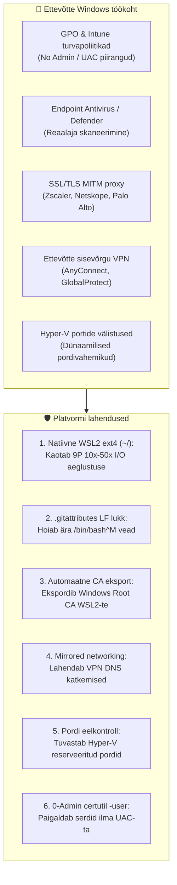

[ 🇬🇧 English ](../windows-enterprise-setup-guide.md) | [ 🇪🇪 Eesti ](windows-enterprise-setup-guide.md) | [ 🇫🇮 Suomi ](../fi/windows-enterprise-setup-guide.md) | [ 🇸🇪 Svenska ](../sv/windows-enterprise-setup-guide.md) | [ 🇱🇻 Latviešu ](../lv/windows-enterprise-setup-guide.md) | [ 🇱🇹 Lietuvių ](../lt/windows-enterprise-setup-guide.md)

# Ettevõtte Windows & WSL2 paigaldus- ja kasutusjuhend

Käesolev juhend annab samm-sammulised juhised **Oracle DevOps platvormi** käivitamiseks **suurettevõtte hallatavates Windows tööjaamades** (Windows 10 / 11 Enterprise, Intune/GPO hallatud, ilma kohaliku administraatori õigusteta, ettevõtte proxy/Zscaler ja sisevõrgu VPN).

---

## 1. Süsteeminõuete maatriks

| Ressurss | Miinimumnõue (BP 0 / 1 / 2) | Soovitatav (BP 5 / 6 / 7 / 8) | Kommentaar & põhjendus |
| :--- | :--- | :--- | :--- |
| **Protsessor (CPU)** | **4 tuuma (8 lõime)** x86_64 | **8 tuuma (16 lõime)** x86_64 | Virtualiseerimine (**VT-x / AMD-V**) peab olema BIOS/UEFI-s lubatud. ARM64 (Snapdragon) ei ole toetatud Oracle 23ai konteinerite emuleerimiseks. |
| **Töömälu (RAM)** | **16 GB Host RAM**<br/>*(WSL2: 6 GB)* | **32 GB Host RAM**<br/>*(WSL2: 12–16 GB)* | Windows + Teams + Defender võtab 5–6 GB. Oracle Free vajab 2.5 GB, ORDS 1 GB, WebLogic/Publisher 3–4 GB. 8 GB masinad hanguvad. |
| **Ketas (Storage)** | **50 GB vaba ruumi SSD-l** | **100 GB vaba ruumi NVMe SSD-l** | Tõmmised võtavad kokku ~25 GB. Mehaanilised HDD kettad on aeglase I/O tõttu rangelt keelatud. |
| **Operatsioonisüsteem** | **Windows 10 Enterprise / Pro** (21H2+, Build 19044+) | **Windows 11 Enterprise** (23H2 / 24H2) | Windows 11 sisaldab `mirrored` võrgurežiimi ja DNS tunneldamist, mis tagab VPN-i töökindluse. |
| **Virtualiseerimine** | **WSL 2** (Kernel 5.15+) | **WSL 2** (Kernel 6.6+) koos `systemd` toega | Windowsi funktsioonid: `VirtualMachinePlatform` ja `Microsoft-Windows-Subsystem-Linux`. |
| **Konteinerimootor** | **Podman Desktop 5.x** või Podman WSL2 sees | **Podman 5.x natiivselt WSL2 sees** | Ettevõttes 100% tasuta ja avatud lähtekoodiga (vaba Docker Desktopi tasulistest litsentsidest). |
| **Git & terminal** | **Git for Windows 2.40+** | **Git for Windows + Windows Terminal** | Nõutavad seadistused: `core.autocrlf=input`, `core.longpaths=true`. |
| **PowerShell** | **Windows PowerShell 5.1** | **PowerShell 7.4+ (Core)** | Vajalik käivitusskriptide ja sertifikaaditööriistade jaoks. |

---

## 2. Peamised ettevõttetõkked ja arhitektuursed lahendused



### 1. Natiivse WSL2 failisüsteemi invariant (ÄRA kasuta `C:\...` / `/mnt/c/`)
- **Oht:** Koodi jooksutamine Windowsi NTFS kettalt (`C:\Users\<user>\...`) käivitab WSL2-s Plan9 (9P) draiveri, mis on **10–50 korda aeglasem**. APEXi ja andmebaasi seadistus võtab 45–90 minutit tavapärase 3–5 minuti asemel.
- **Reegel:** Klooni kood alati WSL2 Linuxi ext4 failisüsteemi (`cd ~ && git clone ...`). Windows Exploreris pääseb koodile ligi võrguteelt `\\wsl$\Ubuntu\home\<user>\...`.

### 2. Reavahetused (CRLF VS LF)
- Kõik koodifailid on lukustatud **LF (`\n`)** reavahetustele läbi `.gitattributes`. Windowsi `.cmd` ja `.ps1` failid kasutavad CRLF.

### 3. Korporatiivne Proxy ja zscaler / netskope SSL inspekteerimine
- Väljuv liiklus dekrüpteeritakse ettevõtte sisese Root CA-ga. Käsk `scripts/wsl/configure-wsl-enterprise.ps1` ekspordib need automaatselt Windowsist WSL2-te.

### 4. VPN DNS tunneldamine
- Windows 11-s häälestatakse `%USERPROFILE%\.wslconfig` sätetega `networkingMode=mirrored` ja `dnsTunneling=true`.

---

## 3. Kiirjuhend windowsi arendajale samm-sammult

### Samm 1: Klooni repositoorium natiivsesse WSL2 ext4 kausta
Ava WSL2 terminal (Ubuntu/Debian) ja käivita:
```bash
cd ~
git clone https://github.com/allanlahe/oracle-free-db-in-prod.git
cd oracle-free-db-in-prod
```

### Samm 2: Häälesta WSL2 & Proxy sertifikaadid (ühekordne tegevus)
Käivita Windows PowerShellis (tavakasutaja õigustes, administraatorit pole vaja):
```powershell
powershell -ExecutionPolicy Bypass -File scripts\wsl\configure-wsl-enterprise.ps1
```
*See häälestab `%USERPROFILE%\.wslconfig` 6–16 GB mälule ja ekspordib proxy sertifikaadid WSL2-te.*

Muudatuste jõustumiseks taaskäivita WSL:
```powershell
wsl --shutdown
```

### Samm 2.5: Käivita mitte-destruktiivne dry-run eelkontroll
Enne andmebaasi ja konteinerite pikka paigaldust kontrolli keskkonna valmisolekut:
Windows Command Promptist:
```cmd
test-windows-dryrun.cmd
```
Või otse WSL2 terminalist:
```bash
./scripts/test-windows-dryrun.sh --fix
```
*See kontrollib ~2 sekundiga 10 kriitilist punkti (natiivne ext4 vs /mnt/c/, reavahetused, mälu, Hyper-V dünaamilised pordid, korporatiivne proxy TLS, VPN DNS, rootless Podman ja SEPS Walleti õigused). Lüliti `--fix` parandab leitud CRLF reavahetused automaatselt.*

### Samm 3: Käivita platvorm
Windows Command Promptist või Explorerist:
```cmd
setup.cmd -b 0
```
*(Vihje: saate käivitada ka `setup.cmd --dry-run` diagnostika tegemiseks enne starti).*

Või otse WSL2 terminalist:
```bash
./scripts/setup-all.sh -b 0
```

### Samm 4: Usalda SSL sertifikaat windowsi brauserites (0-Admin)
Et vältida brauserihoiatusi aadressidel `https://localhost:8448/ords/` ja `https://localhost:8448/dev-hub.html`:
```cmd
scripts\certs\trust-local-cert.cmd
```
*See impordib kohaliku Root CA hoidlasse `Cert:\CurrentUser\Root` ilma UAC kinnituseta.*

---

## 4. Probleemide lahendamine (FAQ)

### K1: `bash: ./scripts/setup-all.sh: /bin/bash^M: bad interpreter`
- **Põhjus:** Repositoorium klooniti Windows Gitiga, mille seade oli `core.autocrlf=true`.
- **Lahendus:** Käivita `./scripts/test-windows-dryrun.sh --fix` või klooni uuesti seadega `git config --global core.autocrlf input`.

### K2: Pordi sidumine ebaõnnestub: `An attempt was made to access a socket in a way forbidden by its access permissions`
- **Põhjus:** Windows Hyper-V reserveeris vajaliku pordi (1532 või 8088).
- **Lahendus:** Kontrolli reserveeritud vahemikke: `netsh interface ipv4 show excludedportrange protocol=tcp`. Taaskäivita Windows NAT või käivita `test-windows-dryrun.cmd` soovituste nägemiseks.
