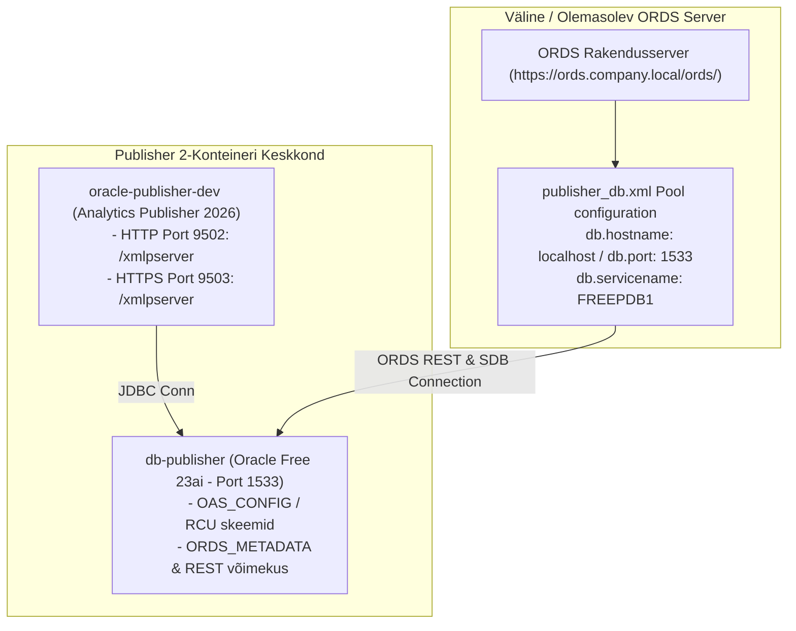

# External ORDS & Analytics Publisher Integration Guide

This guide describes how to configure the **`publisher-only`** profile to run a lightweight, 2-container environment (**Oracle Database Free 23ai** + **Oracle Analytics Publisher**) and connect an **existing/external ORDS application server** to the Publisher database.

---

## 🏛️ Arhitektuuri Ülevaade (Architecture Overview)

Selles mudelis **ei käivitata** lokaalselt eraldi ORDS-i ega APEX-i rakendusserveri konteinereid. Selle asemel installeeritakse Publisheri andmebaasi AINULT ORDS-i andmebaasiskeemid (`ORDS_METADATA`, `ORDS_PUBLIC_USER`) ning REST võimekused. Olemasolev ettevõtte kauge/lokaalne ORDS server ühendub andmebaasiga spetsiaalse ühendusbasseini (pool) kaudu.



---

## ⚙️ Profiili Seadistus (`config/profiles/databases/publisher-only.yaml`)

Profiilis on ORDS rakendusserveri konteiner välja lülitatud, kuid skeemi ja välise ORDS serveri seaded on sisse lülitatud:

```yaml
components:
  ords:
    enabled: false                           # Kohalikku ORDS rakendusserveri konteinerit EI loo
    install_ords_schema_only: true           # LÜLITI: Paigalda andmebaasi AINULT ORDS skeemid (ORDS.ENABLE_SCHEMA)
    target_external_ords_server: "https://ords.company.local/ords/" # Välise ORDS serveri sihtaadress
    external_pool_name: "publisher_db"       # Ühendusbasseini (XML pool) nimi välises ORDS serveris
    db_service_name: "FREEPDB1"
  apex:
    enabled: false                           # APEX on välja lülitatud
  publisher:
    enabled: true
    container_name: oracle-publisher-dev
    http_port: 9502
    https_port: 9503
```

---

## 🛠️ Seadistamise Skript (`scripts/configure-external-ords-pool.sh`)

Süsteemis on olemas automaatne abiskript, mis genereerib vajaliku ORDS Pool XML faili ja suudab selle kopeerida välisesse serverisse:

### 1. XML Konfiguratsioonifaili Genereerimine ja Kontroll:
```bash
./scripts/configure-external-ords-pool.sh --profile publisher-only
```

Skript teostab järgmised sammud:
1. Kontrollib andmebaasis `ORDS_METADATA` ja `ORDS` versiooni.
2. Pärib paroolid turvaliselt **SEPS Walletist** või **Podman Secrets** teenusest (`DB_PUBLISHER_SYS`).
3. Genereerib XML konfiguratsioonifaili asukohta: `config/ords_pools/publisher_db.xml`.

### 2. Automaatne Tarnimine Kaugserverisse (SSH):
Kui välisele ORDS serverile on SSH ligipääs olemas:
```bash
./scripts/configure-external-ords-pool.sh --profile publisher-only --remote-host ords.company.local --ssh-user root
```

---

## 📋 Käsitsi Seadistamise Juhend Välises ORDS Serveris

Kui ORDS serverit seadistatakse käsitsi:

### Samm 1: XML Konfiguratsioonifaili Kopeerimine
Kopeeri genereeritud XML fail välise ORDS serveri andmebaaside kausta:
```bash
cp config/ords_pools/publisher_db.xml /etc/ords/config/databases/publisher_db.xml
```

Faili sisu näidis (`publisher_db.xml`):
```xml
<?xml version="1.0" encoding="UTF-8" standalone="no"?>
<!DOCTYPE properties SYSTEM "http://java.sun.com/dtd/properties.dtd">
<properties>
<comment>ORDS Connection Pool configuration for Publisher DB</comment>
<entry key="db.connectionType">basic</entry>
<entry key="db.hostname">localhost</entry>
<entry key="db.port">1533</entry>
<entry key="db.servicename">FREEPDB1</entry>
<entry key="db.username">ORDS_PUBLIC_USER</entry>
<entry key="db.password">SEPS_WALLETI_VÕI_PODMAN_SECRET_PAROOL</entry>
<entry key="security.requestValidationFunction">wwv_flow_epg_include_modules.authorize</entry>
</properties>
```

### Samm 2: Ametliku ORDS CLI Kasutamine
Teine võimalus on käivitada välises serveris käsk:
```bash
ords config set --db-pool publisher_db \
  db.hostname localhost \
  db.port 1533 \
  db.servicename FREEPDB1 \
  db.username ORDS_PUBLIC_USER
```

---

## 🧪 Kontroll ja Verifitseerimine (Verification & Healthchecks)

### 1. Andmebaasi ORDS Versiooni Kontroll:
Käivita SQLcl või SQLPlus kaudu:
```sql
sql /@DB_PUBLISHER_SYS as sysdba
SELECT ords.version_number FROM dual;
```

### 2. Välise ORDS HTTP Päringu Kontroll:
Testi veebiliidese kättesaadavust:
```bash
curl -k -I https://ords.company.local/ords/publisher_db/
```
Eeldatav tulemus: **HTTP 200 OK** või **HTTP 302 Found**.
