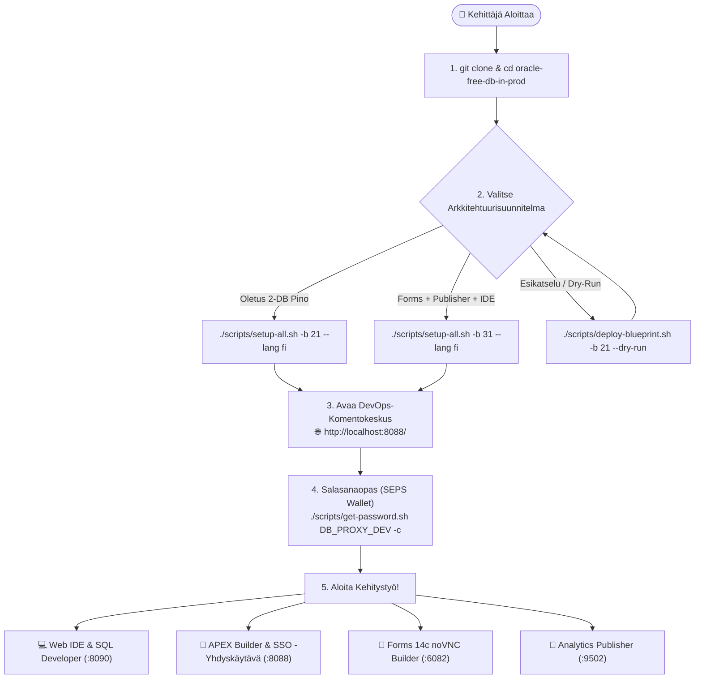
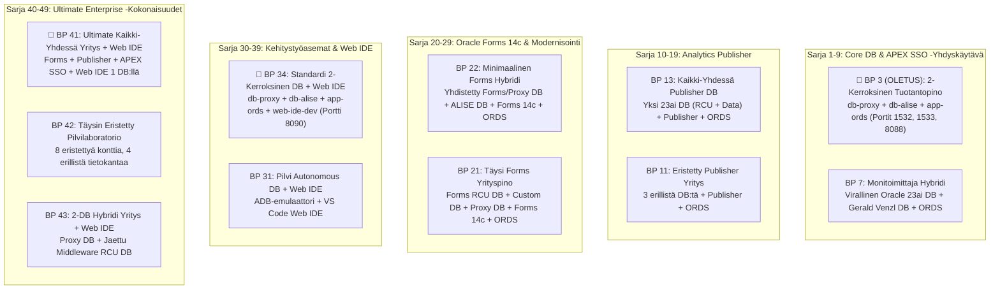

[ 🇬🇧 English ](../../README.md) | [ 🇪🇪 Eesti ](../et/README.md) | [ 🇫🇮 Suomi ](README.md) | [ 🇸🇪 Svenska ](../sv/README.md) | [ 🇱🇻 Latviešu ](../lv/README.md) | [ 🇱🇹 Lietuvių ](../lt/README.md)

# Oracle DevOps -Alusta (Suomenkielinen Käyttöopas)

> **Tuotantovalmis, lisenssimaksuton (0 €) ja 100% salasanaton (SEPS Wallet) Oracle 23ai, APEX SSO -yhdyskäytävä, Forms 14c, Publisher ja Web IDE kehitys- sekä DevOps-alusta.**

---

## ⚡ 60-Sekunnin Pikakäynnistys

```bash
# 1. Kloonaa repositorio ja siirry hakemistoon
git clone https://github.com/allanlahe/oracle-free-db-in-prod.git && cd oracle-free-db-in-prod

# 2. Käynnistä 2-kerroksinen tuotantopino (Blueprint 21)
./scripts/setup-all.sh -b 21 --lang fi

# 3. Tarkastele salasanoja, URL-osoitteita ja leikepöytäapuria (tai avaa Dev Hub: http://localhost:8088/)
./scripts/get-password.sh
```

> [!TIP]
> **Windows Git -Asetukset (Sääntö 13):**
> Ennen kuin kloonaat Windowsissa, määritä Git tukemaan pitkiä polkuja ja suojaamaan NTFS-tiedostojärjestelmää:
> ```powershell
> git config --global core.protectNTFS true
> git config --global core.longpaths true
> git config --global core.autocrlf input
> ```

---

## 🗺️ Uuden Kehittäjän Perehdytyspolku (Onboarding Journey)



---

## ⚡ Setup-All 10-Vaiheinen Elinkaariarkkitehtuuri

```mermaid
flowchart LR
    P1["1. Konttikuvien Lataus"] --> P2["2. ORDS Lataus"]
    P2 --> P3["3. APEX Paketit"]
    P3 --> P4["4. Konttien Käynnistys"]
    P4 --> P5["5. DB Terveyden Odotus"]
    P5 --> P6["6. APEX Asennus"]
    P6 --> P7["7. Skeemat & SEPS Init"]
    P7 --> P8["8. APEX Sovellusten Julkaisu"]
    P8 --> P9["9. Middleware & Palvelut"]
    P9 --> P10["10. Kultainen Tilannevedos (~15s DR)"]
```



---

## 🌐 Dev Hub (`http://localhost:8088/`) — Yhdistetty Ohjauskeskus (*Single Pane of Glass*)

Kehittäjän ei tarvitse opetella ulkoa kymmeniä eri portteja. **Dev Hub** toimii keskitettynä portaalina:
- **1-Klikkauksen Palvelulinkit:** Välitön pääsy APEX Builderiin, Database Actionsiin (SDW), Forms 14c -palveluihin, HTML5 noVNC Forms Builderiin ja Analytics Publisheriin.
- **1-Klikkauksen Salasanakopiointi:** Yksi klikkaus kopioi avatun salasanan suoraan leikepöydälle (valmiina liitettäväksi: `Cmd+V` / `Ctrl+V`).
- **Reaaliaikainen Terveydentilan Diagnostiikka:** Automaattinen latenssitarkistus 6 sekunnin välein.
- **Integroitu Markdown-Dokumentaatiolukija:** Lue ja hae oppaita suoraan selaimessa.
- **Blueprintien Käyttöönotto ja Hallinta:** Ota käyttöön ja vaihda blueprintejä selaimesta tai komennolla `./scripts/deploy-blueprint.sh`.
- **ORDS Älykäs Yhdyskäytäväpaneeli:** Reaaliaikainen näkyvyys keskitetyn ORDS-kontin tilaan, yhteysjoukkoihin (connection pools), vasteaikaan (ms) ja 1-klikkauksen synkronointiin.

---

## 🌐 ORDS Älykäs Yhdyskäytävä ja Autonominen Mikrorekisteröinti (Variant 3)

Alusta eliminoi useiden rinnakkaisten ORDS-konttien aiheuttamat porttiristiriidat **älykkään yhdyskäytävän ja mikrokirjaajan mallilla**:

- **Keskitetty Yhdyskäytävä:** Yksi `app-ords`-kontti toimii porteissa 8088 (HTTP) ja 8448 (HTTPS) palvellen kaikkia aktiivisia tietokantapinoja.
- **Autonominen Mikrorekisteröinti:** Jokainen tietokanta hallitsee omaa yhteysjoukkoaan (`config/ords/proxy/databases/<pool_name>/pool.xml`).
- **Virtuaaliset Palvelutunnisteet (`ords/<pool>`):** Blueprintit määrittelevät virtuaaliset tunnisteet (esim. `ords/proxy`, `ords/alise`). Dev Hub arvioi valmiuden sekä kontin että reaaliaikaisen vasteajan perusteella.
- **Yhteysjoukkojen Hallintatyökalu (CLI):**
  ```bash
  ./scripts/internal/manage-ords-pools.sh status
  ./scripts/internal/manage-ords-pools.sh status json
  ./scripts/internal/manage-ords-pools.sh sync
  ```

---

## 🔑 Mistä Löydän Salasanani? (SEPS Wallet -Pikaopas)

Kaikki salasanat generoidaan vahvalla kryptografisella satunnaisuudella ja tallennetaan turvallisesti **Oracle SEPS (Secure External Password Store) Walleteihin** ja Podman-salaisuuksiin.

```bash
# Näytä salasanojen ja palveluiden koontitaulukko:
./scripts/get-password.sh

# Kopioi kehittäjän salasana suoraan leikepöydälle:
./scripts/get-password.sh DB_PROXY_DEV -c

# Kopioi APEX-pääkäyttäjän salasana:
./scripts/get-password.sh DB_PROXY_APEX_ADMIN -c

# Yhdistä tietokantaan SQLcl:llä ILMAN salasanaa:
sql /@DB_PROXY_DEV
```

---

## 🎯 3 Sidosryhmänäkymää ja Alustan Arvo

| Sidosryhmä | Tärkeimmät Hyödyt ja Päivittäinen Kokemus | Tekninen Mahdollistaja |
| :--- | :--- | :--- |
| **👤 Loppukäyttäjä ja Liiketoiminta** | • **Ei Asennettavia Työpöytäasiakkaita:** Moderni HTML5-selainkokemus ja APEX Universal Theme.<br/>• **Kertakirjautuminen (SSO):** Yksi kirjautuminen APEXin ja Forms-sovellusten välillä.<br/>• **Pixel-Perfect -Raportit:** Automaattinen PDF/Excel-asiakirjojen generointi. | • ORDS Moniallas-Yhdyskäytävä<br/>• APEX Reverse Proxy SSO Formsille<br/>• Analytics Publisher REST API |
| **💻 Kehittäjä** | • **~15s FastStart Palautuminen:** Välitön tilan nollaus Kultaisilla Tilannevedoksilla.<br/>• **Salasanaton SQL:** Nopea yhteys `./scripts/sqlcl.sh`:lla ja SEPS Walletilla.<br/>• **Selainpohjainen Web IDE:** Asennusvapaa VS Code Oracle SQL Developerilla ja tekoälyllä. | • Podman FastStart Tilannevedokset<br/>• SEPS Oracle Wallet -Synkronointi<br/>• `code-server` Web IDE -Kontti |
| **🛡️ Tarkastaja ja Arkkitehti** | • **0 € Lisenssikustannus:** Oracle 23ai Free DB tuotannossa.<br/>• **Zero-Trust Verkkoeristys:** Tietokanta ei avaa raakaa SQL:ää julkiseen verkkoon.<br/>• **Hallittu Suoritus:** EBNF-deklaratiiviset sopimukset, AST-turva-analyysi ja VPD. | • JSON-Relational Duality<br/>• 2-Kerroksinen Verkkotopologia<br/>• Oracle Virtual Private Database (VPD) |

---

## 🔄 Oracle APEXin ja Forms 14c:n Integraation Rooli

Tässä arkkitehtuurissa **Oracle APEX 26.1** on sijoitettu ensisijaisesti seuraaviin rooleihin:
1. **Forms Modernisoinnin Silta:** Forms 14c -lomakkeiden vaiheittainen modernisointi responsiivisiksi verkkosovelluksiksi [Oracle APEXlang DSL:n](https://docs.oracle.com/en/database/oracle/apex/26.1/apxln/) avulla.
2. **Yritystason SSO Reverse Proxy Formsille:** APEX käsittelee nykyaikaiset identiteettipalvelut (Azure Entra ID, SAML, OAuth2) ja välittää todennetun istunnon turvallisesti Forms 14c:lle ilman kallista WebLogic OAM/OIF -infrastruktuuria.

---

## 📋 11 Kuratoitua Arkkitehtuurisuunnitelmaa (Blueprints)



### 🚀 Blueprintien Käyttöönotto ja Hallinta (`./scripts/deploy-blueprint.sh`)

```bash
# 1. Tarkista aktiivinen blueprint ja palveluiden tila:
./scripts/deploy-blueprint.sh --status --lang fi

# 2. Ota käyttöön Blueprint 3 (OLETUS 2-Kerroksinen Tuotantopino):
./scripts/deploy-blueprint.sh -b 3 --lang fi

# 3. Ota käyttöön Blueprint 41 (Ultimate Kaikki-Yhdessä Yritys):
./scripts/deploy-blueprint.sh -b 41 --lang fi

# 4. Simuloi käyttöönottoa ilman muutoksia (Dry-Run):
./scripts/deploy-blueprint.sh -b 34 --dry-run

# 5. Näytä 11 blueprintin taulukko päätteessä:
./scripts/deploy-blueprint.sh --list --lang fi
```

---

## ⚡ Nopeutettu ~15s Palautus & Automaattinen Versiotarkistus

Oracle Free DB in Prod sisältää **älykkään monikerroksisen Golden Snapshot- ja Skip-moottorin** (`scripts/internal/snapshot-resolver.sh`), joka lyhentää toisen käynnistyskerran keston **~6–12 minuutista vain ~15 sekuntiin**:

1. **Automaattinen Versiotarkistus & Vanhentuneiden Tilannevedosten Mitätöinti (`.meta.json`):**
   - Jokainen Golden Snapshot sisältää koneluettavan `.meta.json`-sopimuksen, johon tallennetaan APEXin, tietokannan, ORDSin ja väliohjelmistojen versiot.
   - Ennen palautusta tarkistetaan versioiden yhteensopivuus. Jos havaitaan vanhentunut tilannevedos (esim. kohde `APEX 26.1` vs snapshot `24.2`), järjestelmä antaa `VERSION MISMATCH` -varoituksen, suorittaa puhtaan asennuksen ja luo automaattisesti uuden ajantasaisen tilannevedoksen.
2. **Profiilipohjainen Uudelleenkäyttö & Skip-Matriisi:**
   - Koska samat tietokantaprofiilit toistuvat useissa blueprinteissä (esim. `db-proxy-oracle` BP 3, BP 7, BP 21, BP 22, BP 34, BP 43), blueprintin vaihtaminen (esim. BP 3 $\rightarrow$ BP 34 Web IDE:n lisäämiseksi) jättää tietokannan koskemattomaksi ja käynnistää vain puuttuvan lisäkontin **~3 sekunnissa**.
3. **Shared vs. Dedicated WebLogic -Topologiat:**
   - **Jaettu WebLogic (BP 41 & BP 43):** Yhteinen All-in-One-tietokanta (`db-dev-full`), yhdistetyt RCU-skeemat (`DEV_`), 1 yhdistetty tilannevedos ja matala RAM-muistin kulutus (~6–8 GB).
   - **Erillinen WebLogic (BP 11, BP 21 & BP 42):** Itsenäiset tietokannat (`db-forms`, `db-publisher`), modulaariset tilannevedokset ja valikoiva käynnistys, joka säästää jopa 4 GB RAM-muistia.

---

## 🚀 Pikakäynnistyksen CLI-Komennot (Quickstart CLI)

```bash
# 1. Käynnistä haluttu blueprint:
./scripts/setup-all.sh -b 3 --lang fi

# 2. Tarkastele salasanojen ja palveluiden koontitaulukkoa (tai kopioi -c):
./scripts/get-password.sh
./scripts/get-password.sh DB_PROXY_DEV -c

# 3. Kierrätä salasanat turvallisesti ilman katkoksia:
./scripts/rotate-password.sh db-proxy dev
./scripts/rotate-password.sh all

# 4. Tarkista aktiiviset verkkopalvelut ja SEPS Wallet -yhteydet:
./scripts/check-urls.sh --lang fi
./scripts/check-wallet.sh

# 5. Suorita automaattinen kirjautumis- ja käyttöliittymätesti:
./scripts/test-browser-login.sh

# 6. Suorita monikielisyyden (i18n) tarkistus (Sääntö 9: EN, ET, FI, SV, LV, LT):
./tests/test-multilingual-support.sh

# 7. Luo tai palauta Kultaisia Tilannevedoksia (~15s palautuminen):
./scripts/snapshots/create-golden-snapshots.sh
./scripts/snapshots/restore-golden-snapshots.sh

# 8. Puhdista lokit, väliaikaiset tiedostot ja vanhat tilannevedokset:
./scripts/clean-logs.sh -y
./scripts/snapshots/clean-golden-snapshots.sh -y

# 9. Nollaa ympäristö puhtaaseen alkutilaan:
./scripts/reset-all.sh -y
```

---

---

## 🧭 Oracle APEX DevHub -Sovellus ja APEXlang CI/CD

Erillisen HTML Dev Hubin (`docs/dev-hub.html`) lisäksi alusta sisältää yritystason **Oracle APEX -sovelluksen (Sovellus 101: DevHub)**, joka on luotu deklaratiivisesti [Oracle APEXlang DSL](https://docs.oracle.com/en/database/oracle/apex/26.1/apxln/) -kielellä kansioon [`applications/devhub/`](../../applications/devhub/):

- **Nollajalanjälkidokumentaatio Tietokannassa:** Dokumentaatiota ei koskaan monisteta tai tallenneta tietokantaan CLOB-kenttinä. Kevyt paikallinen REST-dokumentaatiosilta (`scripts/internal/dev-hub-bridge.py` portissa 8089) suoratoistaa lokalisoidun Markdownin suoraan Git-tiedostoista APEXiin, jossa se muunnetaan natiivisti `APEX_MARKDOWN.TO_HTML` -funktiolla.
- **Interaktiivinen Esittely ja Yleiskatsaus (Sivu 7):** Sisältää 8 dian interaktiivisen esityksen, joka kattaa alustan vision, kehittäjien kipupisteet, roolikohtaiset hyödyt, 11 arkkitehtuurimallia, Zero-Trust SEPS Wallet -tietoturvan, ~15s Golden Snapshot -palautuksen ja vastaukset kriittisen arkkitehdin / entisen DBA:n kysymyksiin.
- **Tietokantamoottori ja Erillinen Skeema:** Taustalla toimii dedikoitu skeema `DEVHUB` ja paketti `DEVHUB.DEV_HUB_PKG`, joka suorittaa palvelintason terveystarkastukset (`UTL_HTTP`) kaikille palveluille alle 100 ms viiveellä.
- **Viralliset SQLcl 26.2 APEXlang -Työkalut:**
  ```bash
  # Validoi APEXlang-tiedostot paikallisia sääntöjä vasten:
  node .agents/skills/apexlang/tools/apexctl.mjs apexlang validate --app-path applications/devhub

  # Validoi ja tuo sovellus 101 työtilaan PROXY_WORKSPACE SQLcl:n kautta:
  ./scripts/sqlcl.sh DEVHUB/<salasana>@localhost:1533/FREEPDB1
  SQL> apex validate -input ./applications/devhub -workspace PROXY_WORKSPACE
  SQL> apex import -input ./applications/devhub -id 101 -workspace PROXY_WORKSPACE
  ```
- **Automatisoitu CI/CD -Putki:** Oma GitHub Actions -työnkulku [`.github/workflows/deploy-devhub-apexlang.yml`](../../.github/workflows/deploy-devhub-apexlang.yml) paikallisella emuloinnilla komennolla `./scripts/test-local-ci.sh deploy-devhub-apexlang.yml --dry-run`.
- **Yksikkötestit:** Aja `./tests/unit/test-apex-devhub.sh` skeeman, PL/SQL:n, REST-siltojen ja 6 kielen kattavuuden testaamiseksi.

---

## 📑 Moduulikohtaiset Käyttöoppaat

- 🚀 **[docs/fi/forms-to-apex-migration-guide.md](forms-to-apex-migration-guide.md):** **Oracle Forms $\rightarrow$ APEX Modernisointi- ja Migraatio-opas** — Liiketoimintaperusteet, TCO-kustannusvertailu, 5-vaiheinen automaattinen työnkulku, PL/SQL-logiikan eristäminen ja [Oracle APEXlang DSL](https://docs.oracle.com/en/database/oracle/apex/26.1/apxln/) Vibe-Coding.
- 📐 **[docs/fi/forms-setup.md](forms-setup.md):** Oracle Forms 14c käyttöohje — porttikartta (9001/7001/6082), testilomakkeen avaaminen (`frmservlet?form=test.fmx`), lomakkeiden lisääminen kansioon `forms_apps/`, kääntäminen ja APEX-migraatio.
- 📑 **[docs/fi/publisher-setup.md](publisher-setup.md):** Analytics Publisherin käyttöohje — portti 9502 (`/xmlpserver`), RCU-metatietokanta, `PUBLISHER_READER` Wallet -tili, JDBC-tietolähteiden liittäminen ja raporttien jakelu.
- 💻 **[docs/fi/web-ide-artifactory.md](web-ide-artifactory.md):** Web IDE -käyttöohje — VS Code -laajennukset (Oracle SQL Developer, Antigravity AI, GitHub Actions), isäntäyhteyksien reaaliaikainen synkronointi ja offline GitHub Actions -testaus (`act`).
- 🌐 **[docs/dev-hub.html](../../docs/dev-hub.html):** **Kehittäjän ja DevOpsin Komentokeskus (Developer Hub)** — Saatavilla osoitteissa **`http://localhost:8088/`** ja **`https://localhost:8448/`** (ORDS) sekä **`http://localhost:6082/vnc.html`** (Forms). Sisältää reaaliaikaisen latenssin seurannan, interaktiiviset Mermaid-arkkitehtuurikaaviot, 11 Blueprintin luettelon, selaimensisäisen Markdown-lukijan ja DevOps-pikakomennot 6 kielellä.
- 🧪 **[docs/fi/apex-devhub-test-plan.md](apex-devhub-test-plan.md):** **Oracle APEX DevHub Testaussuunnitelma** — Monitasoinen testausstrategia (utPLSQL-yksikkötestit, REST-siltakyselyt, hybridit Playwright/curl E2E -työnkulut ja APEX Advisor -laadunvarmistus) Golden Snapshot -eristyksellä.
- 📊 **[config/blueprints/README.fi.md](../../config/blueprints/README.fi.md):** Kaikkien 11 arkkitehtuurisuunnitelman tekninen matriisi.
- 📖 **[Oracle APEX 26.1 APEXlang Reference Manual](https://docs.oracle.com/en/database/oracle/apex/26.1/apxln/):** Oraclen virallinen spesifikaatio deklaratiivisesta `.apx`-kieliopista, kääntäjän AST-solmuista ja CLI-komennoista.
- 📜 **[Virallinen APEXlang EBNF -Kielioppi (`apexlang.ebnf`)](https://docs.oracle.com/en/database/oracle/apex/26.1/apxln/apexlang.ebnf):** Koneluettava virallinen EBNF-kielioppitiedosto tekoälyn rajoitettuun dekoodaukseen (GBNF) ja staattisiin turvallisuustyökaluihin.

