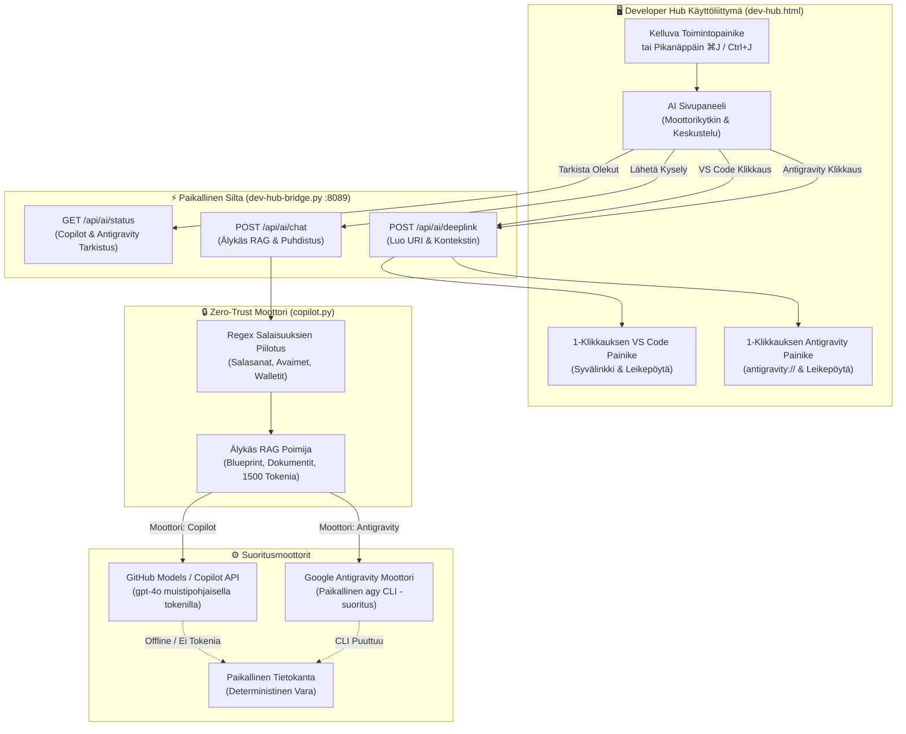

[ 🇬🇧 English ](../devhub-copilot-assistant.md) | [ 🇪🇪 Eesti ](../et/devhub-copilot-assistant.md) | [ 🇫🇮 Suomi ](devhub-copilot-assistant.md) | [ 🇸🇪 Svenska ](../sv/devhub-copilot-assistant.md) | [ 🇱🇻 Latviešu ](../lv/devhub-copilot-assistant.md) | [ 🇱🇹 Lietuvių ](../lt/devhub-copilot-assistant.md)

# 🤖 Dev Hub Monialustainen AI-avustaja (Copilot + Antigravity) ja Zero-Trust RAG -opas

Tämä opas dokumentoi Developer Hubin (`docs/dev-hub.html`) monialustaisen **AI-avustajan**, joka tukee sekä **GitHub Copilotia** että **Google Antigravitya**, Sääntö 5 Zero-Trust -tietoturvakontrolleja, offline-tietokantaa sekä 1-klikauksen siltoja VS Code Copilot Chatiin ja Antigravityyn.

---

## 🏛️ 1. Tekninen arkkitehtuuri ja tietovirta

Avustaja hyödyntää kahden moottorin arkkitehtuuria pikanäppäimellä `⌘J` / `Ctrl+J`, mahdollistaen nopean vaihdon GitHub Copilotin ja Google Antigravityn välillä:

---

## 🔒 2. Zero-Trust -tietoturva ja Sääntö 5 noudattaminen

1. **Ei tallennusta levylle:** Tunnistetiedot ja komentorivin vuorovaikutus hoidetaan muistipohjaisesti.
2. **Dynaaminen sensurointi:** Kaikki käyttäjän kyselyt ja dokumentaatiolainaukset kulkevat `sanitize_text`-funktion läpi:
   - Tietokantojen salasanat (`password: ...`, `IDENTIFIED BY ...`)
   - SEPS Wallet -polut (`cwallet.sso`, `ewallet.p12`)
   - SSH- ja TLS-yksityisavaimet (`BEGIN PRIVATE KEY`)
   - GitHub-käyttöoikeustunnisteet (`ghp_*`, `github_pat_*`)

---

## ⌨️ 3. Kehittäjän pikanäppäimet ja toiminnot

| Toiminto | Pikanäppäin / Käynnistin | Kuvaus |
| :--- | :--- | :--- |
| **Avaa / Sulje Avustaja** | `⌘J` (macOS) / `Ctrl+J` (Windows/Linux) | Avaa tai sulkee AI-paneelin miltä tahansa Dev Hubin välilehdeltä. |
| **Moottorin vaihto** | Otsikon painikkeet `[ GitHub Copilot | Google Antigravity ]` | Vaihtaa aktiivisen tekoälymoottorin (`localStorage`). |
| **Koko näyttö / Palauta** | Oikean yläkulman painike `⛶` | Laajentaa paneelin koko ruudun tilaan koodin tarkastelua varten. |
| **Kysymyksen lähetys** | `Enter`-näppäin | Lähettää kyselyn valitulle tekoälymoottorille. |
| **Avaa VS Codessa** | Napsauta `Avaa VS Code Copilotissa` | Kopioi täyden RAG-kontekstin leikepöydälle ja avaa `vscode://github.copilot/chat`. |
| **Avaa Antigravityssä** | Napsauta `Avaa Antigravityssä` | Kopioi RAG-kontekstin leikepöydälle ja avaa `antigravity://chat` (tai käynnistää sovelluksen). |

---

## 🔄 4. 3-Tasoinen offline-varajärjestelmä

Jos kehityskoneessa ei ole verkkoyhteyttä:
1. **Taso 1 (Yhdistetty):** Käyttää GitHub Models (`gpt-4o`) -rajapintaa tai paikallista `agy` CLI -komentoa.
2. **Taso 2 (CLI-vara):** Käyttää paikallisia CLI-työkaluja.
3. **Taso 3 (Offline):** Luo välittömän deterministisen vastauksen paikallisesta dokumentaatiosta.
