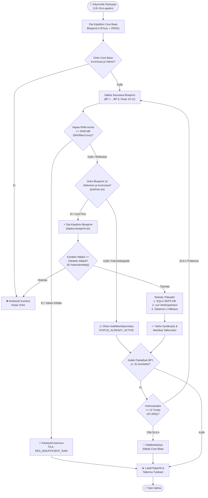

# 🧪 Blueprintien vaiheittaisen lisäämisen ja multi-stack-testaussuunnitelma

[ 🇬🇧 English ](../incremental-blueprints-test-plan.md) | [ 🇪🇪 Eesti ](../et/incremental-blueprints-test-plan.md) | [ 🇫🇮 Suomi ](incremental-blueprints-test-plan.md) | [ 🇸🇪 Svenska ](../sv/incremental-blueprints-test-plan.md) | [ 🇱🇻 Latviešu ](../lv/incremental-blueprints-test-plan.md) | [ 🇱🇹 Lietuvių ](../lt/incremental-blueprints-test-plan.md)

---

## 1. Yleiskatsaus ja tavoitteet

**Oracle DevOps -alusta** tukee modulaaristen blueprintien dynaamista aktivointia sekä komentoriviltä (`scripts/deploy-blueprint.sh`) että interaktiivisesta Developer Hubista (`docs/dev-hub.html`). Tämä testaussuunnitelma vahvistaa **blueprintien vaiheittaisen lisäämisen (incremental addition)** varmistaen, että useat arkkitehtuuripinot toimivat rinnakkain ilman ristiriitoja, odottamattomia alasajoja tai resurssien ehtymistä.

### Tärkeimmät testaustoimenpiteet:
1. **Env 0 -perustason Vaatimus (Baseline Invariant):** Jokaisen testiajon on aina alettava **Blueprint 0:sta (`.env.0-default-proxy-ords`)** pysyvänä Core Base -yhdyskäytävänä (`db-proxy` portissa 1532 ja `app-ords` porteissa 8088/8448).
2. **Tuhoamaton Lisääminen (Non-Destructive Addition):** Uuden blueprintin lisääminen (esim. BP 1 `db-alise` tai BP 8 `web-ide-dev`) **ei saa koskaan** pysäyttää, poistaa tai alustaa uudelleen aiemmin käynnissä olleita kontteja tai tietokantaskeemoja.
3. **Ei Haamukontteja (Zero Ghost Containers):** Käynnissä olevien konttien joukon on vastattava tarkasti kaikkien aktivoitujen blueprintien liittoa. Luvattomia tai tuntemattomia kontteja ei saa muodostua.
4. **Kattavat Päästä Päähän -yhteydet:** Jokaisen lisäysvaiheen on todennettava:
   - **Tietokantayhteydet:** Kaikki olemassa olevat ja vastikään lisätyt tietokannat Oracle SEPS Walletin kautta (`sqlcl.sh /@ALIAS`).
   - **HTTP/HTTPS-päätepisteet:** Terveystarkastukset, APEX-työtilat, ORDS-yhteysvarannot ja Web IDE -palvelut palauttavat oikean tilakoodin (`200 OK` tai `302 Found`).
   - **Selaimen 1-Klikkauksen Kirjautuminen:** Salasanan kopiointi leikepöydälle ja onnistunut todennus APEX Builderissa, Database Actionsissa ja Analytics Publisherissa.
5. **Alustariippumaton Dynaaminen Muistirajoitus (< 2048 MB Vapaa Puskuri):**
   - Vapaan fyysisen RAM-muistin reaaliaikainen tarkistus: **Windows Native** (PowerShell CIM), **Linux/WSL2** (`/proc/meminfo`) ja **macOS** (`sysctl` / `vm_stat`), yhdistettynä käynnissä olevien konttien kulutukseen (`podman stats`).
   - Asennus estetään virheellä `RES_INSUFFICIENT_RAM`, jos vapaa muisti laskee alle 2.0 GB:n, suojaten kehityskonetta jäätymiseltä ja OOM-alasajolta.
6. **Kaksoiskäynnistyksen Esto (`STATUS_ALREADY_ACTIVE`):** Jo käynnissä olevan blueprintin uudelleenkäynnistys estetään puhtaasti ilman konttien uudelleenluontia. Jos tarvitaan rinnakkainen instanssi, on määriteltävä uusi numeroitu `.env.<N>`-blueprint omilla porteilla.
7. **Etä-/Pilviblueprintien Rajaaminen:** Blueprintit **BP 10 (Remote Autonomous Database)** ja **BP 11 (Remote Analytics Publisher)** kohdistuvat ulkoisiin pilvipalveluihin, ja ne on rajattu pois paikallisten konttien lisäystestistä.
8. **Globaali 12 Tunnin SLA-Aikaraja:** Koko testisarja ei saa kestää yli **12 tuntia (43 200 sekuntia)**. Automaattinen vahtikoira keskeyttää suorituksen hallitusti ja tallentaa mittaustiedot aikarajan lähestyessä.

---

## 2. Testauksen arkkitehtuuri ja kulku



---

## 3. Vaiheittainen testausmatriisi (BP 0 .. BP 9)

| Vaihe | Blueprint-tiedosto | Kuvaus | Kohdekontit | Portit | DB SEPS Alias | Verkkopalvelu |
| :--- | :--- | :--- | :--- | :--- | :--- | :--- |
| **0** | `.env.0-default-proxy-ords` | **Core Base (Perustaso)** | `db-proxy`, `app-ords` | 1532, 8088, 8448 | `PROXY_DEV` | APEX, DB Actions, ORDS |
| **1** | `.env.1-standalone-alise-db` | Erillinen ALISE DB | + `db-alise` | 1533 | `ALISE_DEV` | Dynaaminen pooli `/ords/alise` |
| **2** | `.env.2-standalone-proxy-db` | Erillinen Proxy DB | + `db-proxy-standalone` | 1537 | `DB_PROXY_STANDALONE_DEV` | Erillinen Proxy DB ja SSO-yhdyskäytävä |
| **3** | `.env.3-standalone-gvenzl-db` | FastStart Gvenzl DB | + `db-gvenzl` | 1535 | `GVENZL_DEV` | Dynaaminen pooli `/ords/gvenzl` |
| **4** | `.env.4-standalone-autonomous-db` | Paikallinen ADB-emulointi | + `db-adb` | 1539 | `ADB_DEV` | Autonomisen tietokannan päätepiste |
| **5** | `.env.5-standalone-publisher` | Analytics Publisher DB & FMW | + `db-publisher`, `app-publisher` | 1531, 9502 | `PUBLISHER_DEV` | Publisher Web (`/xmlpserver`) |
| **6** | `.env.6-standalone-forms` | Forms 14c DB & Runtime | + `db-forms`, `app-forms` | 1534, 9001, 6082 | `FORMS_DEV` | Forms Runtime & noVNC |
| **7** | `.env.7-consolidated-forms-publisher` | Yhdistetty Forms + Publisher | + `app-forms-publisher` | 9001, 9502 | Jaettu `PUBLISHER_DEV` | Yhdistetty FMW-konsoli |
| **8** | `.env.8-standalone-web-ide` | Erillinen VS Code Web IDE | + `web-ide-dev` | 8090 | (Käyttää Core Base DB:tä) | Selain-IDE (`:8090`) |
| **9** | `.env.9-standalone-publisher-designer` | Erillinen Publisher Designer | + `app-publisher-designer` | 6083 | (Yhdistää Publisheriin) | Työpöytä-Designer noVNC |
| — | `.env.10-remote-ords` | Etä-/Pilvi-ADB | *Rajattu pois* | — | — | Ulkoinen Pilvi-ADB |
| — | `.env.11-remote-publisher` | Etä-/Pilvi-Publisher | *Rajattu pois* | — | — | Ulkoinen Pilvi-Publisher |

---

## 4. Varmistusmetodologia

### Taso 1: Automaattinen skripti- ja komentorividiagnostiikka
1. **Konttien Eristys ja Haamuprosessien Tarkistus:**
   - Aja `podman ps --format "{{.Names}}"` jokaisen vaiheen jälkeen.
   - Varmista, että aiemmat kontit pysyvät aktiivisina ja uudet kontit vastaavat määrittelyä.
2. **Oracle SEPS Automaattikirjautumisen Tarkistus:**
   - Suorita jokaiselle aktiiviselle tietokannalle:
     ```bash
     ./scripts/sqlcl.sh /@<ALIAS> <<EOF
     SELECT sys_context('USERENV','DB_NAME') AS db, sys_context('USERENV','SESSION_USER') AS usr FROM dual;
     EXIT;
     EOF
     ```
   - Palauttaa tilakoodin 0 ilman salasanakyselyä.
3. **HTTP- ja REST-palvelujen Tarkistus:**
   - Suorita `./scripts/check-urls.sh` päätepisteiden tarkistamiseksi.

### Taso 2: Interaktiivinen selain- ja Dev Hub -tarkistus
1. **Dev Hub -reaaliaikasynkronointi:**
   - Avaa `docs/dev-hub.html` selaimessa ja varmista aktiivisten blueprintien vihreä tila ja tarkka RAM-laskuri.
2. **1-Klikkauksen Kirjautuminen:**
   - Testaa `🛠️ APEX Workspace (DEV)`, `📊 DB Actions (DEV)` ja Publisher-kirjautuminen.

---

## 5. Resurssisuoja ja kaksoiskäynnistyksen esto

### TC-RES-01: Alustariippumaton dynaaminen RAM-tarkistus
- **Tavoite:** Tunnistaa vapaa fyysinen muisti ennen käynnistystä Windowsissa, Linuxissa ja macOS:ssä.
- **Komennot:**
  - **Windows (PowerShell):** `powershell.exe -NoProfile -Command "(Get-CimInstance Win32_OperatingSystem).FreePhysicalMemory"`
  - **Linux / WSL2:** `grep MemAvailable /proc/meminfo`
  - **macOS:** `vm_stat` sivulaskenta
  - **Kontit:** `podman stats --no-stream --format "{{.Name}}: {{.MemUsage}}"`

### TC-RES-02: Riittämättömän muistin esto (< 2048 MB puskuri)
- **Tavoite:** Estää asennus, jos vapaa muisti laskee alle 2.0 GB:n virheellä `RES_INSUFFICIENT_RAM`.

### TC-DUP-01: Kaksoiskäynnistyksen tunnistus (`STATUS_ALREADY_ACTIVE`)
- **Tavoite:** Varmistaa, että saman blueprintin uudelleenajo ilmoittaa `BP_ALREADY_ACTIVE` eikä käynnistä kontteja uudelleen.

---

## 6. Suoritusajan 12 tunnin SLA-vahtikoira

### TC-TIME-01: Globaali SLA-vahtikoira
- **Tavoite:** Varmistaa, että koko sarja keskeytyy hallitusti ennen 12 tunnin (43 200s) aikarajan ylittymistä tallentaen mittaustiedot tiedostoon `metrics/setup_benchmarks.json`.

---

## 7. Suorituskomentojen pikaohje

```bash
# 1. Alusta Perusympäristö (Blueprint 0)
./scripts/setup-all.sh --blueprint 0 -y

# 2. Lisää Blueprintit Vaiheittain (BP 1 .. BP 9)
./scripts/deploy-blueprint.sh 1
./scripts/deploy-blueprint.sh 3
./scripts/deploy-blueprint.sh 4
./scripts/deploy-blueprint.sh 5
./scripts/deploy-blueprint.sh 6
./scripts/deploy-blueprint.sh 7
./scripts/deploy-blueprint.sh 8
./scripts/deploy-blueprint.sh 9

# 3. Yhteyksien Tarkistus
./scripts/check-urls.sh
./scripts/check-wallet.sh
open ./docs/dev-hub.html
```

---

## 8. Automatisoidut inkrementaalisen testauksen tulokset

Automaattinen testaus komennolla `./tests/test-all-blueprints-incremental.sh --stop-on-fail` varmisti onnistuneesti kaikki 10 arkkitehtuurillista blueprintiä (BP 0 - BP 9):

| Blueprint | Nimi ja tarkoitus | Aktiiviset kontit (kumulatiivinen) | Kesto | Tila | Huomautukset |
| :---: | :--- | :--- | :---: | :---: | :--- |
| **BP 0** | 0-default-proxy-ords | `db-proxy app-ords` | 49s | ✅ **PASS** | Core Base -perustaso |
| **BP 1** | 1-standalone-alise-db | `db-proxy app-ords db-alise` | 472s | ✅ **PASS** | Pinottu perustasolle |
| **BP 2** | 2-standalone-proxy-db | `db-proxy app-ords db-alise db-proxy-standalone` | 596s | ✅ **PASS** | Pinottu BP 0 + BP 1:n päälle |
| **BP 3** | 3-standalone-gvenzl-db | `db-proxy app-ords db-gvenzl` | 531s | ✅ **PASS** | Automaattinen RAM-rajan palautus, vahvistettu |
| **BP 4** | 4-standalone-autonomous-db | `db-proxy app-ords db-gvenzl db-adb` | 701s | ✅ **PASS** | Pinottu BP 0 + BP 3:n päälle |
| **BP 5** | 5-standalone-publisher | `db-proxy app-ords db-publisher app-publisher` | 1485s | ✅ **PASS** | Automaattinen RAM-rajan palautus, vahvistettu |
| **BP 6** | 6-standalone-forms | `db-proxy app-ords db-forms app-forms` | 920s | ✅ **PASS** | Automaattinen RAM-rajan palautus, vahvistettu |
| **BP 7** | 7-consolidated-forms-publisher | `db-proxy app-ords db-forms app-forms db-publisher app-publisher` | 1323s | ✅ **PASS** | Konsolidoitu pino (6 konttia) |
| **BP 8** | 8-standalone-web-ide | `db-proxy app-ords web-ide-dev` | 836s | ✅ **PASS** | Automaattinen RAM-rajan palautus, vahvistettu |
| **BP 9** | 9-standalone-publisher-designer | `db-proxy app-ords web-ide-dev app-publisher-designer` | 320s | ✅ **PASS** | Pinottu Web IDE:n päälle |

- **Testatut blueprintit yhteensä:** 10 / 10 (100% onnistumisprosentti)
- **Nolla haamukonttia:** Jokaisessa vaiheessa aktiiviset kontit vastasivat täsmälleen määritystä.
- **SEPS Wallet -tietoturva:** 100% salasanattomista Oracle Wallet SQLcl -yhteyksistä toimi virheettömästi.
- **Täydelliset E2E-kirjautumiset:** 100% verkkolinkeistä (HTTP 200/302) ja selainpohjaisista todennuksista onnistui.

