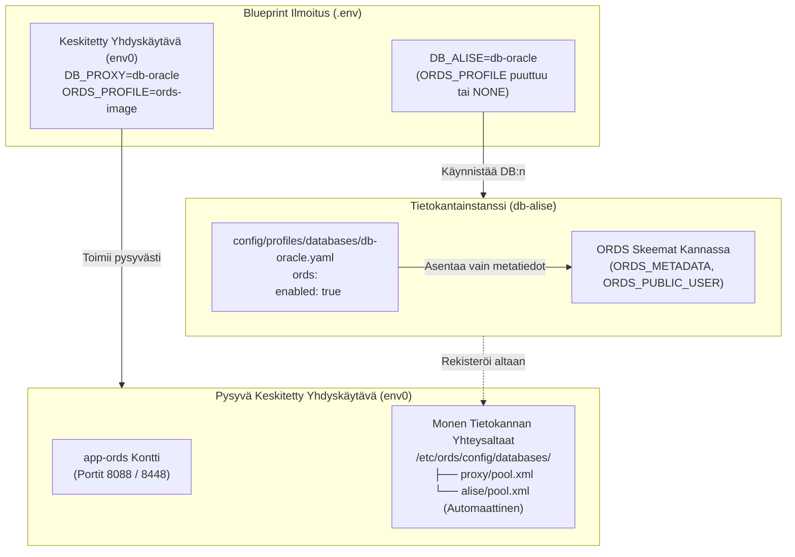

[ 🇬🇧 English ](../ords-profiles-lifecycle.md) | [ 🇪🇪 Eesti ](../et/ords-profiles-lifecycle.md) | [ 🇫🇮 Suomi ](ords-profiles-lifecycle.md) | [ 🇸🇪 Svenska ](../sv/ords-profiles-lifecycle.md) | [ 🇱🇻 Latviešu ](../lv/ords-profiles-lifecycle.md) | [ 🇱🇹 Lietuvių ](../lt/ords-profiles-lifecycle.md)

# 🌐 Oracle REST data services (ORDS) profiilit ja erotettu elinkaariopas

Tämä opas dokumentoi **Oracle REST Data Services (ORDS)** -arkkitehtuurin, elinkaarenhallinnan ja konfiguroinnin paikallisissa konteissa, etäpalvelimilla ja Oracle Autonomous Database (ADB) -pilviympäristöissä.

---

## 🏛️ 1. Erotetun arkkitehtuurin periaatteet

Nykyaikaisessa modulaarisessa arkkitehtuurissa verkkosovellusyhdyskäytävä on erotettu tietokantamoottorista:



### Keskeiset arkkitehtuurisäännöt:
1. **`ords.enabled: true` Tietokantaprofiilissa:**
   - Valmistelee tietokantapuolen ORDS-skeemat, metatiedot (`ORDS_METADATA`) ja proxy-käyttäjät.
   - **EI KÄYNNISTÄ** `app-ords` verkkokonttia.
2. **`ORDS_PROFILE` Blueprintissä:**
   - Määrittää, luodaanko `app-ords` verkkokontti.
   - Jos parametri puuttuu tai sen arvo on `NONE`, tietokanta toimii pelkkänä taustajärjestelmänä ilman verkkokontin muistinkulutusta.
3. **Automaattinen Rekisteröinti Keskitettyyn Yhdyskäytävään:**
   - Kun Blueprint 0 (`env0`) on käynnissä, jokainen uusi tietokanta luo automaattisesti yhteysaltaan `<allas_nimi>.xml` ja lataa sen lennosta keskitettyyn ORDS-konttiin.

---

## 📦 2. Kolme kanonista ORDS-profiilia

Kaikki ORDS-profiilit sijaitsevat hakemistossa `config/profiles/ords/`:

| Profiili | Tiedosto | Tyyppi | Optimointi ja Käyttötarkoitus |
| :--- | :--- | :--- | :--- |
| **`ords-image`** | `config/profiles/ords/ords-image.yaml` | `image` | **Virallinen Oracle OCR Konttikuva.** (`container-registry.oracle.com/database/ords:latest`). Virustorjuntaoptimoitu, nopea käynnistys, ei paikallista purkamista. Suositellaan kehitykseen ja CI/CD:hen. |
| **`ords-local-custom`** | `config/profiles/ords/ords-local-custom.yaml` | `local_custom` | **Paikallinen Mukautettu Skriptiasennus.** Käyttää virallisia paketteja hakemistosta `binaries/ords/`, purettuna tilapäiskontissa. |
| **`ords-remote-custom`** | `config/profiles/ords/ords-remote-custom.yaml` | `remote_custom` | **Etäpalvelimen Yhdyskäytävä.** Yhdistää olemassa olevaan itsenäiseen ORDS-palvelimeen SSH:n tai HTTPS:n kautta. |

---

## ☁️ 3. Oracle autonomous database (ADB) -integraatio

Oracle Autonomous Database (Cloud ADB Serverless) sisältää valmiiksi asennetun ja pilven hallinnoiman ORDS-ympäristön:

```yaml
# config/profiles/databases/db-adb.yaml
ords:
  enabled: true
  install_in_db: false       # ÄLÄ POISTA tai korvaa pilven hallinnoimaa ORDS_METADATA-skeemaa
  verify_version_match: true # Tarkista versioiden yhteensopivuus keskitetyn yhdyskäytävän kanssa
```

---

## 💡 4. Ohjeet jos ORDS-palvelinta ei ole konfiguroitu

Jos käynnistetään tietokanta ilman `ORDS_PROFILE`-määritystä ja keskitetty ORDS ei ole käynnissä:
- Terminaalissa näytetään opastava tila:
  `ℹ️  ORDS Server ei ole konfiguroitu (app-ords puuttuu).`
  `💡 Ohje: Ota verkkoliittymä käyttöön suorittamalla: ./scripts/setup-all.sh --b 0 tai lisää blueprinttiin ORDS_PROFILE=ords-image`

---

## 🚀 5. Pikakomennot

```bash
# 1. Käynnistä pysyvä keskitetty ORDS-yhdyskäytävä:
./scripts/setup-all.sh -b 0

# 2. Käynnistä liiketoimintatietokanta (rekisteröi yhteysaltaan keskitettyyn ORDS:iin):
./scripts/setup-all.sh -b 1

# 3. Tarkista päätepisteet:
./scripts/check-urls.sh
```
