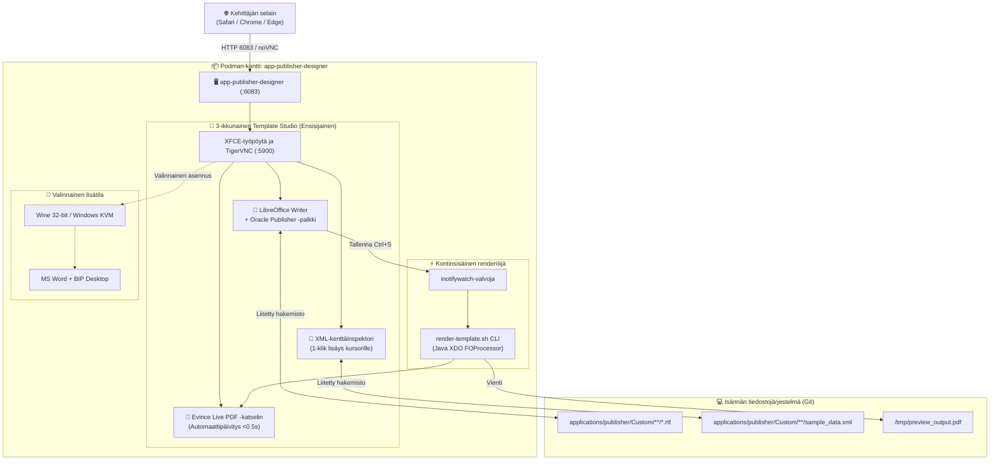
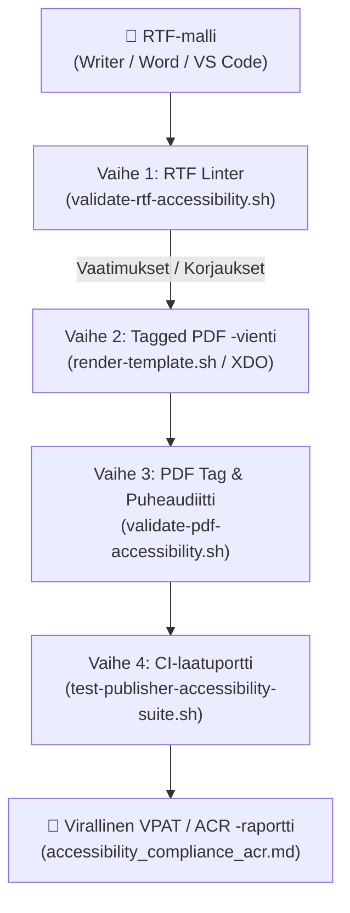

# Oracle Analytics Publisher -mallisuunnittelijan ja saavutettavuuden opas: LibreOffice Writer 3-Pane Studio (Ensisijainen) & MS Word KVM/Wine (Valinnainen)

[ 🇬🇧 English ](../publisher-template-builder-guide.md) | [ 🇪🇪 Eesti ](../et/publisher-template-builder-guide.md) | [ 🇫🇮 Suomi ](publisher-template-builder-guide.md) | [ 🇸🇪 Svenska ](../sv/publisher-template-builder-guide.md) | [ 🇱🇻 Latviešu ](../lv/publisher-template-builder-guide.md) | [ 🇱🇹 Lietuvių ](../lt/publisher-template-builder-guide.md)

---

## 1. Yleiskatsaus ja liiketoimintahyödyt

Pikselintarkkojen asiakirjojen (laskut, lähetteet, talousraportit) suunnittelu Oracle Analytics Publisherissa perustuu **Rich Text Format (RTF) -malleihin**, jotka yhdistetään **XML-tietoihin** saavutettavien ja rakenteellisten PDF-tiedostojen tuottamiseksi.

### 🛑 Ratkaistut yrityshaasteet:
Yritysten IT-ympäristöissä mallien laatijat kohtaavat kriittisiä esteitä:
1. **Ei Microsoft Office -lisenssejä kehitys- ja CI-konteissa:** Yrityslisenssit on sidottu työntekijöiden henkilökohtaisiin tietokoneisiin. CI/CD-automaatio ja kehittäjien Linux-kontit eivät sisällä MS Word -lisenssejä.
2. **Lukitut työasemat (ei pääkäyttäjäoikeuksia):** Kehittäjät eivät voi asentaa lisäohjelmia (`BIPublisherDesktop64.exe`) yrityksen kannettaville.
3. **Monialustaisuus:** **macOS**- tai **Linux**-käyttäjillä ei ole natiivia Word Template Builder -laajennusta.

### 💡 Ratkaisu: LibreOffice 3-Pane Studio (Ensisijainen SSoT):
**`app-publisher-designer`** -kontti (Blueprint 9) tarjoaa käyttövalmiin työaseman suoraan verkkoselaimessa **HTML5 noVNC -yhteydellä portissa 6083** (`http://localhost:6083/vnc.html`):
- **LibreOffice 7.x/24.x Writer (Esikonfiguroitu SSoT):** Sisältää valmiiksi asennetut **⚡ Oracle Publisher** -valikot, työkalupalkit, XML-tunnisteiden lisäyksen ja pikanäppäimet. Ei vaadi kaupallisia lisenssejä.
- **Evince Live PDF -katselin:** Kääntää ja päivittää täytetyn PDF-tiedoston alle 0,5 sekunnissa jokaisen tallennuksen (`Ctrl+S`) jälkeen.
- **Oracle XML -kenttäinspektori:** Visuaalinen XML-puunäkymä yhden klikkauksen kentän lisäyksellä suoraan Writeriin X11-automaation avulla.
- **Kontinsisäinen nopea renderöintimoottori:** Sisäänrakennettu Java Oracle XDO / `FOProcessor` ja komentorivin PDF-vienti.
- **Suora Git-synkronointi:** Studiossa tallennetut mallit tallentuvat suoraan isännän hakemistoon `templates/publisher/`.
- **Valinnainen lisätila:** Microsoft Word Winen tai Windows KVM:n kautta on saatavilla valinnaisena reittinä niille, joilla on tarvittavat 32-bittiset asennuspaketit.

---

## 2. Arkkitehtuuri ja työasematopologia



---

## 3. Pikaopas: LibreOffice Writer 3-Pane Studio (Ensisijainen)

Studio on käyttövalmis heti Blueprint 9:n käynnistyksen jälkeen ilman ulkoisia asennuspaketteja.

### Vaihe 1: Käynnistä suunnittelijakontti
Blueprint 9:n kautta (Suositeltu):
```bash
./scripts/setup-all.sh -b 9
```
Tai erillisellä skriptillä:
```bash
./scripts/publisher/start-designer.sh --lang fi   # Vaihtoehdot: en, et, fi, sv, lv, lt
```

### Vaihe 2: Avaa Template Studio selaimessa
1. Avaa selaimessa `http://localhost:6083/vnc.html`.
2. Kaksoisnapsauta työpöydän kuvaketta **🚀 Oracle Publisher Template Studio**.
3. Studio asettaa automaattisesti 3 ikkunaa vierekkäin:
   - **Vasemmalla (65%):** **LibreOffice Writer** ja aktiivinen malli (`arve_test_standard.rtf`).
   - **Oikealla ylhäällä (35%):** **Evince Live PDF -katselin** näyttäen tiedostoa `valmis_arve.pdf`.
   - **Oikealla alhaalla (35%):** **Oracle XML -kenttäinspektori** näyttäen puurakennetta `arve_test_andmed.xml`.

### Vaihe 3: Suunnittelu ja tunnisteiden lisäys
1. **Oracle Publisher -valikko ja työkalupalkki:**
   - `🏷️ Lisää kenttä`: Lisää `<?TAG_NAME?>` kursorin kohtaan.
   - `🔁 for-each -silmukka`: Ympäröi valitut rivit koodilla `<?for-each:LINES/LINE?> ... <?end for-each?>`.
   - `❓ Ehto (IF)`: Lisää ehtolohkon (`<?if:VAT_RATE > 0?>...<?end if?>`).
   - `⚡ Pikarenderöinti PDF`: Kääntää PDF-tiedoston heti.
2. **1-klikin lisäys XML-inspektorista:**
   - Valitse haluttu solmu puusta ja napsauta **👉 Sisesta Kursorisse** — tunniste syötetään suoraan Writeriin X11-automaation avulla!
3. **Reaaliaikainen esikatselu:**
   - Paina `Ctrl+S` Writerissa. Taustavalvoja kääntää PDF:n uudelleen ja Evince päivittyy alle 0,5 sekunnissa.

### Vaihe 4: Pysäytä kontti muistin vapauttamiseksi
```bash
./scripts/publisher/stop-designer.sh
```

---

## 4. Testaus ja renderöinti kontissa sekä isännässä

Malleja voidaan testata ja kääntää suoraan komentoriviltä avaamatta graafista työpöytää.

### 4.1 Isännän CLI-testirenderöijä (`test-render.sh`)
Skripti tunnistaa automaattisesti, onko `app-publisher-designer` käynnissä:
```bash
# Peruskäyttö:
./scripts/publisher/test-render.sh \
  templates/publisher/samples/arve_test_standard.rtf \
  templates/publisher/samples/arve_test_andmed.xml \
  [tuloste.pdf]

# Monikielinen kääntäminen XLIFF-käännöksellä:
./scripts/publisher/test-render.sh --locale fi
```
- Jos kontti on käynnissä, käännös delegoidaan skriptille `/u01/oracle/bin/render-template.sh` kontin sisällä.
- Jos kontti ei ole käynnissä, käytetään paikallista headless LibreOffice -varakääntäjää.

### 4.2 Suora suoritus kontin sisällä
Renderöinti voidaan käynnistää suoraan kontin sisällä:
```bash
podman exec -it app-publisher-designer /u01/oracle/bin/render-template.sh \
  /u01/templates/samples/arve_test_standard.rtf \
  /u01/templates/samples/arve_test_andmed.xml \
  /u01/templates/samples/valmis_arve_fi.pdf \
  --locale fi
```

### 4.3 Live Watcher & Hot-Reload (`watch-render-host.sh`)
Kun muokkaat malleja paikallisesti tai VS Codessa:
```bash
./scripts/publisher/watch-render-host.sh \
  templates/publisher/samples/arve_test_standard.rtf \
  templates/publisher/samples/arve_test_andmed.xml \
  templates/publisher/samples/valmis_test_arve.pdf
```
- Valvoo RTF-tiedoston muutoksia aikaleimojen avulla.
- Kääntää PDF:n automaattisesti jokaisen tallennuksen jälkeen alle 0,5 sekunnissa.
- Avaa järjestelmän oletuskatselimen automaattisesti.

### 4.4 Monikielinen XLIFF (`.xlf`) -arkkitehtuuri
Yksi RTF-perusmalli (`arve_test_standard.rtf`) tukee kaikkia 6 kieltä virallisten Oracle XLIFF -käännöstiedostojen avulla:
- `arve_test_standard_{et,en,fi,sv,lv,lt}.xlf`

Käännä valitulla kielellä parametrilla `--locale fi`.

---

## 5. Saavutettavuus & PDF/UA-1 -testausprosessi

Kaikkien Oracle Analytics Publisher -asiakirjojen on täytettävä **PDF/UA-1 (ISO 14289-1)**-, **WCAG 2.1 Level AA**-, **Euroopan saavutettavuusdirektiivin (EAA / EN 301 549)** ja **Section 508** -standardit.

### Pakolliset suunnittelusäännöt:
1. **Otsikkohierarkia:** Käytä oikeita tyylejä (`Heading 1` asiakirjan otsikolle, `Heading 2` alaluvuille). Älä koskaan simuloi otsikoita lihavoinnilla.
2. **Taulukon otsikkorivin toisto (`\trhdr`):** Monisivuisissa taulukoissa otsikkorivin on toistuttava jokaisen sivun yläreunassa (*LibreOffice: Taulukon ominaisuudet -> Tekstinkulku -> Toista otsikko*).
3. **Kuvien Alt-teksti:** Jokaisella kuvalla on oltava kuvaava vaihtoehtoinen teksti. Yrityslogot käyttävät dynaamista osoitetta:
   ```text
   url:{concat($IMAGE_DIR, '/company_logo.png')}
   Alt: Yrityksen virallinen logo
   ```
4. **Värikontrasti:** Vähintään suhde **4.5:1** leipätekstille.
5. **Kielitunniste:** Luodun PDF-tiedoston on ilmoitettava koodi `/Lang` (`fi-FI`, `et-EE` jne.).

### Saavutettavuuden 4-vaiheinen testauskulku:



#### Vaihe 1: RTF-rakenteen tarkistus
Suorita linter ennen kääntämistä:
```bash
./scripts/publisher/validate-rtf-accessibility.sh templates/publisher/samples/accessible_starter_template.rtf --strict
```

#### Vaihe 2: Merkityn saavutettavan PDF:n vienti
Renderöinnin aikana moottori lisää vaaditut PDF-rakenteet: `/StructTreeRoot`, `/MarkInfo << /Marked true >>` ja `/Lang (fi-FI)`.

#### Vaihe 3: PDF-tunnisteiden ja ruudunlukuohjelman puhesimulaatio
```bash
./scripts/publisher/validate-pdf-accessibility.sh templates/publisher/samples/valmis_arve_fi.pdf
```
Tarkistaa otsikot (`/H1`), taulukon rakenteen (`/Table`, `/TH`, `/TD`) ja kuvien Alt-tekstit.

#### Vaihe 4: Automaattinen CI-testipaketti & ACR-raportti
```bash
./tests/integration/test-publisher-accessibility-suite.sh
```
Luo virallisen **Saavutettavuusraportin (VPAT / ACR)** tiedostoon:
[`tests/reports/accessibility_compliance_acr.md`](../../tests/reports/accessibility_compliance_acr.md).

Täydelliset ohjeet löydät erikoistuneesta oppaasta:
👉 [`.agents/skills/oracle_publisher_accessibility/SKILL.md`](../../.agents/skills/oracle_publisher_accessibility/SKILL.md).

---

## 6. Kehittäjän työskentely: VS Code & GitHub Copilot

1. Copilot lukee automaattisesti ohjeita tiedostoista [`.github/copilot-instructions.md`](../../.github/copilot-instructions.md) ja [`templates/publisher/COPILOT_INSTRUCTIONS.md`](../../templates/publisher/COPILOT_INSTRUCTIONS.md).
2. Käynnistä live-valvoja: `./scripts/publisher/watch-render-host.sh`.
3. Muokkaa mallia ja tallenna (`Cmd+S`) nähdäksesi päivitykset välittömästi.

---

## 7. Valinnainen: MS Word & BIP Desktop Winen tai Windows KVM:n kautta

Jos organisaatiollasi on voimassa olevat lisenssit:
1. Kopioi 32-bittiset asennusohjelmat hakemistoon `binaries/publisher/`: `setup.exe` ja `BIPublisherDesktop32.exe`.
2. Suorita `./scripts/publisher/setup-word-designer.sh`.

---

## 8. Mallisyntaksin pikaviite

| Toiminto | Oracle BI Publisher RTF Tag | Kuvaus |
| :--- | :--- | :--- |
| **Kenttä** | `<?INVOICE_NUM?>` | Tulostaa XML-elementin arvon |
| **Toistorivit** | `<?for-each:G_LINES?>` ... `<?end for-each?>` | Käy läpi rivielementit |
| **Ehto** | `<?if:VAT_RATE > 0?>` ... `<?end if?>` | Näyttää lohkon vain ehdon täyttyessä |
| **Luvun muotoilu** | `<?format-number(TOTAL, '#,##0.00')?>` | Muotoilee valuutat ja desimaalit |
| **Otsikon toisto** | `\trhdr` | Pakollinen PDF/UA-1-taulukoille |
| **Asiakirjan otsikko** | Tyyli `Heading 1` | Pakollinen H1-tunniste ruudunlukuohjelmille |

---

## 9. Yritystason GitOps-standardi (`applications/publisher/`), REST-julkaisu ja CI/CD-putki

Varmistaakseen yritystason luotettavuuden ja saumattoman CI/CD-automaation kaikki mallit ja tietomallit hallitaan hakemistossa `applications/publisher/`, joka vastaa Oracle Analytics Publisher -palvelimen luetteloa 1:1 (`/Custom/<Toimialue>/<Raportti>/`).

### 9.1 Hakemistorakenne ja GitOps-säännöt

```text
applications/publisher/
├── .gitignore                         # Sulkee pois binääriset *.xdoz ja *.xdmz arkistot
├── README.md                          # Dokumentaatio (6 kieltä: EN, ET, FI, SV, LV, LT)
└── Custom/
    └── Invoices/
        └── Invoice_Report/
            ├── Invoice_Report.xdo/       # Git-seurattu raporttipaketti
            │   ├── template.rtf          # Saavutettava PDF/UA-1 RTF-malli
            │   ├── template_et.xlf       # Vironkieliset XLIFF-käännökset
            │   ├── template_fi.xlf       # Suomenkieliset XLIFF-käännökset
            │   └── _manifest.xml         # Publisher-raportin manifesti
            └── Invoice_DataModel.xdm/    # Git-seurattu tietomallipaketti
                ├── datamodel.sql         # Puhas SQL-tiedonkeruukysely
                ├── datamodel.xml         # Tietomalli XML (sidottu ALISE_APP_DB-lähteeseen)
                └── sample_data.xml       # Esimerkkitiedot testaukseen
```

### 9.2 Komentorivityökalut (CLI)

1. **Luo uusi raportti:**
   ```bash
   ./scripts/publisher/create-report.sh Custom/Invoices/Packing_Slip "Lähetysluettelo"
   ```
2. **Julkaise palvelimelle (REST API / Copy):**
   ```bash
   ./scripts/publisher/deploy-template.sh Custom/Invoices/Invoice_Report --mode rest
   ```
3. **Julkaise välittömällä palvelimen testitulostuksella:**
   ```bash
   ./scripts/publisher/deploy-template.sh Custom/Invoices/Invoice_Report --render
   ```

### 9.3 Roolit ja SEPS Wallet -kierrätys

| Käyttäjä | WebLogic-ryhmä | SEPS Wallet Alias | Oikeudet |
| :--- | :--- | :--- | :--- |
| `bip_developer` | `XMLP_DEVELOPER`, `XMLP_TEMPLATE_DESIGNER` | `PUBLISHER_DEVELOPER` | Mallien ja tietomallien kehitys `/Custom/` |
| `bip_user` | `XMLP_SCHEDULER`, `XMLP_ANALYZER` | `PUBLISHER_USER` | Tulosteiden ajo ja historiatiedot |
| `bip_admin` | `XMLP_ADMIN` | `PUBLISHER_ADMIN` | BIP-luettelon hallinta (ei WebLogic-konsolia) |

Salasanojen kierrätys:
```bash
./scripts/rotate-password.sh publisher dev     # Kierrättää bip_developer salasanan
./scripts/rotate-password.sh publisher user    # Kierrättää bip_user salasanan
./scripts/rotate-password.sh publisher admin   # Kierrättää bip_admin salasanan
```

### 9.4 GitHub Actions CI/CD Tyyppikaavio (`.github/workflows/deploy-publisher-reports.yml`)

```mermaid
sequenceDiagram
    autonumber
    actor Dev as 👨‍💻 Julkaisuvastaava<br/>(Kehittäjä / Ylläpitäjä)
    participant GHA as ⚙️ GitHub Actions Runner<br/>(deploy-publisher-reports)
    participant QG as 🧪 CI Laatuportit<br/>(Linter & Test-Render)
    participant Art as 📦 GitHub Artifacts<br/>(Ladattava PDF)
    participant Sec as 🔑 Salaisuuksien hallinta<br/>(GitHub Secrets / OIDC)
    participant Pub as 🏢 Publisher-palvelin<br/>(:9502 REST API)

    Dev->>GHA: 1. Käynnistä workflow_dispatch<br/>(ympäristö: dev/test/prod, raportin polku)
    activate GHA

    rect rgb(30, 41, 59)
        Note over GHA,QG: Automaattiset laatuportit ennen julkaisua
        GHA->>QG: 2. XML- ja SQL-syntaksin tarkistus<br/>(xmllint datamodel.xml)
        QG-->>GHA: ✅ Syntaksi vahvistettu
        GHA->>QG: 3. RTF-saavutettavuustarkastus<br/>(PDF/UA-1, \trhdr, H1/H2, Alt-teksti)
        QG-->>GHA: ✅ Saavutettavuusvaatimukset täytetty
        GHA->>QG: 4. Testitulostus ilman käyttöliittymää<br/>(sample_data.xml avulla)
        QG-->>GHA: ✅ Testi-PDF luotu
        GHA->>Art: 5. Lataa testi-PDF artefaktina<br/>(actions/upload-artifact@v4)
        Art-->>Dev: 👁️ PDF ladattavissa GitHubista
    end

    rect rgb(15, 23, 42)
        Note over GHA,Pub: Julkaisu palvelimelle (REST API)
        GHA->>Sec: 6. Hae tunnistetiedot (OAuth2 Bearer<br/>tai bip_developer salasana)
        Sec-->>GHA: 🔑 Suojattu valtuutusotsikko
        GHA->>Pub: 7. POST /xmlpserver/services/rest/v1/reports<br/>(deploy-template.sh --mode rest)
        Pub-->>GHA: HTTP 200 / 201 Created (Idempotentti)
        
        opt Jos test_render valittu
            GHA->>Pub: 8. POST /reports/{path}/run (Palvelimen renderöinti)
            Pub-->>GHA: 📑 Palvelimen virallinen PDF
        end
    end

    GHA->>Dev: 9. Julkaise $GITHUB_STEP_SUMMARY<br/>(Yhteenveto ja raporttilinkit)
    deactivate GHA
```



