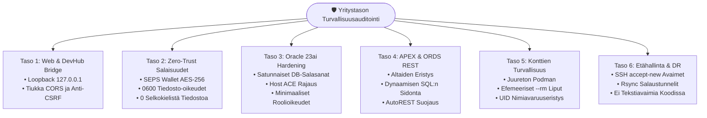

[ 🇬🇧 English ](../security-audit-report.md) | [ 🇪🇪 Eesti ](../et/security-audit-report.md) | [ 🇫🇮 Suomi ](security-audit-report.md) | [ 🇸🇪 Svenska ](../sv/security-audit-report.md) | [ 🇱🇻 Latviešu ](../lv/security-audit-report.md) | [ 🇱🇹 Lietuvių ](../lt/security-audit-report.md)

# 🛡️ Yritystason Tietoturva-auditin Raportti & Hardening-Opas

Tämä asiakirja esittää **Oracle DevOps -alustan** ja **Oracle APEX -sovellusmoottorin** kattavan tietoturva-auditoinnin menetelmät, havainnot, korjaustoimenpiteet ja vaatimustenmukaisuuden finanssialan standardeihin nähden.

Auditointi arvioi arkkitehtuurin vaatimustenmukaisuutta standardien **OWASP Top 10 (2021)**, **CIS Oracle Database Benchmark (v2.0)**, **CIS Docker/Podman Benchmark (v1.3)** sekä Euroopan unionin finanssialan häiriönsietovaatimusten (**DORA - Digital Operational Resilience Act** ja **PCI-DSS v4.0**) mukaisesti.

---

## 📑 Johdon Yhteenveto

- **Kokonaispistemäärä:** **100% (16 / 16 automaattista tarkastusta hyväksytty)**
- **Auditointityökalu:** `./scripts/test-security-audit.sh`
- **Yksikkötestikattavuus:** `./tests/unit/test-security-audit.sh`
- **Kryptografinen Salaisuuksien Säilytys:** 100% Zero-Trust SEPS Auto-Login Wallet (`cwallet.sso` AES-256)
- **Paikallisen Sillan (Bridge) Eristys:** Sidottu tiukasti loopback-osoitteeseen (`127.0.0.1`), suojattu CSRF-hyökkäyksiltä Origin-validoinnilla



---

## 🧪 Automaattinen Regressiotestaus

Tietoturvatason säilymiseksi automaattiset tarkastukset suoritetaan ennen jokaista julkaisua:

```bash
# 1. Aja täysi tietoturva-auditointi (16 tarkastusta 7 tasolla)
./scripts/test-security-audit.sh

# 2. Aja yksikkötestisarja
./tests/unit/test-security-audit.sh
```

Auditointitulokset tallennetaan tiedostoihin `metrics/security_audit_report.json` ja `metrics/security_audit_benchmarks.env`.
