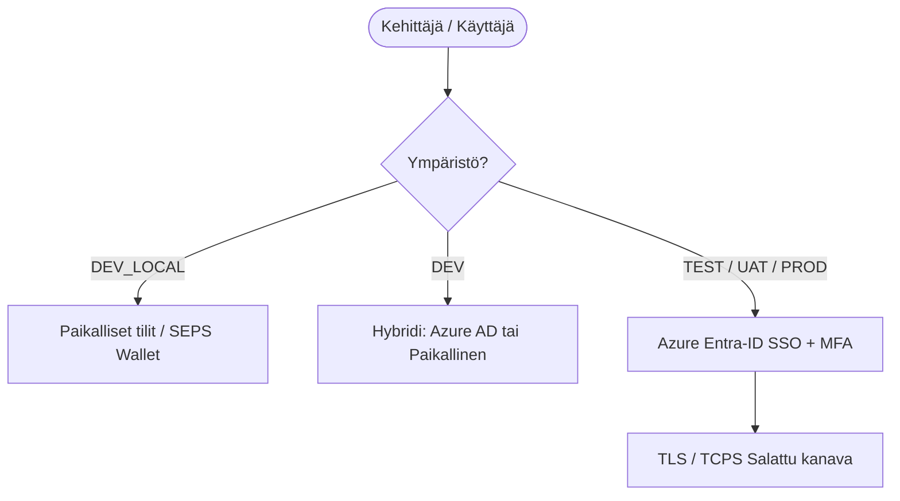

[ 🇬🇧 English ](../security.md) | [ 🇪🇪 Eesti ](../et/security.md) | [ 🇫🇮 Suomi ](security.md) | [ 🇸🇪 Svenska ](../sv/security.md) | [ 🇱🇻 Latviešu ](../lv/security.md) | [ 🇱🇹 Lietuvių ](../lt/security.md)

# 🛡️ Oracle Free DB & APEX tietoturva ja SSO-arkkitehtuuri

Tämä asiakirja kokoaa yhteen alustan tietoturvaperiaatteet, salasanojen hallinnan, kehittäjäroolit sekä pilvipohjaisen kertakirjautumisen (SSO / Azure Entra-ID) arkkitehtuurin.

---

## 1. Paikallinen salaisuuksien hallinta (zero-trust - sääntö 5)

Kaikki salasanat ja salaisuudet säilytetään AES-256-salatussa **Oracle SEPS (Secure External Password Store) Auto-Login Walletissa** (`cwallet.sso`).

- **Selkokielisten Tiedostojen Kielto:** Salasanoja ei koskaan kirjoiteta levylle selkokielisenä (ei `.json`-, `.txt`-, `.env`- tai `.cache`-tiedostoja).
- **Muistipohjainen Purkaminen:** Salasanat puretaan dynaamisesti muistiin tarpeen mukaan komennolla:
  ```bash
  ./scripts/get-password.sh <alias>
  ```
- **Vähimpien Oikeuksien Roolit:** Jokaiselle tietokannalle luodaan standardoidut tilit:
  - `DBA_ADMIN`: Hallinnolliset DDL/DML-tehtävät (`DBA`-rooli).
  - `DEV`: Päivittäinen kehitystili Oracle 23ai `DB_DEVELOPER_ROLE` -roolilla.
  - `APP`: Sovellusobjektien ja ajonaikainen tili (`CREATE SESSION`, `RESOURCE`).
  - `VIEWER`: Vain lukuoikeudet omaava tili (`READ ANY TABLE`).

---

## 2. Ympäristöjen autentikointimatriisi

| Ympäristö (`ENVIRONMENT_TYPE`) | Sijainti | Autentikointityyppi (APEX & DB) | Käyttäjien Hallinta | TLS-Salaus (TCPS) |
| :--- | :--- | :--- | :--- | :--- |
| **`DEV_LOCAL`** | Paikallinen Kehityskone | Paikalliset SEPS Wallet -tilit | Automaattinen / `create-developer.sh` | Valinnainen (Offline) |
| **`DEV`** | Jaettu Kehityspalvelin | Hybridi (Paikallinen + **Azure AD**) | Azure AD + JIT / Paikallinen | Valinnainen |
| **`TEST`** | Testipalvelin (CI/CD) | **Azure Entra-ID (SSO)** | Keskitetty (Azure AD -ryhmät) | Kyllä (Portti 2484) |
| **`UAT`** | Esituotantopalvelin | **Azure Entra-ID (SSO)** | Keskitetty (Azure AD -ryhmät) | Kyllä (Portti 2484) |
| **`PROD`** | Tuotantopalvelin | **Azure Entra-ID (SSO)** | Keskitetty (Azure AD -ryhmät) | Kyllä (Portti 2484) |



---

## 3. Mukautuva 5-tasoinen TLS/HTTPS-moottori

Verkkopalvelut (ORDS, APEX, Analytics Publisher) käyttävät mukautuvaa 5-tasoista sertifikaattihierarkiaa ilman pääkäyttäjäoikeuksia (`scripts/internal/resolve-tls-mode.sh`):

```text
config/certs/
├── custom/          # Taso 0: Käsin lisätyt sertifikaatit (tls.crt, tls.key)
├── public/          # Taso 1: Julkinen FQDN & Let's Encrypt / Julkinen CA
├── corp/            # Taso 2: Yrityksen Sisäinen PKI (corp_cert.crt)
├── user_ca/         # Taso 3: Paikallinen Juuri-CA (käyttäjän avainnipussa, 0-admin)
└── self_signed/     # Taso 4: Dynaamisesti luotu itseallekirjoitettu varajärjestelmä
```

---

## 4. Kertakirjautuminen (SSO)

- **Tietokantatason SSO:** Oracle 23ai tukee natiivisti Azure AD OAuth2 -tunnuksia ja globaaleja rooleja.
- **ORDS & REST API:** ORDS validoi saapuvat Bearer JWT -tunnukset Azure AD:n julkisia avaimia vasten.
- **APEX-Sovellusten SSO:** Sovellukset käyttävät Social Sign-In -toimintoa (OpenID Connect) automaattisella käyttäjien luonnilla ja ryhmäkartoituksella.
