[ 🇬🇧 English ](../setup-all-workflow.md) | [ 🇪🇪 Eesti ](../et/setup-all-workflow.md) | [ 🇫🇮 Suomi ](setup-all-workflow.md) | [ 🇸🇪 Svenska ](../sv/setup-all-workflow.md) | [ 🇱🇻 Latviešu ](../lv/setup-all-workflow.md) | [ 🇱🇹 Lietuvių ](../lt/setup-all-workflow.md)

# Asennusprosessin vuokaavio ja arkkitehtuurivaiheet (setup-all.sh)

Tämä asiakirja kuvaa alustan keskeisen asennusskriptin `./scripts/setup-all.sh` elinkaaren, päätöskohdat ja optimointilogiikan.

---

## 📊 Vuokaavio (Flowchart)

> [!TIP]
> Jos Markdown-lukijasi ei tue graafista Mermaid-kaaviota, katso tallennettu kuva täältä:

```mermaid
flowchart TD
    Start([Käynnistys: setup-all.sh]) --> LoadConfig[1. Lataa asetukset .env-tiedostosta]
    LoadConfig --> CheckArgs{"Tarkista komentorivin<br/>argumentit"}
    
    CheckArgs -->|--force / -y| NonInteractive[Automaattitila:<br/>Ohita vahvistukset]
    CheckArgs -->|Oletus| Interactive[Pyydä vahvistus ja<br/>tarkista levytila]
    
    NonInteractive --> CheckSQLcl
    Interactive --> CheckSQLcl
    
    CheckSQLcl{"Onko paikallinen SQLcl<br/>ja Java saatavilla?"}
    CheckSQLcl -->|Kyllä| LocalSQLcl[Käytä paikallista<br/>run_sqlcl wrapperia]
    CheckSQLcl -->|Ei| EphemeralSQLcl["Fallback: Käytä väliaikaista<br/>SQLcl-konttia (SQLCL_CONTAINER_IMAGE)"]
    
    LocalSQLcl --> Step1[Vaihe 1: Tarkista ja lataa konttikuvat]
    EphemeralSQLcl --> Step1
    
    Step1 --> Step2{"Onko ORDS zip<br/>jo ladattu?"}
    Step2 -->|Kyllä| SkipORDSDownload[Ohita ORDS-lataus]
    Step2 -->|Ei| DownloadORDS[Lataa ORDS zip .env-osoitteesta]
    
    DownloadORDS --> Step3{"Onko APEX zip<br/>muuttunut tai puuttuu?"}
    SkipORDSDownload --> Step3
    
    Step3 -->|Ei| SkipAPEXUnzip[Ohita purku merkkitiedoston perusteella]
    Step3 -->|Kyllä| UnzipAPEX[Pura APEX zip hakemistoon apex/]
    
    UnzipAPEX --> Step4["Vaihe 4: Generoi Podman Secrets<br/>(/run/secrets/) ja käynnistä compose"]
    SkipAPEXUnzip --> Step4
    
    Step4 --> WaitDB{"Odota, kunnes db-apex-proxy<br/>on healthy"}
    WaitDB --> Step45["Vaihe 4.5: Rekisteröi tunnukset<br/>Oracle SEPS Walletiin (cwallet.sso)"]
    
    Step5[Vaihe 5: Odota ORDS-käynnistystä]
    Step45 --> Step5
    
    Step5 --> Step6{"Tarkista: Onko APEX<br/>jo tietokannassa?"}
    Step6 -->|Kyllä, sama versio| SkipAPEXInstall[Ohita APEX-moottorin asennus]
    Step6 -->|Ei tai vanha| InstallAPEX["Asenna APEX (zip kopioidaan<br/>ja puretaan kontin sisällä)"]
    
    InstallAPEX --> CheckPatch{"Onko APEX Patch<br/>jo asennettu?"}
    SkipAPEXInstall --> CheckPatch
    
    CheckPatch -->|Kyllä| SkipPatch[Ohita Patch]
    CheckPatch -->|Ei, zip löytyi| ApplyPatch[Asenna Patch catpatch.sql:llä<br/>ja päivitä ORDS-kuvat]
    
    ApplyPatch --> Step7[Vaihe 7: Alusta skeemat<br/>ja suorita Liquibase-migraatiot]
    SkipPatch --> Step7
    
    Step7 --> Step8{"Onko --no-monitor-app<br/>määritetty?"}
    Step8 -->|Kyllä| SkipApps[Ohita sovellusten asennus]
    Step8 -->|Ei, tiedostot löytyi| DeployApps[Asenna valmiit APEX-sovellukset]
    
    DeployApps --> CreateTestUsers["Luo testikäyttäjät: TEST_DEV<br/>(ORDS.ENABLE_SCHEMA) & TEST_WEB_USER"]
    SkipApps --> CreateTestUsers
    
    CreateTestUsers --> TrustCert{"Tunnista käyttöjärjestelmä<br/>varmenteen luottamukselle"}
    
    TrustCert -->|macOS| TrustMac["Sudo keychain: security add-trusted-cert"]
    TrustCert -->|Windows / Git Bash| TrustWin["Käyttäjän säilö: certutil -user -store Root"]
    TrustCert -->|WSL| TrustWSL["WSL/Windows: certutil.exe (wslpath:n kautta)"]
    TrustCert -->|--force / Muu OS| SkipTrust[Ohita varmenteen lisäys]
    
    TrustMac --> SaveMetrics[Tallenna kesto metrics/<br/>setup_benchmarks.json -tiedostoon]
    TrustWin --> SaveMetrics
    TrustWSL --> SaveMetrics
    SkipTrust --> SaveMetrics
    
    SaveMetrics --> End([Valmis: Ympäristö käyttövalmis, salasanat salattu Oracle SEPS Walletissa])
```

> 

---

## 💡 Arkkitehtuuriset periaatteet ja työvaiheet:

1. **Turvallinen salasanojen hallinta (Podman Secrets Bootstrap -> Oracle SEPS Wallet Runtime):**
   * **Ensikäynnistys (Bootstrap):** Konttien ensikäynnistyksessä `generate-passwords.sh` luo uniikit satunnaissalasanat muistipohjaiseen **Podman Secrets** -säilöön (`/run/secrets/`). Koodissa ei käytetä kovakoodattuja oletussalasanoja.
   * **Pysyvä tallennus (Runtime):** Vaiheessa 4.5 `create-wallet.sh` rekisteröi kaikki tunnukset (`ADMIN`, `DB_APEX_PROXY_SYS`, `DB_TEST_DEV`, `TEST_WEB_USER`) salattuun **Oracle SEPS Walletiin** (`ewallet.p12` / `cwallet.sso`). Työkalut lukevat salasanat dynaamisesti muistiin (`./scripts/get-password.sh <ALIAS>`).
2. **Automaattinen ORDS & SQL Developer Web -aktivointi (`TEST_DEV`):**
   * `TEST_DEV`-käyttäjälle myönnetään Oracle ADB -kehittäjäroolit (`CONSOLE_DEVELOPER`, `DWROLE`, `RESOURCE`, `DB_DEVELOPER_ROLE`) ja aktivoidaan ORDS REST / Database Actions -liittymä (`ORDS.ENABLE_SCHEMA` polulla `test_dev`).
   * Kehittäjät voivat kirjautua välittömästi osoitteessa `https://localhost:8443/ords/test_dev/_sdw/`.
3. **Älykäs SQLcl Fallback (väliaikainen CLI-kontti):**
   Skripti tarkistaa paikallisen Javan ja SQLcl:n saatavuuden. Jos ne puuttuvat, skripti reitittää komennot **väliaikaisen SQLcl-kontin** (`SQLCL_CONTAINER_IMAGE`) kautta `--rm`-lipulla.
4. **Täysi idempotenssi (Idempotent Setup):**
   * **APEX-moottori:** Skripti tarkistaa tietokannan tilan. Jos APEX (versio 26.1.2) on jo asennettu, asennus ohitetaan (säästää ~5 minuuttia).
   * **APEX Patch:** Jos bundle patch on jo ajettu, `catpatch.sql`-suoritus ohitetaan.
   * **ORDS:** Jos ORDS-skeema on jo alustettu samoilla asetuksilla, sitä ei asenneta uudelleen.
5. **Virustorjunnan ja I/O:n optimointi:**
   Suuria asennuspaketteja (APEX) ei koskaan pureta isäntäkoneen levylle. Zip-arkisto siirretään suoraan kontin tiedostojärjestelmään (`/tmp/`) ja puretaan siellä.
6. **Automaattinen SSL-varmenteen luottamus:**
   Paikallinen HTTPS luottaa itseallekirjoitettuun juurivarmenteeseen (`Local Dev Root CA`), joka rekisteröidään käyttöjärjestelmän luotettujen varmenteiden säilöön (macOS Keychain, Windows `certutil`, WSL interop).

---

## ❓ Liittyvät ohjeet ja resurssit

- Vianmääritys, OOM-virheet, porttiristiriidat ja pikapalautus: [UKK (FAQ)](faq.md).
- Viralliset Oracle Container Registry -kuvat ja lataukset: [Oracle-resurssit ja lataukset](oracle-resources-and-downloads.md).
