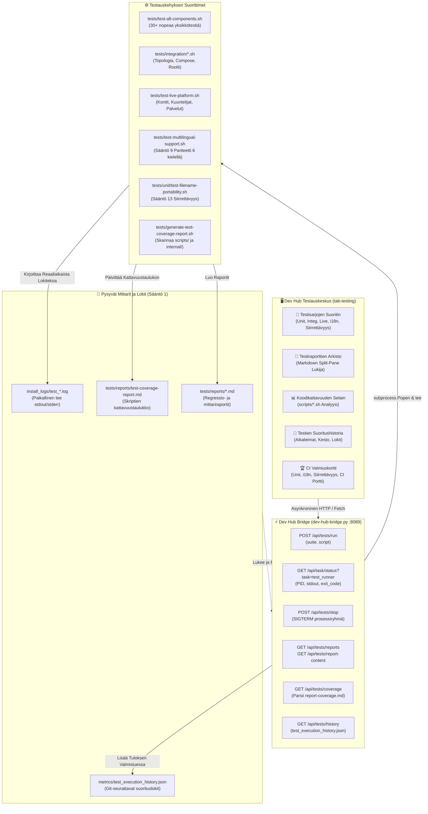

[ 🇬🇧 English ](../testing-framework-and-devhub.md) | [ 🇪🇪 Eesti ](../et/testing-framework-and-devhub.md) | [ 🇫🇮 Suomi ](testing-framework-and-devhub.md) | [ 🇸🇪 Svenska ](../sv/testing-framework-and-devhub.md) | [ 🇱🇻 Latviešu ](../lv/testing-framework-and-devhub.md) | [ 🇱🇹 Lietuvių ](../lt/testing-framework-and-devhub.md)

# 🧪 Testauskehys ja Developer Hub -integraatio

Tämä tekninen opas dokumentoi alustan monitasoisen automatisoidun testausarkkitehtuurin, Developer Hubin (`docs/dev-hub.html`) interaktiivisen **Testauskeskuksen** (`tab-testing`), asynkronisen testien orkestroinnin `dev-hub-bridge.py`-sillan kautta sekä koodikattavuuden seurannan.

---

## 🏛️ 1. Tekninen Arkkitehtuuri ja Komponenttivirta

Testausekosysteemi yhdistää kehittäjän käyttöliittymätoiminnot testiaureihin, reaaliaikaiseen lokitukseen ja Git-seurattuihin mittareihin:

---

## 🚀 2. Testisarjojen Yleiskatsaus

Alusta jakaa laadunvarmistuksen erikoistuneisiin testisarjoihin:

| Sarja | Nimi | Kuvaus | Komento |
| :--- | :--- | :--- | :--- |
| `unit` | **Yksikkötestit** | 29+ nopeaa eristystestiä ilman live-tietokantaa: konfiguraatiot, SEPS-lompakko, syntaksi ja logiikka. | `./tests/test-all-components.sh` |
| `integration` | **Integraatiotestit** | Monitietokantatopologia, compose-ohitusten luonti, profiiliroolit ja yhteystestit. | `tests/integration/*.sh` |
| `live` | **Live E2E -alustatesti** | Täysi regressiotestaus käynnissä oleville konteille, tietokantakuuntelijoille ja verkkopalveluille. | `./tests/test-live-platform.sh` |
| `i18n` | **Monikielisyyspariteetti** | Tiukka Säännön 9 auditointi, joka varmistaa sanaston symmetrian kaikilla 6 kielellä (EN, ET, FI, SV, LV, LT). | `./tests/test-multilingual-support.sh --all` |
| `portability` | **Tiedostonimien Siirrettävyys** | Säännön 13 auditointi: Windows NTFS/FAT -kielletyt merkit, laitenimet ja ASCII-polkustandardit. | `./tests/unit/test-filename-portability.sh` |
| `browser` | **Selain & SSO E2E** | Simuloi selaintoimintoja, APEX-kirjautumista, Dev Hub -pikanäppäimiä ja SSO-todennusta. | `./scripts/test-browser-login.sh` |
| `ci_sim` | **Paikallinen GitHub CI** | Suorittaa tai esikatselee GitHub Actions CI/CD -työnkulkuja ilman verkkoyhteyttä. | `./scripts/test-local-ci.sh --dry-run` |
| `coverage` | **Kattavuusgeneraattori** | Analysoi kattavuuden kansioissa `scripts/` ja `scripts/internal/` ja päivittää markdown-raportin. | `./tests/generate-test-coverage-report.sh` |

---

## 🖥️ 3. Dev Hub Testauskeskus (`tab-testing`)

Developer Hubin testausvälilehti tarjoaa 4 alavälilehteä:

### 3.1 🚀 Testisarjojen Suoritin (`test-subtab-runner`)
- **Sarjakortit**: Mahdollistaa koko sarjan tai alasvetovalikosta valitun yksittäisen skriptin ajamisen yhdellä klikkauksella.
- **Upotettu Reaaliaikainen Pääte**: Pääteikkuna (`#0b0f19`), joka suoratoistaa stdout/stderr-tulostetta reaaliajassa, sisältää automaattisen vierityksen kytkimen, ajastimen, lokin latauksen ja prosessin keskeytyksen (`POST /api/tests/stop`).

### 3.2 📑 Testiraporttien Arkisto (`test-subtab-reports`)
- **Kaksipaneelinen Näkymä**: Vasemmalla listataan raportit (`tests/reports/*.md`) tilatunnisteilla (`PASS`, `FAIL`, `INFO`) ja aikaleimoilla.
- **Renderöity Markdown**: Oikealla näytetään HTML-muotoiltu sisältö aktiivisilla Mermaid-kaavioilla ja kytkimellä raakatekstin tarkasteluun.

### 3.3 📊 Koodikattavuuden Selain (`test-subtab-coverage`)
- **KPI-Yhteenveto**: Visuaalinen edistymispalkki, joka näyttää testattujen skriptien osuuden prosentteina, kokonaismäärän ja testaamattomat skriptit.
- **Interaktiivinen Taulukko**: Listaa kaikki `scripts/*.sh`- ja `scripts/internal/*.sh`-tiedostot ja niihin liittyvät testitiedostot.
- **Suodatus ja Haku**: Nopea tekstihaku ja tilasuodattimet ("Kaikki", "Testatut", "Kattamattomat").
- **Analyysin Päivitys**: Suorittaa skriptin `generate-test-coverage-report.sh` suoraan käyttöliittymästä.

### 3.4 📜 Suoritushistoria (`test-subtab-history`)
- Näyttää tiedostoon `metrics/test_execution_history.json` tallennetut suoritukset.
- Sisältää aikaleiman, sarjan nimen, keston sekunneissa, tulostunnisteen, suoran linkin lokiin `install_logs/test_*.log` sekä **Uudelleensuoritus**-painikkeen.

---

## 🔒 4. Zero-Trust Turvallisuus ja Sääntöjen Noudattaminen

1. **Sääntö 1 (Ajoitus ja Lokitus)**: Jokainen testiajo ohjaa tulosteen automaattisesti tiedostoon `install_logs/test_<suite>_<timestamp>.log` ja tallentaa keston tiedostoon `metrics/test_execution_history.json`.
2. **Sääntö 9 (Monikielisyys)**: Koko käyttöliittymä on käännetty kaikille kuudelle kielelle (EN, ET, FI, SV, LV, LT).
3. **Sääntö 12 (Asynkroninen Tehtävä)**: Testit ajetaan taustalla `subprocess.Popen`-kutsulla ilman selaimen lukittumista tai HTTP-aikakatkaisuja.
4. **Sääntö 13 (Siirrettävyys)**: Kaikki raportti- ja lokitiedostojen nimet käyttävät ASCII kebab-case -muotoa ilman Windows-kiellettyjä merkkejä.
