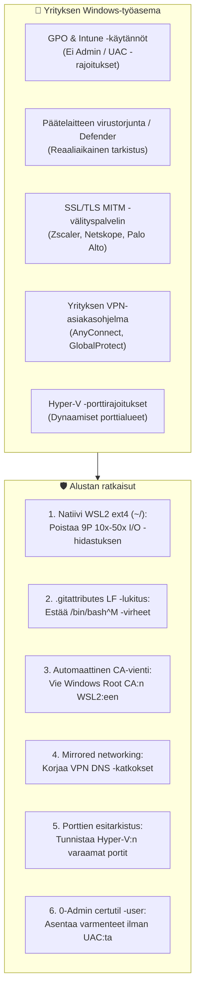

[ 🇬🇧 English ](../windows-enterprise-setup-guide.md) | [ 🇪🇪 Eesti ](../et/windows-enterprise-setup-guide.md) | [ 🇫🇮 Suomi ](windows-enterprise-setup-guide.md) | [ 🇸🇪 Svenska ](../sv/windows-enterprise-setup-guide.md) | [ 🇱🇻 Latviešu ](../lv/windows-enterprise-setup-guide.md) | [ 🇱🇹 Lietuvių ](../lt/windows-enterprise-setup-guide.md)

# Yrityksen Windows & WSL2 -asennus- ja käyttöopas

Tämä opas tarjoaa vaiheittaiset ohjeet **Oracle DevOps -alustan** suorittamiseen **yrityksen hallitsemilla Windows-työasemilla** (Windows 10 / 11 Enterprise, Intune/GPO-hallittu, ilman paikallisia järjestelmänvalvojan oikeuksia, yrityksen proxy/Zscaler ja VPN).

---

## 1. Järjestelmävaatimusmatriisi

| Resurssi | Vähimmäisvaatimus (BP 0 / 1 / 2) | Suositus (BP 5 / 6 / 7 / 8) | Kommentit & perustelut |
| :--- | :--- | :--- | :--- |
| **Suoritin (CPU)** | **4 ydintä (8 säiettä)** x86_64 | **8 ydintä (16 säiettä)** x86_64 | Virtualisoinnin (**VT-x / AMD-V**) on oltava käytössä BIOS/UEFI:ssa. ARM64 (Snapdragon) ei ole tuettu Oracle 23ai -konteille. |
| **Käyttömuisti (RAM)** | **16 GB Host RAM**<br/>*(WSL2: 6 GB)* | **32 GB Host RAM**<br/>*(WSL2: 12–16 GB)* | Windows + Teams + Defender vie 5–6 GB. Oracle Free vaatii 2.5 GB, ORDS 1 GB, WebLogic/Publisher 3–4 GB. 8 GB koneet hidastuvat. |
| **Levytila (Storage)** | **50 GB vapaata tilaa SSD:llä** | **100 GB vapaata tilaa NVMe SSD:llä** | Kuvat vievät yhteensä ~25 GB. Mekaaniset HDD-levyt ovat hitaan I/O:n vuoksi ehdottomasti kiellettyjä. |
| **Käyttöjärjestelmä** | **Windows 10 Enterprise / Pro** (21H2+, Koontiversio 19044+) | **Windows 11 Enterprise** (23H2 / 24H2) | Windows 11 sisältää `mirrored`-verkkotilan ja DNS-tunneloinnin, mikä varmistaa VPN-yhteyden vakauden. |
| **Virtualisointi** | **WSL 2** (Ydin 5.15+) | **WSL 2** (Ydin 6.6+) `systemd`-tuella | Windows-ominaisuudet: `VirtualMachinePlatform` ja `Microsoft-Windows-Subsystem-Linux`. |
| **Konttimoottori** | **Podman Desktop 5.x** tai Podman WSL2:ssa | **Podman 5.x natiivisti WSL2:ssa** | Yrityksessä 100% vapaa ja avoimen lähdekoodin ratkaisu (ei Docker Desktop -lisenssimaksuja). |
| **Git & pääte** | **Git for Windows 2.40+** | **Git for Windows + Windows Terminal** | Vaaditut asetukset: `core.autocrlf=input`, `core.longpaths=true`. |
| **PowerShell** | **Windows PowerShell 5.1** | **PowerShell 7.4+ (Core)** | Tarvitaan käynnistyskomentosarjoille ja varmennetyökaluille. |

---

## 2. Keskeiset yritysrajoitteet ja arkkitehtuuriratkaisut



### 1. Natiivin WSL2-tiedostojärjestelmän invariantti (ÄLÄ käytä `C:\...` / `/mnt/c/`)
- **Vaara:** Koodin suorittaminen Windowsin NTFS-levyltä (`C:\Users\<user>\...`) käynnistää WSL2:ssa Plan9 (9P) -ajurin, joka on **10–50 kertaa hitaampi**. APEX- ja tietokanta-asennus kestää 45–90 minuuttia normaalin 3–5 minuutin sijaan.
- **Sääntö:** Kloonaa koodi aina WSL2:n natiiviin Linux ext4 -tiedostojärjestelmään (`cd ~ && git clone ...`). Windows Explorerissa pääset koodiin käsiksi verkkopolulla `\\wsl$\Ubuntu\home\<user>\...`.

### 2. Rivinvaihdot (CRLF VS LF)
- Kaikki kooditiedostot on lukittu **LF (`\n`)** -rivinvaihdoille `.gitattributes`-tiedostossa. Windowsin `.cmd`- ja `.ps1`-tiedostot käyttävät CRLF:ää.

### 3. Yrityksen Proxy ja zscaler / netskope SSL -tarkastus
- Lähtevä liikenne puretaan yrityksen sisäisellä Root CA:lla. Komento `scripts/wsl/configure-wsl-enterprise.ps1` vie nämä automaattisesti Windowsista WSL2:een.

### 4. VPN DNS -tunnelointi
- Windows 11:ssä määritetään `%USERPROFILE%\.wslconfig` asetuksilla `networkingMode=mirrored` ja `dnsTunneling=true`.

---

## 3. Pikaopas Windows-kehittäjälle vaiheittain

### Vaihe 1: Kloonaa arkisto natiiviin WSL2 ext4 -hakemistoon
Avaa WSL2-pääte (Ubuntu/Debian) ja suorita:
```bash
cd ~
git clone https://github.com/allanlahe/oracle-free-db-in-prod.git
cd oracle-free-db-in-prod
```

### Vaihe 2: Säädä WSL2 & Proxy-varmenteet (kertaluonteinen toimenpide)
Suorita Windows PowerShellissä (vakiokäyttäjän oikeuksin, ylläpitäjää ei tarvita):
```powershell
powershell -ExecutionPolicy Bypass -File scripts\wsl\configure-wsl-enterprise.ps1
```
*Tämä säätää `%USERPROFILE%\.wslconfig`-tiedoston 6–16 GB muistille ja vie varmenteet WSL2:een.*

Ota muutokset käyttöön käynnistämällä WSL uudelleen:
```powershell
wsl --shutdown
```

### Vaihe 2.5: Suorita tuhoamaton dry-run-esitarkistus
Ennen pitkää asennusta varmista ympäristön yhteensopivuus:
Windows Command Promptista:
```cmd
test-windows-dryrun.cmd
```
Tai suoraan WSL2-päätteestä:
```bash
./scripts/test-windows-dryrun.sh --fix
```
*Tämä tarkistaa ~2 sekunnissa 10 kriittistä kohdetta (ext4 vs /mnt/c/, rivinvaihdot, RAM, Hyper-V -portit, TLS-proxy, VPN DNS, rootless Podman ja SEPS Wallet -oikeudet). Valitsin `--fix` korjaa havaitut CRLF-rivinvaihdot automaattisesti.*

### Vaihe 3: Käynnistä alusta
Windows Command Promptista tai Explorerista:
```cmd
setup.cmd -b 0
```
*(Vihje: voit myös ajaa `setup.cmd --dry-run` diagnostiikkaa varten ennen käynnistystä).*

Tai suoraan WSL2-päätteestä:
```bash
./scripts/setup-all.sh -b 0
```

### Vaihe 4: Luota SSL-varmenteeseen Windows-selaimissa (0-Admin)
Välttääksesi selainvaroitukset osoitteissa `https://localhost:8448/ords/` ja `https://localhost:8448/dev-hub.html`:
```cmd
scripts\certs\trust-local-cert.cmd
```
*Tämä tuo paikallisen Root CA:n säilöön `Cert:\CurrentUser\Root` ilman UAC-vahvistusta.*

---

## 4. Ongelmanratkaisu (FAQ)

### K1: `bash: ./scripts/setup-all.sh: /bin/bash^M: bad interpreter`
- **Syy:** Arkisto kloonattiin Windows Gitillä asetuksella `core.autocrlf=true`.
- **Ratkaisu:** Suorita `./scripts/test-windows-dryrun.sh --fix` tai kloonaa uudelleen asetuksella `git config --global core.autocrlf input`.

### K2: Portin sitominen epäonnistuu: `An attempt was made to access a socket in a way forbidden by its access permissions`
- **Syy:** Windows Hyper-V varasi tarvittavan portin (1532 tai 8088).
- **Ratkaisu:** Tarkista varatut alueet: `netsh interface ipv4 show excludedportrange protocol=tcp`. Käynnistä Windows NAT uudelleen tai aja `test-windows-dryrun.cmd`.
