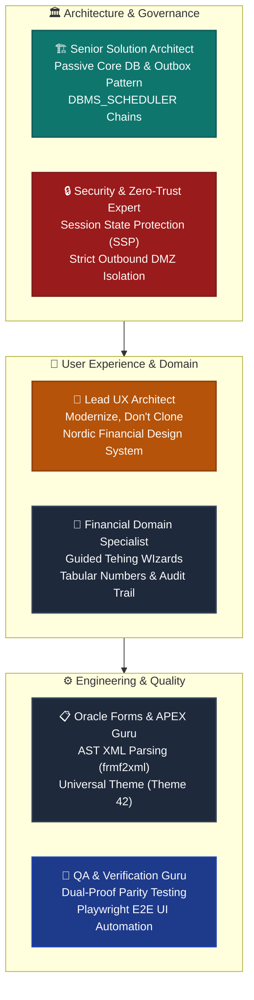
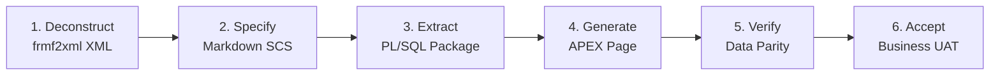

# 🏛️ Enterprise Oracle Forms Modernization: Strategic Master Plan

> **Language Switcher:**  
> [ 🇬🇧 English ](file:///Users/allanlahe/Oracle/oracle-free-db-in-prod/docs/forms-modernization-master-plan.md) | [ 🇪🇪 Eesti ](file:///Users/allanlahe/Oracle/oracle-free-db-in-prod/docs/et/forms-modernization-master-plan.md)

---

## 1. Executive Summary & Vision

This master plan governs the evolutionary modernization of a mission-critical **25-year-old financial core application** comprising approximately **130 Oracle Forms modules** into a modern, responsive, and secure **Oracle APEX** web application.

```
┌──────────────────────────────────────────────────────────────────────────────────────────────────┐
│ CORE TRANSFORMATION PRINCIPLE: EVOLUTION, NOT REWRITE                                           │
├───────────────────────────────────────────────────┬──────────────────────────────────────────────┤
│ ❌ THE ANTI-PATTERN: BIG-BANG REWRITE             │ ✅ THE PROVEN PATH: APEX + CORE DB EVOLUTION │
├───────────────────────────────────────────────────┼──────────────────────────────────────────────┤
│ • Complete rewrite into React/Java from scratch   │ • 80–90% of business logic already in DB     │
│ • 4+ years spent, millions burned, business frozen│ • Forms was only the window into the DB      │
│ • External agencies lack database domain context  │ • APEX directly leverages existing packages  │
│ • Double infrastructure cost & duplicated DR      │ • 0€ additional license fees (included in DB)│
│ • 5–10 years delivery risk                        │ • 10–15 months phased delivery via AI stream │
└───────────────────────────────────────────────────┴──────────────────────────────────────────────┘
```

### Key Starting Foundations
1. **80–90% Business Logic in Database:** Decades of tax rules, calculation algorithms, and business logic already reside in battle-tested PL/SQL packages.
2. **Oracle Analytics Publisher in Place:** Oracle Reports is not used; Publisher generates Pixel-Perfect output and integrates natively with APEX.
3. **Latest APEX and ORDS Installed:** The core database platform is already modern, supported, and ready.
4. **Zero-Trust Enterprise Network Boundary:** The Core Business Database (`Core DB`) is strictly passive and never initiates outbound connections.

---

## 2. The 7-Perspective Expert Audit



### 2.1 🎨 UX Lead: Financial Ergonomics & Design System
- **Modernize, Don't Clone:** Replace legacy, dense 100-field screens with clean **Faceted Search**, **Interactive Grids**, and **Multi-Step Wizards**.
- **Nordic Financial Theme Integration:**
  - Primary Action Yellow: `#FDC92A` (tints `#FBDD91`, `#FFDF88`)
  - Deep Solid Brown: `#2F2424` (navigation, typography, high contrast)
  - Soft Apricot/Sand Surface: `#FBF2EA` / `#F9F8F6`
  - High-contrast financial numbers: Right-aligned with tabular numbers (`font-variant-numeric: tabular-nums`).
  - WCAG 2.1 AA/AAA compliance across all transaction dialogs.
- **Keyboard Productivity:** Preserve keyboard flow (`Tab`, `Enter`, global shortcuts) for high-frequency financial operators.

### 2.2 📋 Oracle Forms Specialist: Deconstruction & Centralization
- **130 Modules Triage:**
  - **Wave 1 (30 forms):** Simple Lookups & CRUD (`SCORE <= 40`).
  - **Wave 2 (60 forms):** Standard Master-Detail Transactions (`SCORE 41–120`).
  - **Wave 3 (40 forms):** Complex Financial Monoliths (`SCORE > 120`).
- **Trigger Transformation:**
  - `POST-QUERY` row queries $\rightarrow$ Consolidated SQL Views.
  - `WHEN-VALIDATE-RECORD` $\rightarrow$ Database constraints and validation procedures.
  - Forms program units $\rightarrow$ Reusable PL/SQL packages.

### 2.3 🔒 Security Expert: Zero-Trust & Passive Core DB
- **Core DB is NOT an Outbound Actor:** Network firewalls strictly prohibit Core DB from initiating external sockets.
- **Session State Protection (SSP):** Enforce strict URL argument checksums (`Checksum: Arguments Must Have Checksum`).
- **Granular Authorization:** Multi-level roles mapped to database permissions; no client-side authorization bypass.

### 2.4 🏗️ Senior Solution Architect: Passive Outbox & Batch Orchestration
- **Transactional Outbox Pattern:** Core DB writes events to `OUTBOX_EVENTS` within the same ACID transaction.
- **DMZ Proxy DB (`db-proxy`):** Runs `DBMS_SCHEDULER` jobs pulling pending outbox events and dispatching to external REST APIs and Kafka clusters.
- **Inbound APIs via ORDS:** External consumers call ORDS, which securely invokes passive stored procedures in Core DB.

### 2.5 🧪 QA Guru: Dual-Proof Data Parity Testing
- **Database MINUS Verification:** Automated comparison script (`diff-forms-apex-data.sh`) comparing table outputs of legacy Forms vs new APEX pages.
- **Playwright E2E Automation:** Headless browser test suite verifying user flows and validation edge cases.

### 2.6 ⚡ Oracle APEX Guru: Universal Theme & Maintainability
- **Native Components Over External Frameworks:** Strictly utilize APEX native Interactive Grid, Forms, and Cards styled via CSS rather than complex external JS wrappers.
- **Seamless Future Upgrades:** Theme Roller styling ensures clean APEX version upgrades without breaking custom code.

### 2.7 💼 Financial Specialist: Trust & Operational Ease
- **Double-Confirmation on Financial Impact:** Explicit confirmation modals before booking ledger entries or triggering batch disbursements.
- **In-App Contextual Help:** Built-in help text on every financial field, accessible offline without external dependencies.

---

## 3. Repositories Architecture (Multi-Repo Separation)

To ensure clean governance, version control, and security boundaries:

```
┌─────────────────────────────────────────────────────────────────────────────────────────────────┐
│ REPOSITORIES TOPOLOGY                                                                           │
├────────────────────────────────┬───────────────────────────────┬────────────────────────────────┤
│ 1. oracle-devops-platform      │ 2. financial-core-db          │ 3. financial-apex-app          │
│ (DevOps, Infrastructure & AI)  │ (Database Schemas & Logic)    │ (APEX UI, Styles & Tests)      │
├────────────────────────────────┼───────────────────────────────┼────────────────────────────────┤
│ • Podman/Docker orchestration  │ • Tables, views, packages     │ • APEX Application source      │
│ • Oracle Forms 14c & frmf2xml  │ • Liquibase changelogs        │ • Nordic Financial theme CSS   │
│ • Migration acceleration tools │ • Transactional Outbox DDL    │ • Playwright E2E test specs    │
│ • Portfolio analyzer scripts   │ • utPLSQL test suites         │ • Offline user help & docs     │
│ • Dev Hub Cockpit              │ • DBMS_SCHEDULER definitions  │ • In-app localized strings     │
└────────────────────────────────┴───────────────────────────────┴────────────────────────────────┘
```

### 100% Offline-First Knowledge Strategy
- **SCS Triad Specs:** Every form module maintains `requirements.md`, `data_dictionary.md`, and `tasks.md` in repository documentation.
- **Determinist Mapping Skills:** Local `.agents/skills/` provide static lookup tables mapping Forms blocks to APEX pages and PL/SQL packages.
- **Offline Help in Database:** In-app help is compiled directly into database tables during release deployment.

---

## 4. The 6-Stage AI Migration Assembly Line

Every single form module passes through an automated 6-stage conveyor:



1. **Stage 1 — Deconstruct:** `scripts/forms/form-to-xml.sh` converts binary `.fmb` to XML AST.
2. **Stage 2 — Specify:** AI summarizes functional rules, constraints, and data flows in Markdown.
3. **Stage 3 — Extract:** `scripts/forms/extract-forms-plsql.sh` isolates embedded triggers into `pkg_<form>_logic.sql`.
4. **Stage 4 — Generate:** AI drafts APEX declarative page with Nordic Financial theme tokens.
5. **Stage 5 — Parity Test:** `scripts/forms/diff-forms-apex-data.sh` verifies 100% data and calculation equality.
6. **Stage 6 — Business UAT:** Domain specialists test ergonomic flow and grant production sign-off.

---

## 5. Timeline & Resource Estimation

### Scenario A: 1 Lead Architect / Orchestrator + AI Accelerator
- **Wave 0 (Preparation & Foundation):** 3–4 weeks (Theme, Outbox framework, 3 pilot forms).
- **Wave 1 (Simple CRUD - 30 forms):** 2 weeks (~3 forms/day).
- **Wave 2 (Master-Detail - 60 forms):** 6–7 weeks (~2 forms/day).
- **Wave 3 (Monoliths - 40 forms):** 8–10 weeks (1–2 days/form).
- **Wave 4 (UAT & Go-Live):** 3–4 weeks.
- **Total Duration:** **5.5 – 7 months**.

### Scenario B: Standard Human Team (Without AI Assembly Line)
- **Team Size:** 1 Lead Architect, 2 Senior APEX Developers, 1 Forms PL/SQL Specialist, 1 QA Automation Engineer, 0.5 UX Designer, 0.5 Business Analyst.
- **Total Duration:** **10 – 14 months**.

---

## 6. Migration Factory Tooling In This Repository

This repository provides ready-to-use acceleration tooling:

| Tool / Asset | Path | Description |
|---|---|---|
| **Portfolio Analyzer** | [`scripts/forms/analyze-forms-portfolio.sh`](file:///Users/allanlahe/Oracle/oracle-free-db-in-prod/scripts/forms/analyze-forms-portfolio.sh) | Analyzes all Forms XMLs, calculates complexity score, and assigns migration waves. |
| **Outbox Core DDL** | [`config/templates/outbox-proxy/01_core_outbox_ddl.sql`](file:///Users/allanlahe/Oracle/oracle-free-db-in-prod/config/templates/outbox-proxy/01_core_outbox_ddl.sql) | Passive Core DB transactional outbox table and publisher package. |
| **Proxy Dispatcher** | [`config/templates/outbox-proxy/02_proxy_poller_chain.sql`](file:///Users/allanlahe/Oracle/oracle-free-db-in-prod/config/templates/outbox-proxy/02_proxy_poller_chain.sql) | DMZ Proxy DB `DBMS_SCHEDULER` chain polling outbox and making outbound calls. |
| **Nordic Theme CSS** | [`assets/themes/nordic-financial/nordic-financial-theme.css`](file:///Users/allanlahe/Oracle/oracle-free-db-in-prod/assets/themes/nordic-financial/nordic-financial-theme.css) | Universal Theme 42 CSS style with official corporate color tokens. |
| **Theme Roller JSON** | [`assets/themes/nordic-financial/theme_roller_nordic_financial.json`](file:///Users/allanlahe/Oracle/oracle-free-db-in-prod/assets/themes/nordic-financial/theme_roller_nordic_financial.json) | 1-click Theme Roller import configuration. |
| **Parity Verifier** | [`scripts/forms/diff-forms-apex-data.sh`](file:///Users/allanlahe/Oracle/oracle-free-db-in-prod/scripts/forms/diff-forms-apex-data.sh) | Automated SQL MINUS verification between Forms and APEX data states. |
| **Interactive Slideshow** | `Dev Hub > Forms Modernization` | 13-slide interactive presentation deck and strategic comparison matrix. |
