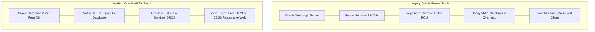
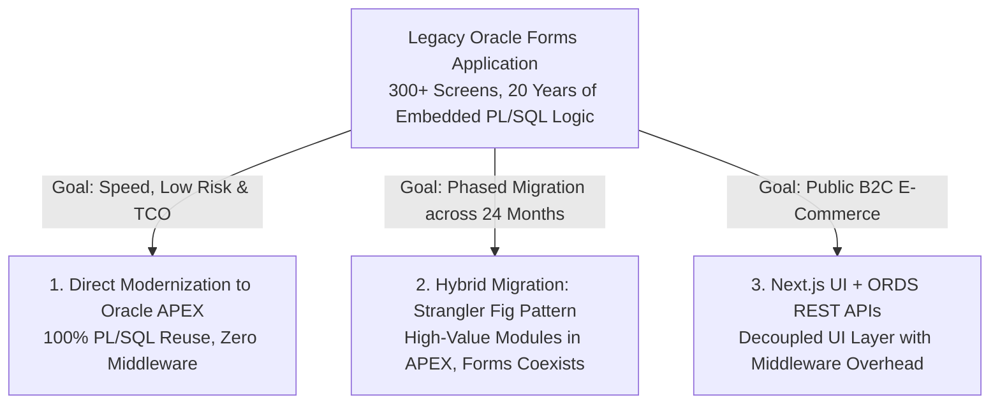
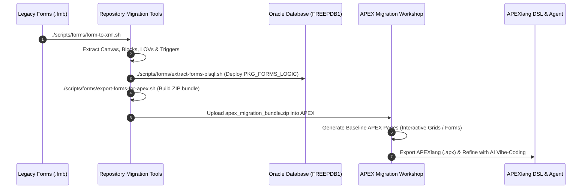

# Oracle Forms & Reports to Oracle APEX Modernization & Migration Guide

[ 🇬🇧 English ](file:///Users/allanlahe/Oracle/oracle-free-db-in-prod/docs/forms-to-apex-migration-guide.md) | [ 🇪🇪 Eesti ](file:///Users/allanlahe/Oracle/oracle-free-db-in-prod/docs/et/forms-to-apex-migration-guide.md) | [ 🇫🇮 Suomi ](file:///Users/allanlahe/Oracle/oracle-free-db-in-prod/docs/fi/forms-to-apex-migration-guide.md) | [ 🇸🇪 Svenska ](file:///Users/allanlahe/Oracle/oracle-free-db-in-prod/docs/sv/forms-to-apex-migration-guide.md) | [ 🇱🇻 Latviešu ](file:///Users/allanlahe/Oracle/oracle-free-db-in-prod/docs/lv/forms-to-apex-migration-guide.md) | [ 🇱🇹 Lietuvių ](file:///Users/allanlahe/Oracle/oracle-free-db-in-prod/docs/lt/forms-to-apex-migration-guide.md)

---

## 1. Executive Summary & The Business Case for 2026

Still running Oracle Forms & Reports in 2026? The primary catalyst driving global enterprises to Oracle APEX is no longer just technological elegance — **it is Total Cost of Ownership (TCO), operational agility, and talent availability.**



### The True Cost of Legacy Forms & Reports
Operating Oracle Forms environments introduces substantial friction:
- ❌ **Heavy Middleware Overhead:** Demands dedicated Oracle WebLogic Server clusters, Node Manager, and RCU schemas.
- ❌ **High Infrastructure Footprint:** Multi-GB RAM allocations per managed server and slow startup times.
- ❌ **Deployment Complexity:** Fragile `.fmx`/`.mmx` binary recompilations across different OS architectures.
- ❌ **Client-Side Friction:** Dependence on Java Web Start, browser plugins, or remote desktop/noVNC bridges.
- ❌ **High Maintenance & Support Costs:** Shrinking talent pool and premium extended support fees.

### The Oracle APEX Advantage
Meanwhile, Oracle APEX runs **natively inside the Oracle Database engine**:
- ✅ **Zero Separate Middleware:** ORDS handles lightweight HTTP/REST routing; APEX executes directly in the SQL/PLSQL kernel.
- ✅ **No Extra Licensing:** Included at no additional cost with your Oracle Database (Free DB, SE2, EE, Autonomous Database).
- ✅ **100% PL/SQL Logic Reuse:** Existing business logic, procedures, packages, and database triggers require zero rewriting.
- ✅ **Modern Responsive UX:** Universal Theme delivers mobile-first, dark mode, accessibility, and desktop ergonomics out-of-the-box.
- ✅ **Cloud & Container Native:** Deploy instantly in lightweight Podman containers, Kubernetes, or OCI.
- ✅ **AI-Assisted Vibe Coding:** Accelerate modernization using APEXlang (`.apx`) declarative DSL and LLM coding agents.

> [!IMPORTANT]
> **The Key Takeaway for Decision Makers:**
> Organizations can modernize their entire core business application portfolio **without rewriting their core database logic**. The question is no longer *"Should we modernize?"*, but *"How much longer can we afford legacy overhead?"*

---

## 2. Why APEX is Superior in Today's Generative AI World: "Low-Code as Code"

*(Inspired by Justin Miller & Cristina Varas, Enterprise Architecture & AI Strategy)*

Low-code development is experiencing a profound paradigm shift: from dragging components in visual web editors to **"Low-Code as Code"**. With Oracle APEX 26.1 and APEXlang, developers can build, validate, and deploy complete, robust enterprise applications from VS Code without dragging a single component onto a screen.

In today’s Generative AI era, there are two fundamentally different ways to build applications with LLMs:

```mermaid
graph TD
  subgraph Option 1: Direct Generation (Imperative Fragility)
    D1[LLM Prompt] --> D2[LLM writes 10,000s of lines of raw code<br/>React, Next.js, Node, Custom Auth, Hand-rolled State]
    D2 --> D3[Massive hallucination risk, missing CSRF,<br/>N+1 queries, unmaintainable PR diffs]
  end

  subgraph Option 2: Indirect Generation (Intent-Driven Abstraction)
    I1[LLM Prompt] --> I2[LLM writes 10 lines of APEXlang DSL<br/>Specifies high-level INTENT: Grid, Form, Facets]
    I2 --> I3[Battle-tested Implementation Engine<br/>Oracle APEX + Database Kernel]
    I3 --> I4[100x Higher Correctness, 1000x Higher Readability,<br/>Guaranteed Session State, Auth & Concurrency]
  end
```

### The SQL Analogy: Why We Don't Generate 100k Lines of C/Java
Everything you can do in SQL could technically be written in C or Java. You don't *need* a database; an LLM could generate a private data storage and file-locking system from scratch (**Option 1: Direct Generation**). 
However, nobody does this. Instead, we write **10 lines of declarative SQL** and let the **RDBMS (Implementation Engine)** handle multi-version concurrency control (MVCC), ACID transactions, buffer cache, B-tree indexes, and table joins (**Option 2: Indirect Generation**).

### The APEXlang Breakthrough (APEX 26.1+)
Data-centric web applications are composed of standard, foundational building blocks: reports, charts, faceted search, modal forms, session-state management, authentication schemes, and row-level authorization.

- **Direct Generation (Option 1):** Asking an LLM to generate thousands of lines of full-stack TypeScript/React/CSS glue creates technical debt, hidden security vulnerabilities, and unreadable code reviews.
- **Indirect Generation (Option 2):** Asking an LLM to generate declarative **APEXlang (`.apx`)** specifies only high-level **intent** (e.g. *Interactive Grid on ORDERS_V with Modal Drawer Form on COMMISSION_TIERS*). The native **Oracle APEX Implementation Engine** executes and secures the components.

| Dimension | Direct Generation (Raw Full-Stack AI) | Indirect Generation (APEXlang + APEX Engine) |
| :--- | :--- | :--- |
| **Code Footprint** | 1,000–10,000 lines of boilerplate & glue | **10–50 lines of declarative `.apx` DSL** |
| **Probability of Correctness** | Moderate (hallucinated edge cases, leaks) | **100x Higher** (Engine guarantees architecture) |
| **Human Readability & Review** | Extremely difficult (huge AI diffs) | **1000x Higher** (Clean, intention-based diffs) |
| **Built-in Security** | Manual (must prompt for CSRF, binds, RLS) | **Automatic** (Session state protection, bind vars) |
| **Long-Term Lifecycle (LCM)** | Severe dependency rot (npm/framework churn) | **Zero Rot** (Engine upgrades preserve app code) |
| **Human-in-the-Loop Governance**| Brittle, opaque AI black-box | **Auditable, versioned, and maintainable** |

### Governed Input vs. Governed Runtime: Inverting the AI Trust Model

*(Inspired by Kris Rice, SVP Software Development, Oracle Database)*

Most developer security articles warning against the risks of "vibe coding" diagnose the same flaws: AI generates raw code that secretly hides SQL injection, broken authentication, or leaked credentials. Their proposed cure is post-generation friction: security scanners, heavy manual audits, and complex review gates.

**Oracle APEX + APEXlang completely inverts this paradigm:**

```mermaid
graph TD
  subgraph Traditional Vibe-Coding (Governed Runtime / Post-Hoc Friction)
    T1[LLM Emits Arbitrary Code] --> T2[Security Flaws & Broken Auth Injected]
    T2 --> T3[High-Friction Scanners, Code Reviews & SAST]
    T3 --> T4[Risk of Production Leaks & Bypasses]
  end

  subgraph APEX + APEXlang (Governed Input / Guardrail at Generation)
    A1[LLM Emits Declarative APEXlang DSL] --> A2[Versioned EBNF Grammar Guardrail]
    A2 --> A3[Parse-Time AST Validation: Invalid Constructs Fail Immediately]
    A3 --> A4[Database Kernel Security: Automatic Binds, Zero Injection, Unbypassable RLS]
  end
```

1. **Published EBNF Grammar as Front-Door Guardrail ([`apexlang.ebnf`](https://docs.oracle.com/en/database/oracle/apex/26.1/apxln/apexlang.ebnf)):** An LLM writing APEXlang does not emit arbitrary procedural source. It emits declarative definitions constrained by a published formal [EBNF grammar](https://docs.oracle.com/en/database/oracle/apex/26.1/apxln/apexlang.ebnf). In local/enterprise inference (e.g. `llama.cpp` GBNF constrained decoding), the model physically cannot emit invalid properties, malformed enums, or unclosed syntax. Invalid syntax fails at parse time in SQLcl, never in production.
2. **Deterministic AST Static Security Analysis:** Security tools and linters walk the Abstract Syntax Tree (AST) rather than brittle regex strings to verify authorization schemes (`@ADMIN_ROLE`), frame embedding (`embedInFrames: deny`), and extended HTML escaping before deployment.
3. **Built-in Platform Immunity:**
   - **SQL Injection:** APEX uses bind variables by default across all regions, forms, and processes.
   - **Authentication:** Standardized declarative schemes enforce SSO/OAuth/DB auth without hand-rolled JWT bugs.
   - **Access Control & Row-Level Security (RLS):** Policies and Virtual Private Database (VPD) rules live in the database kernel *below* the application layer. The AI model can reference them, but can **never** bypass them.

> [!TIP]
> **Governed Input vs. Governed Runtime:**
> You can spend immense engineering effort catching mistakes after an LLM generates them, or you can generate onto a trusted platform that makes most security vulnerabilities impossible by design. Check the official machine-readable [APEXlang EBNF Grammar](https://docs.oracle.com/en/database/oracle/apex/26.1/apxln/apexlang.ebnf).

### Generate What You Want to Own, Own What You Generate
With modern AI agents (Antigravity, Claude Code, Codex), you can generate *any* application; you are limited only by the quality of your prompt. But for enterprise workloads, passing day-1 AI unit tests is not enough:

1. **The Short-Term Trap (Direct AI Generation):** If you generate 10,000 lines of custom full-stack glue, you own every single line. Six months later, npm packages deprecate, security CVEs emerge, and browser APIs evolve, forcing developers into perpetual refactoring cycles.
2. **The Long-Term Enterprise Standard (Model-Driven APEX Engine):** When you generate declarative **APEXlang**, your application code remains pristine and bug-free for years. As Oracle upgrades the APEX and Database engines, your application automatically inherits security hardening, accessibility updates, and performance optimizations **without requiring you to rewrite or re-generate a single line of code**.

> [!TIP]
> **Industry Analysts Perspective (IDC, Blue Badge Insights, KuppingerCole, Constellation Research):**
> Independent software analysts (Carl Olofson, Andrew J. Brust, Alexei Balaganski) highlight three strategic breakthroughs in Oracle's generative AI approach:
> 1. **Open AI Model Ecosystem:** Oracle avoids proprietary AI model lock-in by supporting leading external coding agents (Antigravity AI, Claude Code, Cursor, Codex) via standard MCP protocols.
> 2. **Decoupled Innovation from Technical Debt:** Declarative APEXlang allows rapid AI prototyping while the underlying database runtime guarantees zero long-term dependency decay.
> 3. **Transparent Governance (No Black-Box AI):** Declarative `.apx` structures provide full explainability and human auditability before execution in enterprise databases.

---

## 3. The Modular Monolith Advantage: Avoiding the Microservices Trap

*(Inspired by Anton Martyniuk & Enterprise Architecture Best Practices)*

A common modern trap when modernizing legacy systems (Forms/Reports) is jumping prematurely into distributed microservices architectures under the promise of independent deployments.

```mermaid
graph TD
  subgraph The Distributed Microservices Trap
    M1[100+ Repos & Fragmented CI/CD]
    M2[Network Latency on Every Internal Hop]
    M3[Distributed Transactions & Saga Complexity]
    M4[Data Drift & Eventual Consistency Bugs]
    M1 --- M2
    M2 --- M3
    M3 --- M4
  end

  subgraph The In-Database Modular Monolith (Oracle APEX)
    A1[Single Deployable Unit & Instant Setup]
    A2[In-Memory SQL/PLSQL Execution: Zero Network Latency]
    A3[Native ACID Transactions & Zero Data Drift]
    A4[Instant REST APIs via ORDS AutoREST on Demand]
    A1 --- A2
    A2 --- A3
    A3 --- A4
  end
```

### Microservices Don't Remove Complexity; They Move It to the Network
When organizations rewrite monoliths into 30+ microservices, they trade manageable code complexity for severe operational overhead:
- ❌ Distributed transactions requiring fragile Saga compensation logic.
- ❌ Network latency and serialization overhead on every internal API call.
- ❌ Data drifting out of sync across fragmented document/relational databases.
- ❌ Local development setups taking new engineers a week to configure.

### Oracle APEX: The High-Velocity Modular Monolith
Oracle APEX and Oracle 23ai provide the ideal **Modular Monolith architecture**:
1. **Clean Domain Boundaries:** Isolate domain logic cleanly using database schemas, PL/SQL packages, and APEX applications without paying network taxes.
2. **Native ACID & Multi-Model:** Query Relational tables, JSON Relational Duality Views, and AI Vector Embeddings in a single transactional query with zero data drift.
3. **Pragmatic Service Extraction:** When an external consumer *genuinely* requires an API, enable **ORDS AutoREST (`ORDS.ENABLE_OBJECT`)** in one line of code without tearing down your architecture.

---

## 4. Strategic Decision Framework: APEX vs. Next.js vs. Hybrid Migration

*(Inspired by Marcio Ramo & Wojciech Bielawski, Enterprise Architecture Roundtable)*

When modernizing a 300+ screen Oracle Forms estate, software architects often ask: **"Should we rewrite to Next.js/React or migrate to Oracle APEX?"**



### "Fall in Love with the Problem, Not the Technology" (Domain Knowledge is the Real Asset)

*(Inspired by Simon Martinelli, Creator of AI Unified Process & Oracle ACE Pro)*

In the generative AI era, generating code is fast and cheap. The real competitive advantage and true engineering challenge is **understanding the domain problem, business intent, and system requirements**. 

Legacy Oracle Forms applications embody 15–25 years of refined business domain rules, validation exceptions, and operational edge cases. Software engineering discipline is not about chasing the latest UI framework; it is about building the right solution to a domain problem. When modernizing, the primary goal must be **preserving and honoring that domain knowledge** with the simplest, most direct architecture possible.

### Minimizing Accidental Coupling (Independent Variation Principle)

*(Inspired by Yannick Loth, Software Architect & Creator of IVP)*

Every architectural choice either minimizes or amplifies **accidental coupling**:
- **Accidental Coupling in Middle-Tier Rewrites (Next.js / Node):** Splitting a database-backed domain into a separate frontend framework forces teams to build and maintain accidental plumbing: network serializers, DTO mappings, cross-tier state machines, and duplicate validation logic.
- **Minimal Coupling in Oracle APEX:** Because APEX executes directly in the database kernel against native SQL/PLSQL packages, accidental architectural dependencies are eliminated. Changes to domain tables propagate naturally without cascading across 5 network layers.

### Strategic Decision Matrix

| Dimension | Oracle APEX (In-Database) | Next.js / React (Middle-Tier) | Hybrid Migration (Strangler Fig) |
| :--- | :--- | :--- | :--- |
| **Primary Optimization** | **Speed, Lowest Risk, PL/SQL Reuse** | B2C Consumer UI, Multi-Cloud UI | Risk Mitigation for 100+ screens |
| **Business Logic Reuse**| **100% Direct PL/SQL Package Reuse**| Requires REST API Layer (`ORDS`) | Progressive PL/SQL extraction |
| **Infrastructure Overhead**| **Zero (Runs natively in Oracle DB)** | Requires Node.js / Vercel servers | Zero extra infrastructure |
| **Security & Auth** | **Built-in Session & RLS Protection** | Custom JWT, CORS, CSRF handling | Unified APEX & Database auth |
| **Best Used For** | **Core ERP, CRM, Internal Operations**| **Public Consumer Portals** | **Enterprise Portfolios (300+ Forms)**|

> [!TIP]
> **The Pragmatic Enterprise Path (The Hybrid Strategy):**
> For large portfolios, adopt the **Strangler Fig Pattern**: modernize high-friction, mission-critical modules to **Oracle APEX** first while legacy Forms modules continue operating against the same underlying database schema. Expose clean REST endpoints via **ORDS AutoREST** only where external third-party portals genuinely require them.

---

## 5. Technical Comparison Matrix

| Architectural Feature | Legacy Oracle Forms 14c / 12c | Modern Oracle APEX (23ai / 26.1) |
| :--- | :--- | :--- |
| **Execution Tier** | WebLogic Managed Server (`WLS_FORMS`) | Native Oracle Database Kernel |
| **HTTP Web Gateway** | WebLogic HTTP Server / OHS | Oracle REST Data Services (ORDS) |
| **Client Requirement** | Java Runtime (JRE), Web Start, or noVNC (`6082`) | Zero-footprint HTML5 / CSS3 / JavaScript |
| **User Interface** | Fixed coordinate canvas, non-responsive | Fluid Responsive Universal Theme (Mobile & Desktop) |
| **Licensing** | FMW / WebLogic Suite Licensing | **Included with Oracle Database (No extra cost)** |
| **Startup / Recovery** | 3–6 minutes domain boot | **~5–15 seconds FastStart container boot** |
| **Data Access** | State-heavy SQL*Net sessions | Stateless, pooled database connections |
| **Modern API Integration** | Complex SOAP / Java wrappers | Native REST Workshop & AutoREST (`ORDS.ENABLE_OBJECT`) |

---

## 6. The 5-Stage Migration Blueprint

Our repository provides pre-built automated scripts in [`scripts/forms/`](file:///Users/allanlahe/Oracle/oracle-free-db-in-prod/scripts/forms) to streamline and de-risk the modernization journey.



---

### Stage 1: Inventory & XML Conversion

Oracle APEX cannot parse proprietary binary `.fmb` files directly. Convert binary modules into structured XML:

```bash
# Convert single form module:
./scripts/forms/form-to-xml.sh forms_apps/orders.fmb

# Convert an entire directory of forms:
find forms_apps -name "*.fmb" -exec ./scripts/forms/form-to-xml.sh {} \;
```

This generates `orders.xml`, detailing every block, item, trigger, alert, and canvas coordinate.

---

### Stage 2: Extract & Centralize PL/SQL Business Logic

Forms applications often embed critical business rules inside client-side triggers (`WHEN-BUTTON-PRESSED`, `POST-QUERY`, `KEY-NEXT-ITEM`).

Extract these into clean database packages:
```bash
./scripts/forms/extract-forms-plsql.sh forms_apps/orders.xml
```

This creates `PKG_ORDERS_FORMS_LOGIC.sql`:
```sql
CREATE OR REPLACE PACKAGE BODY PKG_ORDERS_FORMS_LOGIC AS
    -- Extracted from WHEN-BUTTON-PRESSED (BTN_CALCULATE)
    PROCEDURE calculate_totals (
        p_order_id IN orders.order_id%TYPE,
        p_total    OUT NUMBER
    ) IS
    BEGIN
        SELECT SUM(quantity * unit_price)
          INTO p_total
          FROM order_items
         WHERE order_id = p_order_id;
    END calculate_totals;
END PKG_ORDERS_FORMS_LOGIC;
/
```
Deploy this package to your database schema so that APEX can invoke it with zero latency.

---

### Stage 3: Generate the APEX Migration Bundle

Bundle all XML definitions, icon files, and report schemas into a single migration package:

```bash
./scripts/forms/export-forms-for-apex.sh
```
Output: `build/apex_migration_bundle.zip`.

---

### Stage 4: Import into APEX Application Migration Workshop

1. Open **Oracle APEX App Builder** (`http://localhost:8088/ords` or `https://localhost:8448/ords`).
2. Navigate to **App Builder** $\rightarrow$ **Application Migration Workshop**.
3. Click **Create Project** and upload `build/apex_migration_bundle.zip`.
4. Review the analyzed components:
   - **Blocks:** Mapped directly to **Interactive Grids** or **Form Regions**.
   - **Lists of Values (LOV):** Converted to Shared Component LOVs.
   - **Canvases:** Structured into page tabs, drawers, and modal dialogs.
5. Click **Generate Application** to create your baseline modern APEX application.

---

### Stage 5: AI-Driven Refinement with APEXlang DSL & SQLcl MCP

Once the baseline app is generated, export it to APEXlang (`.apx`) for AI vibe coding and polishing:

```bash
sql /@DB_PROXY_DEV <<EOF
apex export -applicationid 100 -exptype apexlang
EXIT;
EOF
```

> [!TIP]
> **Why SQLcl & MCP is the Mandatory AI Tooling Pair:**
> The AI agent (Antigravity AI / Claude Code) connects directly to **SQLcl via Model Context Protocol (`sql -mcp`)**:
> 1. **Zero Schema Hallucinations:** The agent inspects live database dictionary metadata (`USER_TAB_COLUMNS`) over MCP before drafting code.
> 2. **Parse-Time EBNF Validation:** The agent executes `apex validate` to verify grammar compliance before importing.
> 3. **Instant Automated Deployment:** The agent executes `apex import` in seconds without manual drag-and-drop.

Use the **APEXlang AI Skill** ([`apexlang_app_generation`](file:///Users/allanlahe/Oracle/oracle-free-db-in-prod/.agents/skills/apexlang_app_generation/SKILL.md)) and official [Oracle APEXlang Reference Manual](https://docs.oracle.com/en/database/oracle/apex/26.1/apxln/) to:
1. Replace legacy multi-window layouts with modern **Modal Drawers** (`pageMode: "Modal Dialog"`).
2. Wire multi-lingual translations into `shared-components/messages.apx` using `&APP_TEXT$KEY.` tokens.
3. Replace slow `POST-QUERY` row fetches with high-performance SQL Virtual Columns or Joins.

---

## 7. Migrating Oracle Reports (`.rdf`)

| Legacy Oracle Reports Pattern | Modern APEX Target Pattern |
| :--- | :--- |
| **Operational Invoices & Letters** | **Oracle Analytics Publisher** (Pixel-Perfect REST API, BP 10/41) |
| **Interactive Management Reports** | **APEX Interactive Reports & Cards** with client-side SVG charts |
| **Ad-Hoc PDF Printing** | **APEX Native Document Printing** (Built-in PDF/XLSX export) |
| **Batch Background Output** | Background PL/SQL Job (`DBMS_SCHEDULER`) delivering via ORDS REST |

---

## 8. Summary & Next Steps

Modernizing from Oracle Forms to Oracle APEX is a high-ROI, predictable journey when utilizing automated extraction and in-database execution:

1. **Deploy Blueprint 41 or Blueprint 22** to test Forms and APEX side-by-side:
   ```bash
   ./scripts/setup-all.sh -b 41
   ```
2. **Execute the extraction pipeline:**
   ```bash
   ./scripts/forms/export-forms-for-apex.sh
   ```
3. **Enjoy instant ~15s recovery and automated SEPS wallet credential management!**
