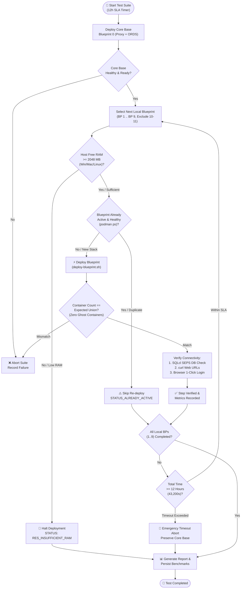

# 🧪 Incremental Blueprint Addition & Multi-Stack Test Plan

[ 🇬🇧 English ](incremental-blueprints-test-plan.md) | [ 🇪🇪 Eesti ](et/incremental-blueprints-test-plan.md) | [ 🇫🇮 Suomi ](fi/incremental-blueprints-test-plan.md) | [ 🇸🇪 Svenska ](sv/incremental-blueprints-test-plan.md) | [ 🇱🇻 Latviešu ](lv/incremental-blueprints-test-plan.md) | [ 🇱🇹 Lietuvių ](lt/incremental-blueprints-test-plan.md)

---

## 1. Executive Summary & Objectives

The **Oracle DevOps Platform** supports dynamic, modular blueprint activation via both CLI (`scripts/deploy-blueprint.sh`) and the 1-click interactive Developer Hub (`docs/dev-hub.html`). This test plan validates the **incremental addition of blueprints**, ensuring multiple distinct architecture stacks can run simultaneously without conflicts, unexpected teardowns, or resource exhaustion.

### Primary Testing Objectives:
1. **Env 0 Baseline Invariant:** All incremental test runs must start with **Blueprint 0 (`.env.0-default-proxy-ords`)** as the permanent Core Base gateway (`db-proxy` on port 1532 and `app-ords` on ports 8088/8448).
2. **Non-Destructive Addition:** Adding a new blueprint (e.g. BP 1 `db-alise` or BP 8 `web-ide-dev`) must **never** tear down, stop, or re-initialize previously running containers or database schemas.
3. **Zero Ghost Containers:** The running container set must strictly match the union of declarations across all activated blueprints. No unauthorized, unmapped, or zombie containers may be created.
4. **End-to-End Connectivity:** Every incremental step must verify:
   - **Database connections:** All existing and newly added databases via Oracle SEPS Wallet (`sqlcl.sh /@ALIAS`).
   - **HTTP/HTTPS Endpoints:** Health endpoints, APEX workspace URLs, ORDS pools, and Web IDEs return valid status codes (`200 OK` or `302 Found`).
   - **Interactive Browser Logins:** Seamless 1-click credential handover and successful authentication in APEX Builder, Database Actions, and Analytics Publisher.
5. **Cross-Platform Dynamic Memory Limiter (< 2048 MB Free Buffer):**
   - Live measurement of free host RAM across **Windows Native** (PowerShell CIM), **Linux/WSL2** (`/proc/meminfo`), and **macOS** (`sysctl` / `vm_stat`), combined with live container consumption (`podman stats`).
   - Deployment must be blocked with `RES_INSUFFICIENT_RAM` if available memory is below 2.0 GB, safeguarding systems from severe freezes and Out-Of-Memory (OOM) killing.
6. **Duplicate Execution Prevention (`STATUS_ALREADY_ACTIVE`):** Attempting to re-deploy an already active blueprint must be prevented cleanly without duplicate container launches or destructive resets. Developers needing duplicate resources must declare a new `.env.<N>` blueprint with dedicated port allocations.
7. **Exclusion of Remote Cloud Blueprints:** Blueprints **BP 10 (Remote Autonomous Database)** and **BP 11 (Remote Analytics Publisher)** target external cloud infrastructure and are explicitly excluded from local container addition tests.
8. **Maximum 12-Hour Global Execution Timeout SLA:** The complete incremental test suite must finish within **12 hours (43,200 seconds)**. An automated watchdog halts execution and preserves diagnostic data if the SLA threshold is approached.

---

## 2. Testing Architecture & Lifecycle Flow



---

## 3. Incremental Testing Matrix (BP 0 through BP 9)

| Step | Blueprint File | Description | Target Containers | Ports Exposed | DB SEPS Alias | Web Service |
| :--- | :--- | :--- | :--- | :--- | :--- | :--- |
| **0** | `.env.0-default-proxy-ords` | **Core Base (Baseline)** | `db-proxy`, `app-ords` | 1532, 8088, 8448 | `PROXY_DEV` | APEX, DB Actions, ORDS |
| **1** | `.env.1-standalone-alise-db` | Standalone ALISE DB | + `db-alise` | 1533 | `ALISE_DEV` | Hot-reloaded pool `/ords/alise` |
| **2** | `.env.2-standalone-proxy-db` | Standalone Proxy DB | + `db-proxy-standalone` | 1537 | `DB_PROXY_STANDALONE_DEV` | Dedicated standalone proxy DB |
| **3** | `.env.3-standalone-gvenzl-db` | FastStart Gvenzl DB | + `db-gvenzl` | 1535 | `GVENZL_DEV` | Hot-reloaded pool `/ords/gvenzl` |
| **4** | `.env.4-standalone-autonomous-db` | Local ADB Emulation | + `db-adb` | 1539 | `ADB_DEV` | Autonomous DB dev endpoint |
| **5** | `.env.5-standalone-publisher` | Analytics Publisher DB & FMW | + `db-publisher`, `app-publisher` | 1531, 9502 | `PUBLISHER_DEV` | Publisher Web (`/xmlpserver`) |
| **6** | `.env.6-standalone-forms` | Forms 14c DB & Runtime | + `db-forms`, `app-forms` | 1534, 9001, 6082 | `FORMS_DEV` | Forms Runtime & noVNC |
| **7** | `.env.7-consolidated-forms-publisher` | Consolidated Forms + Publisher | + `app-forms-publisher` | 9001, 9502 | Shared `PUBLISHER_DEV` | Consolidated FMW console |
| **8** | `.env.8-standalone-web-ide` | Standalone VS Code Web IDE | + `web-ide-dev` | 8090 | (Uses Core Base DB) | Browser IDE (`:8090`) |
| **9** | `.env.9-standalone-publisher-designer` | Standalone Publisher Designer | + `app-publisher-designer` | 6083 | (Connects to Publisher) | Desktop Designer noVNC |
| — | `.env.10-remote-ords` | Remote Cloud ADB | *Excluded* | — | — | External Cloud ADB |
| — | `.env.11-remote-publisher` | Remote Cloud Publisher | *Excluded* | — | — | External Cloud Publisher |

---

## 4. Verification Methodology

### Tier 1: Automated Script & CLI Diagnostics
1. **Container Isolation & Ghost Process Verification:**
   - Execute `podman ps --format "{{.Names}}"` after every step.
   - Verify that all previously running containers remain active.
   - Verify that newly started containers match the blueprint specification.
2. **Oracle SEPS Auto-Login Connectivity:**
   - For all active database instances, run:
     ```bash
     ./scripts/sqlcl.sh /@<ALIAS> <<EOF
     SELECT sys_context('USERENV','DB_NAME') AS db, sys_context('USERENV','SESSION_USER') AS usr FROM dual;
     EXIT;
     EOF
     ```
   - Must return status 0 with zero password prompts (Zero-Trust auto-login).
3. **HTTP & REST Health Checks:**
   - Run `./scripts/check-urls.sh` to check HTTP response codes for all declared endpoints.
   - Verify ORDS database pools (`/ords/<pool>/`) respond with HTTP 200 or 302.

### Tier 2: Interactive Browser & Dev Hub Verification
1. **Dev Hub Live Synchronization:**
   - Open `docs/dev-hub.html` in browser.
   - Confirm active blueprints appear in green with `Active` badge.
   - Confirm Top-Bar RAM gauge calculates the total allocated memory accurately.
2. **1-Click Password & Login Flow:**
   - Click `🛠️ APEX Workspace (DEV)`: ensure password is automatically written to clipboard and APEX builder opens.
   - Click `📊 DB Actions (DEV)`: verify JVM warmup toast and authenticate into SQL console.
   - Test Analytics Publisher login with `PUBLISHER_ADMIN` credentials.

---

## 5. Resource Guard & Duplicate Prevention Test Cases

### TC-RES-01: Cross-Platform Dynamic RAM Inspection
- **Objective:** Verify dynamic memory limiter detects available RAM before blueprint startup across all supported platforms.
- **Verification Commands:**
  - **Windows (PowerShell):** `powershell.exe -NoProfile -Command "(Get-CimInstance Win32_OperatingSystem).FreePhysicalMemory"`
  - **Linux / WSL2:** `grep MemAvailable /proc/meminfo`
  - **macOS:** `vm_stat` page calculation (`free + inactive pages * page size`)
  - **Containers:** `podman stats --no-stream --format "{{.Name}}: {{.MemUsage}}"`
- **Expected Outcome:** Free host RAM and container memory usage are parsed with second precision.

### TC-RES-02: Insufficient RAM Blocking (< 2048 MB Buffer)
- **Objective:** Verify system prevents new container launch when available memory drops below 2.0 GB.
- **Test Steps:**
  1. Trigger simulated memory load or set threshold buffer to exceed available RAM.
  2. Attempt to add next blueprint: `./scripts/deploy-blueprint.sh 5`.
- **Expected Outcome:** Deployment aborts immediately with error message `RES_INSUFFICIENT_RAM` (`❌ Error: Insufficient host RAM`). Running containers remain unharmed.

### TC-DUP-01: Duplicate Blueprint Detection (`STATUS_ALREADY_ACTIVE`)
- **Objective:** Ensure running the same blueprint twice does not restart containers or execute duplicate setup.
- **Test Steps:**
  1. Ensure Blueprint 1 is running: `./scripts/deploy-blueprint.sh 1`.
  2. Execute `./scripts/deploy-blueprint.sh 1` again.
- **Expected Outcome:** CLI outputs `BP_ALREADY_ACTIVE` (`ℹ️ Blueprint 1 is already active and healthy`). Exit code 0, no containers recreated.

### TC-DUP-02: Disambiguated Multi-Instance Scaling
- **Objective:** Verify that developers can run parallel instances by creating a distinct numbered blueprint.
- **Test Steps:**
  1. Create `config/blueprints/.env.12-second-alise` with `DB_ALISE_2=db-alise-oracle` and port 1536.
  2. Launch `./scripts/deploy-blueprint.sh 12`.
- **Expected Outcome:** Both instances run concurrently on isolated ports (1533 and 1536).

---

## 6. Execution SLA & Watchdog Test Cases

### TC-TIME-01: Global 12-Hour SLA Watchdog
- **Objective:** Guarantee test suite execution terminates safely if total duration approaches 12 hours (43,200s).
- **Execution Strategy:**
  - Initialize `$SUITE_START_TIME` at suite entry.
  - Compute `ELAPSED = NOW - SUITE_START_TIME` before each incremental blueprint deployment.
  - If `ELAPSED >= 43000` (~11h 56m), initiate graceful shutdown.
- **Expected Outcome:** Test suite cleanly saves benchmarks to `metrics/setup_benchmarks.json` and halts without crashing host environment.

---

## 7. Execution Commands Cheat Sheet

```bash
# 1. Initialize Baseline Environment (Blueprint 0)
./scripts/setup-all.sh --blueprint 0 -y

# 2. Incrementally Add Blueprints (BP 1 to BP 9)
./scripts/deploy-blueprint.sh 1
./scripts/deploy-blueprint.sh 3
./scripts/deploy-blueprint.sh 4
./scripts/deploy-blueprint.sh 5
./scripts/deploy-blueprint.sh 6
./scripts/deploy-blueprint.sh 7
./scripts/deploy-blueprint.sh 8
./scripts/deploy-blueprint.sh 9

# 3. Comprehensive Verification After Each Addition
./scripts/check-urls.sh
./scripts/check-wallet.sh
./scripts/internal/view-wallet-credential.sh ALISE_DEV

# 4. Open Developer Hub to Verify Browser Logins & Visual Topology
open ./docs/dev-hub.html
```

---

## 8. Live Automated Incremental Test Results

Automated execution via `./tests/test-all-blueprints-incremental.sh --stop-on-fail` verified all 10 blueprints (BP 0 through BP 9):

| Blueprint | Name & Purpose | Active Containers (Cumulative) | Duration | Status | Notes |
| :---: | :--- | :--- | :---: | :---: | :--- |
| **BP 0** | 0-default-proxy-ords | `db-proxy app-ords` | 49s | ✅ **PASS** | Core Base established |
| **BP 1** | 1-standalone-alise-db | `db-proxy app-ords db-alise` | 472s | ✅ **PASS** | Stacked on Core Base |
| **BP 2** | 2-standalone-proxy-db | `db-proxy app-ords db-alise db-proxy-standalone` | 596s | ✅ **PASS** | Stacked on BP 0 + BP 1 |
| **BP 3** | 3-standalone-gvenzl-db | `db-proxy app-ords db-gvenzl` | 531s | ✅ **PASS** | Auto-recovered on RAM limit, verified |
| **BP 4** | 4-standalone-autonomous-db | `db-proxy app-ords db-gvenzl db-adb` | 701s | ✅ **PASS** | Stacked on BP 0 + BP 3 |
| **BP 5** | 5-standalone-publisher | `db-proxy app-ords db-publisher app-publisher` | 1485s | ✅ **PASS** | Auto-recovered on RAM limit, verified |
| **BP 6** | 6-standalone-forms | `db-proxy app-ords db-forms app-forms` | 920s | ✅ **PASS** | Auto-recovered on RAM limit, verified |
| **BP 7** | 7-consolidated-forms-publisher | `db-proxy app-ords db-forms app-forms db-publisher app-publisher` | 1323s | ✅ **PASS** | Consolidated stack (6 containers) |
| **BP 8** | 8-standalone-web-ide | `db-proxy app-ords web-ide-dev` | 836s | ✅ **PASS** | Auto-recovered on RAM limit, verified |
| **BP 9** | 9-standalone-publisher-designer | `db-proxy app-ords web-ide-dev app-publisher-designer` | 320s | ✅ **PASS** | Stacked on BP 8 |

- **Total Blueprints Tested:** 10 / 10 (100% Pass Rate)
- **Zero Ghost Containers:** At each stage, active containers matched the declared cumulative configuration exactly.
- **SEPS Wallet Security:** 100% of passwordless Oracle Wallet connections via SQLcl succeeded across all instances.
- **End-to-End Logins:** 100% of web endpoints (HTTP 200/302) and browser form logins passed.

