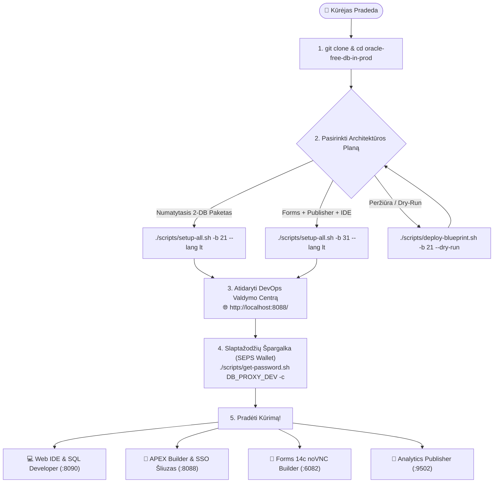
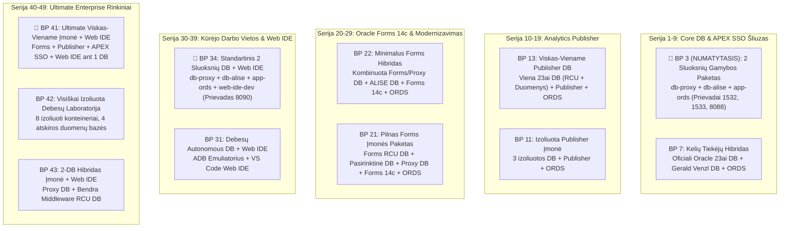

[ 🇬🇧 English ](../../README.md) | [ 🇪🇪 Eesti ](../et/README.md) | [ 🇫🇮 Suomi ](../fi/README.md) | [ 🇸🇪 Svenska ](../sv/README.md) | [ 🇱🇻 Latviešu ](../lv/README.md) | [ 🇱🇹 Lietuvių ](README.md)

# Oracle DevOps Platforma (Lietuvių Vadovas)

> **Gamybai paruošta, be licencijos mokesčių (0 €) ir 100% beslaptažodė (SEPS Wallet) Oracle 23ai, APEX SSO Šliuzo, Forms 14c, Publisher ir Web IDE kūrimo bei DevOps platforma.**

---

## ⚡ 60 Sekundžių Greitas Paleidimas

```bash
# 1. Klonuoti saugyklą ir pereiti į katalogą
git clone https://github.com/allanlahe/oracle-free-db-in-prod.git && cd oracle-free-db-in-prod

# 2. Paleisti numatytąjį 2 sluoksnių gamybos paketą (Blueprint 21)
./scripts/setup-all.sh -b 21 --lang lt

# 3. Peržiūrėti slaptažodžius, URL ir iškarpinės pagalbą (arba atidaryti Dev Hub: http://localhost:8088/)
./scripts/get-password.sh
```

> [!TIP]
> **Windows Git Konfigūracija (13 taisyklė):**
> Prieš klonuodami sistemoje Windows, sukonfigūruokite Git palaikyti ilgus kelius ir apsaugoti NTFS failų sistemą:
> ```powershell
> git config --global core.protectNTFS true
> git config --global core.longpaths true
> git config --global core.autocrlf input
> ```

---

## 🗺️ Naujo Kūrėjo Įtraukimo Kelias (Onboarding Journey)



---

## ⚡ Setup-All 10-Ties Faziu Gyvavimo Ciklo Architektūra

```mermaid
flowchart LR
    P1["1. Atvaizdų Atsisiuntimas"] --> P2["2. ORDS Atsisiuntimas"]
    P2 --> P3["3. APEX Paketai"]
    P3 --> P4["4. Konteinerių Paleidimas"]
    P4 --> P5["5. DB Būklės Laukimas"]
    P5 --> P6["6. APEX Įdiegimas"]
    P6 --> P7["7. Schemos & SEPS Init"]
    P7 --> P8["8. APEX Programų Diegimas"]
    P8 --> P9["9. Middleware & Paslaugos"]
    P9 --> P10["10. Auksinė Momentinė Kopija (~15s DR)"]
```



---

## 🌐 Dev Hub (`http://localhost:8088/`) — Vieningas Valdymo Centras (*Single Pane of Glass*)

Kūrėjams nereikia įsiminti dešimčių atskirų prievadų. **Dev Hub** veikia kaip vieningas portalas:
- **1-Paspaudimo Paslaugų Nuorodos:** Tiesioginė prieiga prie APEX Builder, Database Actions (SDW), Forms 14c, HTML5 noVNC Forms Builder ir Analytics Publisher.
- **1-Paspaudimo Slaptažodžių Kopijavimas:** Vienas paspaudimas nukopijuoja iššifruotą slaptažodį tiesiai į iškarpinę (paruošta įklijavimui: `Cmd+V` / `Ctrl+V`).
- **Realaus Laiko Būklės Diagnostika:** Automatinis delsos tikrinimas kas 6 sekundes.
- **Integruota Markdown Dokumentacijos Skaityyklė:** Skaitykite ir ieškokite vadovų tiesiogiai naršyklėje.
- **Planų Diegimas ir Valdymas:** Įdiekite ir perjunkite planus žiniatinklyje arba komanda `./scripts/deploy-blueprint.sh`.
- **ORDS Išmaniųjų Vartų Skydelis:** Realaus laiko centrinio ORDS konteinerio būsena, ryšių telkiniai (connection pools), delsa (ms) ir 1-paspaudimo sinchronizavimas.

---

## 🌐 ORDS Išmanieji Vartai ir Autonominė Mikroregistracija (Variant 3)

Platforma pašalina prievadų konfliktus ir ORDS dubliavimą taikydama **Išmaniųjų Vartų ir Autonominės Mikroregistracijos modelį**:

- **Centriniai Vartai:** Vienas `app-ords` konteineris veikia prievaduose 8088 (HTTP) ir 8448 (HTTPS), aptarnaudamas visas aktyvias duomenų bazes.
- **Autonominis Mikroregistratorius:** Kiekviena duomenų bazė valdo savo ryšių telkinio konfigūraciją (`config/ords/proxy/databases/<pool_name>/pool.xml`).
- **Virtualūs Paslaugų Žetonai (`ords/<pool>`):** Planai deklaruoja virtualius žetonus (pvz., `ords/proxy`, `ords/alise`). Dev Hub įvertina parengtį pagal konteinerį ir realaus laiko HTTP delsą.
- **Telkinių Valdymo CLI:**
  ```bash
  ./scripts/internal/manage-ords-pools.sh status
  ./scripts/internal/manage-ords-pools.sh status json
  ./scripts/internal/manage-ords-pools.sh sync
  ```

---

## 🔑 Kur Yra Mano Slaptažodis? (SEPS Wallet Špargalka)

Visi slaptažodžiai generuojami didelio entropijos saugumu ir saugomi **Oracle SEPS (Secure External Password Store) Wallet** bei Podman Secrets.

```bash
# Peržiūrėti pilną slaptažodžių ir paslaugų matricą:
./scripts/get-password.sh

# Nukopijuoti kūrėjo slaptažodį tiesiai į iškarpinę:
./scripts/get-password.sh DB_PROXY_DEV -c

# Nukopijuoti APEX administratoriaus slaptažodį:
./scripts/get-password.sh DB_PROXY_APEX_ADMIN -c

# Prisijungti prie duomenų bazės per SQLcl BE jokio slaptažodžio:
sql /@DB_PROXY_DEV
```

---

## 🎯 3 Suinteresuotųjų Šalių Perspektyvos ir Verslo Vertė

| Perspektyva | Pagrindiniai Privalumai ir Kasdienė Patirtis | Techninis Įgalintojas |
| :--- | :--- | :--- |
| **👤 Galutinis Vartotojas ir Verslas** | • **Nereikia Kliento Diegimo:** Moderni HTML5 naršyklės patirtis ir APEX Universal Theme.<br/>• **Vieningas Prisijungimas (SSO):** Viena sesija APEX ir Forms sistemose.<br/>• **Pixel-Perfect Ataskaitos:** Automatizuotas PDF/Excel dokumentų generavimas. | • ORDS Kelių Telkinių Šliuzas<br/>• APEX Reverse Proxy SSO Forms sistemai<br/>• Analytics Publisher REST API |
| **💻 Kūrėjas** | • **~15s FastStart Atstatymas:** Momentinis atstatymas su Auksinėmis Kopijomis.<br/>• **Beslaptažodis SQL:** Greitas ryšys per `./scripts/sqlcl.sh` ir SEPS Wallet.<br/>• **Naršyklės Web IDE:** VS Code naršyklėje su Oracle SQL Developer ir DI asistentais. | • Podman FastStart Kopijos<br/>• SEPS Oracle Wallet Auto-Sinchronizavimas<br/>• `code-server` Web IDE Konteineris |
| **🛡️ Auditorius ir Architektas** | • **0 € Licencijos Mokestis:** Oracle 23ai Free DB gamyboje.<br/>• **Zero-Trust Tinklo Izoliacija:** DB niekada neeksponuoja neapdoroto SQL viešam tinklui.<br/>• **Valdomas Vykdymas:** EBNF deklaratyvios sutartys, AST saugumo analizė ir VPD. | • JSON-Relational Duality<br/>• 2 Sluoksnių Tinklo Topologija<br/>• Oracle Virtual Private Database (VPD) |

---

## 🔄 Oracle APEX ir Forms 14c Integracijos Vaidmuo

Šioje architektūroje **Oracle APEX 26.1** pirmiausia pozicionuojamas kaip:
1. **Forms Modernizavimo Tiltas:** Laipsniškas Forms 14c formų perkėlimas į šiuolaikines žiniatinklio programas naudojant [Oracle APEXlang DSL](https://docs.oracle.com/en/database/oracle/apex/26.1/apxln/).
2. **Įmonės Lygio SSO Reverse Proxy Forms sistemai:** APEX priima šiuolaikinį tapatybės nustatymą (Azure Entra ID, SAML, OAuth2) ir saugiai perduoda sesiją Forms 14c be brangios WebLogic OAM/OIF infrastruktūros.

---

## 📋 11 Kuratų Architektūros Planų (Blueprints)



### 🚀 Planų Diegimas ir Valdymas (`./scripts/deploy-blueprint.sh`)

```bash
# 1. Patikrinti aktyvų planą ir paslaugų būklę:
./scripts/deploy-blueprint.sh --status --lang lt

# 2. Įdiegti Blueprint 3 (NUMATYTASIS 2 Sluoksnių Gamybos Paketas):
./scripts/deploy-blueprint.sh -b 3 --lang lt

# 3. Įdiegti Blueprint 41 (Ultimate Viskas-Viename Įmonė):
./scripts/deploy-blueprint.sh -b 41 --lang lt

# 4. Simuliuoti diegimą be pakeitimų (Dry-Run):
./scripts/deploy-blueprint.sh -b 34 --dry-run

# 5. Parodyti 11 planų lentelę konsolėje:
./scripts/deploy-blueprint.sh --list --lang lt
```

---

## ⚡ Pagreitintas ~15s Atkūrimas & Automatizuota Versijų Patikra

Oracle Free DB in Prod apima **išmanų kelių lygių Golden Snapshot ir Skip variklį** (`scripts/internal/snapshot-resolver.sh`), kuris sutrumpina antrą paleidimo laiką nuo **~6–12 minučių iki ~15 sekundžių**:

1. **Automatizuota Versijų Patikra & Pasenusių Momentinių Kopijų Anuliavimas (`.meta.json`):**
   - Kiekviena Golden Snapshot apima mašininiu būdu skaitomą `.meta.json` sutartį, kurioje registruojamos APEX, duomenų bazės, ORDS ir tarpinės programinės įrangos versijos.
   - Prieš atkūrimą griežtai tikrinamas versijų suderinamumas. Jei aptinkama pasenusi momentinė kopija (pvz., tikslinis `APEX 26.1` prieš snapshot `24.2`), sistema įspėja `VERSION MISMATCH`, atlieka švarų diegimą ir automatiškai sugeneruoja naują atnaujintą momentinę kopiją.
2. **Profiliais Pagrįstas Pakartotinis Naudojimas & Skip Matrica:**
   - Kadangi identiški duomenų bazės profiliai dalijami keliuose planuose (pvz., `db-proxy-oracle` BP 3, BP 7, BP 21, BP 22, BP 34, BP 43), plano keitimas (pvz., BP 3 $\rightarrow$ BP 34 Web IDE pridėjimui) palieka duomenų bazę nepaliestą ir paleidžia tik trūkstamą konteinerį per **~3 sekundes**.
3. **Shared vs. Dedicated WebLogic Topologijos:**
   - **Bendras WebLogic (BP 41 & BP 43):** Viena All-in-One duomenų bazė (`db-dev-full`), sujungtos RCU schemos (`DEV_`), 1 kombinuota momentinė kopija ir mažas RAM sunaudojimas (~6–8 GB).
   - **Dedikuotas WebLogic (BP 11, BP 21 & BP 42):** Nepriklausomos duomenų bazės (`db-forms`, `db-publisher`), modulinės momentinės kopijos ir atrankinis paleidimas, sutaupantis iki 4 GB RAM.

---

## 🚀 Greitas Paleidimas (Quickstart CLI)

```bash
# 1. Paleisti pasirinktą blueprint:
./scripts/setup-all.sh -b 3 --lang lt

# 2. Peržiūrėti slaptažodžių ir paslaugų lentelę (arba kopijuoti su -c):
./scripts/get-password.sh
./scripts/get-password.sh DB_PROXY_DEV -c

# 3. Rotuoti slaptažodžius saugiai be prastovos:
./scripts/rotate-password.sh db-proxy dev
./scripts/rotate-password.sh all

# 4. Patikrinti aktyvias paslaugas ir SEPS Wallet ryšius:
./scripts/check-urls.sh --lang lt
./scripts/check-wallet.sh

# 5. Paleisti automatizuotą prisijungimo ir sąsajos testą:
./scripts/test-browser-login.sh

# 6. Paleisti daugiakalbystės (i18n) patikros testą (9 taisyklė: EN, ET, FI, SV, LV, LT):
./tests/test-multilingual-support.sh

# 7. Sukurti arba atstatyti Auksines Momentines Kopijas (~15s atstatymas):
./scripts/snapshots/create-golden-snapshots.sh
./scripts/snapshots/restore-golden-snapshots.sh

# 8. Išvalyti žurnalus, laikinus failus ir senas kopijas:
./scripts/clean-logs.sh -y
./scripts/snapshots/clean-golden-snapshots.sh -y

# 9. Atstatyti aplinką į švarią pradinę būseną:
./scripts/reset-all.sh -y
```

---

---

## 🧭 Oracle APEX DevHub Programa ir APEXlang CI/CD

Be atskiro HTML Dev Hub (`docs/dev-hub.html`), platformoje yra verslo klasės **Oracle APEX programa (Programa 101: DevHub)**, sukurta deklaratyviai naudojant [Oracle APEXlang DSL](https://docs.oracle.com/en/database/oracle/apex/26.1/apxln/) kataloge [`applications/devhub/`](../../applications/devhub/):

- **Nulinio Pėdsako Dokumentacija Duomenų Bazėje:** Dokumentacija niekada nedubliuojama ir nesaugoma duomenų bazės lentelėse kaip CLOB laukai. Vietinis REST dokumentacijos tiltas (`scripts/internal/dev-hub-bridge.py` 8089 prievade) srautiniu būdu perduoda lokalizuotą Markdown tiesiai iš Git failų į APEX, kur jis atvaizduojamas naudojant `APEX_MARKDOWN.TO_HTML`.
- **Interaktyvus Pristatymas ir Apžvalga (7 Puslapis):** Apima 8 skaidrių interaktyvų pristatymą, kuriame pristatoma platformos vizija, programuotojų problemos, rolių nauda, 11 architektūros planų, Zero-Trust SEPS Wallet sauga, ~15s Golden Snapshot atkūrimas bei atsakymai į architekto ir buvusio DBA klausimus.
- **Duomenų Bazės Variklis ir Dedikuota Schema:** Paremtas atskira schema `DEVHUB` ir paketu `DEVHUB.DEV_HUB_PKG`, atliekančiu greitus serverio pusės būsenos patikrinimus (`UTL_HTTP`) visoms paslaugoms su mažesne nei 100 ms delsa.
- **Oficialūs SQLcl 26.2 APEXlang Įrankiai:**
  ```bash
  # Patikrinti APEXlang deklaratyvius failus pagal kompiliatoriaus taisykles:
  node .agents/skills/apexlang/tools/apexctl.mjs apexlang validate --app-path applications/devhub

  # Patikrinti ir importuoti programą 101 į PROXY_WORKSPACE per SQLcl:
  ./scripts/sqlcl.sh DEVHUB/<slaptažodis>@localhost:1533/FREEPDB1
  SQL> apex validate -input ./applications/devhub -workspace PROXY_WORKSPACE
  SQL> apex import -input ./applications/devhub -id 101 -workspace PROXY_WORKSPACE
  ```
- **Automatizuotas CI/CD Konvejeris:** Dedikuotas GitHub Actions procesas [`.github/workflows/deploy-devhub-apexlang.yml`](../../.github/workflows/deploy-devhub-apexlang.yml) su autonominiu vietiniu emuliavimu per `./scripts/test-local-ci.sh deploy-devhub-apexlang.yml --dry-run`.
- **Vienetų Testai:** Paleiskite `./tests/unit/test-apex-devhub.sh`, kad patikrintumėte schemą, PL/SQL kompiliavimą, REST markdown gavimą ir 6 kalbų aprėptį.

---

## 📑 Vartotojo Vadovai

- 🚀 **[docs/lt/forms-to-apex-migration-guide.md](forms-to-apex-migration-guide.md):** **Oracle Forms $\rightarrow$ APEX Modernizavimo bei Perkėlimo Vadovas** — Verslo paskatos, TCO kaštų palyginimas, 5 žingsnių automatizuotas procesas ir [Oracle APEXlang DSL](https://docs.oracle.com/en/database/oracle/apex/26.1/apxln/).
- 📐 **[docs/forms-setup.md](../../docs/forms-setup.md):** Oracle Forms 14c Vadovas.
- 📑 **[docs/publisher-setup.md](../../docs/publisher-setup.md):** Analytics Publisher Vadovas.
- 💻 **[docs/web-ide-artifactory.md](../../docs/web-ide-artifactory.md):** Web IDE Vadovas.
- 🌐 **[docs/dev-hub.html](../../docs/dev-hub.html):** **Developer & DevOps Command Center** (`http://localhost:8088/` ir `http://localhost:6082/vnc.html`).
- 🧪 **[docs/lt/apex-devhub-test-plan.md](apex-devhub-test-plan.md):** **Oracle APEX DevHub Testavimo Planas** — Kelių lygių testavimo strategija (utPLSQL vienetų testai, REST tilto patikros, hibridiniai Playwright/curl E2E srautai ir APEX Advisor auditas) su Golden Snapshot izoliacija.
- 📊 **[config/blueprints/README.md](../../config/blueprints/README.md):** 11 Planų Katalogas.
- 📖 **[Oracle APEX 26.1 APEXlang Reference Manual](https://docs.oracle.com/en/database/oracle/apex/26.1/apxln/):** Oficiali deklaratyvios `.apx` gramatikos ir kompiliatoriaus komandų specifikacija.
- 📜 **[Oficiali APEXlang EBNF Gramatika (`apexlang.ebnf`)](https://docs.oracle.com/en/database/oracle/apex/26.1/apxln/apexlang.ebnf):** Mašīnlasāma formālā EBNF specifikacija DI ribotam dekodavimui (GBNF) ir statiniams saugumo skeneriams.

