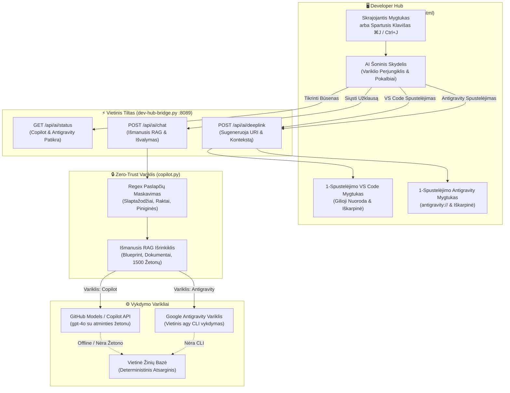

[ 🇬🇧 English ](../devhub-copilot-assistant.md) | [ 🇪🇪 Eesti ](../et/devhub-copilot-assistant.md) | [ 🇫🇮 Suomi ](../fi/devhub-copilot-assistant.md) | [ 🇸🇪 Svenska ](../sv/devhub-copilot-assistant.md) | [ 🇱🇻 Latviešu ](../lv/devhub-copilot-assistant.md) | [ 🇱🇹 Lietuvių ](devhub-copilot-assistant.md)

# 🤖 Dev Hub Daugiatinklis AI asistentas (Copilot + Antigravity) ir Zero-Trust RAG vadovas

Šis vadovas dokumentuoja Developer Hub (`docs/dev-hub.html`) integruotą **daugiatinklį AI asistentą**, palaikantį tiek **GitHub Copilot**, tiek **Google Antigravity**, 5 Taisyklės Zero-Trust saugumo kontrolę, autonominę vietinę žinių bazę ir 1-spustelėjimo tiltus į „VS Code Copilot Chat“ bei „Antigravity“.

---

## 🏛️ 1. Techninė architektūra ir duomenų srautas

Asistentas naudoja dviejų variklių architektūrą su sparčiuoju klavišu `⌘J` / `Ctrl+J`, užtikrinančią greitą perjungimą tarp GitHub Copilot ir Google Antigravity:

---

## 🔒 2. Zero-Trust saugumas ir 5 Taisyklės laikymasis

1. **Niekada neišsaugoma diske:** Autentifikavimo žetonai ir komandinės eilutės sąveika vykdomi išimtinai operatyviojoje atmintyje.
2. **Dinaminis maskavimas:** Visi klausimai ir dokumentacijos ištraukos pereina `sanitize_text` filtrą:
   - Duomenų bazių slaptažodžiai (`password: ...`, `IDENTIFIED BY ...`)
   - SEPS Wallet keliai (`cwallet.sso`, `ewallet.p12`)
   - SSH ir TLS privatūs raktai (`BEGIN PRIVATE KEY`)
   - GitHub prieigos žetonai (`ghp_*`, `github_pat_*`)

---

## ⌨️ 3. Kūrėjo spartieji klavišai ir parinktys

| Veiksmas | Spartusis klavišas / Paleidiklis | Aprašymas |
| :--- | :--- | :--- |
| **Atidaryti / Uždaryti asistentą** | `⌘J` (macOS) / `Ctrl+J` (Windows/Linux) | Atidaro arba uždaro AI skydelį iš bet kurios Dev Hub kortelės. |
| **Perjungti variklį** | Antraštės mygtukai `[ GitHub Copilot | Google Antigravity ]` | Perjungia aktyvų AI variklį (`localStorage`). |
| **Visas ekranas / Atstatyti** | Viršutinis dešinysis mygtukas `⛶` | Išplečia skydelį į visą ekraną kodo analizei. |
| **Pateikti klausimą** | `Enter` klavišas | Siunčia užklausą pasirinktam AI varikliui. |
| **Atidaryti „VS Code“** | Spustelėti `Atidaryti „VS Code Copilot“` | Nukopijuoja pilną RAG kontekstą į iškarpinę ir atidaro `vscode://github.copilot/chat`. |
| **Atidaryti su Antigravity** | Spustelėti `Atidaryti su Antigravity` | Nukopijuoja RAG kontekstą į iškarpinę ir atidaro `antigravity://chat` (arba paleidžia programą). |

---

## 🔄 4. 3-Lygmenų atsarginė sistema be interneto

Jei kūrėjo kompiuteryje nėra interneto ryšio:
1. **1 Lygis (Prisijungta):** Kreipiasi į GitHub Models (`gpt-4o`) arba vietinį `agy` CLI.
2. **2 Lygis (CLI atsarga):** Naudoja vietinius CLI įrankius.
3. **3 Lygis (Vietinis be tinklo):** Akimirksniu sugeneruoja deterministinį atsakymą iš vietinės dokumentacijos.
