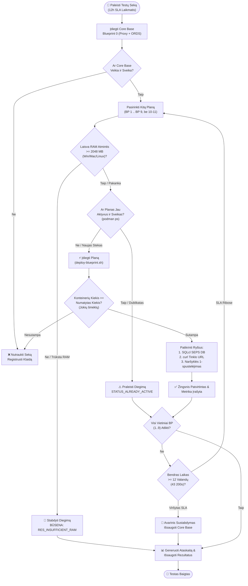

# 🧪 Nuoseklaus Struktūrinių Planų Pridėjimo ir „Multi-Stack“ Testavimo Planas

[ 🇬🇧 English ](../incremental-blueprints-test-plan.md) | [ 🇪🇪 Eesti ](../et/incremental-blueprints-test-plan.md) | [ 🇫🇮 Suomi ](../fi/incremental-blueprints-test-plan.md) | [ 🇸🇪 Svenska ](../sv/incremental-blueprints-test-plan.md) | [ 🇱🇻 Latviešu ](../lv/incremental-blueprints-test-plan.md) | [ 🇱🇹 Lietuvių ](incremental-blueprints-test-plan.md)

---

## 1. Santrauka ir Tikslai

**Oracle DevOps platforma** palaiko modulinį ir dinaminį struktūrinių planų („blueprints“) aktyvavimą tiek per komandinę eilutę (`scripts/deploy-blueprint.sh`), tiek interaktyviajame Developer Hub (`docs/dev-hub.html`). Šis testavimo planas tikrina **nuoseklų struktūrinių planų pridėjimą (incremental addition)**, užtikrindamas, kad kelios architektūros konfigūracijos veikia lygiagrečiai be konfliktų, nenumatytų sustabdymų ar išteklių trūkumo.

### Pagrindiniai Testavimo Tikslai:
1. **Env 0 Bazinio Lygio Reikalavimas (Baseline Invariant):** Kiekvienas testas privalo prasidėti nuo **Blueprint 0 („.env.0-default-proxy-ords“)** kaip nuolatinio Core Base tinklo vartų modulio (`db-proxy` 1532 prievade ir `app-ords` 8088/8448 prievaduose).
2. **Nedestruktyvus Pridėjimas (Non-Destructive Addition):** Naujo plano pridėjimas (pvz., BP 1 `db-alise` arba BP 8 `web-ide-dev`) **niekada negali** sustabdyti, pašalinti ar iš naujo inicijuoti anksčiau paleistų konteinerių ar duomenų bazių schemų.
3. **Jokių Šmėklinių Konteinerių (Zero Ghost Containers):** Veikiančių konteinerių aibė turi tiksliai atitikti visų aktyvuotų planų sąjungą. Neautorizuotų ar nežinomų konteinerių kūrimas yra griežtai draudžiamas.
4. **Visapusiškas Ryšys:** Kiekviename etape privaloma patikrinti:
   - **Duomenų Bazių Ryšiai:** Visi esami ir naujai pridėti Oracle SEPS Wallet ryšiai (`sqlcl.sh /@ALIAS`).
   - **HTTP/HTTPS Prieigos Taškai:** Būklės patikros, APEX darbo erdvės, ORDS telkiniai ir Web IDE grąžina teisingus būsenos kodus (`200 OK` arba `302 Found`).
   - **1-Spustelėjimo Prisijungimas Naršyklėje:** Automatinis slaptažodžio nukopijavimas į iškarpinę ir sklandus autentifikavimas APEX Builder, Database Actions bei Analytics Publisher.
5. **Kelių Platformų Dinaminis Atminties Ribotuvas (< 2048 MB Laisvas Buferis):**
   - Realaus laiko laisvos fizinės RAM atminties patikra sistemose **Windows Native** (PowerShell CIM), **Linux/WSL2** (`/proc/meminfo`) ir **macOS** (`sysctl` / `vm_stat`), suderinta su veikiančių konteinerių sunaudojimu (`podman stats`).
   - Diegimas stabdomas su klaida `RES_INSUFFICIENT_RAM`, jei laisva atmintis nukrenta žemiau 2.0 GB.
6. **Dvigubo Vykdymo Prevencija (`STATUS_ALREADY_ACTIVE`):** Jau veikiančio plano pakartotinis paleidimas švariai praleidžiamas neperkraunant konteinerių. Lygiagrečiam vykdymui sukuriamas naujas numeruotas `.env.<N>` planas su unikaliais prievadais.
7. **Nuotolinių / Debesijos Planų Išskyrimas:** Planai **BP 10 (Remote Autonomous Database)** ir **BP 11 (Remote Analytics Publisher)** yra skirti išorinei debesijos infrastruktūrai ir yra išbraukti iš vietinių konteinerių pridėjimo testų.
8. **Globalus 12 Valandų SLA Laiko Limitas:** Visa testavimo seka privalo tilpti į **12 valandų (43 200 sekundžių)** limitą.

---

## 2. Testavimo Architektūra ir Eiga



---

## 3. Nuoseklaus Testavimo Matrica (BP 0 .. BP 9)

| Žingsnis | Plano Failas | Aprašymas | Tiksliniai Konteineriai | Prievadai | DB SEPS Alias | Tinklo Paslauga |
| :--- | :--- | :--- | :--- | :--- | :--- | :--- |
| **0** | `.env.0-default-proxy-ords` | **Core Base (Bazinis Lygis)** | `db-proxy`, `app-ords` | 1532, 8088, 8448 | `PROXY_DEV` | APEX, DB Actions, ORDS |
| **1** | `.env.1-standalone-alise-db` | Atskira ALISE DB | + `db-alise` | 1533 | `ALISE_DEV` | Dinaminis telkinys `/ords/alise` |
| **2** | `.env.2-standalone-proxy-db` | Atskira Proxy DB | + `db-proxy-standalone` | 1537 | `DB_PROXY_STANDALONE_DEV` | Atskira Proxy DB ir SSO vartai |
| **3** | `.env.3-standalone-gvenzl-db` | FastStart Gvenzl DB | + `db-gvenzl` | 1535 | `GVENZL_DEV` | Dinaminis telkinys `/ords/gvenzl` |
| **4** | `.env.4-standalone-autonomous-db` | Vietinė ADB Emuliacija | + `db-adb` | 1539 | `ADB_DEV` | Autonominės DB prieiga |
| **5** | `.env.5-standalone-publisher` | Analytics Publisher DB & FMW | + `db-publisher`, `app-publisher` | 1531, 9502 | `PUBLISHER_DEV` | Publisher Web (`/xmlpserver`) |
| **6** | `.env.6-standalone-forms` | Forms 14c DB & Runtime | + `db-forms`, `app-forms` | 1534, 9001, 6082 | `FORMS_DEV` | Forms Runtime & noVNC |
| **7** | `.env.7-consolidated-forms-publisher` | Jungtinė Forms + Publisher | + `app-forms-publisher` | 9001, 9502 | Bendras `PUBLISHER_DEV` | Jungtinė FMW konsolė |
| **8** | `.env.8-standalone-web-ide` | Atskira VS Code Web IDE | + `web-ide-dev` | 8090 | (Naudoja Core Base DB) | Naršyklės IDE (`:8090`) |
| **9** | `.env.9-standalone-publisher-designer` | Atskiras Publisher Designer | + `app-publisher-designer` | 6083 | (Jungiasi prie Publisher) | Darbastalio Designer noVNC |
| — | `.env.10-remote-ords` | Nuotolinė Debesijos ADB | *Išbraukta* | — | — | Išorinė Debesijos ADB |
| — | `.env.11-remote-publisher` | Nuotolinis Publisher | *Išbraukta* | — | — | Išorinis Debesijos Publisher |

---

## 4. Patikros Metodika

### 1. Lygis: Automatizuota Skriptų Diagnostika
1. **Konteinerių Izoliacija ir Šmėklinių Procesų Patikra:**
   - Po kiekvieno žingsnio vykdyti `podman ps --format "{{.Names}}"`.
2. **Oracle SEPS Automatinio Prisijungimo Patikra:**
   - Vykdyti `./scripts/sqlcl.sh /@<ALIAS>` kiekvienai aktyviai DB be slaptažodžio įvedimo.
3. **HTTP ir REST Patikros:**
   - Vykdyti `./scripts/check-urls.sh`.

### 2. Lygis: Naršyklės ir Dev Hub Patikra
1. **Dev Hub Realaus Laiko Sinchronizacija:**
   - Atverti `docs/dev-hub.html` ir patikrinti žalią būseną bei RAM skaitiklį.
2. **1-Spustelėjimo Prisijungimas:**
   - Patikrinti APEX, DB Actions ir Analytics Publisher prieigas.

---

## 5. Išteklių Apsauga ir Dublikatų Prevencija

### TC-RES-01: Kelių Platformų RAM Patikra
- **Tikslas:** Patikrinti laisvą atmintį Windows (PowerShell CIM), Linux (`/proc/meminfo`) ir macOS (`vm_stat`).

### TC-RES-02: Blokavimas Esant Nepakankamai Atminčiai (< 2048 MB Buferis)
- **Tikslas:** Blokuoti diegimą su klaida `RES_INSUFFICIENT_RAM`.

### TC-DUP-01: Dvigubo Paleidimo Aptikimas (`STATUS_ALREADY_ACTIVE`)
- **Tikslas:** Pranešti `BP_ALREADY_ACTIVE` neperkraunant veikiančių konteinerių.

---

## 6. Vykdymo 12 Valandų SLA Priežiūra

### TC-TIME-01: Globalus SLA Laikmatis
- **Tikslas:** Saugiai nutraukti testą ir išsaugoti duomenis faile `metrics/setup_benchmarks.json` prieš pasiekiant 12 valandų limitą.

---

## 7. Komandų Atmintinė

```bash
# 1. Inicijuoti bazinę aplinką (Blueprint 0)
./scripts/setup-all.sh --blueprint 0 -y

# 2. Nuosekliai pridėti planus (BP 1 iki BP 9)
./scripts/deploy-blueprint.sh 1
./scripts/deploy-blueprint.sh 3
./scripts/deploy-blueprint.sh 4
./scripts/deploy-blueprint.sh 5
./scripts/deploy-blueprint.sh 6
./scripts/deploy-blueprint.sh 7
./scripts/deploy-blueprint.sh 8
./scripts/deploy-blueprint.sh 9

# 3. Patikrinti ryšius
./scripts/check-urls.sh
./scripts/check-wallet.sh
open ./docs/dev-hub.html
```

---

## 8. Automatizuotų Inkrementinių Testų Rezultatai

Automatizuotas vykdymas naudojant `./tests/test-all-blueprints-incremental.sh --stop-on-fail` sėkmingai patikrino visus 10 architektūrinių planų (BP 0 iki BP 9):

| Planas | Pavadinimas ir paskirtis | Aktyvūs konteineriai (sukaupti) | Trukmė | Būsena | Pastabos |
| :---: | :--- | :--- | :--- | :---: | :--- |
| **BP 0** | 0-default-proxy-ords | `db-proxy app-ords` | 49s | ✅ **PASS** | Sukurtas Core Base pagrindas |
| **BP 1** | 1-standalone-alise-db | `db-proxy app-ords db-alise` | 472s | ✅ **PASS** | Pridėtas ant Core Base |
| **BP 2** | 2-standalone-proxy-db | `db-proxy app-ords db-alise db-proxy-standalone` | 596s | ✅ **PASS** | Pridėtas ant BP 0 + BP 1 |
| **BP 3** | 3-standalone-gvenzl-db | `db-proxy app-ords db-gvenzl` | 531s | ✅ **PASS** | Automatinis RAM atstatymas, patvirtinta |
| **BP 4** | 4-standalone-autonomous-db | `db-proxy app-ords db-gvenzl db-adb` | 701s | ✅ **PASS** | Pridėtas ant BP 0 + BP 3 |
| **BP 5** | 5-standalone-publisher | `db-proxy app-ords db-publisher app-publisher` | 1485s | ✅ **PASS** | Automatinis RAM atstatymas, patvirtinta |
| **BP 6** | 6-standalone-forms | `db-proxy app-ords db-forms app-forms` | 920s | ✅ **PASS** | Automatinis RAM atstatymas, patvirtinta |
| **BP 7** | 7-consolidated-forms-publisher | `db-proxy app-ords db-forms app-forms db-publisher app-publisher` | 1323s | ✅ **PASS** | Konsoliduotas paketas (6 konteineriai) |
| **BP 8** | 8-standalone-web-ide | `db-proxy app-ords web-ide-dev` | 836s | ✅ **PASS** | Automatinis RAM atstatymas, patvirtinta |
| **BP 9** | 9-standalone-publisher-designer | `db-proxy app-ords web-ide-dev app-publisher-designer` | 320s | ✅ **PASS** | Pridėtas ant Web IDE |

- **Iš viso ištestuota planų:** 10 / 10 (100% sėkmės rodiklis)
- **Nulis netikrų konteinerių:** Kiekviename etape veikiantys konteineriai tiksliai atitiko deklaraciją.
- **SEPS Wallet saugumas:** 100% slaptažodžio nereikalaujančių Oracle Wallet SQLcl ryšių veikė nepriekaištingai.
- **Pilni E2E prisijungimai:** 100% žiniatinklio nuorodų (HTTP 200/302) ir naršyklės autentifikavimo testų buvo sėkmingi.

