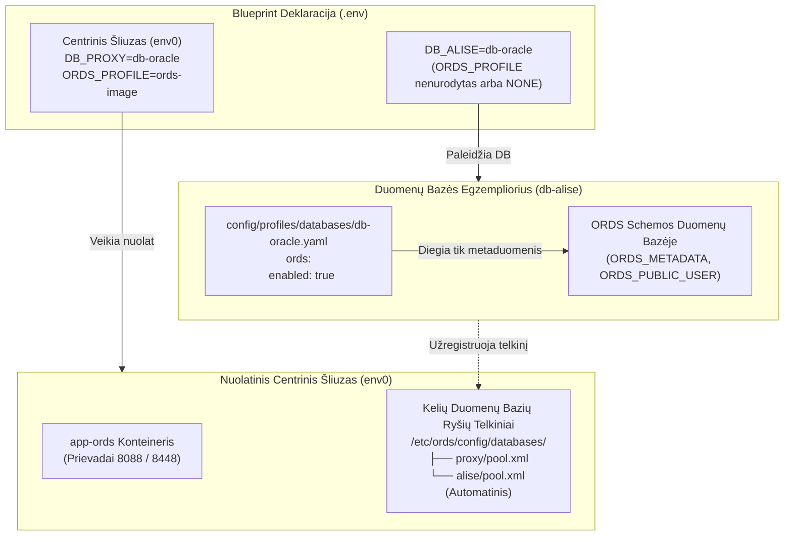

[ 🇬🇧 English ](../ords-profiles-lifecycle.md) | [ 🇪🇪 Eesti ](../et/ords-profiles-lifecycle.md) | [ 🇫🇮 Suomi ](../fi/ords-profiles-lifecycle.md) | [ 🇸🇪 Svenska ](../sv/ords-profiles-lifecycle.md) | [ 🇱🇻 Latviešu ](../lv/ords-profiles-lifecycle.md) | [ 🇱🇹 Lietuvių ](ords-profiles-lifecycle.md)

# 🌐 Oracle REST Data Services (ORDS) Profilių ir Atsieto Gyvavimo Ciklo Vadovas

Šis vadovas dokumentuoja **Oracle REST Data Services (ORDS)** architektūrą, gyvavimo ciklo orkestravimą ir konfigūravimą vietiniuose konteineriuose, nuotoliniuose serveriuose bei Oracle Autonomous Database (ADB) debesų aplinkose.

---

## 🏛️ 1. Atsietos Architektūros Principai

Šiuolaikinėje modulinėje architektūroje saityno programų šliuzas yra atskirtas nuo duomenų bazės variklio:



### Pagrindinės Architektūros Taisyklės:
1. **`ords.enabled: true` Duomenų Bazės Profilyje:**
   - Paruošia duomenų bazės ORDS schemas, metaduomenis (`ORDS_METADATA`) ir įgaliotuosius naudotojus.
   - **NEPALEIDŽIA** `app-ords` saityno konteinerio.
2. **`ORDS_PROFILE` Blueprint Faile:**
   - Nustato, ar bus sukurtas `app-ords` saityno konteineris.
   - Jei parametras nenurodytas arba yra `NONE`, duomenų bazė veikia kaip gryna foninė paslauga be papildomos RAM apkrovos.
3. **Automatinė Registracija Centriniame Šliuze:**
   - Kai fone veikia Blueprint 0 (`env0`), kiekviena naujai diegiama duomenų bazė automatiškai sugeneruoja ryšių telkinį `<telkinio_pavadinimas>.xml` ir iš karto atnaujina centrinį ORDS konteinerį.

---

## 📦 2. Trys Kanoniniai ORDS Profiliai

Visi ORDS profiliai saugomi kataloge `config/profiles/ords/`:

| Profilis | Failas | Tipas | Optimizavimas ir Tikslas |
| :--- | :--- | :--- | :--- |
| **`ords-image`** | `config/profiles/ords/ords-image.yaml` | `image` | **Oficialus Oracle OCR Konteinerio Atvaizdis.** (`container-registry.oracle.com/database/ords:latest`). Antivirusams optimizuotas, greitas startas, be vietinio išpakavimo. Rekomenduojama kūrimui ir CI/CD. |
| **`ords-local-custom`** | `config/profiles/ords/ords-local-custom.yaml` | `local_custom` | **Vietinio Pasirinktinio Scenarijaus Diegimas.** Naudoja oficialius paketus iš `binaries/ords/`, išpakuojamus laikinajame konteineryje. |
| **`ords-remote-custom`** | `config/profiles/ords/ords-remote-custom.yaml` | `remote_custom` | **Nuotolinio Serverio Šliuzas.** Jungiasi prie esamo ORDS serverio per SSH arba HTTPS. |

---

## ☁️ 3. Oracle Autonomous Database (ADB) Integravimas

Oracle Autonomous Database (Cloud ADB Serverless) apima iš anksto įdiegtą ir debesyje valdomą ORDS:

```yaml
# config/profiles/databases/db-adb.yaml
ords:
  enabled: true
  install_in_db: false       # NEŠALINKITE ir neperrašykite debesies valdomo ORDS_METADATA
  verify_version_match: true # Patikrinti versijų suderinamumą su centriniu šliuzu
```

---

## 💡 4. Nurodymai, Kai ORDS Serveris Nėra Sukonfigūruotas

Jei duomenų bazė paleidžiama be `ORDS_PROFILE` ir centrinis ORDS neveikia:
- Terminale pateikiamas aiškus pranešimas:
  `ℹ️  ORDS serveris nėra sukonfigūruotas (trūksta app-ords konteinerio).`
  `💡 Nurodymas: Norėdami įjungti saityno sąsają, paleiskite: ./scripts/setup-all.sh --b 0 arba pridėkite prie blueprint ORDS_PROFILE=ords-image`

---

## 🚀 5. Greitosios Komandos

```bash
# 1. Paleisti nuolatinį centrinį ORDS šliuzą:
./scripts/setup-all.sh -b 0

# 2. Paleisti atskirą verslo duomenų bazę (automatiškai užregistruoja telkinį centriniame ORDS):
./scripts/setup-all.sh -b 1

# 3. Patikrinti saityno adresus:
./scripts/check-urls.sh
```
