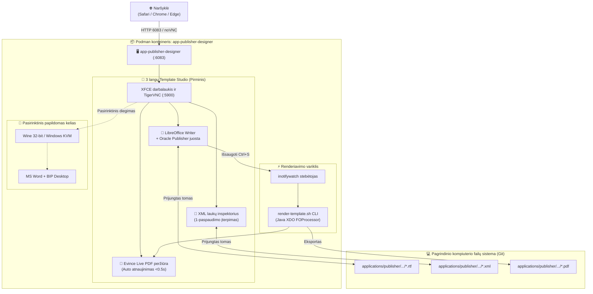

# Oracle Analytics Publisher šablonų kūrėjas ir prieinamumo gidas: LibreOffice Writer 3-Pane Studio (Pirminis) & MS Word KVM/Wine (Pasirinktinis)

[ 🇬🇧 English ](../publisher-template-builder-guide.md) | [ 🇪🇪 Eesti ](../et/publisher-template-builder-guide.md) | [ 🇫🇮 Suomi ](../fi/publisher-template-builder-guide.md) | [ 🇸🇪 Svenska ](../sv/publisher-template-builder-guide.md) | [ 🇱🇻 Latviešu ](../lv/publisher-template-builder-guide.md) | [ 🇱🇹 Lietuvių ](publisher-template-builder-guide.md)

---

## 1. Apžvalga ir verslo vertė

Pikselių tikslumo verslo dokumentų (sąskaitų faktūrų, važtaraščių, finansinių ataskaitų) kūrimas Oracle Analytics Publisher platformoje remiasi **Rich Text Format (RTF) šablonais**, kurie sujungiami su **XML duomenimis**, sukuriant prieinamus ir struktūrizuotus PDF failus.

### 🛑 Įmonių IT apribojimai:
1. **Nėra Microsoft Office licencijų kūrimo ir CI konteineriuose:** Įmonės licencijos pririštos prie asmeninių kompiuterių. CI/CD ir Linux konteineriai neturi prieigos prie MS Word.
2. **Užrakintos darbo vietos (be administratoriaus teisių):** Kūrėjai negali diegti vietinių programų (`BIPublisherDesktop64.exe`) įmonės nešiojamuosiuose kompiuteriuose.
3. **Kelių platformų palaikymas:** Kūrėjams su **macOS** arba **Linux** nėra oficialaus Word Template Builder priedo.

### 💡 Sprendimas: LibreOffice 3-Pane Studio (Pirminis SSoT):
Konteineris **`app-publisher-designer`** (Blueprint 9) suteikia paruoštą darbo vietą tiesiogiai naršyklėje per **HTML5 noVNC prievade 6083** (`http://localhost:6083/vnc.html`):
- **LibreOffice 7.x/24.x Writer (Iš anksto sukonfigūruotas SSoT):** Yra pritaikyti **⚡ Oracle Publisher** meniu, įrankių juostos, XML žymų įterpimas ir sparčiųjų klavišų palaikymas be komercinių licencijų poreikio.
- **Evince Live PDF peržiūros programa:** Perrenderuoja ir atnaujina PDF failą greičiau nei per 0,5 sekundės po kiekvieno išsaugojimo (`Ctrl+S`).
- **Oracle XML laukų inspektorius:** Vizualus XML medis su 1-paspaudimo įterpimu tiesiai į Writer per X11 automatizavimą.
- **Konteineryje veikiantis greitasis renderiavimo variklis:** Integruotas Java Oracle XDO / `FOProcessor` ir komandinės eilutės PDF eksportas.
- **Tiesioginė Git sinchronizacija:** Šablonai saugomi tiesiogiai pagrindinio kompiuterio aplanke `templates/publisher/`.
- **Pasirinktinis režimas:** Microsoft Word per Wine arba Windows KVM yra prieinamas kaip alternatyva tiems, kurie turi 32 bitų diegimo failus.

---

## 2. Architektūra ir topologija



---

## 3. Greita pradžia: LibreOffice Writer 3-Pane Studio (Pirminis)

### 1 žingsnis: Paleiskite konteinerį
Per Blueprint 9 (Rekomenduojama):
```bash
./scripts/setup-all.sh -b 9
```
Arba per skriptą:
```bash
./scripts/publisher/start-designer.sh --lang lt   # Parinktys: en, et, fi, sv, lv, lt
```

### 2 žingsnis: Atidarykite Template Studio naršyklėje
1. Naršyklėje atidarykite `http://localhost:6083/vnc.html`.
2. Dukart spustelėkite darbalaukio piktogramą **🚀 Oracle Publisher Template Studio**.
3. Automatiškai išdėstomi 3 langai:
   - **Kairėje (65%):** **LibreOffice Writer** su aktyviu šablonu (`arve_test_standard.rtf`).
   - **Viršuje dešinėje (35%):** **Evince Live PDF peržiūra**, rodanti `valmis_arve.pdf`.
   - **Apačioje dešinėje (35%):** **Oracle XML laukų inspektorius** su `arve_test_andmed.xml`.

### 3 žingsnis: Kūrimas ir žymų įterpimas
1. **Oracle Publisher meniu ir įrankių juosta:**
   - `🏷️ Įterpti lauką`: Įterpia `<?TAG_NAME?>` ties žymekliu.
   - `🔁 for-each ciklas`: Apgaubia eilutes `<?for-each:LINES/LINE?> ... <?end for-each?>`.
   - `⚡ Greitasis PDF renderiavimas`: Sugeneruoja PDF nedelsiant.
2. **1-paspaudimo įterpimas iš XML inspektoriaus:**
   - Pasirinkite elementą XML medyje ir spustelėkite **👉 Sisesta Kursorisse**.
3. **Tiesioginė peržiūra:**
   - Išsaugokite faile Writer (`Ctrl+S`) — Evince atnaujina vaizdą greičiau nei per 0,5 sekundės.

---

## 4. Testavimas konteineryje ir pagrindiniame kompiuteryje

### 4.1 CLI testavimo įrankis (`test-render.sh`)
```bash
./scripts/publisher/test-render.sh \
  templates/publisher/samples/arve_test_standard.rtf \
  templates/publisher/samples/arve_test_andmed.xml \
  [išvestis.pdf]

# Daugiakalbis renderiavimas su XLIFF:
./scripts/publisher/test-render.sh --locale lt
```

### 4.2 Vy Ferrymas konteinerio viduje
```bash
podman exec -it app-publisher-designer /u01/oracle/bin/render-template.sh \
  /u01/templates/samples/arve_test_standard.rtf \
  /u01/templates/samples/arve_test_andmed.xml \
  /u01/templates/samples/valmis_arve_lt.pdf \
  --locale lt
```

### 4.3 Live Watcher & Hot-Reload (`watch-render-host.sh`)
```bash
./scripts/publisher/watch-render-host.sh \
  templates/publisher/samples/arve_test_standard.rtf \
  templates/publisher/samples/arve_test_andmed.xml \
  templates/publisher/samples/valmis_test_arve.pdf
```
Stebi failo pakeitimus ir automatiškai perrenderuoja PDF po kiekvieno išsaugojimo.

---

## 5. Prieinamumas & PDF/UA-1 patikros procesas

Dokumentai privalo atitikti **PDF/UA-1 (ISO 14289-1)**, **WCAG 2.1 Level AA**, **Europos prieinamumo aktą (EAA / EN 301 549)** ir **Section 508**.

### 4 žingsnių testavimo procesas:
1. **1 žingsnis: RTF struktūros patikra:**
   ```bash
   ./scripts/publisher/validate-rtf-accessibility.sh templates/publisher/samples/accessible_starter_template.rtf --strict
   ```
2. **2 žingsnis: Prieinamo PDF eksportas su žymomis (`/StructTreeRoot`, `/MarkInfo`, `/Lang`).**
3. **3 žingsnis: PDF žymų ir ekrano skaitytuvo balso imitacija:**
   ```bash
   ./scripts/publisher/validate-pdf-accessibility.sh templates/publisher/samples/valmis_arve_lt.pdf
   ```
4. **4 žingsnis: Automatizuotas CI testų paketas & ACR ataskaita:**
   ```bash
   ./tests/integration/test-publisher-accessibility-suite.sh
   ```
   Generuoja oficialią ataskaitą: [`tests/reports/accessibility_compliance_acr.md`](../../tests/reports/accessibility_compliance_acr.md).

Išsamią specifikaciją rasite:
👉 [`.agents/skills/oracle_publisher_accessibility/SKILL.md`](../../.agents/skills/oracle_publisher_accessibility/SKILL.md).

---

## 6. Darbo eiga su VS Code & GitHub Copilot

1. Copilot naudoja instrukcijas iš [`.github/copilot-instructions.md`](../../.github/copilot-instructions.md).
2. Paleiskite `./scripts/publisher/watch-render-host.sh` ir atlikite pakeitimus su momentine peržiūra.

---

## 7. Pasirinktinai: MS Word & BIP Desktop per Wine arba Windows KVM

1. Įkelkite `setup.exe` ir `BIPublisherDesktop32.exe` į `binaries/publisher/`.
2. Paleiskite `./scripts/publisher/setup-word-designer.sh`.

---

## 8. Šablonų sintaksės trumpas žinynas

| Funkcija | Oracle BI Publisher RTF Tag | Aprašymas |
| :--- | :--- | :--- |
| **Lauko reikšmė** | `<?INVOICE_NUM?>` | Išveda XML elemento reikšmę |
| **Ciklas** | `<?for-each:G_LINES?>` ... `<?end for-each?>` | Cikliškai eina per eilutes |
| **Sąlyga** | `<?if:VAT_RATE > 0?>` ... `<?end if?>` | Rodo turinį tik esant sąlygai |
| **Lentelės antraštės kartojimas**| `\trhdr` | Privaloma PDF/UA-1 lentelėms |
| **Dokumento antraštė**| Stilius `Heading 1` | Privaloma viena H1 žyma ekrano skaitytuvams |

---

## 9. Įmonės GitOps Standartas (`applications/publisher/`), REST Diegimas ir CI/CD Konvejeris

Norint užtikrinti įmonės lygio patikimumą ir suderinamumą su CI/CD, visi šablonai ir duomenų modeliai valdomi kataloge `applications/publisher/`, kuris 1:1 atitinka Oracle Analytics Publisher serverio katalogą (`/Custom/<Sritis>/<Ataskaita>/`).

### 9.1 Katalogo Struktūra ir GitOps Invariantas

```text
applications/publisher/
├── .gitignore                         # Neįtraukia binarinių *.xdoz ir *.xdmz archyvų
├── README.md                          # Dokumentacija (6 kalbos: EN, ET, FI, SV, LV, LT)
└── Custom/
    └── Invoices/
        └── Invoice_Report/
            ├── Invoice_Report.xdo/       # Git sekamas ataskaitos paketas
            │   ├── template.rtf          # Prieinamas PDF/UA-1 RTF šablonas
            │   ├── template_et.xlf       # Estų kalbos XLIFF vertimai
            │   ├── template_fi.xlf       # Suomių kalbos XLIFF vertimai
            │   └── _manifest.xml         # Publisher ataskaitos manifestas
            └── Invoice_DataModel.xdm/    # Git sekamas duomenų modelio paketas
                ├── datamodel.sql         # Švari SQL duomenų atrankos užklausa
                ├── datamodel.xml         # Duomenų modelio XML (susietas su ALISE_APP_DB)
                └── sample_data.xml       # Pavyzdiniai duomenys testavimui
```

### 9.2 Komandinės Eilutės Įrankiai (CLI)

1. **Sukurti naują ataskaitą:**
   ```bash
   ./scripts/publisher/create-report.sh Custom/Invoices/Packing_Slip "Važtaraštis"
   ```
2. **Įdiegti į serverį (REST API / Copy):**
   ```bash
   ./scripts/publisher/deploy-template.sh Custom/Invoices/Invoice_Report --mode rest
   ```
3. **Įdiegti su tiesioginiu PDF bandomuoju generavimu serveryje:**
   ```bash
   ./scripts/publisher/deploy-template.sh Custom/Invoices/Invoice_Report --render
   ```

### 9.3 Rolės ir SEPS Wallet Rotacija

| Naudotojas | WebLogic Grupė | SEPS Wallet Alias | Teisės |
| :--- | :--- | :--- | :--- |
| `bip_developer` | `XMLP_DEVELOPER`, `XMLP_TEMPLATE_DESIGNER` | `PUBLISHER_DEVELOPER` | Šablonų ir duomenų modelių kūrimas aplanke `/Custom/` |
| `bip_user` | `XMLP_SCHEDULER`, `XMLP_ANALYZER` | `PUBLISHER_USER` | Ataskaitų vykdymas ir istorijos peržiūra |
| `bip_admin` | `XMLP_ADMIN` | `PUBLISHER_ADMIN` | BIP katalogo administravimas (be WebLogic konsolės) |

Slaptažodžių rotacija su Oracle SEPS Wallet:
```bash
./scripts/rotate-password.sh publisher dev     # Rotuoja bip_developer slaptažodį
./scripts/rotate-password.sh publisher user    # Rotuoja bip_user slaptažodį
./scripts/rotate-password.sh publisher admin   # Rotuoja bip_admin slaptažodį
```

### 9.4 GitHub Actions CI/CD Sekų Diagrama (`.github/workflows/deploy-publisher-reports.yml`)

```mermaid
sequenceDiagram
    autonumber
    actor Dev as 👨‍💻 Laidos valdytojas<br/>(Programuotojas / Administratorius)
    participant GHA as ⚙️ GitHub Actions Runner<br/>(deploy-publisher-reports)
    participant QG as 🧪 CI Kokybės vartai<br/>(Linter & Test-Render)
    participant Art as 📦 GitHub Artefaktai<br/>(Atsisiunčiamas PDF)
    participant Sec as 🔑 Saugi paslapčių saugykla<br/>(GitHub Secrets / OIDC)
    participant Pub as 🏢 Publisher serveris<br/>(:9502 REST API)

    Dev->>GHA: 1. Paleisti workflow_dispatch<br/>(aplinka: dev/test/prod, ataskaitos kelias)
    activate GHA

    rect rgb(30, 41, 59)
        Note over GHA,QG: Automatizuoti kokybės vartai prieš diegimą
        GHA->>QG: 2. XML ir SQL sintaksės patikra<br/>(xmllint datamodel.xml)
        QG-->>GHA: ✅ Sintaksė patikrinta
        GHA->>QG: 3. RTF prieinamumo auditas<br/>(PDF/UA-1, \trhdr, H1/H2, Alt-tekstas)
        QG-->>GHA: ✅ Prieinamumo reikalavimai įvykdyti
        GHA->>QG: 4. Bandomasis generavimas be GUI<br/>(su sample_data.xml)
        QG-->>GHA: ✅ Bandomasis PDF sugeneruotas
        GHA->>Art: 5. Įkelti bandomąjį PDF kaip artefaktą<br/>(actions/upload-artifact@v4)
        Art-->>Dev: 👁️ PDF atsisiunčiamas GitHub sąsajoje
    end

    rect rgb(15, 23, 42)
        Note over GHA,Pub: Diegimas į Publisher serverį (REST API)
        GHA->>Sec: 6. Užklausti įgaliojimų (OAuth2 Bearer<br/>arba bip_developer slaptažodis)
        Sec-->>GHA: 🔑 Saugi autorizacijos antraštė
        GHA->>Pub: 7. POST /xmlpserver/services/rest/v1/reports<br/>(deploy-template.sh --mode rest)
        Pub-->>GHA: HTTP 200 / 201 Created (Idempotentus)
        
        opt Jei pasirinktas test_render
            GHA->>Pub: 8. POST /reports/{path}/run (Serverio generavimas)
            Pub-->>GHA: 📑 Oficialus serverio PDF
        end
    end

    GHA->>Dev: 9. Paskelbti $GITHUB_STEP_SUMMARY<br/>(Santrauka ir ataskaitų nuorodos)
    deactivate GHA
```



