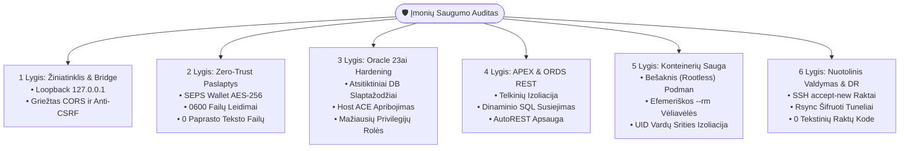

[ 🇬🇧 English ](../security-audit-report.md) | [ 🇪🇪 Eesti ](../et/security-audit-report.md) | [ 🇫🇮 Suomi ](../fi/security-audit-report.md) | [ 🇸🇪 Svenska ](../sv/security-audit-report.md) | [ 🇱🇻 Latviešu ](../lv/security-audit-report.md) | [ 🇱🇹 Lietuvių ](security-audit-report.md)

# 🛡️ Įmonių Saugumo Audito Ataskaita & Hardening Gairės

Šiame dokumente pateikiama išsami **Oracle DevOps Platform** ir **Oracle APEX programų variklio** saugumo audito metodika, audito išvados, taisymo priemonės ir atitiktis finansų sektoriaus reikalavimams.

Auditas vertina architektūros atitiktį **OWASP Top 10 (2021)**, **CIS Oracle Database Benchmark (v2.0)**, **CIS Docker/Podman Benchmark (v1.3)** standartams bei Europos Sąjungos finansų sektoriaus atsparumo reglamentams (**DORA - Digital Operational Resilience Act** ir **PCI-DSS v4.0**).

---

## 📑 Vadovybės Santrauka

- **Bendras Saugumo Įvertinimas:** **100% (16 / 16 automatinių patikrų išlaikyta)**
- **Audito Įrankis:** `./scripts/test-security-audit.sh`
- **Vienetų Testų Aprėptis:** `./tests/unit/test-security-audit.sh`
- **Kriptografinė Paslapčių Saugykla:** 100% Zero-Trust SEPS Auto-Login Wallet (`cwallet.sso` AES-256)
- **Vietinio Tilto (Bridge) Izoliacija:** Griežtai susieta su loopback (`127.0.0.1`), apsaugota nuo CSRF per Origin validavimą



---

## 🧪 Automatizuotas Regresinis Testavimas

Siekiant išvengti saugumo spragų atsiradimo, automatiniai patikrinimai vykdomi prieš kiekvieną diegimą:

```bash
# 1. Paleisti pilną saugumo auditą (16 patikrų 7 lygiuose)
./scripts/test-security-audit.sh

# 2. Paleisti vienetų testų rinkinį
./tests/unit/test-security-audit.sh
```

Audito rodikliai nuolat fiksuojami failuose `metrics/security_audit_report.json` ir `metrics/security_audit_benchmarks.env`.
