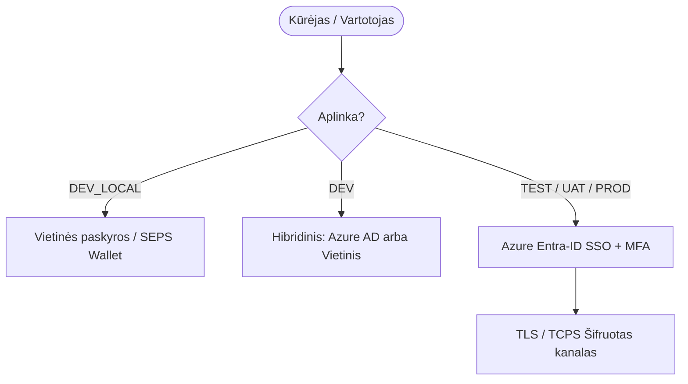

[ 🇬🇧 English ](../security.md) | [ 🇪🇪 Eesti ](../et/security.md) | [ 🇫🇮 Suomi ](../fi/security.md) | [ 🇸🇪 Svenska ](../sv/security.md) | [ 🇱🇻 Latviešu ](../lv/security.md) | [ 🇱🇹 Lietuvių ](security.md)

# 🛡️ Oracle Free DB & APEX sauga ir SSO architektūra

Šiame dokumente pateikiami platformos saugumo principai, slaptažodžių valdymas, kūrėjų vaidmenys ir vieningo prisijungimo (SSO / Azure Entra-ID) architektūra.

---

## 1. Vietinis paslapčių valdymas (zero-trust - 5 taisyklė)

Visi slaptažodžiai ir paslaptys saugomi AES-256 užšifruotoje **Oracle SEPS (Secure External Password Store) Auto-Login Wallet** piniginėje (`cwallet.sso`).

- **Atviro Teksto Failų Draudimas:** Slaptažodžiai niekada nerašomi į diską atviru tekstu (jokių `.json`, `.txt`, `.env` ar `.cache` failų).
- **Atmintyje Vykdomas Iššifravimas:** Slaptažodžiai dinamiškai iššifruojami atmintyje pagal poreikį:
  ```bash
  ./scripts/get-password.sh <alias>
  ```
- **Mažiausių Teisių Principas:** Kiekvienai duomenų bazei automatiškai sugeneruojamos standartinės paskyros:
  - `DBA_ADMIN`: Administracinės užduotys (`DBA` rolė).
  - `DEV`: Kasdienis kūrėjas su Oracle 23ai `DB_DEVELOPER_ROLE`.
  - `APP`: Programų vykdymo paskyra (`CREATE SESSION`, `RESOURCE`).
  - `VIEWER`: Tik skaitymo auditas (`READ ANY TABLE`).

---

## 2. Aplinkų autentifikavimo matrica

| Aplinka (`ENVIRONMENT_TYPE`) | Vieta | Autentifikavimo Tipas (APEX & DB) | Vartotojų Valdymas | TLS Šifravimas (TCPS) |
| :--- | :--- | :--- | :--- | :--- |
| **`DEV_LOCAL`** | Kūrėjo Kompiuteris | Vietinės SEPS Wallet paskyros | Automatizuotas / `create-developer.sh` | Pasirinktinai (Offline) |
| **`DEV`** | Bendras Kūrimo Serveris | Hibridinis (Vietinis + **Azure AD**) | Azure AD + JIT / Vietinės paskyros | Pasirinktinai |
| **`TEST`** | Testavimo Serveris (CI/CD) | **Azure Entra-ID (SSO)** | Centrinis (Azure AD grupės) | Taip (Prievadas 2484) |
| **`UAT`** | Priešgamybinis Serveris | **Azure Entra-ID (SSO)** | Centrinis (Azure AD grupės) | Taip (Prievadas 2484) |
| **`PROD`** | Gamybinis Serveris | **Azure Entra-ID (SSO)** | Centrinis (Azure AD grupės) | Taip (Prievadas 2484) |



---

## 3. Adaptyvus 5 lygių TLS/HTTPS variklis

Žiniatinklio paslaugos (ORDS, APEX, Analytics Publisher) naudoja adaptyvią sertifikatų hierarchiją be administratoriaus teisių (`scripts/internal/resolve-tls-mode.sh`):

```text
config/certs/
├── custom/          # 0 lygis: Rankiniu būdu pridėti sertifikatai (tls.crt, tls.key)
├── public/          # 1 lygis: Viešasis FQDN & Let's Encrypt / Viešasis CA
├── corp/            # 2 lygis: Įmonės Vidinis PKI (corp_cert.crt)
├── user_ca/         # 3 lygis: Vietinis Root CA (vartotojo raktinėje, 0-admin)
└── self_signed/     # 4 lygis: Dinamiškai sugeneruotas savarankiškai pasirašytas sertifikatas
```

---

## 4. Vieningas prisijungimas (SSO)

- **Duomenų Bazės Lygio SSO:** Oracle 23ai palaiko Azure AD OAuth2 žetonus ir visuotines roles.
- **ORDS & REST API:** ORDS tikrina gaunamus Bearer JWT žetonus pagal Azure AD viešuosius raktus.
- **APEX Programų SSO:** Programos naudoja Social Sign-In (OpenID Connect) su automatiniu vartotojų registravimu.

---

## 5. Analytics Publisher Saugumo ir Rolų Matrica

Oracle Analytics Publisher taiko dviejų fazių įmonės lygio saugumo modelį:

### 1 Fazė: Vietinė Zero-Trust SEPS Wallet (Numatytoji Aktyvi)
Visi prisijungimo duomenys saugiai saugomi šifruotoje Oracle SEPS Auto-Login Wallet (`cwallet.sso`). Slaptažodžiai niekada nerašomi į diską atviru tekstu.

| Rolė / Paskyra | WebLogic Saugumo Grupė | SEPS Wallet Alias | Teisės ir Atsakomybės Sritis |
| :--- | :--- | :--- | :--- |
| `bip_developer` | `XMLP_DEVELOPER`, `XMLP_TEMPLATE_DESIGNER` | `PUBLISHER_DEVELOPER` | Šablonų, XLIFF vertimų ir duomenų modelių kūrimas aplanke `/Custom/` |
| `bip_user` | `XMLP_SCHEDULER`, `XMLP_ANALYZER` | `PUBLISHER_USER` | Ataskaitų vykdymas, planavimas, istorijos peržiūra ir REST API vartotojai |
| `bip_admin` | `XMLP_ADMIN` | `PUBLISHER_ADMIN` | BIP katalogo administravimas (izoliuotas nuo WebLogic konsolės) |

Slaptažodžių valdymo ir rotacijos komandos:
```bash
./scripts/get-password.sh PUBLISHER_DEVELOPER
./scripts/rotate-password.sh publisher dev     # Rotuoja programuotojo slaptažodį
./scripts/rotate-password.sh publisher user    # Rotuoja vartotojo slaptažodį
./scripts/rotate-password.sh publisher admin   # Rotuoja administratoriaus slaptažodį
./scripts/rotate-password.sh publisher all     # Rotuoja visus Publisher slaptažodžius
```

### 2 Fazė: Įmonės Debesijos Tapatybė ir M2M (Laukimo / Standby Režimas)
- **Interaktyvūs interneto vartotojai:** SAML 2.0 Web SSO su Azure Entra ID / Okta / PingFederate.
- **REST API / CI/CD konvejeriai:** OAuth2 M2M Bearer žetonai (`client_credentials` suteikimas), susieti su virtualiomis AppRoles (`BIP_DEVELOPER`, `BIP_INTEGRATION`).
- Gali būti aktyvuota pagal poreikį be kodo pakeitimų per `config/profiles/publisher/publisher-standard.yaml` ir `./scripts/internal/configure-publisher-sso.sh`.

