[ 🇬🇧 English ](../setup-all-workflow.md) | [ 🇪🇪 Eesti ](../et/setup-all-workflow.md) | [ 🇫🇮 Suomi ](../fi/setup-all-workflow.md) | [ 🇸🇪 Svenska ](../sv/setup-all-workflow.md) | [ 🇱🇻 Latviešu ](../lv/setup-all-workflow.md) | [ 🇱🇹 Lietuvių ](setup-all-workflow.md)

# Diegimo proceso eigos diagrama ir architektūriniai žingsniai (setup-all.sh)

Šiame dokumente aprašomas pagrindinio platformos diegimo scenarijaus `./scripts/setup-all.sh` visas gyvavimo ciklas, sprendimų priėmimo taškai ir optimizavimo logika.

---

## 📊 Eigos diagrama (Flowchart)

> [!TIP]
> Jei jūsų Markdown peržiūros priemonė nepalaiko Mermaid diagramų, žiūrėkite išsaugotą vaizdą čia:

```mermaid
flowchart TD
    Start([Paleidimas: setup-all.sh]) --> LoadConfig[1. Įkelti nustatymus iš .env]
    LoadConfig --> CheckArgs{"Patikrinti CLI<br/>argumentus"}
    
    CheckArgs -->|--force / -y| NonInteractive[Automatizuotas režimas:<br/>Praleisti patvirtinimus]
    CheckArgs -->|Numatytasis| Interactive[Prašyti patvirtinimo &<br/>patikrinti disko vietą]
    
    NonInteractive --> CheckSQLcl
    Interactive --> CheckSQLcl
    
    CheckSQLcl{"Ar vietinis SQLcl<br/>ir Java yra?"}
    CheckSQLcl -->|Taip| LocalSQLcl[Naudoti vietinį<br/>run_sqlcl apvalkalą]
    CheckSQLcl -->|Ne| EphemeralSQLcl["Atsarginis: Naudoti laikiną<br/>SQLcl konteinerį (SQLCL_CONTAINER_IMAGE)"]
    
    LocalSQLcl --> Step1[1 žingsnis: Patikrinti ir<br/>atsisiųsti konteinerių atvaizdus]
    EphemeralSQLcl --> Step1
    
    Step1 --> Step2{"Ar ORDS zip<br/>jau talpykloje?"}
    Step2 -->|Taip| SkipORDSDownload[Praleisti ORDS atsisiuntimą]
    Step2 -->|Ne| DownloadORDS[Atsisiųsti ORDS zip iš .env nuorodos]
    
    DownloadORDS --> Step3{"Ar APEX zip<br/>pasikeitė ar trūksta?"}
    SkipORDSDownload --> Step3
    
    Step3 -->|Ne| SkipAPEXUnzip[Praleisti išpakavimą pagal žymeklio failą]
    Step3 -->|Taip| UnzipAPEX[Išpakuoti APEX zip į apex/ aplanką]
    
    UnzipAPEX --> Step4["4 žingsnis: Sugeneruoti Podman Secrets<br/>(/run/secrets/) & paleisti compose"]
    SkipAPEXUnzip --> Step4
    
    Step4 --> WaitDB{"Laukti, kol db-apex-proxy<br/>taps healthy"}
    WaitDB --> Step45["4.5 žingsnis: Registruoti duomenis<br/>Oracle SEPS Wallet (cwallet.sso)"]
    
    Step5[5 žingsnis: Laukti ORDS paleidimo]
    Step45 --> Step5
    
    Step5 --> Step6{"Patikrinti: Ar APEX<br/>jau yra DB?"}
    Step6 -->|Taip, ta pati versija| SkipAPEXInstall[Praleisti APEX variklio diegimą]
    Step6 -->|Ne arba sena| InstallAPEX["Įdiegti APEX (zip nukopijuojamas<br/>& išpakuojamas konteineryje)"]
    
    InstallAPEX --> CheckPatch{"Ar APEX pataisa<br/>jau įdiegta?"}
    SkipAPEXInstall --> CheckPatch
    
    CheckPatch -->|Taip| SkipPatch[Praleisti pataisą]
    CheckPatch -->|Ne, zip rastas| ApplyPatch[Įdiegti pataisą per catpatch.sql<br/>& atnaujinti ORDS atvaizdus]
    
    ApplyPatch --> Step7[7 žingsnis: Inicializuoti schemas<br/>& vykdyti Liquibase migracijas]
    SkipPatch --> Step7
    
    Step7 --> Step8{"Ar nurodyta<br/>--no-monitor-app?"}
    Step8 -->|Taip| SkipApps[Praleisti programų diegimą]
    Step8 -->|Ne, failai rasti| DeployApps[Diegti paruoštas APEX programas]
    
    DeployApps --> CreateTestUsers["Sukurti testinius naudotojus: TEST_DEV<br/>(ORDS.ENABLE_SCHEMA) & TEST_WEB_USER"]
    SkipApps --> CreateTestUsers
    
    CreateTestUsers --> TrustCert{"Nustatyti OS sertifikato<br/>pasitikėjimui"}
    
    TrustCert -->|macOS| TrustMac["Sudo keychain: security add-trusted-cert"]
    TrustCert -->|Windows / Git Bash| TrustWin["Naudotojo saugykla: certutil -user -store Root"]
    TrustCert -->|WSL| TrustWSL["WSL/Windows: certutil.exe (per wslpath)"]
    TrustCert -->|--force / Kita OS| SkipTrust[Praleisti sertifikato registravimą]
    
    TrustMac --> SaveMetrics[Išsaugoti trukmę metrics/setup_benchmarks.json]
    TrustWin --> SaveMetrics
    TrustWSL --> SaveMetrics
    SkipTrust --> SaveMetrics
    
    SaveMetrics --> End([Pabaiga: Aplinka parengta, slaptažodžiai užšifruoti Oracle SEPS Wallet])
```

> 

---

## 💡 Architektūriniai principai ir operatyviniai veiksmai:

1. **Saugi prieigos duomenų kontrolė (Podman Secrets -> Oracle SEPS Wallet):**
   * **Pirminis paleidimas (Bootstrap):** Konteinerių starto metu `generate-passwords.sh` sugeneruoja unikalius atsitiktinius slaptažodžius atmintyje esančioje **Podman Secrets** saugykloje (`/run/secrets/`). Kodo bazėje nėra jokių numatytųjų slaptažodžių.
   * **Ilgalaikis saugojimas (Runtime):** 4.5 žingsnyje `create-wallet.sh` registruoja visus duomenis (`ADMIN`, `DB_APEX_PROXY_SYS`, `DB_TEST_DEV`, `TEST_WEB_USER`) šifruotoje **Oracle SEPS Wallet** (`ewallet.p12` / `cwallet.sso`).
2. **Automatinis ORDS & SQL Developer Web aktyvavimas (`TEST_DEV`):**
   * `TEST_DEV` naudotojui priskiriami Oracle ADB kūrėjo vaidmenys ir aktyvuojama ORDS REST sąsaja (`ORDS.ENABLE_SCHEMA` keliu `test_dev`).
   * Kūrėjai gali iškart prisijungti adresu `https://localhost:8443/ords/test_dev/_sdw/`.
3. **Intelektuali SQLcl alternatyva (laikinas CLI konteineris):**
   Jei vietinė Java ar SQLcl nepasiekiama, scenarijus automatiškai nukreipia vykdymą per **laikiną SQLcl konteinerį** (`SQLCL_CONTAINER_IMAGE`) su `--rm` vėliava.
4. **Visiškas idempotentiškumas:**
   * **APEX variklis:** Jei APEX (versija 26.1.2) jau įdiegtas duomenų bazėje, diegimas praleidžiamas (sutaupoma ~5 min.).
   * **APEX pataisa:** Jei pataisų registras rodo atliktą atnaujinimą, `catpatch.sql` paleidimas nevykdomas.
   * **ORDS:** Jei ORDS schema jau sukonfigūruota, pakartotinis diegimas neatliekamas.
5. **Antivirusinės ir disko I/O optimizavimas:**
   Dideli archyvai (APEX) niekada neišpakuojami pagrindinio kompiuterio diske. Vienas `.zip` archyvas nukopijuojamas tiesiai į konteinerio failų sistemą (`/tmp/`) ir išpakuojamas ten.
6. **Kelių platformų SSL sertifikato pasitikėjimas:**
   Vietinis HTTPS naudoja savarankiškai pasirašytą šakninį sertifikatą (`Local Dev Root CA`), kuris automatiškai užregistruojamas OS sertifikatų saugykloje (macOS Keychain, Windows `certutil`, WSL interop).

---

## ❓ Susiję DUK ir oficialūs šaltiniai

- Trikčių šalinimas, atminties trūkumas (OOM), prievadų konfliktai ir momentinių kopijų atkūrimas: [DUK (FAQ)](faq.md).
- Oficialūs Oracle Container Registry atvaizdai ir atsisiuntimai: [Oracle ištekliai ir atsisiuntimai](oracle-resources-and-downloads.md).
