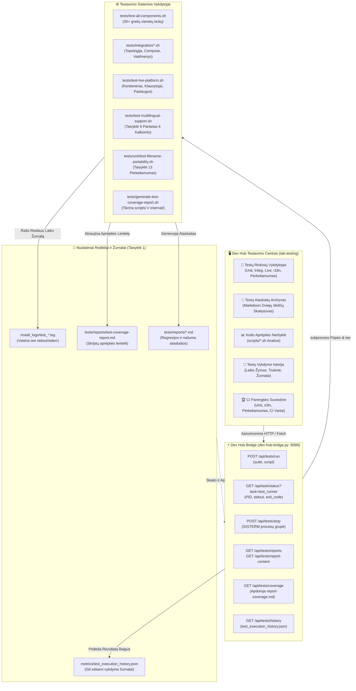

[ 🇬🇧 English ](../testing-framework-and-devhub.md) | [ 🇪🇪 Eesti ](../et/testing-framework-and-devhub.md) | [ 🇫🇮 Suomi ](../fi/testing-framework-and-devhub.md) | [ 🇸🇪 Svenska ](../sv/testing-framework-and-devhub.md) | [ 🇱🇻 Latviešu ](../lv/testing-framework-and-devhub.md) | [ 🇱🇹 Lietuvių ](testing-framework-and-devhub.md)

# 🧪 Testavimo Sistema ir Developer Hub Integracija

Šiame techniniame vadove aprašoma platformos kelių lygių automatizuoto testavimo architektūra, interaktyvus **Testavimo Centras** (`tab-testing`) sistemoje Developer Hub (`docs/dev-hub.html`), asinchroninis testų vykdymas per `dev-hub-bridge.py` ir kodo aprėpties stebėjimas.

---

## 🏛️ 1. Techninė Architektūra ir Komponentų Srautas

Testavimo ekosistema sujungia kūrėjo vartotojo sąsajos veiksmus su testų vykdytojais, realaus laiko registravimu ir Git sekamais rodikliais:

---

## 🚀 2. Testų Rinkinių Apžvalga

Platforma kokybės užtikrinimą suskirsto į specializuotus testų rinkinius:

| Rinkinys | Pavadinimas | Aprašymas | Komanda |
| :--- | :--- | :--- | :--- |
| `unit` | **Vienetų Testų Rinkinys** | 29+ greiti izoliuoti testai be veikiančios DB: konfigūracijos, SEPS piniginė, sintaksė ir logika. | `./tests/test-all-components.sh` |
| `integration` | **Integraciniai Testai** | Kelių duomenų bazių topologija, compose override kūrimas, profilių vaidmenys ir ryšiai. | `tests/integration/*.sh` |
| `live` | **Veikiančios Platformos E2E** | Pilnas regresinis testavimas prieš veikiančius konteinerius, DB klausytojus ir paslaugas. | `./tests/test-live-platform.sh` |
| `i18n` | **Daugiakalbystės Paritetas** | Griežtas Taisyklės 9 auditas, tikrinantis žodyno simetriją visomis 6 kalbomis (EN, ET, FI, SV, LV, LT). | `./tests/test-multilingual-support.sh --all` |
| `portability` | **Failų Vardų Perkeliamumas** | Taisyklės 13 auditas: Windows NTFS/FAT draudžiami simboliai, įrenginių vardai ir ASCII keliai. | `./tests/unit/test-filename-portability.sh` |
| `browser` | **Naršyklė & SSO E2E** | Simuliuoja naršyklės veiksmus, APEX prisijungimą, Dev Hub sparčiuosius klavišus ir SSO autentifikavimą. | `./scripts/test-browser-login.sh` |
| `ci_sim` | **Vietinis GitHub CI** | Vykdo arba peržiūri GitHub Actions darbo eigas autonomiškai laikinuose konteineriuose. | `./scripts/test-local-ci.sh --dry-run` |
| `coverage` | **Aprėpties Generatorius** | Analizuoja aprėptį `scripts/` ir `scripts/internal/` kataloguose bei atnaujina markdown ataskaitą. | `./tests/generate-test-coverage-report.sh` |

---

## 🖥️ 3. Dev Hub Testavimo Centras (`tab-testing`)

Developer Hub testavimo skirtukas siūlo 4 specializuotus poskirtukus:

### 3.1 🚀 Testų Rinkinių Vykdytojas (`test-subtab-runner`)
- **Rinkinių Kortelės**: Leidžia vienu spustelėjimu vykdyti visą rinkinį arba išskleidžiamajame sąraše pasirinktą atskirą skriptą.
- **Integruotas Realaus Laiko Terminalas**: Terminalo langas (`#0b0f19`), rodantis stdout/stderr realiuoju laiku, su automatiniu slinkimu, laikmačiu, žurnalo atsisiuntimu ir stabdymu (`POST /api/tests/stop`).

### 3.2 📑 Testų Ataskaitų Archyvas (`test-subtab-reports`)
- **Dvigubos Skilties Rodinys**: Kairiajame skydelyje pateikiamos ataskaitos (`tests/reports/*.md`) su būsenos žymomis (`PASS`, `FAIL`, `INFO`) ir laiko žymomis.
- **Renderuotas Markdown**: Dešiniajame skydelyje rodomas suformatuotas HTML su veikiančiomis Mermaid diagramomis ir perjungikliu į neapdorotą tekstą.

### 3.3 📊 Kodo Aprėpties Naršyklė (`test-subtab-coverage`)
- **KPI Suvestinė**: Vaizdinė eigos juosta, rodanti padengtų skriptų procentą, bendrą skaičių, padengtus ir nepadengtus skriptus.
- **Interaktyvi Lentelė**: Išvardija visus skriptus `scripts/*.sh` ir `scripts/internal/*.sh` bei susijusius testų failus.
- **Filtravimas ir Paieška**: Greita teksto paieška ir būsenos filtrai ("Visi", "Padengti", "Nepadengti").
- **Analizės Atnaujinimas**: Vykdo `generate-test-coverage-report.sh` tiesiai iš sąsajos.

### 3.4 📜 Vykdymo Istorija (`test-subtab-history`)
- Rodo faile `metrics/test_execution_history.json` užregistruotą istoriją.
- Pateikia laiko žymą, rinkinį, skripto pavadinimą, trukmę sekundėmis, rezultatą, tiesioginę nuorodą į `install_logs/test_*.log` ir mygtuką **Vykdyti iš naujo**.

---

## 🔒 4. Zero-Trust Saugumas ir Taisyklių Atitiktis

1. **Taisyklė 1 (Laiko Matavimas ir Žurnalas)**: Kiekvienas testas automatiškai nukreipia išvestį į `install_logs/test_<suite>_<timestamp>.log` ir išsaugo trukmę faile `metrics/test_execution_history.json`.
2. **Taisyklė 9 (Daugiakalbystė)**: Visa sąsaja yra visiškai išversta į visas šešias kalbas (EN, ET, FI, SV, LV, LT).
3. **Taisyklė 12 (Asinchroninė Užduotis)**: Testai vykdomi fone per `subprocess.Popen`, neužblokuojant naršyklės ir nesukeliant HTTP skirtųjų laikų.
4. **Taisyklė 13 (Perkeliamumas)**: Visi ataskaitų ir žurnalų failų vardai naudoja griežtą ASCII kebab-case standartą be Windows draudžiamų simbolių.
