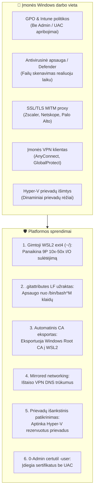

[ 🇬🇧 English ](../windows-enterprise-setup-guide.md) | [ 🇪🇪 Eesti ](../et/windows-enterprise-setup-guide.md) | [ 🇫🇮 Suomi ](../fi/windows-enterprise-setup-guide.md) | [ 🇸🇪 Svenska ](../sv/windows-enterprise-setup-guide.md) | [ 🇱🇻 Latviešu ](../lv/windows-enterprise-setup-guide.md) | [ 🇱🇹 Lietuvių ](windows-enterprise-setup-guide.md)

# Įmonės Windows & WSL2 diegimo ir naudojimo vadovas

Šiame vadove pateikiami nuoseklūs nurodymai, kaip paleisti **Oracle DevOps platformą** **įmonės valdomose Windows darbo vietose** (Windows 10 / 11 Enterprise, valdoma Intune/GPO, be vietinio administratoriaus teisių, su įmonės proxy/Zscaler ir VPN).

---

## 1. Sistemos reikalavimų matrica

| Resursas | Minimalus reikalavimas (BP 0 / 1 / 2) | Rekomenduojama (BP 5 / 6 / 7 / 8) | Komentarai & pagrindimas |
| :--- | :--- | :--- | :--- |
| **Procesorius (CPU)** | **4 branduoliai (8 gijos)** x86_64 | **8 branduoliai (16 gijų)** x86_64 | Virtualizacija (**VT-x / AMD-V**) turi būti įjungta BIOS/UEFI. ARM64 (Snapdragon) nepalaikoma Oracle 23ai konteineriams. |
| **Darbinė atmintis (RAM)** | **16 GB Host RAM**<br/>*(WSL2: 6 GB)* | **32 GB Host RAM**<br/>*(WSL2: 12–16 GB)* | Windows + Teams + Defender sunaudoja 5–6 GB. Oracle Free reikia 2.5 GB, ORDS 1 GB, WebLogic/Publisher 3–4 GB. 8 GB kompiuteriai veikia lėtai. |
| **Disko vieta (Storage)** | **50 GB laisvos vietos SSD** | **100 GB laisvos vietos NVMe SSD** | Konteinerių atvaizdžiai užima ~25 GB. Mechaniniai HDD diskai griežtai draudžiami dėl lėto I/O. |
| **Operacinė sistema** | **Windows 10 Enterprise / Pro** (21H2+, Darbo versija 19044+) | **Windows 11 Enterprise** (23H2 / 24H2) | Windows 11 palaiko `mirrored` tinklo režimą ir DNS tuneliavimą, užtikrinantį VPN stabilumą. |
| **Virtualizacija** | **WSL 2** (Branduolys 5.15+) | **WSL 2** (Branduolys 6.6+) su `systemd` palaikymu | Windows funkcijos: `VirtualMachinePlatform` ir `Microsoft-Windows-Subsystem-Linux`. |
| **Konteinerių variklis** | **Podman Desktop 5.x** arba Podman per WSL2 | **Podman 5.x tiesiogiai WSL2** | 100% nemokama atvirojo kodo platforma (be Docker Desktop licencijavimo mokesčių). |
| **Git & terminalas** | **Git for Windows 2.40+** | **Git for Windows + Windows Terminal** | Privalomi nustatymai: `core.autocrlf=input`, `core.longpaths=true`. |
| **PowerShell** | **Windows PowerShell 5.1** | **PowerShell 7.4+ (Core)** | Reikalinga paleidimo scenarijams ir sertifikatų tvarkymui. |

---

## 2. Pagrindinės įmonės kliūtys ir architektūriniai sprendimai



### 1. Gimtosios WSL2 failų sistemos invariantas (NENAUDOKITE `C:\...` / `/mnt/c/`)
- **Pavojus:** Kodo vykdymas iš Windows NTFS kelių (`C:\Users\<user>\...`) priverčia WSL2 naudoti Plan9 (9P) tvarkyklę, kuri yra **10–50 kartų lėtesnė**. APEX ir duomenų bazės diegimas trunka 45–90 minučių vietoje įprastų 3–5 minučių.
- **Taisyklė:** Visada klonuokite kodą į WSL2 gimtąją Linux ext4 failų sistemą (`cd ~ && git clone ...`). Windows Explorer failus pasieksite tinklo keliu `\\wsl$\Ubuntu\home\<user>\...`.

### 2. Eilučių pabaigos (CRLF VS LF)
- Visi failai fiksuojami prie **LF (`\n`)** eilučių pabaigų per `.gitattributes`. Windows `.cmd` ir `.ps1` failai naudoja CRLF.

### 3. Įmonės Proxy ir SSL inspekcija
- Išeinantis srautas tikrinamas įmonės Root CA. Scenarijus `scripts/wsl/configure-wsl-enterprise.ps1` automatiškai juos perkelia į WSL2.

### 4. VPN DNS tuneliavimas
- Windows 11 aplinkoje faile `%USERPROFILE%\.wslconfig` nustatoma `networkingMode=mirrored` ir `dnsTunneling=true`.

---

## 3. Greitoji instrukcija Windows kūrėjui

### 1 Žingsnis: Klonuokite saugyklą į gimtąjį WSL2 ext4 katalogą
Atidarykite WSL2 terminalą (Ubuntu/Debian) ir įvykdykite:
```bash
cd ~
git clone https://github.com/allanlahe/oracle-free-db-in-prod.git
cd oracle-free-db-in-prod
```

### 2 Žingsnis: Nustatykite WSL2 & Proxy sertifikatus (vienkartinis veiksmas)
Vykdykite Windows PowerShell (įprasto naudotojo teisėmis, administratoriaus nereikia):
```powershell
powershell -ExecutionPolicy Bypass -File scripts\wsl\configure-wsl-enterprise.ps1
```
*Tai sukonfigūruoja `%USERPROFILE%\.wslconfig` 6–16 GB atminčiai ir eksportuoja sertifikatus į WSL2.*

Paleiskite WSL iš naujo:
```powershell
wsl --shutdown
```

### 2.5 Žingsnis: Paleiskite nekenksmingą dry-run diagnostiką
Prieš ilgą diegimą patikrinkite aplinkos suderinamumą:
Iš Windows Command Prompt:
```cmd
test-windows-dryrun.cmd
```
Arba tiesiogiai WSL2 terminale:
```bash
./scripts/test-windows-dryrun.sh --fix
```
*Tai per ~2 sekundes patikrina 10 kritinių punktų (ext4 vs /mnt/c/, eilučių pabaigos, RAM, Hyper-V prievadai, proxy TLS, VPN DNS, rootless Podman ir SEPS Wallet teisės). Parametras `--fix` automatiškai ištaiso aptiktas CRLF eilučių pabaigas.*

### 3 Žingsnis: Paleiskite platformą
Iš Windows Command Prompt arba Explorer:
```cmd
setup.cmd -b 0
```
*(Patarimas: taip pat galite paleisti `setup.cmd --dry-run` diagnostikai prieš startą).*

Arba tiesiogiai WSL2 terminale:
```bash
./scripts/setup-all.sh -b 0
```

### 4 Žingsnis: Pasitikėkite SSL sertifikatu Windows naršyklėse (0-Admin)
Norėdami išvengti naršyklės įspėjimų adresais `https://localhost:8448/ords/` ir `https://localhost:8448/dev-hub.html`:
```cmd
scripts\certs\trust-local-cert.cmd
```
*Tai įkelia vietinį Root CA į `Cert:\CurrentUser\Root` be UAC patvirtinimo.*

---

## 4. Problemų sprendimas (FAQ)

### K1: `bash: ./scripts/setup-all.sh: /bin/bash^M: bad interpreter`
- **Priežastis:** Saugykla buvo klonuota su Windows Git nustatymu `core.autocrlf=true`.
- **Sprendimas:** Paleiskite `./scripts/test-windows-dryrun.sh --fix` arba klonuokite iš naujo su `git config --global core.autocrlf input`.

### K2: Prievado susiejimas nepavyksta: `An attempt was made to access a socket in a way forbidden by its access permissions`
- **Priežastis:** Windows Hyper-V rezervavo reikiamą prievadą (1532 arba 8088).
- **Sprendimas:** Patikrinkite rezervuotus prievadus su `netsh interface ipv4 show excludedportrange protocol=tcp`. Paleiskite iš naujo Windows NAT arba paleiskite `test-windows-dryrun.cmd`.
