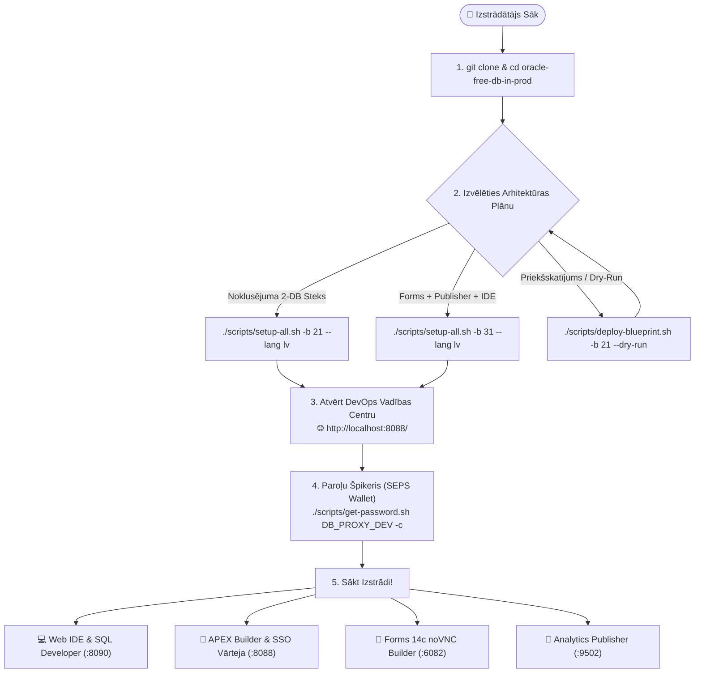
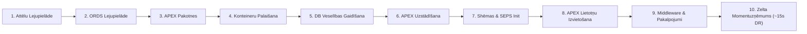
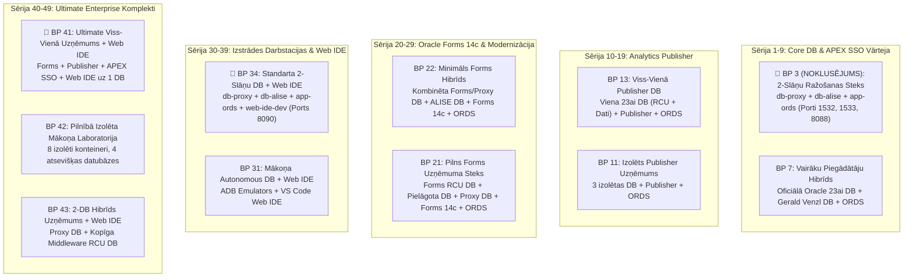

[ 🇬🇧 English ](../../README.md) | [ 🇪🇪 Eesti ](../et/README.md) | [ 🇫🇮 Suomi ](../fi/README.md) | [ 🇸🇪 Svenska ](../sv/README.md) | [ 🇱🇻 Latviešu ](README.md) | [ 🇱🇹 Lietuvių ](../lt/README.md)

# Oracle DevOps Platforma (Latviešu Rokasgrāmata)

> **Ražošanai gatava, bez licences maksas (0 €) un 100% bezparoļu (SEPS Wallet) Oracle 23ai, APEX SSO Vārtejas, Forms 14c, Publisher un Web IDE izstrādes un DevOps platforma.**

---

## ⚡ 60 Sekunžu Ātrā Palaišana

```bash
# 1. Klonēt krātuvi un pāriet uz mapi
git clone https://github.com/allanlahe/oracle-free-db-in-prod.git && cd oracle-free-db-in-prod

# 2. Palaist noklusējuma 2-slāņu ražošanas steku (Blueprint 21)
./scripts/setup-all.sh -b 21 --lang lv

# 3. Skatīt paroles, URL un starpliktuves palīgu (vai atvērt Dev Hub: http://localhost:8088/)
./scripts/get-password.sh
```

> [!TIP]
> **Windows Git Konfigurācija (13. noteikums):**
> Pirms klonēšanas operētājsistēmā Windows konfigurējiet Git atbalstīt garus ceļus un aizsargāt NTFS failu sistēmu:
> ```powershell
> git config --global core.protectNTFS true
> git config --global core.longpaths true
> git config --global core.autocrlf input
> ```

---

## 🗺️ Jauna Izstrādātāja Ceļvedis (Onboarding Journey)



---

## ⚡ Setup-All 10-Fāžu Dzīvescikla Arhitektūra



---

## 🌐 Dev Hub (`http://localhost:8088/`) — Vienots Vadības Centrs (*Single Pane of Glass*)

Izstrādātājiem nav jāatceras desmitiem dažādu portu. **Dev Hub** kalpo kā vienots portāls:
- **1-Klikšķa Pakalpojumu Saites:** Tūlītēja piekļuve APEX Builder, Database Actions (SDW), Forms 14c, HTML5 noVNC Forms Builder un Analytics Publisher.
- **1-Klikšķa Paroļu Kopēšana:** Viens klikšķis nokopē atšifrēto paroli tieši starpliktuvē (gatavs ielīmēšanai ar `Cmd+V` / `Ctrl+V`).
- **Reāllaika Veselības Diagnostika:** Automātiska aiztures pārbaude ik pēc 6 sekundēm.
- **Integrēts Markdown Dokumentācijas Lasītājs:** Lasiet un meklējiet rokasgrāmatas tieši pārlūkprogrammā.
- **Plānu Izvēršana un Pārvaldība:** Izvērsiet un pārslēdziet plānus tīmekļa saskarnē vai ar komandu `./scripts/deploy-blueprint.sh`.
- **ORDS Viedās Vārtejas Panelis:** Reāllaika pārskats par centrālā ORDS konteinera stāvokli, savienojumu pūliem (connection pools), aizturi (ms) un 1-klikšķa sinhronizāciju.

---

## 🌐 ORDS Viedā Vārteja un Autonomā Mikroreģistrācija (Variant 3)

Platforma novērš portu konfliktus un ORDS dublēšanos ar **Viedās Vārtejas un Autonomās Mikroreģistrācijas modeli**:

- **Centrālā Vārteja:** Viens `app-ords` konteiners darbojas portos 8088 (HTTP) un 8448 (HTTPS), apkalpojot visas aktīvās datubāzes.
- **Autonoms Mikroreģistrators:** Katra datubāze pārvalda savu savienojumu pūlu (`config/ords/proxy/databases/<pool_name>/pool.xml`).
- **Virtuālie Servisa Marķieri (`ords/<pool>`):** Plāni deklarē virtuālos marķierus (piem., `ords/proxy`, `ords/alise`). Dev Hub novērtē gatavību pēc konteinera un reāllaika HTTP aiztures.
- **Pūlu Pārvaldības CLI:**
  ```bash
  ./scripts/internal/manage-ords-pools.sh status
  ./scripts/internal/manage-ords-pools.sh status json
  ./scripts/internal/manage-ords-pools.sh sync
  ```

---

## 🔑 Kur Ir Mana Parole? (SEPS Wallet Špikeris)

Visas paroles tiek ģenerētas ar augstu kriptogrāfisko drošību un droši glabātas **Oracle SEPS (Secure External Password Store) Wallet** un Podman Secrets.

```bash
# Skatīt pilnu paroļu un pakalpojumu matricu:
./scripts/get-password.sh

# Kopēt izstrādātāja paroli tieši starpliktuvē:
./scripts/get-password.sh DB_PROXY_DEV -c

# Kopēt APEX administratora paroli:
./scripts/get-password.sh DB_PROXY_APEX_ADMIN -c

# Pievienoties datubāzei ar SQLcl BEZ paroles ievades:
sql /@DB_PROXY_DEV
```

---

## 🎯 3 Ieinteresēto Pušu Skatījumi un Biznesa Vērtība

| Skatījums | Galvenie Ieguvumi un Ikdienas Pieredze | Tehniskais Nodrošinātājs |
| :--- | :--- | :--- |
| **👤 Gala Lietotājs un Bizness** | • **Nav Jāinstalē Programmatūra:** Mūsdienīga HTML5 pārlūka pieredze un APEX Universal Theme.<br/>• **Vienotā Pieteikšanās (SSO):** Viena sesija APEX un Forms sistēmās.<br/>• **Pixel-Perfect Atskaites:** Automatizēta PDF/Excel dokumentu ģenerēšana. | • ORDS Vairāku Baseinu Vārteja<br/>• APEX Reverse Proxy SSO priekš Forms<br/>• Analytics Publisher REST API |
| **💻 Izstrādātājs** | • **~15s FastStart Atkopšana:** Tūlītēja atiestatīšana ar Zelta Momentuzņēmumiem.<br/>• **Bezparoļu SQL:** Tūlītējs savienojums ar `./scripts/sqlcl.sh` un SEPS Wallet.<br/>• **Pārlūka Web IDE:** Pārlūka VS Code ar Oracle SQL Developer un MI asistentiem. | • Podman FastStart Momentuzņēmumi<br/>• SEPS Oracle Wallet Auto-Sinhronizācija<br/>• `code-server` Web IDE Konteiners |
| **🛡️ Audits un Arhitekts** | • **0 € Licences Maksa:** Oracle 23ai Free DB ražošanā.<br/>• **Zero-Trust Tīkla Izolācija:** Datubāze nekad neatver neapstrādātu SQL publiskajam tīklam.<br/>• **Pārvaldīta Izpilde:** EBNF deklaratīvie līgumi, AST drošības analīze un VPD. | • JSON-Relational Duality<br/>• 2-Slāņu Tīkla Topoloģija<br/>• Oracle Virtual Private Database (VPD) |

---

## 🔄 Oracle APEX un Forms 14c Integrācijas Loma

Šajā arhitektūrā **Oracle APEX 26.1** primāri tiek pozicionēts kā:
1. **Forms Modernizācijas Tilts:** Pakāpeniska Forms 14c lietotņu pārnese uz modernām tīmekļa lietotnēm, izmantojot [Oracle APEXlang DSL](https://docs.oracle.com/en/database/oracle/apex/26.1/apxln/).
2. **Uzņēmuma Līmeņa SSO Reverse Proxy priekš Forms:** APEX nodrošina mūsdienīgu autentifikāciju (Azure Entra ID, SAML, OAuth2) un droši nodod sesiju Forms 14c bez dārgas WebLogic OAM/OIF infrastruktūras.

---

## 📋 11 Kurēti Arhitektūras Plāni (Blueprints)



### 🚀 Plānu Izvēršana un Pārvaldība (`./scripts/deploy-blueprint.sh`)

```bash
# 1. Pārbaudīt aktīvo plānu un pakalpojumu veselību:
./scripts/deploy-blueprint.sh --status --lang lv

# 2. Izvērst Blueprint 3 (NOKLUSĒJUMA 2-Slāņu Ražošanas Steks):
./scripts/deploy-blueprint.sh -b 3 --lang lv

# 3. Izvērst Blueprint 41 (Ultimate Viss-Vienā Uzņēmums):
./scripts/deploy-blueprint.sh -b 41 --lang lv

# 4. Simulēt izvēršanu bez izmaiņām (Dry-Run):
./scripts/deploy-blueprint.sh -b 34 --dry-run

# 5. Parādīt 11 plānu tabulu konsolē:
./scripts/deploy-blueprint.sh --list --lang lv
```

---

## ⚡ Paātrināta ~15s Atjaunošana & Automatizēta Versiju Pārbaude

Oracle Free DB in Prod ietver **inteliģentu daudzlīmeņu Golden Snapshot un Skip dzinēju** (`scripts/internal/snapshot-resolver.sh`), kas samazina otro palaišanas laiku no **~6–12 minūtēm līdz ~15 sekundēm**:

1. **Automatizēta Versiju Pārbaude & Novecojušu Momentuzņēmumu Anulēšana (`.meta.json`):**
   - Katrs Golden Snapshot ietver mašīnlasāmu `.meta.json` līgumu, kurā reģistrētas APEX, datubāzes, ORDS un starpprogrammatūras versijas.
   - Pirms atjaunošanas tiek stingri pārbaudīta versiju saderība. Ja tiek atklāts novecojis momentuzņēmums (piem., mērķis `APEX 26.1` pret snapshot `24.2`), sistēma brīdina ar `VERSION MISMATCH`, veic tīru instalēšanu un automātiski ģenerē jaunu atjauninātu momentuzņēmumu.
2. **Profilos Balstīta Atkārtota Izmantošana & Skip Matrica:**
   - Tā kā identiski datubāzes profili tiek koplietoti vairākos plānos (piem., `db-proxy-oracle` BP 3, BP 7, BP 21, BP 22, BP 34, BP 43), pārslēdzot plānus (piem., BP 3 $\rightarrow$ BP 34 Web IDE pievienošanai), datubāze paliek neskarta un tiek palaists tikai trūkstošais konteiners **~3 sekundēs**.
3. **Shared vs. Dedicated WebLogic Topoloģijas:**
   - **Koplietots WebLogic (BP 41 & BP 43):** Viena All-in-One datubāze (`db-dev-full`), vienotas RCU shēmas (`DEV_`), 1 kombinēts momentuzņēmums un zems RAM patēriņš (~6–8 GB).
   - **Specializēts WebLogic (BP 11, BP 21 & BP 42):** Neatkarīgas datubāzes (`db-forms`, `db-publisher`), modulāri momentuzņēmumi un selektīva palaišana, ietaupot līdz 4 GB RAM.

---

## 🚀 Ātrā Palaišana (Quickstart CLI)

```bash
# 1. Palaist izvēlēto blueprint:
./scripts/setup-all.sh -b 3 --lang lv

# 2. Skatīt paroļu un pakalpojumu tabulu (vai kopēt ar -c):
./scripts/get-password.sh
./scripts/get-password.sh DB_PROXY_DEV -c

# 3. Rotēt paroles droši bez dīkstāves:
./scripts/rotate-password.sh db-proxy dev
./scripts/rotate-password.sh all

# 4. Pārbaudīt aktīvos tīmekļa pakalpojumus un SEPS Wallet:
./scripts/check-urls.sh --lang lv
./scripts/check-wallet.sh

# 5. Palaist automatizēto pieteikšanās un saskarnes testu:
./scripts/test-browser-login.sh

# 6. Palaist daudzvalodu (i18n) verifikācijas testu (9. noteikums: EN, ET, FI, SV, LV, LT):
./tests/test-multilingual-support.sh

# 7. Izveidot vai atjaunot Zelta Momentuzņēmumus (~15s atkopšana):
./scripts/snapshots/create-golden-snapshots.sh
./scripts/snapshots/restore-golden-snapshots.sh

# 8. Notīrīt žurnālus, pagaidu failus un vecos momentuzņēmumus:
./scripts/clean-logs.sh -y
./scripts/snapshots/clean-golden-snapshots.sh -y

# 9. Atiestatīt vidi uz tīru sākuma stāvokli:
./scripts/reset-all.sh -y
```

---

---

## 🧭 Oracle APEX DevHub Lietotne un APEXlang CI/CD

Papildus atsevišķajam HTML Dev Hub (`docs/dev-hub.html`) platformā ir iekļauta uzņēmuma līmeņa **Oracle APEX lietotne (Lietotne 101: DevHub)**, kas deklaratīvi izveidota ar [Oracle APEXlang DSL](https://docs.oracle.com/en/database/oracle/apex/26.1/apxln/) direktorijā [`applications/devhub/`](../../applications/devhub/):

- **Nulles Pēdas Dokumentācija Datu Bāzē:** Dokumentācija nekad netiek dublēta vai glabāta datubāzes tabulās kā CLOB lauki. Vietējais REST dokumentācijas tilts (`scripts/internal/dev-hub-bridge.py` portā 8089) straumē lokalizētu Markdown tieši no Git failiem uz APEX, kur tas tiek attēlots ar `APEX_MARKDOWN.TO_HTML`.
- **Interaktīva Prezentācija un Pārskats (7. Lapa):** Ietver 8 slaidu interaktīvu prezentāciju, kas aptver platformas vīziju, izstrādātāju problēmas, lomu ieguvumus, 11 arhitektūras plānus, Zero-Trust SEPS Wallet drošību, ~15s Golden Snapshot atjaunošanu un atbildes uz bijušā DBA un arhitekta jautājumiem.
- **Datu Bāzes Dzinējs un Shēma:** Balstīts uz atsevišķu shēmu `DEVHUB` un pakotni `DEVHUB.DEV_HUB_PKG`, veicot ātras servera puses veselības pārbaudes (`UTL_HTTP`) ar mazāk nekā 100 ms aizturi.
- **Oficiālie SQLcl 26.2 APEXlang Rīki:**
  ```bash
  # Validēt APEXlang deklaratīvos failus pret kompilatora noteikumiem:
  node .agents/skills/apexlang/tools/apexctl.mjs apexlang validate --app-path applications/devhub

  # Validēt un importēt lietotni 101 darba telpā PROXY_WORKSPACE ar SQLcl:
  ./scripts/sqlcl.sh DEVHUB/<parole>@localhost:1533/FREEPDB1
  SQL> apex validate -input ./applications/devhub -workspace PROXY_WORKSPACE
  SQL> apex import -input ./applications/devhub -id 101 -workspace PROXY_WORKSPACE
  ```
- **Automatizēta CI/CD Darbplūsma:** Atsevišķa GitHub Actions darbplūsma [`.github/workflows/deploy-devhub-apexlang.yml`](../../.github/workflows/deploy-devhub-apexlang.yml) ar bezsaistes lokālu emulāciju, izmantojot `./scripts/test-local-ci.sh deploy-devhub-apexlang.yml --dry-run`.
- **Vienību Testēšana:** Palaidiet `./tests/unit/test-apex-devhub.sh`, lai pārbaudītu shēmu, PL/SQL kompilāciju, REST markdown saņemšanu un 6 valodu pārklājumu.

---

## 📑 Lietotāja Rokasgrāmatas

- 🏛️ **[docs/enterprise-distributed-architecture.md](../../docs/enterprise-distributed-architecture.md) | [docs/lv/enterprise-distributed-architecture.md](enterprise-distributed-architecture.md):** **Sadalītā Uzņēmuma Arhitektūra** — 4 līmeņu finanšu arhitektūra (ORDS, Publisher, Proxy DB, Publisher DB), integrācija ar esošo pamatdarbības datubāzi un PROD Active/Standby avārijas atjaunošana (RTO < 60s, RPO < 15m).
- 📋 **[docs/backlog/README.md](../../docs/backlog/README.md):** **Finanšu Jira Backlog** — 11 ražošanai gatavi Jira stāsti (62 SP) sadalītai izvietošanai, multi-pool maršrutēšanai un automātiskai kļūmjpārlēcei.
- 🚀 **[docs/lv/forms-to-apex-migration-guide.md](forms-to-apex-migration-guide.md):** **Oracle Forms $\rightarrow$ APEX Modernizācijas un Pārejas Rokasgrāmata** — Biznesa pamatojums, TCO salīdzinājums, 5 posmu automatizēta darba plūsma un [Oracle APEXlang DSL](https://docs.oracle.com/en/database/oracle/apex/26.1/apxln/).
- 📐 **[docs/forms-setup.md](../../docs/forms-setup.md):** Oracle Forms 14c Rokasgrāmata.
- 📑 **[docs/publisher-setup.md](../../docs/publisher-setup.md):** Analytics Publisher Rokasgrāmata.
- 💻 **[docs/web-ide-artifactory.md](../../docs/web-ide-artifactory.md):** Web IDE Rokasgrāmata.
- 🌐 **[docs/dev-hub.html](../../docs/dev-hub.html):** **Developer & DevOps Command Center** (`http://localhost:8088/` un `http://localhost:6082/vnc.html`).
- 🧪 **[docs/lv/apex-devhub-test-plan.md](apex-devhub-test-plan.md):** **Oracle APEX DevHub Testēšanas Plāns** — Daudzlīmeņu testēšanas stratēģija (utPLSQL vienību testi, REST tilta pārbaudes, hibrīdās Playwright/curl E2E plūsmas un APEX Advisor audits) ar Golden Snapshot izolāciju.
- 📊 **[config/blueprints/README.md](../../config/blueprints/README.md):** 11 Plānu Katalogs.
- 📖 **[Oracle APEX 26.1 APEXlang Reference Manual](https://docs.oracle.com/en/database/oracle/apex/26.1/apxln/):** Oficiālā specifikācija deklaratīvajai `.apx` sintaksei un kompilatora komandām.
- 📜 **[Oficiālā APEXlang EBNF Gramatika (`apexlang.ebnf`)](https://docs.oracle.com/en/database/oracle/apex/26.1/apxln/apexlang.ebnf):** Mašīnlasāma formālā EBNF specifikācija MI ierobežotai dekodēšanai (GBNF) un statiskajiem drošības skeneriem.

