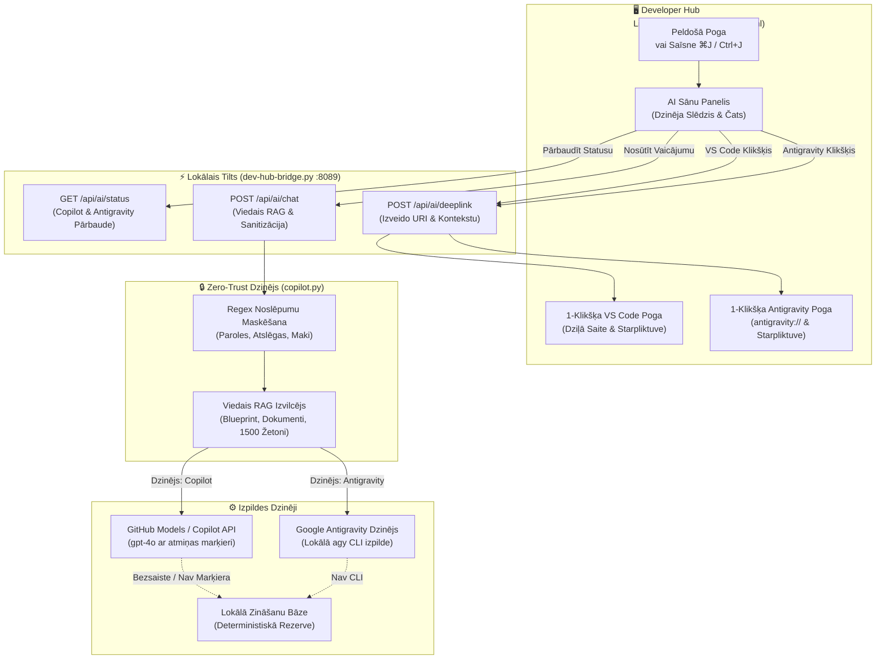

[ 🇬🇧 English ](../devhub-copilot-assistant.md) | [ 🇪🇪 Eesti ](../et/devhub-copilot-assistant.md) | [ 🇫🇮 Suomi ](../fi/devhub-copilot-assistant.md) | [ 🇸🇪 Svenska ](../sv/devhub-copilot-assistant.md) | [ 🇱🇻 Latviešu ](devhub-copilot-assistant.md) | [ 🇱🇹 Lietuvių ](../lt/devhub-copilot-assistant.md)

# 🤖 Dev Hub daudzdzinēju AI asistents (Copilot + Antigravity) un Zero-Trust RAG rokasgrāmata

Šī rokasgrāmata dokumentē Developer Hub (`docs/dev-hub.html`) iebūvēto **daudzdzinēju AI asistentu**, kas atbalsta gan **GitHub Copilot**, gan **Google Antigravity**, 5. Noteikuma Zero-Trust drošības kontroles, bezsaistes lokālo zināšanu bāzi un 1-klikšķa tiltus uz VS Code Copilot Chat un Antigravity.

---

## 🏛️ 1. Tehniskā arhitektūra un datu plūsma

Asistents izmanto dubultā dzinēja arhitektūru ar saīsni `⌘J` / `Ctrl+J`, nodrošinot ērtu pārslēgšanos starp GitHub Copilot un Google Antigravity:

---

## 🔒 2. Zero-Trust drošība un 5. Noteikuma izpilde

1. **Nekad netiek glabāts diskā:** Autentifikācijas marķieri un CLI komandas tiek apstrādātas tikai operatīvajā atmiņā.
2. **Dinamiska maskēšana:** Visi lietotāja vaicājumi un dokumentācijas fragmenti tiek apstrādāti ar `sanitize_text`:
   - Datu bāzes paroles (`password: ...`, `IDENTIFIED BY ...`)
   - SEPS Wallet ceļi (`cwallet.sso`, `ewallet.p12`)
   - SSH un TLS privātās atslēgas (`BEGIN PRIVATE KEY`)
   - GitHub piekļuves marķieri (`ghp_*`, `github_pat_*`)

---

## ⌨️ 3. Izstrādātāja saīsnes un iespējas

| Darbība | Saīsne / Izsaucējs | Apraksts |
| :--- | :--- | :--- |
| **Atvērt / Aizvērt Asistentu** | `⌘J` (macOS) / `Ctrl+J` (Windows/Linux) | Atver vai aizver AI paneli no jebkuras Dev Hub cilnes. |
| **Pārslēgt dzinēju** | Galvenes pogas `[ GitHub Copilot | Google Antigravity ]` | Pārslēdz aktīvo AI dzinēju (`localStorage`). |
| **Pilnekrāns / Atjaunot** | Augšējā labā poga `⛶` | Izvērš paneli pilnekrānā koda ērtai analīzei. |
| **Iesniegt jautājumu** | `Enter` taustiņš | Nosūta vaicājumu izvēlētajam AI dzinējam. |
| **Atvērt iekš VS Code** | Klikšķis uz `Atvērt iekš VS Code Copilot` | Iekopē pilnu RAG kontekstu starpliktuvē un atver `vscode://github.copilot/chat`. |
| **Atvērt iekš Antigravity** | Klikšķis uz `Atvērt iekš Antigravity` | Iekopē pilnu RAG kontekstu starpliktuvē un atver `antigravity://chat` (vai palaiž lietotni). |

---

## 🔄 4. 3-Līmeņu bezsaistes rezerves sistēma

Ja izstrādātāja datoram nav interneta savienojuma:
1. **1. Līmenis (Pieslēgts):** Izmanto GitHub Models (`gpt-4o`) vai lokālo `agy` CLI.
2. **2. Līmenis (CLI rezerve):** Izmanto lokālos CLI rīkus.
3. **3. Līmenis (Bezsaiste):** Tūlītēji ģenerē deterministisku atbildi no lokālās dokumentācijas.
