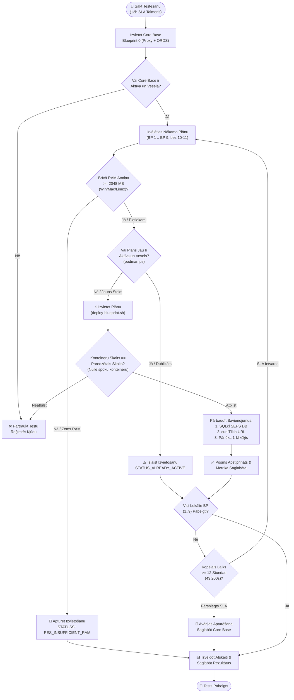

# 🧪 Pakāpeniskas struktūrplānu pievienošanas un vairāku steku testēšanas plāns

[ 🇬🇧 English ](../incremental-blueprints-test-plan.md) | [ 🇪🇪 Eesti ](../et/incremental-blueprints-test-plan.md) | [ 🇫🇮 Suomi ](../fi/incremental-blueprints-test-plan.md) | [ 🇸🇪 Svenska ](../sv/incremental-blueprints-test-plan.md) | [ 🇱🇻 Latviešu ](incremental-blueprints-test-plan.md) | [ 🇱🇹 Lietuvių ](../lt/incremental-blueprints-test-plan.md)

---

## 1. Kopsavilkums un mērķi

**Oracle DevOps platforma** nodrošina dinamisku un modulāru struktūrplānu (blueprints) aktivizāciju gan no komandrindas (`scripts/deploy-blueprint.sh`), gan interaktīvajā Developer Hub (`docs/dev-hub.html`). Šis testēšanas plāns pārbauda **pakāpenisku struktūrplānu pievienošanu (incremental addition)**, garantējot, ka vairāki arhitektūras steki darbojas vienlaicīgi bez konfliktiem, neparedzētas apturēšanas vai resursu izsīkuma.

### Galvenie testēšanas mērķi:
1. **Env 0 Bāzes Līmeņa Prasība (Baseline Invariant):** Katram testam vienmēr jāsākas ar **Blueprint 0 (`.env.0-default-proxy-ords`)** kā pastāvīgu Core Base vārteju (`db-proxy` portā 1532 un `app-ords` portos 8088/8448).
2. **Nedestruktīva Pievienošana (Non-Destructive Addition):** Jauna struktūrplāna pievienošana (piem., BP 1 `db-alise` vai BP 8 `web-ide-dev`) **nekad nedrīkst** apturēt, dzēst vai atkārtoti inicializēt iepriekš palaistos konteinerus vai datubāzes shēmas.
3. **Nulle Spoku Konteineru (Zero Ghost Containers):** Darbojošos konteineru kopai precīzi jāatbilst visu aktivizēto struktūrplānu apvienojumam. Neatļautu vai nezināmu konteineru izveide ir aizliegta.
4. **Pilnīga Savienojamība:** Katrā pievienošanas posmā jāpārbauda:
   - **Datubāzu Savienojumi:** Visi esošie un jaunpievienotie Oracle SEPS Wallet savienojumi (`sqlcl.sh /@ALIAS`).
   - **HTTP/HTTPS Galapunkti:** Veselības pārbaudes, APEX darba vietas, ORDS pūli un Web IDE atgriež korektus statusa kodus (`200 OK` vai `302 Found`).
   - **Pārlūka 1-Klikšķa Pieteikšanās:** Automātiska paroles iekopēšana starpliktuvē un sekmīga autentifikācija APEX Builder, Database Actions un Analytics Publisher.
5. **Starpplatformu Dinamiskais Atmiņas Ierobežotājs (< 2048 MB Brīvais Buferis):**
   - Brīvās fiziskās RAM atmiņas reāllaika mērījumi sistēmās **Windows Native** (PowerShell CIM), **Linux/WSL2** (`/proc/meminfo`) un **macOS** (`sysctl` / `vm_stat`), apvienojumā ar aktīvo konteineru patēriņu (`podman stats`).
   - Izvietošana tiek bloķēta ar kļūdu `RES_INSUFFICIENT_RAM`, ja brīvā atmiņa nokrītas zem 2.0 GB.
6. **Dubultas Izpildes Novēršana (`STATUS_ALREADY_ACTIVE`):** Jau aktīva struktūrplāna atkārtota palaišana tiek tīri apturēta, nepārstartējot konteinerus. Paralēlai palaišanai jāizveido jauns numurēts `.env.<N>` plāns ar unikāliem portiem.
7. **Attālināto / Mākoņa Plānu Izslēgšana:** Plāni **BP 10 (Remote Autonomous Database)** un **BP 11 (Remote Analytics Publisher)** attiecas uz ārējo mākoņinfrastruktūru un ir izslēgti no lokālo konteineru testiem.
8. **Globālais 12 Stundu SLA Izpildes Noildzes Limits:** Visai testēšanas kopa jāpabeidz **12 stundu (43 200 sekunžu)** laikā.

---

## 2. Testēšanas arhitektūra un plūsma



---

## 3. Pakāpeniskas testēšanas matrica (BP 0 .. BP 9)

| Solis | Plāna Fails | Apraksts | Mērķa Konteineri | Porti | DB SEPS Alias | Tīkla Pakalpojums |
| :--- | :--- | :--- | :--- | :--- | :--- | :--- |
| **0** | `.env.0-default-proxy-ords` | **Core Base (Bāzes Līmenis)** | `db-proxy`, `app-ords` | 1532, 8088, 8448 | `PROXY_DEV` | APEX, DB Actions, ORDS |
| **1** | `.env.1-standalone-alise-db` | Atsevišķa ALISE DB | + `db-alise` | 1533 | `ALISE_DEV` | Dinamisks pūls `/ords/alise` |
| **2** | `.env.2-standalone-proxy-db` | Atsevišķa Proxy DB | + `db-proxy-standalone` | 1537 | `DB_PROXY_STANDALONE_DEV` | Atsevišķa Proxy DB un SSO vārteja |
| **3** | `.env.3-standalone-gvenzl-db` | FastStart Gvenzl DB | + `db-gvenzl` | 1535 | `GVENZL_DEV` | Dinamisks pūls `/ords/gvenzl` |
| **4** | `.env.4-standalone-autonomous-db` | Lokālā ADB Emulācija | + `db-adb` | 1539 | `ADB_DEV` | Autonomās DB galapunkts |
| **5** | `.env.5-standalone-publisher` | Analytics Publisher DB & FMW | + `db-publisher`, `app-publisher` | 1531, 9502 | `PUBLISHER_DEV` | Publisher Web (`/xmlpserver`) |
| **6** | `.env.6-standalone-forms` | Forms 14c DB & Runtime | + `db-forms`, `app-forms` | 1534, 9001, 6082 | `FORMS_DEV` | Forms Runtime & noVNC |
| **7** | `.env.7-consolidated-forms-publisher` | Apvienots Forms + Publisher | + `app-forms-publisher` | 9001, 9502 | Kopējs `PUBLISHER_DEV` | Apvienota FMW konsole |
| **8** | `.env.8-standalone-web-ide` | Atsevišķa VS Code Web IDE | + `web-ide-dev` | 8090 | (Izmanto Core Base DB) | Pārlūka IDE (`:8090`) |
| **9** | `.env.9-standalone-publisher-designer` | Atsevišķs Publisher Designer | + `app-publisher-designer` | 6083 | (Pieslēdzas Publisher) | Darbvirsmas Designer noVNC |
| — | `.env.10-remote-ords` | Attālinātā Mākoņa ADB | *Izslēgts* | — | — | Ārējā Mākoņa ADB |
| — | `.env.11-remote-publisher` | Attālinātais Publisher | *Izslēgts* | — | — | Ārējais Mākoņa Publisher |

---

## 4. Pārbaudes metodika

### 1. Līmenis: Automatizēta skriptu diagnostika
1. **Konteineru Izolācija un Spoku Procesu Pārbaude:**
   - Pēc katra soļa izpildīt `podman ps --format "{{.Names}}"`.
2. **Oracle SEPS Automātiskās Pieteikšanās Pārbaude:**
   - Izpildīt `./scripts/sqlcl.sh /@<ALIAS>` katrai datubāzei bez paroles ievades.
3. **HTTP un REST Pārbaudes:**
   - Izpildīt `./scripts/check-urls.sh`.

### 2. Līmenis: Pārlūka un Dev Hub pārbaude
1. **Dev Hub Reāllaika Sinhronizācija:**
   - Pārbaudīt aktīvo plānu zaļo statusu un precīzu RAM skaitītāju vietnē `docs/dev-hub.html`.
2. **1-Klikšķa Pieteikšanās:**
   - Pārbaudīt piekļuvi APEX, DB Actions un Analytics Publisher.

---

## 5. Resursu aizsardzība un dublikātu kontrole

### TC-RES-01: Starpplatformu RAM pārbaude
- **Mērķis:** Pārbaudīt brīvo atmiņu Windows (PowerShell CIM), Linux (`/proc/meminfo`) un macOS (`vm_stat`).

### TC-RES-02: Bloķēšana nepietiekamas atmiņas gadījumā (< 2048 MB buferis)
- **Mērķis:** Bloķēt uzstādīšanu ar kļūdu `RES_INSUFFICIENT_RAM`.

### TC-DUP-01: Dubultas palaišanas tuvināšana (`STATUS_ALREADY_ACTIVE`)
- **Mērķis:** Ziņot `BP_ALREADY_ACTIVE`, nepārstartējot konteinerus.

---

## 6. Izpildes 12 stundu SLA uzraudzība

### TC-TIME-01: Globālais SLA taimeris
- **Mērķis:** Droši pārtraukt testu un saglabāt datus failā `metrics/setup_benchmarks.json` pirms 12 stundu limita sasniegšanas.

---

## 7. Izpildes komandu īsā pamācība

```bash
# 1. Inicializēt bāzes vidi (Blueprint 0)
./scripts/setup-all.sh --blueprint 0 -y

# 2. Pakāpeniski pievienot plānus (BP 1 līdz BP 9)
./scripts/deploy-blueprint.sh 1
./scripts/deploy-blueprint.sh 3
./scripts/deploy-blueprint.sh 4
./scripts/deploy-blueprint.sh 5
./scripts/deploy-blueprint.sh 6
./scripts/deploy-blueprint.sh 7
./scripts/deploy-blueprint.sh 8
./scripts/deploy-blueprint.sh 9

# 3. Pārbaudīt savienojumus
./scripts/check-urls.sh
./scripts/check-wallet.sh
open ./docs/dev-hub.html
```

---

## 8. Automatizēto inkrementālo testu rezultāti

Automatizētā izpilde, izmantojot `./tests/test-all-blueprints-incremental.sh --stop-on-fail`, veiksmīgi verificēja visus 10 arhitektūras plānus (BP 0 līdz BP 9):

| Plāns | Nosaukums un mērķis | Aktīvie konteineri (kumulatīvi) | Ilgums | Statuss | Piezīmes |
| :---: | :--- | :--- | :---: | :---: | :--- |
| **BP 0** | 0-default-proxy-ords | `db-proxy app-ords` | 49s | ✅ **PASS** | Izveidota Core Base bāze |
| **BP 1** | 1-standalone-alise-db | `db-proxy app-ords db-alise` | 472s | ✅ **PASS** | Uzstādīts virs Core Base |
| **BP 2** | 2-standalone-proxy-db | `db-proxy app-ords db-alise db-proxy-standalone` | 596s | ✅ **PASS** | Uzstādīts virs BP 0 + BP 1 |
| **BP 3** | 3-standalone-gvenzl-db | `db-proxy app-ords db-gvenzl` | 531s | ✅ **PASS** | Automātiska RAM atkopšana, verificēts |
| **BP 4** | 4-standalone-autonomous-db | `db-proxy app-ords db-gvenzl db-adb` | 701s | ✅ **PASS** | Uzstādīts virs BP 0 + BP 3 |
| **BP 5** | 5-standalone-publisher | `db-proxy app-ords db-publisher app-publisher` | 1485s | ✅ **PASS** | Automātiska RAM atkopšana, verificēts |
| **BP 6** | 6-standalone-forms | `db-proxy app-ords db-forms app-forms` | 920s | ✅ **PASS** | Automātiska RAM atkopšana, verificēts |
| **BP 7** | 7-consolidated-forms-publisher | `db-proxy app-ords db-forms app-forms db-publisher app-publisher` | 1323s | ✅ **PASS** | Konsolidēts steks (6 konteineri) |
| **BP 8** | 8-standalone-web-ide | `db-proxy app-ords web-ide-dev` | 836s | ✅ **PASS** | Automātiska RAM atkopšana, verificēts |
| **BP 9** | 9-standalone-publisher-designer | `db-proxy app-ords web-ide-dev app-publisher-designer` | 320s | ✅ **PASS** | Uzstādīts virs Web IDE |

- **Kopā testēti plāni:** 10 / 10 (100% sekmības rādītājs)
- **Nulle spoku konteineru:** Katrā posmā aktīvie konteineri precīzi atbilda deklarācijai.
- **SEPS Wallet drošība:** 100% bezparoles Oracle Wallet SQLcl savienojumu darbojās nevainojami.
- **Pilnas E2E pieteikšanās:** 100% tīmekļa saišu (HTTP 200/302) un pārlūkprogrammas autentifikāciju bija veiksmīgas.

