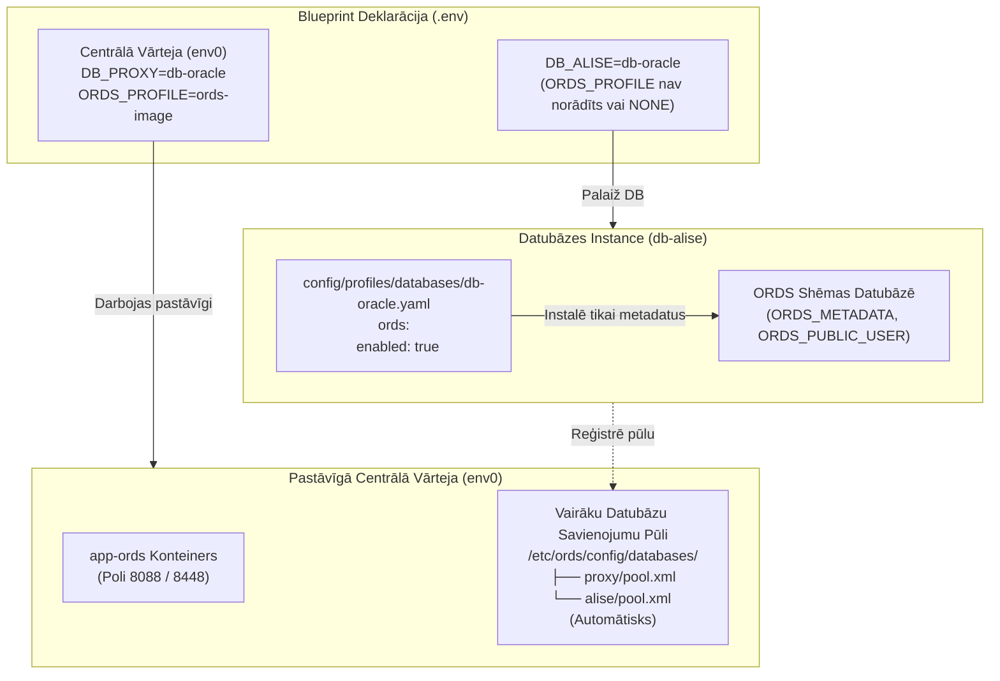

[ 🇬🇧 English ](../ords-profiles-lifecycle.md) | [ 🇪🇪 Eesti ](../et/ords-profiles-lifecycle.md) | [ 🇫🇮 Suomi ](../fi/ords-profiles-lifecycle.md) | [ 🇸🇪 Svenska ](../sv/ords-profiles-lifecycle.md) | [ 🇱🇻 Latviešu ](ords-profiles-lifecycle.md) | [ 🇱🇹 Lietuvių ](../lt/ords-profiles-lifecycle.md)

# 🌐 Oracle REST data services (ORDS) profilu un atsevišķā dzīvescikla rokasgrāmata

Šī rokasgrāmata dokumentē **Oracle REST Data Services (ORDS)** arhitektūru, dzīvescikla pārvaldību un konfigurāciju vietējos konteineros, attālinātos serveros un Oracle Autonomous Database (ADB) mākoņvidēs.

---

## 🏛️ 1. Atsevišķās arhitektūras principi

Modernā modulārā arhitektūrā tīmekļa lietojumprogrammu vārteja ir atdalīta no datubāzes dzinēja:



### Galvenie arhitektūras noteikumi:
1. **`ords.enabled: true` Datubāzes Profilā:**
   - Sagatavo datubāzes ORDS shēmas, metadatus (`ORDS_METADATA`) un starpniekservera lietotājus.
   - **NEPALAIDĪS** `app-ords` tīmekļa konteineru.
2. **`ORDS_PROFILE` Blueprint:**
   - Nosaka, vai tiek izveidots `app-ords` tīmekļa konteiners.
   - Ja parametrs nav norādīts vai ir `NONE`, datubāze darbojas kā tīrs aizmugursistēmas serviss bez lieka RAM patēriņa.
3. **Automātiskā Reģistrācija Centrālajā Vārtejā:**
   - Kad darbojas Blueprint 0 (`env0`), katra jaunā datubāze automātiski ģenerē sava pūla failu `<pūla_vārds>.xml` un nekavējoties pārlādē centrālo ORDS konteineru.

---

## 📦 2. Trīs kanoniskie ORDS profili

Visi ORDS profili atrodas mapē `config/profiles/ords/`:

| Profils | Fails | Tips | Optimizācija un Mērķis |
| :--- | :--- | :--- | :--- |
| **`ords-image`** | `config/profiles/ords/ords-image.yaml` | `image` | **Oficiālais Oracle OCR Konteinera Attēls.** (`container-registry.oracle.com/database/ords:latest`). Pretvīrusu optimizēts, ātra palaišana. Ieteicams izstrādei un CI/CD. |
| **`ords-local-custom`** | `config/profiles/ords/ords-local-custom.yaml` | `local_custom` | **Vietējā Pielāgotā Skripta Instalācija.** Izmanto oficiālos arhīvus no `binaries/ords/`, atpakotus pagaidu konteinerā. |
| **`ords-remote-custom`** | `config/profiles/ords/ords-remote-custom.yaml` | `remote_custom` | **Attālā Servera Vārteja.** Savienojas ar esošu ORDS serveri, izmantojot SSH vai HTTPS. |

---

## ☁️ 3. Oracle autonomous database (ADB) integrācija

Oracle Autonomous Database (Cloud ADB Serverless) ietver iepriekš instalētu un mākoņa pārvaldītu ORDS:

```yaml
# config/profiles/databases/db-adb.yaml
ords:
  enabled: true
  install_in_db: false       # NEDRĪKST dzēst vai pārrakstīt mākoņa ORDS_METADATA
  verify_version_match: true # Pārbaudīt versiju saderību ar centrālo vārteju
```

---

## 💡 4. Norādījumi, ja ORDS serveris nav konfigurēts

Ja datubāze tiek palaista bez `ORDS_PROFILE` un centrālais ORDS nedarbojas:
- Terminālī tiek parādīts skaidrs paziņojums:
  `ℹ️  ORDS serveris nav konfigurēts (trūkst app-ords konteinera).`
  `💡 Norāde: Lai iespējotu tīmekļa saskarni, palaidiet: ./scripts/setup-all.sh --b 0 vai pievienojiet blueprintam ORDS_PROFILE=ords-image`

---

## 🚀 5. Ātrās komandas

```bash
# 1. Palaist pastāvīgo centrālo ORDS vārteju:
./scripts/setup-all.sh -b 0

# 2. Palaist atsevišķu biznesa datubāzi (automātiski reģistrē pūlu centrālajā ORDS):
./scripts/setup-all.sh -b 1

# 3. Pārbaudīt tīmekļa adreses:
./scripts/check-urls.sh
```
