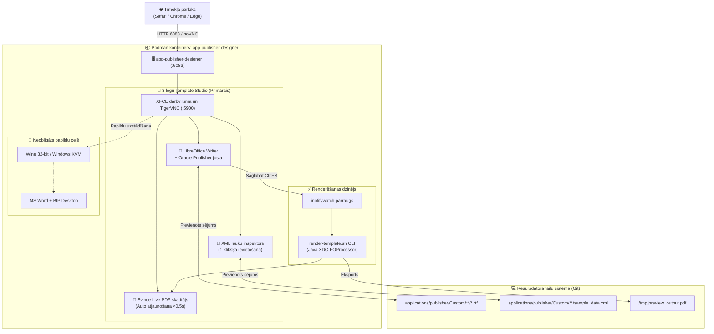

# Oracle Analytics Publisher veidņu veidotājs & piekļūstamības rokasgrāmata: LibreOffice Writer 3-Pane Studio (Primārais) & MS Word KVM/Wine (Neobligāts)

[ 🇬🇧 English ](../publisher-template-builder-guide.md) | [ 🇪🇪 Eesti ](../et/publisher-template-builder-guide.md) | [ 🇫🇮 Suomi ](../fi/publisher-template-builder-guide.md) | [ 🇸🇪 Svenska ](../sv/publisher-template-builder-guide.md) | [ 🇱🇻 Latviešu ](publisher-template-builder-guide.md) | [ 🇱🇹 Lietuvių ](../lt/publisher-template-builder-guide.md)

---

## 1. Pārskats un biznesa pamatojums

Pikseļu precizitātes biznesa dokumentu (rēķini, pavadzīmes, finanšu atskaites) izveide Oracle Analytics Publisher platformā balstās uz **Rich Text Format (RTF) veidnēm**, kas tiek apvienotas ar **XML datiem**, ģenerējot piekļūstamus un strukturētus PDF dokumentus.

### 🛑 Korporatīvie šķēršļi:
1. **Nav Microsoft Office licenču izstrādes un CI konteineros:** Uzņēmuma licences ir piesaistītas darbinieku personālajiem datoriem. CI/CD sistēmās un Linux konteineros nav pieejams MS Word.
2. **Slēgtas darbstacijas (bez administratora tiesībām):** Izstrādātāji nevar instalēt vietējās programmas (`BIPublisherDesktop64.exe`) korporatīvajos datoros.
3. **Starpplatformu saderība:** Izstrādātājiem ar **macOS** vai **Linux** nav oficiāla Word Template Builder spraudņa.

### 💡 Risinājums: LibreOffice 3-Pane Studio (Primārais SSoT):
Konteiners **`app-publisher-designer`** (Blueprint 9) piedāvā gatavu darbstaciju tieši tīmekļa pārlūkā, izmantojot **HTML5 noVNC portā 6083** (`http://localhost:6083/vnc.html`):
- **LibreOffice 7.x/24.x Writer (Iepriekš konfigurēts SSoT):** Ietver pielāgotas **⚡ Oracle Publisher** izvēlnes, rīkjoslas, XML iezīmju ievietošanu un īsinājumtaustiņus bez nepieciešamības pēc komerciālām licencēm.
- **Evince Live PDF skatītājs:** Pārzīmē un atjaunina PDF failu mazāk nekā 0,5 sekundēs pēc katras saglabāšanas (`Ctrl+S`).
- **Oracle XML lauku inspektors:** Vizuāls XML koks ar 1-klikšķa ievietošanu tieši Writer programmā, izmantojot X11 automatizāciju.
- **Konteinera ātrās renderēšanas dzinējs:** Iebūvēts Java Oracle XDO / `FOProcessor` un komandrindas PDF eksports.
- **Tieša Git sinhronizācija:** Veidnes tiek saglabātas resursdatora mapē `templates/publisher/`.
- **Neobligāts režīms:** Microsoft Word ar Wine vai Windows KVM ir pieejams kā papildu opcija tiem, kam ir 32 bitu instalācijas faili.

---

## 2. Arhitektūra un topoloģija



---

## 3. Ātrais starts: LibreOffice Writer 3-Pane Studio (Primārais)

### 1. solis: Palaidiet konteineru
Ar Blueprint 9 (Ieteicams):
```bash
./scripts/setup-all.sh -b 9
```
Vai ar skriptu:
```bash
./scripts/publisher/start-designer.sh --lang lv   # Opcijas: en, et, fi, sv, lv, lt
```

### 2. solis: Atveriet Template Studio pārlūkā
1. Atveriet `http://localhost:6083/vnc.html`.
2. Veiciet dubultklikšķi uz ikonas **🚀 Oracle Publisher Template Studio**.
3. Automātiski tiek izkārtoti 3 logi:
   - **Pa kreisi (65%):** **LibreOffice Writer** ar aktīvo veidni (`arve_test_standard.rtf`).
   - **Augšā pa labi (35%):** **Evince Live PDF skatītājs**, rādot `valmis_arve.pdf`.
   - **Apakšā pa labi (35%):** **Oracle XML lauku inspektors** ar `arve_test_andmed.xml`.

### 3. solis: Veidošana un iezīmju ievietošana
1. **Oracle Publisher izvēlne un rīkjosla Writer programmā:**
   - `🏷️ Ievietot lauku`: Ievieto `<?TAG_NAME?>` kursorā.
   - `🔁 for-each cikls`: Aptver rindas ar `<?for-each:LINES/LINE?> ... <?end for-each?>`.
   - `⚡ Ātrā PDF renderēšana`: Ģenerē PDF nekavējoties.
2. **1-klikšķa ievietošana no XML inspektora:**
   - Izvēlieties elementu XML kokā un noklikšķiniet uz **👉 Sisesta Kursorisse**.
3. **Reāllaika priekšskatījums:**
   - Saglabājiet failu Writer (`Ctrl+S`) — Evince atjaunina skatu mazāk nekā 0,5 sekundēs.

---

## 4. Testēšana konteinerā un resursdatorā

### 4.1 Resursdatora CLI rīks (`test-render.sh`)
```bash
./scripts/publisher/test-render.sh \
  templates/publisher/samples/arve_test_standard.rtf \
  templates/publisher/samples/arve_test_andmed.xml \
  [izeja.pdf]

# Daudzvalodu renderēšana ar XLIFF:
./scripts/publisher/test-render.sh --locale lv
```

### 4.2 Izpilde konteinera iekšienē
```bash
podman exec -it app-publisher-designer /u01/oracle/bin/render-template.sh \
  /u01/templates/samples/arve_test_standard.rtf \
  /u01/templates/samples/arve_test_andmed.xml \
  /u01/templates/samples/valmis_arve_lv.pdf \
  --locale lv
```

### 4.3 Live Watcher & Hot-Reload (`watch-render-host.sh`)
```bash
./scripts/publisher/watch-render-host.sh \
  templates/publisher/samples/arve_test_standard.rtf \
  templates/publisher/samples/arve_test_andmed.xml \
  templates/publisher/samples/valmis_test_arve.pdf
```
Pārrauga faila izmaiņas un automātiski pārzīmē PDF katrā saglabāšanā.

---

## 5. Piekļūstamība & PDF/UA-1 verifikācijas process

Dokumentiem jāatbilst **PDF/UA-1 (ISO 14289-1)**, **WCAG 2.1 Level AA**, **Eiropas Piekļūstamības aktam (EAA / EN 301 549)** un **Section 508**.

### 4 soļu testēšanas plūsma:
1. **1. solis: RTF struktūras pārbaude:**
   ```bash
   ./scripts/publisher/validate-rtf-accessibility.sh templates/publisher/samples/accessible_starter_template.rtf --strict
   ```
2. **2. solis: Strukturēta PDF eksports ar iezīmēm (`/StructTreeRoot`, `/MarkInfo`, `/Lang`).**
3. **3. solis: PDF iezīmju un ekrāna lasītāja balss simulācija:**
   ```bash
   ./scripts/publisher/validate-pdf-accessibility.sh templates/publisher/samples/valmis_arve_lv.pdf
   ```
4. **4. solis: Automatizēta CI testu pakotne & ACR atskaite:**
   ```bash
   ./tests/integration/test-publisher-accessibility-suite.sh
   ```
   Ģenerē oficiālu pārskatu: [`tests/reports/accessibility_compliance_acr.md`](../../tests/reports/accessibility_compliance_acr.md).

Pilnu specifikāciju skatiet:
👉 [`.agents/skills/oracle_publisher_accessibility/SKILL.md`](../../.agents/skills/oracle_publisher_accessibility/SKILL.md).

---

## 6. Izstrāde ar VS Code & GitHub Copilot

1. Copilot izmanto norādes no [`.github/copilot-instructions.md`](../../.github/copilot-instructions.md).
2. Palaidiet `./scripts/publisher/watch-render-host.sh` un veiciet izmaiņas ar tūlītēju priekšskatījumu.

---

## 7. Neobligāti: MS Word & BIP Desktop caur Wine vai Windows KVM

1. Iekopējiet `setup.exe` un `BIPublisherDesktop32.exe` mapē `binaries/publisher/`.
2. Izpildiet `./scripts/publisher/setup-word-designer.sh`.

---

## 8. Veidņu sintakses īsā rokasgrāmata

| Funkcija | Oracle BI Publisher RTF Tag | Apraksts |
| :--- | :--- | :--- |
| **Lauka vērtība** | `<?INVOICE_NUM?>` | Izvada XML elementa vērtību |
| **Cikls** | `<?for-each:G_LINES?>` ... `<?end for-each?>` | Iterē cauri rindu sarakstam |
| **Nosacījums** | `<?if:VAT_RATE > 0?>` ... `<?end if?>` | Rāda saturu tikai pie nosacījuma |
| **Tabulas galvenes atkārtošana**| `\trhdr` | Obligāts PDF/UA-1 tabulām |
| **Dokumenta virsraksts**| Stils `Heading 1` | Obligāta H1 iezīme ekrāna lasītājiem |

---

## 9. Uzņēmuma GitOps Standarts (`applications/publisher/`), REST Izvietošana un CI/CD Konveijers

Lai garantētu uzņēmuma līmeņa uzticamību un CI/CD saderību, visas veidnes un datu modeļi tiek pārvaldīti mapē `applications/publisher/`, kas atbilst Oracle Analytics Publisher servera katalogam 1:1 (`/Custom/<Nozare>/<Pārskats>/`).

### 9.1 Kataloga Struktūra un GitOps Invariants

```text
applications/publisher/
├── .gitignore                         # Izslēdz bināros *.xdoz un *.xdmz arhīvus
├── README.md                          # Dokumentācija (6 valodas: EN, ET, FI, SV, LV, LT)
└── Custom/
    └── Invoices/
        └── Invoice_Report/
            ├── Invoice_Report.xdo/       # Git izsekota pārskata pakotne
            │   ├── template.rtf          # Piekļūstama PDF/UA-1 RTF veidne
            │   ├── template_et.xlf       # Igauņu valodas XLIFF tulkojumi
            │   ├── template_fi.xlf       # Somu valodas XLIFF tulkojumi
            │   └── _manifest.xml         # Publisher pārskata manifests
            └── Invoice_DataModel.xdm/    # Git izsekota datu modeļa pakotne
                ├── datamodel.sql         # Tīrs SQL datu atlases vaicājums
                ├── datamodel.xml         # Datu modeļa XML (piesaistīts ALISE_APP_DB)
                └── sample_data.xml       # Paraugdati testēšanai
```

### 9.2 Komandrindas Rīki (CLI)

1. **Izveidot jaunu pārskatu:**
   ```bash
   ./scripts/publisher/create-report.sh Custom/Invoices/Packing_Slip "Pavadzīme"
   ```
2. **Izvietot serverī (REST API / Copy):**
   ```bash
   ./scripts/publisher/deploy-template.sh Custom/Invoices/Invoice_Report --mode rest
   ```
3. **Izvietot ar tūlītēju PDF testa atveidošanu serverī:**
   ```bash
   ./scripts/publisher/deploy-template.sh Custom/Invoices/Invoice_Report --render
   ```

### 9.3 Lomas un SEPS Wallet Rotācija

| Lietotājs | WebLogic Grupa | SEPS Wallet Alias | Tiesības |
| :--- | :--- | :--- | :--- |
| `bip_developer` | `XMLP_DEVELOPER`, `XMLP_TEMPLATE_DESIGNER` | `PUBLISHER_DEVELOPER` | Veidņu un datu modeļu izveide mapē `/Custom/` |
| `bip_user` | `XMLP_SCHEDULER`, `XMLP_ANALYZER` | `PUBLISHER_USER` | Atskaišu izpilde un vēstures pārvaldība |
| `bip_admin` | `XMLP_ADMIN` | `PUBLISHER_ADMIN` | BIP kataloga pārvaldība (nav WebLogic konsoles) |

Paroļu rotācija ar Oracle SEPS Wallet:
```bash
./scripts/rotate-password.sh publisher dev     # Rotē bip_developer paroli
./scripts/rotate-password.sh publisher user    # Rotē bip_user paroli
./scripts/rotate-password.sh publisher admin   # Rotē bip_admin paroli
```

### 9.4 GitHub Actions CI/CD Sekvences Diagramma (`.github/workflows/deploy-publisher-reports.yml`)

```mermaid
sequenceDiagram
    autonumber
    actor Dev as 👨‍💻 Laidiena pārvaldnieks<br/>(Izstrādātājs / Administrators)
    participant GHA as ⚙️ GitHub Actions Runner<br/>(deploy-publisher-reports)
    participant QG as 🧪 CI Kvalitātes vārti<br/>(Linter & Test-Render)
    participant Art as 📦 GitHub Artefakti<br/>(Lejupielādējams PDF)
    participant Sec as 🔑 Drošo noslēpumu krātuve<br/>(GitHub Secrets / OIDC)
    participant Pub as 🏢 Publisher serveris<br/>(:9502 REST API)

    Dev->>GHA: 1. Palaist workflow_dispatch<br/>(vide: dev/test/prod, atskaites ceļš)
    activate GHA

    rect rgb(30, 41, 59)
        Note over GHA,QG: Automatizētie kvalitātes vārti pirms izvietošanas
        GHA->>QG: 2. XML un SQL sintakses pārbaude<br/>(xmllint datamodel.xml)
        QG-->>GHA: ✅ Sintakse pārbaudīta
        GHA->>QG: 3. RTF piekļūstamības audits<br/>(PDF/UA-1, \trhdr, H1/H2, Alt-teksts)
        QG-->>GHA: ✅ Piekļūstamības prasības izpildītas
        GHA->>QG: 4. Testa renderēšana bez grafiskā interfeisa<br/>(ar sample_data.xml)
        QG-->>GHA: ✅ Testa PDF ģenerēts
        GHA->>Art: 5. Augšupielādēt testa PDF kā artefaktu<br/>(actions/upload-artifact@v4)
        Art-->>Dev: 👁️ PDF lejupielādējams GitHub saskarnē
    end

    rect rgb(15, 23, 42)
        Note over GHA,Pub: Izvietošana Publisher serverī (REST API)
        GHA->>Sec: 6. Pieprasīt pilnvaras (OAuth2 Bearer<br/>vai bip_developer parole)
        Sec-->>GHA: 🔑 Droša autorizācijas galvene
        GHA->>Pub: 7. POST /xmlpserver/services/rest/v1/reports<br/>(deploy-template.sh --mode rest)
        Pub-->>GHA: HTTP 200 / 201 Created (Idempotents)
        
        opt Ja izvēlēts test_render
            GHA->>Pub: 8. POST /reports/{path}/run (Servera renderēšana)
            Pub-->>GHA: 📑 Oficiālais servera PDF
        end
    end

    GHA->>Dev: 9. Publicēt $GITHUB_STEP_SUMMARY<br/>(Kopsavilkums un atskaišu saites)
    deactivate GHA
```



