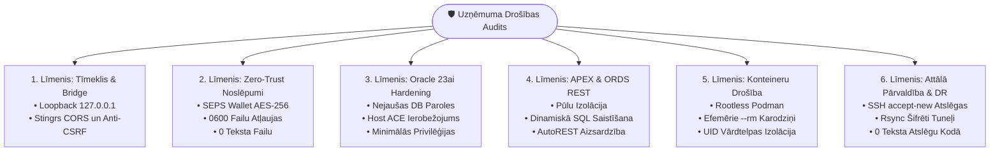

[ 🇬🇧 English ](../security-audit-report.md) | [ 🇪🇪 Eesti ](../et/security-audit-report.md) | [ 🇫🇮 Suomi ](../fi/security-audit-report.md) | [ 🇸🇪 Svenska ](../sv/security-audit-report.md) | [ 🇱🇻 Latviešu ](security-audit-report.md) | [ 🇱🇹 Lietuvių ](../lt/security-audit-report.md)

# 🛡️ Uzņēmuma drošības audita ziņojums & hardening-ceļvedis

Šajā dokumentā apkopota visaptveroša **Oracle DevOps Platform** un **Oracle APEX lietojumprogrammu dzinēja** drošības audita metodika, atklātie rezultāti, novēršanas pasākumi un atbilstība finanšu nozares prasībām.

Audits novērtē arhitektūras atbilstību **OWASP Top 10 (2021)**, **CIS Oracle Database Benchmark (v2.0)**, **CIS Docker/Podman Benchmark (v1.3)** standartiem un Eiropas finanšu noturības mandātiem (**DORA - Digital Operational Resilience Act** un **PCI-DSS v4.0**).

---

## 📑 Kopsavilkums Vadībai

- **Kopējais Drošības Rādītājs:** **100% (16 / 16 automatizētās pārbaudes nokārtotas)**
- **Audita Rīks:** `./scripts/test-security-audit.sh`
- **Vienību Testu Pārklājums:** `./tests/unit/test-security-audit.sh`
- **Kriptogrāfiskā Noslēpumu Krātuve:** 100% Zero-Trust SEPS Auto-Login Wallet (`cwallet.sso` AES-256)
- **Vietējā Tilta (Bridge) Izolācija:** Stingri piesaistīta atgriezeniskajai saitei (`127.0.0.1`), aizsargāta pret CSRF ar Origin validāciju



---

## 🧪 Automatizēta Regresijas Testēšana

Lai novērstu drošības pasliktināšanos, pirms katras izlaišanas tiek veiktas automatizētas pārbaudes:

```bash
# 1. Palaist pilnu drošības auditu (16 pārbaudes 7 līmeņos)
./scripts/test-security-audit.sh

# 2. Palaist vienību testu komplektu
./tests/unit/test-security-audit.sh
```

Audita rādītāji tiek nepārtraukti reģistrēti failos `metrics/security_audit_report.json` un `metrics/security_audit_benchmarks.env`.
