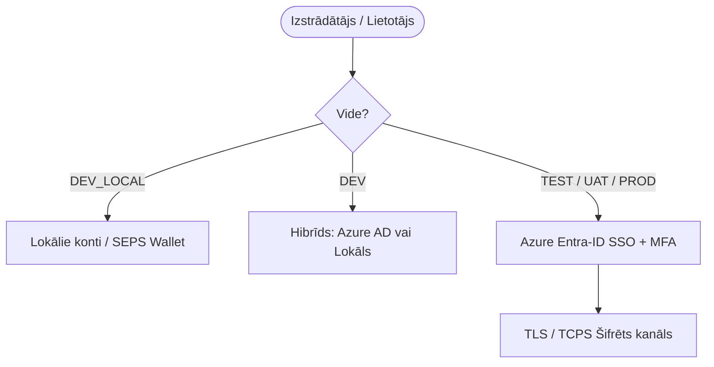

[ 🇬🇧 English ](../security.md) | [ 🇪🇪 Eesti ](../et/security.md) | [ 🇫🇮 Suomi ](../fi/security.md) | [ 🇸🇪 Svenska ](../sv/security.md) | [ 🇱🇻 Latviešu ](security.md) | [ 🇱🇹 Lietuvių ](../lt/security.md)

# 🛡️ Oracle Free DB & APEX Drošība un SSO Arhitektūra

Šis dokuments apkopo platformas drošības apsvērumus, akreditācijas datu pārvaldību, izstrādātāju lomas un vienotās pieteikšanās (SSO / Azure Entra-ID) arhitektūru.

---

## 1. Lokālā Noslēpumu Pārvaldība (Zero-Trust - 5. Noteikums)

Visas paroles un noslēpumi tiek glabāti AES-256 šifrētā **Oracle SEPS (Secure External Password Store) Auto-Login Wallet** (`cwallet.sso`).

- **Atklāta Teksta Failu Aizliegums:** Paroles nekad netiek rakstītas uz diska atklātā tekstā (nav `.json`, `.txt`, `.env` vai `.cache` failu).
- **Atmiņā Balstīta Dekrēpšana:** Paroles tiek dinamiski atšifrētas atmiņā pēc pieprasījuma:
  ```bash
  ./scripts/get-password.sh <alias>
  ```
- **Minimālo Privilēģiju Princips:** Katrai datubāzei tiek ģenerēti standarta konti:
  - `DBA_ADMIN`: Administratīvie uzdevumi (`DBA` loma).
  - `DEV`: Ikdienas izstrādātāja loma ar Oracle 23ai `DB_DEVELOPER_ROLE`.
  - `APP`: Lietojumprogrammu izpildlaika konts (`CREATE SESSION`, `RESOURCE`).
  - `VIEWER`: Tikai lasīšanas audits (`READ ANY TABLE`).

---

## 2. Vides Autentifikācijas Matrica

| Vide (`ENVIRONMENT_TYPE`) | Atrašanās Vieta | Autentifikācijas Veids (APEX & DB) | Lietotāju Pārvaldība | TLS Šifrēšana (TCPS) |
| :--- | :--- | :--- | :--- | :--- |
| **`DEV_LOCAL`** | Izstrādātāja Dators | Lokālie SEPS Wallet konti | Automatizēta / `create-developer.sh` | Pēc izvēles (Offline) |
| **`DEV`** | Koplietots Izstrādes Serveris | Hibrīds (Lokālais + **Azure AD**) | Azure AD + JIT / Lokālie konti | Pēc izvēles |
| **`TEST`** | Testa Serveris (CI/CD) | **Azure Entra-ID (SSO)** | Centrāla (Azure AD grupas) | Jā (Ports 2484) |
| **`UAT`** | Pirms-Produkcijas Serveris | **Azure Entra-ID (SSO)** | Centrāla (Azure AD grupas) | Jā (Ports 2484) |
| **`PROD`** | Produkcijas Serveris | **Azure Entra-ID (SSO)** | Centrāla (Azure AD grupas) | Jā (Ports 2484) |



---

## 3. Adaptīvais 5 Līmeņu TLS/HTTPS Dzinējs

Tīmekļa pakalpojumi (ORDS, APEX, Analytics Publisher) izmanto adaptīvu 5 līmeņu sertifikātu hierarhiju bez administratora tiesībām (`scripts/internal/resolve-tls-mode.sh`):

```text
config/certs/
├── custom/          # 0. līmenis: Manuāli pievienoti sertifikāti (tls.crt, tls.key)
├── public/          # 1. līmenis: Publiskais FQDN & Let's Encrypt / Publiskā CA
├── corp/            # 2. līmenis: Uzņēmuma Iekšējā PKI (corp_cert.crt)
├── user_ca/         # 3. līmenis: Lokālā Root CA (lietotāja atslēgu glabātuvē, 0-admin)
└── self_signed/     # 4. līmenis: Dinamiski ģenerēts pašparakstīts sertifikāts
```

---

## 4. Vienotā Pieteikšanās (SSO)

- **Datubāzes Līmeņa SSO:** Oracle 23ai atbalsta Azure AD OAuth2 marķierus un globālās lomas.
- **ORDS & REST API:** ORDS pārbauda ienākošos Bearer JWT marķierus pret Azure AD publiskajām atslēgām.
- **APEX Lietotņu SSO:** Lietotnes izmanto Social Sign-In (OpenID Connect) ar automātisku lietotāju reģistrāciju.
