[ 🇬🇧 English ](../setup-all-workflow.md) | [ 🇪🇪 Eesti ](../et/setup-all-workflow.md) | [ 🇫🇮 Suomi ](../fi/setup-all-workflow.md) | [ 🇸🇪 Svenska ](../sv/setup-all-workflow.md) | [ 🇱🇻 Latviešu ](setup-all-workflow.md) | [ 🇱🇹 Lietuvių ](../lt/setup-all-workflow.md)

# Uzstādīšanas procesa blokshēma un arhitektūras soļi (setup-all.sh)

Šis dokuments apraksta platformas galvenā uzstādīšanas skripta `./scripts/setup-all.sh` pilnu dzīves ciklu, lēmumu pieņemšanas punktus un optimizācijas loģiku.

---

## 📊 Blokshēma (Flowchart)

> [!TIP]
> Ja jūsu Markdown skatītājs neatbalsta grafisko Mermaid diagrammu, skatiet attēlu šeit:

```mermaid
flowchart TD
    Start([Starts: setup-all.sh]) --> LoadConfig[1. Ielādēt iestatījumus no .env]
    LoadConfig --> CheckArgs{"Pārbaudīt CLI<br/>argumentus"}
    
    CheckArgs -->|--force / -y| NonInteractive[Automatizētais režīms:<br/>Izlaist apstiprinājumus]
    CheckArgs -->|Noklusējums| Interactive[Pieprasīt apstiprinājumu &<br/>pārbaudīt diska vietu]
    
    NonInteractive --> CheckSQLcl
    Interactive --> CheckSQLcl
    
    CheckSQLcl{"Vai lokālais SQLcl<br/>un Java ir pieejams?"}
    CheckSQLcl -->|Jā| LocalSQLcl[Izmantot lokālo<br/>run_sqlcl ietvaru]
    CheckSQLcl -->|Nē| EphemeralSQLcl["Rezerves variants: Pagaidu<br/>SQLcl konteiners (SQLCL_CONTAINER_IMAGE)"]
    
    LocalSQLcl --> Step1[1. solis: Pārbaudīt un<br/>lejupielādēt konteineru attēlus]
    EphemeralSQLcl --> Step1
    
    Step1 --> Step2{"Vai ORDS zip<br/>jau ir kešots?"}
    Step2 -->|Jā| SkipORDSDownload[Izlaist ORDS lejupielādi]
    Step2 -->|Nē| DownloadORDS[Lejupielādēt ORDS zip no .env saites]
    
    DownloadORDS --> Step3{"Vai APEX zip ir<br/>mainīts vai trūkst?"}
    SkipORDSDownload --> Step3
    
    Step3 -->|Nē| SkipAPEXUnzip[Izlaist atspiešanu, balstoties uz marķieri]
    Step3 -->|Jā| UnzipAPEX[Atspiest APEX zip uz apex/ mapi]
    
    UnzipAPEX --> Step4["4. solis: Ģenerēt Podman Secrets<br/>(/run/secrets/) & palaist compose"]
    SkipAPEXUnzip --> Step4
    
    Step4 --> WaitDB{"Gaidīt, līdz db-apex-proxy<br/>ir healthy"}
    WaitDB --> Step45["4.5. solis: Reģistrēt datus<br/>Oracle SEPS Wallet (cwallet.sso)"]
    
    Step5[5. solis: Gaidīt ORDS palaišanos]
    Step45 --> Step5
    
    Step5 --> Step6{"Pārbaudīt: Vai APEX<br/>jau ir datubāzē?"}
    Step6 -->|Jā, tā pati versija| SkipAPEXInstall[Izlaist APEX dzinēja instalēšanu]
    Step6 -->|Nē vai vecs| InstallAPEX["Instalēt APEX (zip tiek pārsūtīts<br/>un atspiests konteinerā)"]
    
    InstallAPEX --> CheckPatch{"Vai APEX labojums<br/>jau ir instalēts?"}
    SkipAPEXInstall --> CheckPatch
    
    CheckPatch -->|Jā| SkipPatch[Izlaist labojumu]
    CheckPatch -->|Nē, zip atrasts| ApplyPatch[Instalēt labojumu ar catpatch.sql<br/>& atjaunot ORDS attēlus]
    
    ApplyPatch --> Step7[7. solis: Inicializēt shēmas<br/>& palaist Liquibase migrācijas]
    SkipPatch --> Step7
    
    Step7 --> Step8{"Vai --no-monitor-app<br/>ir norādīts?"}
    Step8 -->|Jā| SkipApps[Izlaist lietotņu izvietošanu]
    Step8 -->|Nē, faili atrasti| DeployApps[Izvietot sagatavotās APEX lietotnes]
    
    DeployApps --> CreateTestUsers["Izveidot testa lietotājus: TEST_DEV<br/>(ORDS.ENABLE_SCHEMA) & TEST_WEB_USER"]
    SkipApps --> CreateTestUsers
    
    CreateTestUsers --> TrustCert{"Noteikt OS sertifikāta<br/>uzticamībai"}
    
    TrustCert -->|macOS| TrustMac["Sudo keychain: security add-trusted-cert"]
    TrustCert -->|Windows / Git Bash| TrustWin["Lietotāja krātuve: certutil -user -store Root"]
    TrustCert -->|WSL| TrustWSL["WSL/Windows: certutil.exe (izmantojot wslpath)"]
    TrustCert -->|--force / Cita OS| SkipTrust[Izlaist sertifikāta pievienošanu]
    
    TrustMac --> SaveMetrics[Saglabāt ilgumu metrics/setup_benchmarks.json]
    TrustWin --> SaveMetrics
    TrustWSL --> SaveMetrics
    SkipTrust --> SaveMetrics
    
    SaveMetrics --> End([Gatavs: Vide sagatavota, paroles šifrētas Oracle SEPS Wallet])
```

> 

---

## 💡 Arhitektūras principi un darbības soļi:

1. **Droša akreditācijas datu pārvaldība (Podman Secrets -> Oracle SEPS Wallet):**
   * **Sākotnējā palaišana (Bootstrap):** Konteineru pirmajā uzstādīšanā `generate-passwords.sh` ģenerē unikālas augstas entropijas paroles atmiņas bāzētā **Podman Secrets** krātuvē (`/run/secrets/`). Koda bāzē nav noklusējuma paroļu.
   * **Pastāvīgā glabāšana (Runtime):** 4.5. solī `create-wallet.sh` reģistrē visus akreditācijas datus (`ADMIN`, `DB_APEX_PROXY_SYS`, `DB_TEST_DEV`, `TEST_WEB_USER`) šifrētā **Oracle SEPS Wallet** (`ewallet.p12` / `cwallet.sso`).
2. **Automātiska ORDS & SQL Developer Web aktivizēšana (`TEST_DEV`):**
   * `TEST_DEV` lietotājam tiek piešķirtas Oracle ADB izstrādātāja lomas un aktivizēta ORDS REST saskarne (`ORDS.ENABLE_SCHEMA` ceļam `test_dev`).
   * Izstrādātāji var uzreiz pieslēgties adresē `https://localhost:8443/ords/test_dev/_sdw/`.
3. **Inteliģentais SQLcl aizstājējs (pagaidu CLI konteiners):**
   Ja lokālā Java vai SQLcl nav pieejama, skripts automātiski izmanto **pagaidu SQLcl konteineru** (`SQLCL_CONTAINER_IMAGE`) ar `--rm` parametru.
4. **Pilnīga idempotence:**
   * **APEX dzinējs:** Ja APEX (versija 26.1.2) jau ir instalēts, instalācija tiek izlaista (~5 minūšu ietaupījums).
   * **APEX Patch:** Ja labojumu reģistrs rāda gatavu instalāciju, `catpatch.sql` netiek atkārtots.
   * **ORDS:** Ja ORDS shēma jau ir konfigurēta, atkārtota uzstādīšana nenotiek.
5. **Pretvīrusu un diska I/O optimizācija:**
   Lielie instalācijas arhīvi (APEX) nekad netiek atspiesti uz resursdatora diska. Viena `.zip` pakotne tiek pārsūtīta un atspiesta tieši konteinera failu sistēmā (`/tmp/`).
6. **Starpplatformu SSL sertifikātu uzticamība:**
   Lokālais HTTPS izmanto pašparakstītu saknes sertifikātu (`Local Dev Root CA`), kas tiek automātiski reģistrēts OS sertifikātu krātuvē (macOS Keychain, Windows `certutil`, WSL interop).

---

## ❓ Saistītie BUJ un oficiālie resursi

- Problēmu novēršana, OOM kļūdas, portu konflikti un zelta momentuzņēmumu atjaunošana: [BUJ (FAQ)](faq.md).
- Oficiālie Oracle Container Registry attēli un lejupielādes: [Oracle resursi un lejupielādes](oracle-resources-and-downloads.md).
