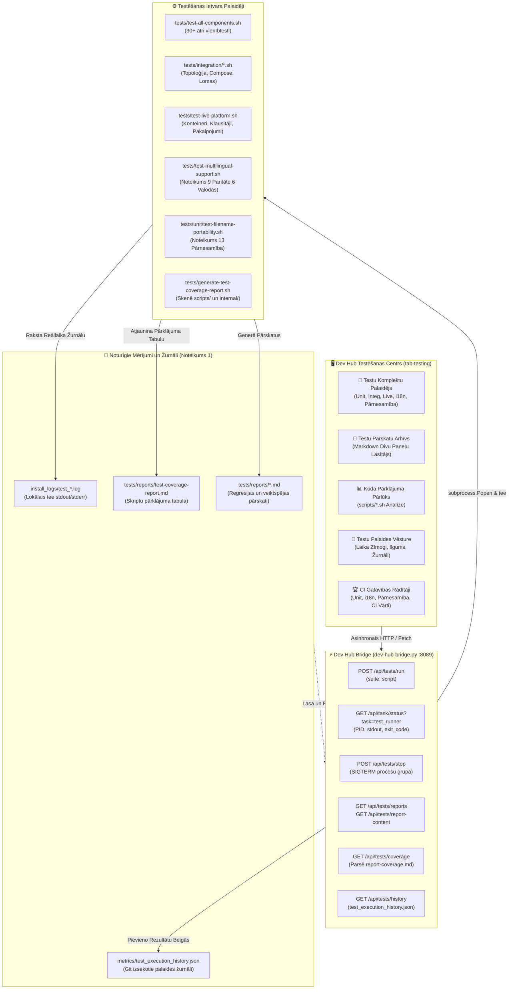

[ 🇬🇧 English ](../testing-framework-and-devhub.md) | [ 🇪🇪 Eesti ](../et/testing-framework-and-devhub.md) | [ 🇫🇮 Suomi ](../fi/testing-framework-and-devhub.md) | [ 🇸🇪 Svenska ](../sv/testing-framework-and-devhub.md) | [ 🇱🇻 Latviešu ](testing-framework-and-devhub.md) | [ 🇱🇹 Lietuvių ](../lt/testing-framework-and-devhub.md)

# 🧪 Testēšanas ietvars un developer Hub integrācija

Šī tehniskā rokasgrāmata dokumentē platformas daudzlīmeņu automatizētās testēšanas arhitektūru, interaktīvo **Testēšanas Centru** (`tab-testing`) programmā Developer Hub (`docs/dev-hub.html`), asinhrono testu pārvaldību, izmantojot `dev-hub-bridge.py`, un koda pārklājuma uzskaiti.

---

## 🏛️ 1. Tehniskā arhitektūra un komponentu plūsma

Testēšanas ekosistēma savieno izstrādātāja lietotāja saskarnes darbības ar testa palaidējiem, reāllaika žurnālēšanu un Git izsekotajiem rādītājiem:

---

## 🚀 2. Testu komplektu pārskats

Platforma sadala kvalitātes pārbaudi specializētos testu komplektos:

| Komplekts | Nosaukums | Apraksts | Komanda |
| :--- | :--- | :--- | :--- |
| `unit` | **Vienībtestu Komplekts** | 29+ ātri izolācijas testi bez aktīvas datubāzes: konfigurācija, SEPS maks, sintakse un loģika. | `./tests/test-all-components.sh` |
| `integration` | **Integrācijas Testi** | Vairāku datubāzu topoloģija, compose override ģenerēšana, profilu lomas un savienojumu pārbaudes. | `tests/integration/*.sh` |
| `live` | **Live Platformas E2E** | Pilna regresija pret aktīvajiem konteineriem, datubāzes klausītājiem un tīmekļa pakalpojumiem. | `./tests/test-live-platform.sh` |
| `i18n` | **Daudzvalodu Paritāte** | Stingra Noteikuma 9 pārbaude, kas verificē vārdnīcas simetriju visās 6 valodās (EN, ET, FI, SV, LV, LT). | `./tests/test-multilingual-support.sh --all` |
| `portability` | **Failu Nosaukumu Pārnesamība** | Noteikuma 13 pārbaude: Windows NTFS/FAT aizliegtās rakstzīmes, ierīču vārdi un ASCII ceļi. | `./tests/unit/test-filename-portability.sh` |
| `browser` | **Pārlūkprogramma & SSO E2E** | Simulē pārlūkprogrammas darbības, APEX pieteikšanos, Dev Hub saīsnes un SSO autentifikāciju. | `./scripts/test-browser-login.sh` |
| `ci_sim` | **Lokālais GitHub CI** | Izpilda vai priekšskata GitHub Actions darbplūsmas bezsaistes režīmā pagaidu konteineros. | `./scripts/test-local-ci.sh --dry-run` |
| `coverage` | **Pārklājuma Ģenerators** | Analizē pārklājumu mapēs `scripts/` un `scripts/internal/` un atjaunina markdown pārskatu. | `./tests/generate-test-coverage-report.sh` |

---

## 🖥️ 3. Dev Hub testēšanas centrs (`tab-testing`)

Developer Hub testēšanas cilnē ir 4 specializētas apakšcilnes:

### 3.1 🚀 Testu komplektu palaidējs (`test-subtab-runner`)
- **Komplektu Kartītes**: Ļauj ar vienu klikšķi palaist visu komplektu vai nolaižamajā izvēlnē atlasītu atsevišķu skriptu.
- **Iegultais Reāllaika Terminālis**: Termināļa logs (`#0b0f19`), kas reāllaikā straumē stdout/stderr, nodrošina automātisko ritināšanu, taimeri, žurnāla lejupielādi un apturēšanu (`POST /api/tests/stop`).

### 3.2 📑 Testu pārskatu arhīvs (`test-subtab-reports`)
- **Divu Paneļu Skats**: Kreisajā panelī ir uzskaitīti pārskati (`tests/reports/*.md`) ar statusa nozīmītēm (`PASS`, `FAIL`, `INFO`) un laika zīmogiem.
- **Renderēts Markdown**: Labajā panelī tiek parādīts HTML saturs ar aktīvām Mermaid diagrammām un pārslēgu uz neapstrādātu tekstu.

### 3.3 📊 Koda pārklājuma pārlūks (`test-subtab-coverage`)
- **KPI Kopsavilkums**: Progresa josla, kas parāda pārklāto skriptu procentuālo daudzumu, kopskaits, pārklātos un nepārklātos skriptus.
- **Interaktīvā Tabula**: Parāda visus skriptus `scripts/*.sh` un `scripts/internal/*.sh` un saistītos testu failus.
- **Filtri un Meklēšana**: Ātrā meklēšana un filtri ("Visi", "Pārklāti", "Nepārklāti").
- **Analīzes Atjaunošana**: Palaiž `generate-test-coverage-report.sh` tieši no saskarnes.

### 3.4 📜 Palaides vēsture (`test-subtab-history`)
- Parāda failā `metrics/test_execution_history.json` reģistrēto vēsturi.
- Rāda laika zīmogu, komplektu, skripta nosaukumu, ilgumu sekundēs, statusa nozīmīti, saiti uz `install_logs/test_*.log` un pogu **Palaist vēlreiz**.

---

## 🔒 4. Zero-trust drošība un noteikumu izpilde

1. **Noteikums 1 (Hronometrāža un Žurnālēšana)**: Katrs tests automātiski novirza izvadi uz `install_logs/test_<suite>_<timestamp>.log` un saglabā ilgumu failā `metrics/test_execution_history.json`.
2. **Noteikums 9 (Daudzvalodība)**: Visa saskarne ir tulkota visās sešās valodās (EN, ET, FI, SV, LV, LT).
3. **Noteikums 12 (Asinhronie Uzdevumi)**: Testi tiek palaisti fonā, izmantojot `subprocess.Popen`, nebloķējot pārlūku un neizraisot noildzes kļūdas.
4. **Noteikums 13 (Pārnesamība)**: Visi pārskatu un žurnālu failu nosaukumi atbilst stingram ASCII kebab-case standartam bez Windows aizliegtajām rakstzīmēm.

---

## 🌐 5. Glosārija saišu droša pārbaude bez lejupielādes (`test-glossary-links.sh` / `.cmd`)

Nodrošina, ka dokumentācijas un Dev Hub glosārija saites nekad neatgriež `404 Not Found` kļūdu, vienlaikus garantējot pilnīgu aizsardzību pret failu lejupielādi:

1. **Atmiņā veikti HTTP HEAD pieprasījumi**: Pārbaudes dzinējs (`scripts/internal/check-glossary-links.py`) veic tikai HTTP `HEAD` pieprasījumus, nolasot tikai statusa kodu (200, 301, 404). Saturs netiek saglabāts diskā.
2. **Starpplatformu nulles ierīce (Windows un POSIX)**:
   - **POSIX (macOS / Linux / WSL2)**: Izvade tiek novirzīta uz `/dev/null`.
   - **Windows (NTFS / CMD / PowerShell)**: Izvade tiek novirzīta uz `NUL` ar `tests/unit/test-glossary-links.cmd`.
   - **Python standarta bibliotēka**: `os.devnull` garantē nulles ierakstus diskā visās operētājsistēmās.
3. **Protokola ierobežojums**: Atļauts tikai `https://`.
4. **Dev Hub izpilde**: Tests reģistrēts Dev Hub **Unit Test Suite** sadaļā (`tab-testing`) ar reāllaika termināļa straumēšanu.
