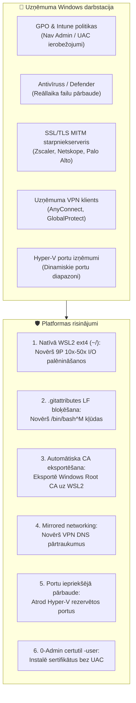

[ 🇬🇧 English ](../windows-enterprise-setup-guide.md) | [ 🇪🇪 Eesti ](../et/windows-enterprise-setup-guide.md) | [ 🇫🇮 Suomi ](../fi/windows-enterprise-setup-guide.md) | [ 🇸🇪 Svenska ](../sv/windows-enterprise-setup-guide.md) | [ 🇱🇻 Latviešu ](windows-enterprise-setup-guide.md) | [ 🇱🇹 Lietuvių ](../lt/windows-enterprise-setup-guide.md)

# Uzņēmuma Windows & WSL2 uzstādīšanas un lietošanas rokasgrāmata

Šī rokasgrāmata sniedz pakāpeniskus norādījumus par **Oracle DevOps platformas** darbināšanu **uzņēmuma pārvaldītās Windows darbstacijās** (Windows 10 / 11 Enterprise, Intune/GPO pārvaldīts, bez vietējām administratora tiesībām, ar uzņēmuma proxy/Zscaler un iekšējā tīkla VPN).

---

## 1. Sistēmas prasību matrica

| Resurss | Minimālā prasība (BP 0 / 1 / 2) | Ieteicamā (BP 5 / 6 / 7 / 8) | Komentāri & pamatojums |
| :--- | :--- | :--- | :--- |
| **Procesors (CPU)** | **4 kodoli (8 pavedieni)** x86_64 | **8 kodoli (16 pavedieni)** x86_64 | Virtualizācijai (**VT-x / AMD-V**) jābūt iespējotai BIOS/UEFI. ARM64 (Snapdragon) netiek atbalstīts Oracle 23ai konteineriem. |
| **Operatīvā atmiņa (RAM)** | **16 GB Host RAM**<br/>*(WSL2: 6 GB)* | **32 GB Host RAM**<br/>*(WSL2: 12–16 GB)* | Windows + Teams + Defender patērē 5–6 GB. Oracle Free nepieciešami 2.5 GB, ORDS 1 GB, WebLogic/Publisher 3–4 GB. 8 GB datori kļūst nestabili. |
| **Diska vieta (Storage)** | **50 GB brīvas vietas SSD** | **100 GB brīvas vietas NVMe SSD** | Attēli aizņem kopā ~25 GB. Mehāniskie HDD diski ir stingri aizliegti lēnā I/O dēļ. |
| **Operētājsistēma** | **Windows 10 Enterprise / Pro** (21H2+, Build 19044+) | **Windows 11 Enterprise** (23H2 / 24H2) | Windows 11 ietver `mirrored` tīkla režīmu un DNS tunelēšanu, kas nodrošina VPN stabilitāti. |
| **Virtualizācija** | **WSL 2** (Kodols 5.15+) | **WSL 2** (Kodols 6.6+) ar `systemd` atbalstu | Windows funkcijas: `VirtualMachinePlatform` un `Microsoft-Windows-Subsystem-Linux`. |
| **Konteineru dzinējs** | **Podman Desktop 5.x** vai Podman iekš WSL2 | **Podman 5.x natīvi WSL2** | 100% brīva un atvērtā koda programma (bez Docker Desktop licences maksām). |
| **Git & terminālis** | **Git for Windows 2.40+** | **Git for Windows + Windows Terminal** | Obligātie iestatījumi: `core.autocrlf=input`, `core.longpaths=true`. |
| **PowerShell** | **Windows PowerShell 5.1** | **PowerShell 7.4+ (Core)** | Nepieciešams palaišanas skriptiem un sertifikātu rīkiem. |

---

## 2. Galvenie uzņēmuma šķēršļi un arhitektūras risinājumi



### 1. Natīvās WSL2 failu sistēmas invariants (NELIETOJIET `C:\...` / `/mnt/c/`)
- **Bīstamība:** Koda palaišana no Windows NTFS ceļiem (`C:\Users\<user>\...`) liek WSL2 izmantot Plan9 (9P) draiveri, kas ir **10–50 reizes lēnāks**. APEX un datubāzes uzstādīšana aizņems 45–90 minūtes parasto 3–5 minūšu vietā.
- **Noteikums:** Vienmēr klonējiet repozitoriju WSL2 natīvajā Linux ext4 failu sistēmā (`cd ~ && git clone ...`). Windows Explorer var piekļūt failiem ar tīkla ceļu `\\wsl$\Ubuntu\home\<user>\...`.

### 2. Rindiņu beigas (CRLF VS LF)
- Visi faili tiek stingri bloķēti uz **LF (`\n`)** ar `.gitattributes`. Windows `.cmd` un `.ps1` faili izmanto CRLF.

### 3. Uzņēmuma starpniekserveris un SSL pārbaude
- Izejošā trafika tiek pārbaudīta ar uzņēmuma iekšējo Root CA. Skripts `scripts/wsl/configure-wsl-enterprise.ps1` to automātiski eksportē uz WSL2.

### 4. VPN DNS tunelēšana
- Operētājsistēmā Windows 11 failā `%USERPROFILE%\.wslconfig` jāiestata `networkingMode=mirrored` un `dnsTunneling=true`.

---

## 3. Īsa pamācība Windows izstrādātājam soli pa solim

### 1. Solis: Klonējiet repozitoriju natīvajā WSL2 ext4 mapē
Atveriet WSL2 termināli (Ubuntu/Debian) un izpildiet:
```bash
cd ~
git clone https://github.com/allanlahe/oracle-free-db-in-prod.git
cd oracle-free-db-in-prod
```

### 2. Solis: Pielāgojiet WSL2 & starpniekservera sertifikātus (vienreizēja darbība)
Izpildiet Windows PowerShell (kā parasts lietotājs, administrators nav nepieciešams):
```powershell
powershell -ExecutionPolicy Bypass -File scripts\wsl\configure-wsl-enterprise.ps1
```
*Tas konfigurē `%USERPROFILE%\.wslconfig` 6–16 GB atmiņai un eksportē sertifikātus uz WSL2.*

Restartējiet WSL, lai lietotu izmaiņas:
```powershell
wsl --shutdown
```

### 2.5. Solis: Palaidiet nesagraujošo dry-run diagnostiku
Pirms ilgstošas uzstādīšanas pārbaudiet vides saderību:
No Windows Command Prompt:
```cmd
test-windows-dryrun.cmd
```
Vai tieši WSL2 terminālī:
```bash
./scripts/test-windows-dryrun.sh --fix
```
*Tas ~2 sekundēs pārbauda 10 kritiskus punktus (natīvā ext4 vs /mnt/c/, rindiņu beigas, RAM, Hyper-V porti, proxy TLS, VPN DNS, rootless Podman un SEPS Wallet tiesības). Parametrs `--fix` automātiski novērš atrastās CRLF rindiņu beigas.*

### 3. Solis: Palaidiet platformu
No Windows Command Prompt vai Explorer:
```cmd
setup.cmd -b 0
```
*(Padoms: varat arī palaist `setup.cmd --dry-run` diagnostikai pirms starta).*

Vai tieši WSL2 terminālī:
```bash
./scripts/setup-all.sh -b 0
```

### 4. Solis: Uzticieties SSL sertifikātam Windows pārlūkprogrammās (0-Admin)
Lai novērstu pārlūkprogrammas brīdinājumus vietnēs `https://localhost:8448/ords/` un `https://localhost:8448/dev-hub.html`:
```cmd
scripts\certs\trust-local-cert.cmd
```
*Tas importē vietējo Root CA krātuvē `Cert:\CurrentUser\Root` bez UAC apstiprinājuma.*

---

## 4. Problēmu novēršana (FAQ)

### J1: `bash: ./scripts/setup-all.sh: /bin/bash^M: bad interpreter`
- **Cēlonis:** Repozitorijs tika klonēts ar Windows Git ar iestatījumu `core.autocrlf=true`.
- **Risinājums:** Palaidiet `./scripts/test-windows-dryrun.sh --fix` vai klonējiet no jauna ar `git config --global core.autocrlf input`.

### J2: Porta piesaiste neizdodas: `An attempt was made to access a socket in a way forbidden by its access permissions`
- **Cēlonis:** Windows Hyper-V ir rezervējis nepieciešamo portu (1532 vai 8088).
- **Risinājums:** Pārbaudiet rezervētos portus ar `netsh interface ipv4 show excludedportrange protocol=tcp`. Restartējiet Windows NAT vai palaidiet `test-windows-dryrun.cmd`.
